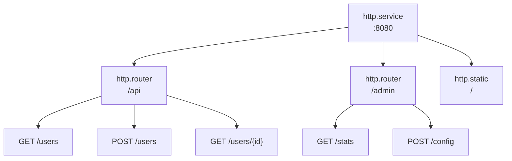

# Roteamento

Uma entrada `http.router` agrupa endpoints sob um prefixo de URL e aplica middleware compartilhado. Cada `http.endpoint` define um handler HTTP.

**Classificação: referência de roteamento.** Os blocos de configuração são fragmentos parciais do registro, a menos que incluam um namespace e todas as entradas referenciadas. Os blocos de handlers usam IDs de funções pertencentes à aplicação em vez de definir uma camada de dados.

## Arquitetura


```mermaid
flowchart TB
    S[http.service<br/>:8080] --> R1[http.router<br/>/api]
    S --> R2[http.router<br/>/admin]
    S --> ST[http.static<br/>/]

    R1 --> E1[GET /users]
    R1 --> E2[POST /users]
    R1 --> E3["GET /users/{id}"]

    R2 --> E4[GET /stats]
    R2 --> E5[POST /config]
```

As entradas referenciam seus pais por metadados:

- Roteadores: `meta.server: app:gateway`
- Endpoints: `meta.router: app:api`

## Configuração do roteador

```yaml
- name: api
  kind: http.router
  meta:
    server: gateway
  prefix: /api/v1
  middleware:
    - cors
    - compress
  options:
    cors.allow.origins: "*"
  post_middleware:
    - endpoint_firewall
```

| Campo | Tipo | Descrição |
|-------|------|-----------|
| `meta.server` | ID do registro | Servidor HTTP pai |
| `prefix` | string | Prefixo de URL para todas as rotas |
| `middleware` | []string | Middleware de pré-handler |
| `options` | map | Opções do middleware |
| `post_middleware` | []string | Middleware de pós-match |
| `post_options` | map | Opções do middleware de pós-match |

## Configuração do endpoint

```yaml
- name: get_user
  kind: http.endpoint
  meta:
    router: api
  method: GET
  path: /users/{id}
  func: app.users:get_user
```

| Campo | Tipo | Descrição |
|-------|------|-----------|
| `meta.router` | ID do registro | Roteador pai |
| `method` | string | Método HTTP: `GET`, `POST`, `PUT`, `DELETE`, `PATCH`, `HEAD`, `OPTIONS`, `TRACE` ou `*` para todos os métodos |
| `path` | string | Padrão do caminho da URL, começando com `/` |
| `func` | ID do registro | Função handler |

## Parâmetros de caminho

Use a sintaxe `{param}` para parâmetros de URL:

```yaml
- name: get_post
  kind: http.endpoint
  meta:
    router: api
  method: GET
  path: /users/{user_id}/posts/{post_id}
  func: get_user_post
```

Acesse-os no handler:

```lua
local http = require("http")

local function handler()
    local req, req_err = http.request()
    if req_err then return nil, req_err end
    local user_id, user_err = req:param("user_id")
    if user_err then return nil, user_err end
    local post_id, post_err = req:param("post_id")
    if post_err then return nil, post_err end

    return {user_id = user_id, post_id = post_id}
end
```

### Caminhos curinga

Capture os segmentos de caminho restantes com `{param...}`:

```yaml
- name: serve_files
  kind: http.endpoint
  meta:
    router: api
  method: GET
  path: /files/{filepath...}
  func: serve_file
```

O curinga corresponde aos segmentos restantes. Assim, uma requisição como `GET /api/v1/files/docs/guides/readme.md` é despachada com `req:param("filepath")` definido como `docs/guides/readme.md`.

O curinga deve ser o último segmento do caminho.

## Funções handler

Os handlers de endpoint usam o módulo `http` para acessar os objetos de requisição e resposta. Consulte o [módulo HTTP](../lua/http/http.md) para ver a referência da API.

```lua
local http = require("http")
local funcs = require("funcs")

local function handler()
    local req, req_err = http.request()
    if req_err then return nil, req_err end
    local res, res_err = http.response()
    if res_err then return nil, res_err end

    local user_id, param_err = req:param("id")
    if param_err then return nil, param_err end
    local user, call_err = funcs.call("app.users:get_user", user_id)
    if call_err then return nil, call_err end

    local status_err = res:set_status(http.STATUS.OK)
    if status_err then return nil, status_err end
    local write_err = res:write_json(user)
    if write_err then return nil, write_err end
    return true
end

return { handler = handler }
```

## Opções de middleware

As opções de middleware usam notação de ponto, com o nome do middleware como prefixo:

```yaml
middleware:
  - cors
  - ratelimit
  - token_auth
options:
  cors.allow.origins: "https://app.example.com"
  cors.allow.methods: "GET,POST,PUT,DELETE"
  ratelimit.requests: "100"
  ratelimit.window: "1m"
  token_auth.store: "app:tokens"
  token_auth.header.name: "Authorization"
```

O middleware de pós-match usa `post_options`:

```yaml
post_middleware:
  - endpoint_firewall
post_options:
  endpoint_firewall.action: "access"
```

## Middleware de pré-handler e pós-match

O middleware de **pré-handler** (`middleware`) é executado depois que o servidor seleciona uma rota, mas antes de os parâmetros da rota e os metadados do endpoint serem anexados ao contexto da requisição:

- CORS, incluindo preflight OPTIONS
- Compressão
- Rate limiting
- Detecção de IP real
- Autenticação por token, que enriquece o contexto

O middleware de **pós-match** (`post_middleware`) é executado depois que os parâmetros da rota e os metadados do endpoint são anexados:

- Firewall de endpoint, que precisa das informações da rota para autorizar
- Firewall de recurso
- Relay WebSocket

```yaml
middleware:        # Before endpoint metadata: matched routes only
  - cors
  - compress
  - token_auth     # Enriches context with actor/scope

post_middleware:   # Post-match: matched routes only
  - endpoint_firewall  # Uses actor from token_auth
```

<tip>
A autenticação por token pertence à cadeia de pré-handler porque enriquece o contexto da requisição antes da autorização. Middleware de autorização como <code>endpoint_firewall</code> pertence à cadeia de pós-match porque precisa do ID do endpoint correspondente. Requisições sem correspondência não executam nenhuma das cadeias do roteador.
</tip>

## Ligação entre roteador e endpoint

Este exemplo define a entrada do handler de listagem. Os IDs de função `app:get_user_by_id` e `app:create_user` referenciam handlers definidos em outro local do mesmo namespace.

```yaml
version: "1.0"
namespace: app

entries:
  # Server
  - name: gateway
    kind: http.service
    addr: ":8080"
    lifecycle:
      auto_start: true

  # API Router
  - name: api
    kind: http.router
    meta:
      server: gateway
    prefix: /api/v1
    middleware:
      - cors
      - compress
      - ratelimit
    options:
      cors.allow.origins: "https://app.example.com"
      ratelimit.requests: "100"
      ratelimit.window: "1m"

  # Handler function
  - name: get_users
    kind: function.lua
    source: file://handlers/users.lua
    method: list
    modules:
      - http
      - json
      - sql

  # Endpoints
  - name: list_users
    kind: http.endpoint
    meta:
      router: api
    method: GET
    path: /users
    func: get_users

  - name: get_user
    kind: http.endpoint
    meta:
      router: api
    method: GET
    path: /users/{id}
    func: app:get_user_by_id

  - name: create_user
    kind: http.endpoint
    meta:
      router: api
    method: POST
    path: /users
    func: app:create_user
```

## Rotas protegidas

A configuração a seguir separa as rotas públicas das que exigem autenticação e autorização:

```yaml
entries:
  # Public routes (no auth)
  - name: public
    kind: http.router
    meta:
      server: gateway
    prefix: /api/public
    middleware:
      - cors

  # Protected routes
  - name: protected
    kind: http.router
    meta:
      server: gateway
    prefix: /api
    middleware:
      - cors
      - token_auth
    options:
      token_auth.store: app:tokens
    post_middleware:
      - endpoint_firewall
```

## Veja também

- [Servidor](./server.md) - Configuração do servidor HTTP
- [Arquivos estáticos](./static.md) - Serviço de arquivos estáticos
- [Middleware](./middleware.md) - Middleware disponível
- [Módulo HTTP](../lua/http/http.md) - API HTTP para Lua
