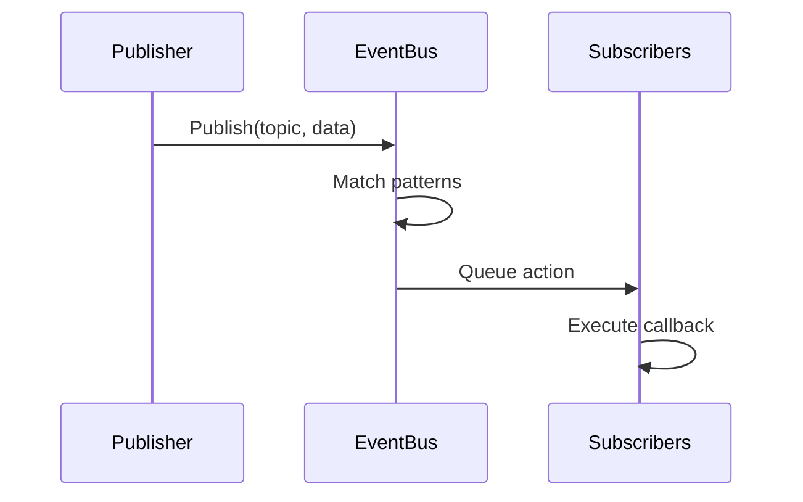
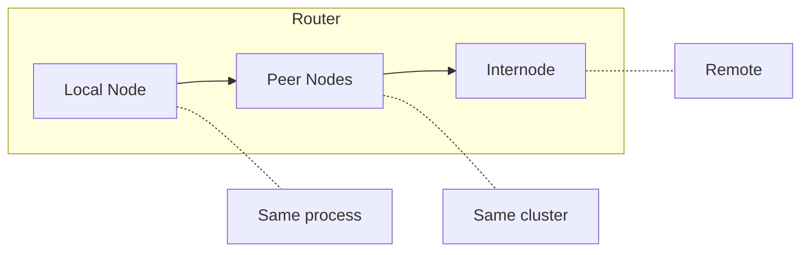

# Arquitetura

<note>
Esta pagina esta em construcao. O conteudo pode estar incompleto ou mudar.
</note>

Wippy e um sistema em camadas construido em Go. Componentes inicializam em ordem de dependencia, comunicam-se atraves de um barramento de eventos e executam processos Lua via um scheduler de work-stealing.

## Camadas

| Camada | Componentes |
|--------|-------------|
| Aplicacao | Processos Lua, funcoes, workflows |
| Runtime | Motor Lua (gopher-lua), 50+ modulos |
| Servicos | HTTP, Queue, Storage, Temporal |
| Sistema | Topology, Factory, Functions, Contracts |
| Nucleo | Scheduler, Registry, Dispatcher, EventBus, Relay |
| Infraestrutura | AppContext, Logger, Transcoder |

Cada camada depende apenas das camadas abaixo dela. A camada Nucleo fornece primitivas fundamentais, enquanto Servicos constroem abstracoes de nivel mais alto.

## Sequencia de Boot

A inicializacao da aplicacao prossegue em quatro fases.

### Fase 1: Infraestrutura

Cria infraestrutura central antes de qualquer componente carregar:

| Componente | Proposito |
|------------|-----------|
| AppContext | Dicionario selado para referencias de componentes |
| EventBus | Pub/sub para comunicacao entre componentes |
| Transcoder | Serializacao de payload (JSON, YAML, Lua) |
| Logger | Logging estruturado com streaming de eventos |
| Relay | Roteamento de mensagens (Node, Router, Mailbox) |

### Fase 2: Carregamento de Componentes

O Loader resolve dependencias via ordenacao topologica e carrega componentes nivel por nivel. Componentes no mesmo nivel carregam em paralelo.

| Nivel | Componentes | Dependencias |
|-------|-------------|--------------|
| 0 | PIDGen | nenhuma |
| 1 | Dispatcher | PIDGen |
| 2 | Registry | Dispatcher |
| 3 | Finder, Supervisor | Registry |
| 4 | Topology | Supervisor |
| 5 | Lifecycle | Topology |
| 6 | Factory | Lifecycle |
| 7 | Functions | Factory |

Cada componente se anexa ao contexto durante Load, disponibilizando servicos para componentes dependentes.

### Fase 3: Ativacao

Apos todos os componentes carregarem:

1. **Congelar Dispatcher** - Bloqueia registro de handlers de comando para lookups sem lock
2. **Selar AppContext** - Nenhuma escrita mais permitida, habilita leituras sem lock
3. **Iniciar Componentes** - Chama `Start()` em cada componente com interface `Starter`

### Fase 4: Carregamento de Entradas

Entradas do registro (de arquivos YAML) sao carregadas e validadas:

1. Entradas parseadas dos arquivos do projeto
2. Estagios de pipeline transformam entradas (override, link, bytecode)
3. Servicos marcados `auto_start: true` comecam a executar
4. Supervisor monitora servicos registrados

## Componentes

Componentes sao servicos Go que participam do ciclo de vida da aplicacao.

### Fases do Ciclo de Vida

| Fase | Metodo | Proposito |
|------|--------|-----------|
| Load | `Load(ctx) (ctx, error)` | Inicializar e anexar ao contexto |
| Start | `Start(ctx) error` | Iniciar operacao ativa |
| Stop | `Stop(ctx) error` | Shutdown gracioso |

Componentes declaram dependencias. O loader constroi um grafo aciclico direcionado e executa em ordem topologica. Shutdown ocorre em ordem reversa.

### Componentes Padrao

| Componente | Dependencias | Proposito |
|------------|--------------|-----------|
| PIDGen | nenhuma | Geracao de ID de processo |
| Dispatcher | PIDGen | Despacho de handlers de comando |
| Registry | Dispatcher | Armazenamento e versionamento de entradas |
| Finder | Registry | Lookup e busca de entradas |
| Supervisor | Registry | Politicas de reinicio de servico |
| Topology | Supervisor | Arvore pai/filho de processos |
| Lifecycle | Topology | Gerenciamento de ciclo de vida de servicos |
| Factory | Lifecycle | Spawn de processos |
| Functions | Factory | Chamadas de funcoes stateless |

## Event Bus

Pub/sub assincrono para comunicacao entre componentes.

### Design

- Goroutine unica de dispatcher processa todos os eventos
- Entrega de acoes baseada em fila previne bloqueio de publishers
- Pattern matching suporta topicos exatos e wildcards (`*`)
- Ciclo de vida baseado em contexto vincula inscricoes a cancelamento

### Fluxo de Eventos

### Topicos Comuns

| Topico | Publisher | Proposito |
|--------|-----------|-----------|
| `registry.entry.*` | Registry | Mudancas de entradas |
| `process.started` | Topology | Ciclo de vida de processo |
| `process.stopped` | Topology | Ciclo de vida de processo |
| `supervisor.state.*` | Supervisor | Mudancas de estado de servico |

## Registry

Armazenamento versionado para definicoes de entradas.

### Recursos

- **Estado Versionado** - Cada mutacao cria nova versao
- **Historico** - Historico em SQLite para trilha de auditoria
- **Observacao** - Observar entradas especificas para mudancas
- **Orientado a Eventos** - Publica eventos em mutacoes

### Ciclo de Vida de Entrada

Estagios de pipeline transformam entradas:

| Estagio | Proposito |
|---------|-----------|
| Override | Aplicar overrides de config |
| Disable | Remover entradas por padrao |
| Link | Resolver requirements e dependencias |
| Bytecode | Compilar Lua para bytecode |
| EmbedFS | Coletar entradas de filesystem |

## Relay

Roteamento de mensagens entre processos atraves de nos.

### Roteamento de Tres Niveis

1. **Local** - Entrega direta dentro do mesmo no
2. **Peer** - Encaminhar para nos peer no cluster
3. **Internode** - Rotear para nos remotos via rede

### Mailbox

Cada no tem uma mailbox com pool de workers:

- Hashing FNV-1a atribui remetentes a workers
- Preserva ordenacao de mensagens por remetente
- Workers processam mensagens concorrentemente
- Back-pressure quando fila enche

## AppContext

Dicionario selado para referencias de componentes.

| Propriedade | Comportamento |
|-------------|---------------|
| Antes de selar | Escritas protegidas por RWMutex |
| Apos selar | Leituras sem lock, panic em escrita |
| Chaves duplicadas | Panic |
| Type safety | Funcoes getter tipadas |

Componentes anexam servicos durante a fase Load. Apos boot completar, AppContext e selado para performance otima de leitura.

## Shutdown

Shutdown gracioso prossegue em ordem reversa de dependencia:

1. SIGINT/SIGTERM aciona shutdown
2. Supervisor para servicos gerenciados
3. Componentes com interface `Stopper` recebem `Stop()`
4. Limpeza de infraestrutura

Segundo sinal forca saida imediata.

## Veja Tambem

- [Scheduler](internal-scheduler.md) - Execucao de processos
- [Event Bus](internal-events.md) - Sistema pub/sub
- [Registry](internal-registry.md) - Gerenciamento de estado
- [Command Dispatch](internal-dispatch.md) - Tratamento de yields
