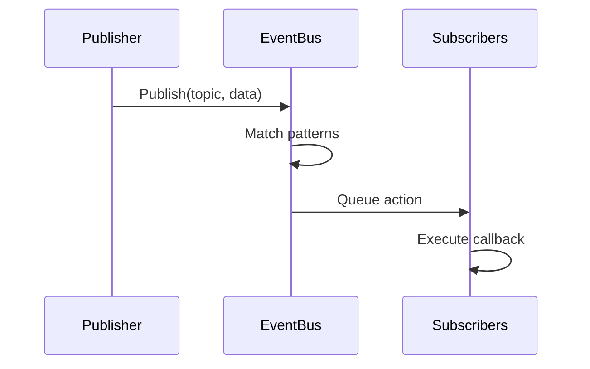
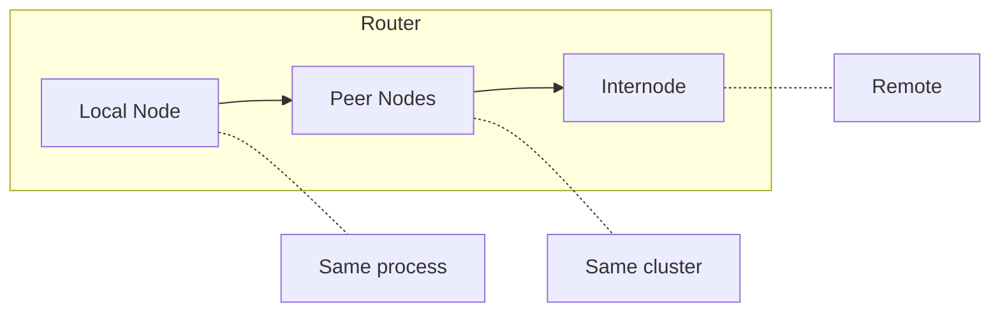

# Arquitetura

<note>
Esta página está em construção. O conteúdo pode estar incompleto ou mudar.
</note>

Wippy é um sistema em camadas construído em Go. Componentes inicializam em ordem de dependência, comunicam-se através de um barramento de eventos e executam processos Lua via um scheduler de work-stealing.

## Camadas

| Camada | Componentes |
|--------|-------------|
| Aplicação | Processos Lua, funções, workflows |
| Runtime | Motor Lua (gopher-lua), 50+ módulos |
| Serviços | HTTP, Queue, Storage, Temporal |
| Sistema | Topology, Factory, Functions, Contracts |
| Núcleo | Scheduler, Registry, Dispatcher, EventBus, Relay |
| Infraestrutura | AppContext, Logger, Transcoder |

Cada camada depende apenas das camadas abaixo dela. A camada Núcleo fornece primitivas fundamentais, enquanto Serviços constroem abstrações de nível mais alto.

## Sequência de Boot

A inicialização da aplicação prossegue em quatro fases.

### Fase 1: Infraestrutura

Cria infraestrutura central antes de qualquer componente carregar:

| Componente | Propósito |
|------------|-----------|
| AppContext | Dicionário selado para referências de componentes |
| EventBus | Pub/sub para comunicação entre componentes |
| Transcoder | Serialização de payload (JSON, YAML, Lua) |
| Logger | Logging estruturado com streaming de eventos |
| Relay | Roteamento de mensagens (Node, Router, Mailbox) |

### Fase 2: Carregamento de Componentes

O Loader resolve dependências via ordenação topológica e carrega componentes nível por nível. Componentes no mesmo nível carregam em paralelo.

| Nível | Componentes | Dependências |
|-------|-------------|--------------|
| 0 | PIDGen | nenhuma |
| 1 | Dispatcher | PIDGen |
| 2 | Registry | Dispatcher |
| 3 | Finder, Supervisor | Registry |
| 4 | Topology | Supervisor |
| 5 | Lifecycle | Topology |
| 6 | Factory | Lifecycle |
| 7 | Functions | Factory |

Cada componente se anexa ao contexto durante Load, disponibilizando serviços para componentes dependentes.

### Fase 3: Ativação

Após todos os componentes carregarem:

1. **Congelar Dispatcher** - Bloqueia registro de handlers de comando para lookups sem lock
2. **Selar AppContext** - Nenhuma escrita mais permitida, habilita leituras sem lock
3. **Iniciar Componentes** - Chama `Start()` em cada componente com interface `Starter`

### Fase 4: Carregamento de Entradas

Entradas do registro (de arquivos YAML) são carregadas e validadas:

1. Entradas parseadas dos arquivos do projeto
2. Estágios de pipeline transformam entradas (override, link, bytecode)
3. Serviços marcados `auto_start: true` começam a executar
4. Supervisor monitora serviços registrados

## Componentes

Componentes são serviços Go que participam do ciclo de vida da aplicação.

### Fases do Ciclo de Vida

| Fase | Método | Propósito |
|------|--------|-----------|
| Load | `Load(ctx) (ctx, error)` | Inicializar e anexar ao contexto |
| Start | `Start(ctx) error` | Iniciar operação ativa |
| Stop | `Stop(ctx) error` | Shutdown gracioso |

Componentes declaram dependências. O loader constrói um grafo acíclico direcionado e executa em ordem topológica. Shutdown ocorre em ordem reversa.

### Componentes Padrão

| Componente | Dependências | Propósito |
|------------|--------------|-----------|
| PIDGen | nenhuma | Geração de ID de processo |
| Dispatcher | PIDGen | Despacho de handlers de comando |
| Registry | Dispatcher | Armazenamento e versionamento de entradas |
| Finder | Registry | Lookup e busca de entradas |
| Supervisor | Registry | Políticas de reinício de serviço |
| Topology | Supervisor | Árvore pai/filho de processos |
| Lifecycle | Topology | Gerenciamento de ciclo de vida de serviços |
| Factory | Lifecycle | Spawn de processos |
| Functions | Factory | Chamadas de funções stateless |

## Event Bus

Pub/sub assíncrono para comunicação entre componentes.

### Design

- Goroutine única de dispatcher processa todos os eventos
- Entrega de ações baseada em fila previne bloqueio de publishers
- Pattern matching suporta tópicos exatos e wildcards (`*`)
- Ciclo de vida baseado em contexto vincula inscrições a cancelamento

### Fluxo de Eventos

### Tópicos Comuns

| Tópico | Publisher | Propósito |
|--------|-----------|-----------|
| `registry.entry.*` | Registry | Mudanças de entradas |
| `process.started` | Topology | Ciclo de vida de processo |
| `process.stopped` | Topology | Ciclo de vida de processo |
| `supervisor.state.*` | Supervisor | Mudanças de estado de serviço |

## Registry

Armazenamento versionado para definições de entradas.

### Recursos

- **Estado Versionado** - Cada mutação cria nova versão
- **Histórico** - Histórico em SQLite para trilha de auditoria
- **Observação** - Observar entradas específicas para mudanças
- **Orientado a Eventos** - Publica eventos em mutações

### Ciclo de Vida de Entrada

Estágios de pipeline transformam entradas:

| Estágio | Propósito |
|---------|-----------|
| Override | Aplicar overrides de config |
| Disable | Remover entradas por padrão |
| Link | Resolver requirements e dependências |
| Bytecode | Compilar Lua para bytecode |
| EmbedFS | Coletar entradas de filesystem |

## Relay

Roteamento de mensagens entre processos através de nós.

### Roteamento de Três Níveis

1. **Local** - Entrega direta dentro do mesmo nó
2. **Peer** - Encaminhar para nós peer no cluster
3. **Internode** - Rotear para nós remotos via rede

### Mailbox

Cada nó tem uma mailbox com pool de workers:

- Hashing FNV-1a atribui remetentes a workers
- Preserva ordenação de mensagens por remetente
- Workers processam mensagens concorrentemente
- Back-pressure quando fila enche

## AppContext

Dicionário selado para referências de componentes.

| Propriedade | Comportamento |
|-------------|---------------|
| Antes de selar | Escritas protegidas por RWMutex |
| Após selar | Leituras sem lock, panic em escrita |
| Chaves duplicadas | Panic |
| Type safety | Funções getter tipadas |

Componentes anexam serviços durante a fase Load. Após boot completar, AppContext é selado para performance ótima de leitura.

## Shutdown

Shutdown gracioso prossegue em ordem reversa de dependência:

1. SIGINT/SIGTERM aciona shutdown
2. Supervisor para serviços gerenciados
3. Componentes com interface `Stopper` recebem `Stop()`
4. Limpeza de infraestrutura

Segundo sinal força saída imediata.

## Veja Também

- [Scheduler](internals/scheduler.md) - Execução de processos
- [Event Bus](internals/events.md) - Sistema pub/sub
- [Registry](internals/registry.md) - Gerenciamento de estado
- [Command Dispatch](internals/dispatch.md) - Tratamento de yields
