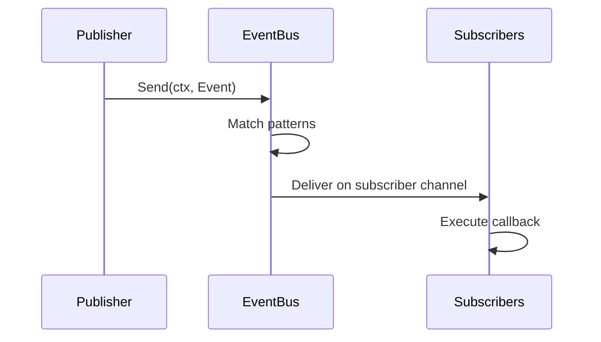
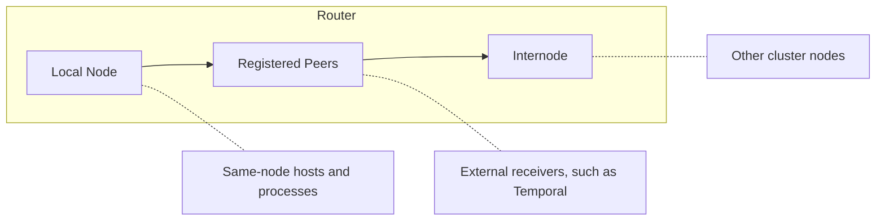

# Arquitetura

Wippy é um sistema em camadas construído em Go. Componentes inicializam em ordem de dependência, comunicam-se através de um barramento de eventos e executam processos Lua via um scheduler de work-stealing.

Esta é uma referência de implementação. Os diagramas e tipos Go descrevem internals do runtime, e não entradas do registro da aplicação ou APIs de extensão.

## Camadas

| Camada | Componentes |
|--------|-------------|
| Aplicação | Processos Lua, funções, workflows |
| Runtime | Motor Lua (wippyai/go-lua) e módulos do runtime |
| Serviços | HTTP, Queue, Storage, Temporal |
| Sistema | Topology, Factory, Functions, Contracts |
| Núcleo | Scheduler, Registry, Dispatcher, EventBus, Relay |
| Infraestrutura | AppContext, Logger, Transcoder |

Cada camada depende apenas das camadas abaixo dela. A camada Núcleo fornece primitivas fundamentais, enquanto Serviços constroem abstrações de nível mais alto.

## Sequência de Boot

A inicialização da aplicação prossegue em quatro fases.

### Fase 1: Infraestrutura

Cria infraestrutura central antes de qualquer componente carregar:

| Componente | Propósito |
|------------|-----------|
| AppContext | Dicionário selado para referências de componentes |
| EventBus | Pub/sub para comunicação entre componentes |
| Transcoder | Serialização de payload (JSON, YAML, Lua) |
| Logger | Logging estruturado com streaming de eventos |
| Relay | Roteamento de mensagens (Node, Router, Mailbox) |

### Fase 2: Carregamento de Componentes

O Loader resolve as dependências por ordenação topológica e carrega os componentes sequencialmente, nível por nível. Mesmo os componentes de um mesmo nível são carregados um de cada vez.

As arestas de dependência determinam os níveis; grupos de pacotes como Core e System não impõem uma ordem global separada. Portanto, componentes sem uma aresta de dependência podem ficar no mesmo nível, independentemente do grupo de pacotes.

Cada componente se anexa ao contexto durante Load, disponibilizando serviços para componentes dependentes.

### Fase 3: Ativação

Depois que todos os componentes são carregados:

1. **Iniciar serviços do runtime** — Chama `StartRuntimeServices(ctx)`
2. **Congelar o Dispatcher** — Bloqueia o registro de handlers de comandos para consultas sem lock
3. **Selar o AppContext** — Impede novas escritas e habilita leituras sem lock
4. **Iniciar componentes** — Chama `Start()` em cada componente que implementa `Starter`

### Fase 4: Carregamento de Entradas

As entradas do registro provenientes dos manifests `_index.json`, `_index.yaml` e `_index.yml` do projeto são carregadas e validadas:

1. Entradas parseadas dos arquivos do projeto
2. Estágios de pipeline transformam entradas (override, link, bytecode)
3. Serviços marcados `auto_start: true` começam a executar
4. Supervisor monitora serviços registrados

## Componentes

Componentes são serviços Go que participam do ciclo de vida da aplicação.

### Fases do Ciclo de Vida

| Fase | Método | Propósito |
|------|--------|-----------|
| Load | `Load(ctx) (ctx, error)` | Inicializar e anexar ao contexto |
| Start | `Start(ctx) error` | Iniciar operação ativa |
| Stop | `Stop(ctx) error` | Encerramento gracioso |

Componentes declaram dependências. O loader constrói um grafo acíclico direcionado e executa em ordem topológica. Shutdown ocorre em ordem reversa.

### Componentes Padrão

| Componente | Dependências | Propósito |
|------------|--------------|-----------|
| PIDGen | nenhuma | Geração de ID de processo |
| Dispatcher | nenhuma | Despacho de handlers de comando |
| Registry | Artifact | Armazenamento e versionamento de entradas |
| Finder | Registry | Lookup e busca de entradas |
| Supervisor | Registry | Políticas de reinício de serviço |
| Topology | nenhuma | Árvore pai/filho de processos |
| Lifecycle | Topology | Gerenciamento de ciclo de vida de serviços |
| Factory | nenhuma | Criação de processos |
| Functions | Registry | Execução de funções em pool |

## Barramento de eventos :id=event-bus

Pub/sub assíncrono para comunicação entre componentes.

### Design

- Goroutine única de dispatcher processa todos os eventos
- Publishers enfileiram ações sem aguardar a entrega aos subscribers
- O pattern matching aceita valores exatos, `*`, `**` e alternância de segmentos
- Ciclo de vida baseado em contexto vincula inscrições a cancelamento

### Fluxo de Eventos

```mermaid
sequenceDiagram
    participant P as Publisher
    participant B as EventBus
    participant S as Subscribers

    P->>B: Send(ctx, Event)
    B->>B: Match patterns
    B->>S: Deliver on subscriber channel
    S->>S: Execute callback
```

### Tópicos Comuns

Os eventos têm campos `System` e `Kind` separados. Os sistemas integrados publicam:

| Sistema | Tipo | Propósito |
|---------|------|-----------|
| `registry` | `entry.create`, `entry.update`, `entry.delete`, `entry.accept`, `entry.reject` | Mutações de entradas |
| `registry` | `registry.begin`, `registry.commit`, `registry.discard` | Limites de transação |
| `process` | `factory.register`, `factory.delete`, `factory.accept`, `factory.reject` | Registro de factory para tipos de processo |
| `supervisor` | `service.register`, `service.remove`, `service.update`, `service.start`, `service.stop` | Ciclo de vida de serviço |

## Registry

Armazenamento versionado para definições de entradas.

### Recursos

- **Estado Versionado** - Cada mutação cria nova versão
- **Histórico** - Histórico em memória por padrão; histórico opcional em SQLite para uma trilha de auditoria durável (history_type: sqlite)
- **Observação** - Observar entradas específicas para mudanças
- **Orientado a Eventos** - Publica eventos em mutações

### Ciclo de Vida de Entrada

```mermaid
flowchart LR
    YAML[YAML Files] --> Parser
    Parser --> Stages[Pipeline Stages]
    Stages --> Registry
    Registry --> Validation
    Validation --> Active
```

Estágios de pipeline transformam entradas:

| Estágio | Propósito |
|---------|-----------|
| Override | Aplicar overrides de config |
| Desativar | Remover entradas por padrão |
| Link | Resolver requirements e dependências |
| Bytecode | Compilar Lua para bytecode |
| EmbedFS | Coletar entradas de filesystem |

## Relay

Roteamento de mensagens entre processos através de nós.

### Roteamento de Três Níveis

```mermaid
flowchart LR
    subgraph Router
        Local[Local Node] --> Peer[Registered Peers]
        Peer --> Inter[Internode]
    end

    Local -.- L[Same-node hosts and processes]
    Peer -.- P[External receivers, such as Temporal]
    Inter -.- I[Other cluster nodes]
```

1. **Local** — Entrega direta entre hosts e processos no mesmo nó
2. **Peer** — Encaminha para um receiver externo registrado, como o Temporal
3. **Internode** — Recorre ao roteamento de rede para outro nó do cluster

### Mailbox

Cada nó tem uma mailbox com pool de workers:

- Hashing FNV-1a atribui remetentes a workers
- Preserva ordenação de mensagens por remetente
- Workers processam mensagens concorrentemente
- Back-pressure quando fila enche

## AppContext

Dicionário selado para referências de componentes.

| Propriedade | Comportamento |
|-------------|---------------|
| Antes de selar | Escritas de thread única durante a inicialização |
| Após selar | Leituras sem lock, panic em escrita |
| Chaves duplicadas | Panic |
| Segurança de tipos | Funções de acesso tipadas |

Os componentes anexam serviços durante a fase Load. Quando o boot termina, o AppContext é selado, permitindo leituras sem lock e impedindo novas escritas.

## Encerramento :id=shutdown

Encerramento gracioso prossegue em ordem reversa de dependência:

1. SIGINT/SIGTERM aciona shutdown
2. Supervisor para serviços gerenciados
3. Componentes com interface `Stopper` recebem `Stop()`
4. Limpeza de infraestrutura

Segundo sinal força saída imediata.

## Consulte também

- [Scheduler](./scheduler.md) — Execução de processos
- [Event bus](./events.md) — Sistema pub/sub
- [Registro](./registry.md) — Gerenciamento de estado
- [Despacho de comandos](./dispatch.md) — Tratamento de yields
