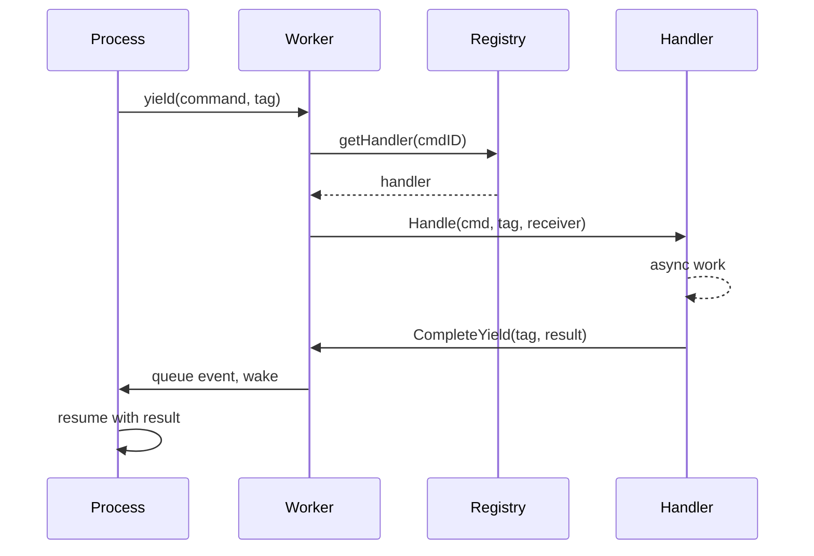

# Command Dispatch

O sistema de despacho roteia comandos de processos para handlers. Processos cedem comandos com tags de correlacao, handlers executam trabalho assincrono, e resultados fluem de volta via filas de eventos.

## Fluxo



## Registry de Comandos

O registry armazena handlers em uma estrutura hibrida:

```go
type Registry struct {
    handlers [256]Handler         // Comandos de sistema: O(1) index
    extended map[CommandID]Handler // Comandos estendidos: lookup em map
    frozen   atomic.Bool          // Sem lock apos boot
}
```

Comandos de sistema (0-255) usam indexacao de array. Comandos estendidos usam lookup em map. Apos `Freeze()`, todos os lookups sao sem lock.

### Faixas de Command ID

| Faixa | Modulo | Exemplos |
|-------|--------|----------|
| 1-9 | process | Send, Spawn, Terminate, Monitor, Link |
| 10-29 | clock | Sleep, Ticker, Timer |
| 50-59 | stream | Read, Write, Close, Seek |
| 60-79 | http | Request, RequestBatch |
| 80-89 | websocket | Connect, Send, Receive |
| 90-99 | event | Subscribe, Send |
| 100-119 | sql | Query, Execute, Transaction ops |
| 120-129 | store | Get, Set, Delete, Has |
| 130-139 | security | ValidateToken, CreateToken |
| 140-149 | function | Call, AsyncStart, AsyncCancel |
| 150-159 | exec | ProcessWait |
| 160-169 | cloudstorage | Upload, Download, List, Presigned URLs |
| 170-179 | eval | Compile, Run, CreateProcess |
| 180-189 | workflow | SideEffect, Call, Version, UpsertAttrs |
| 190-199 | contract | Open, Call, AsyncCall, AsyncCancel |
| 256+ | custom | Servicos definidos pelo usuario |

Registro acontece durante boot via `MustRegisterCommands()`. Colisoes causam panic na inicializacao.

## Definindo Comandos

Comandos sao estruturas de dados com um `CommandID` unico:

```go
const MyCommand dispatcher.CommandID = 200

type MyCmd struct {
    Input  string
    Option int
}

var myCmdPool = sync.Pool{New: func() any { return &MyCmd{} }}

func (c *MyCmd) CmdID() dispatcher.CommandID { return MyCommand }

func (c *MyCmd) Release() {
    c.Input = ""
    c.Option = 0
    myCmdPool.Put(c)
}
```

Reuso de pool elimina alocacao em hot paths. Registre no package init:

```go
func init() {
    dispatcher.MustRegisterCommands("myservice", MyCommand)
}
```

## Dispatchers

Um dispatcher agrupa handlers relacionados. Ele implementa `RegisterAll` para registrar handlers e metodos de ciclo de vida para setup/teardown:

```go
type Handler interface {
    Handle(ctx context.Context, cmd Command, tag uint64, receiver ResultReceiver) error
}

type ResultReceiver interface {
    CompleteYield(tag uint64, data any, err error)
}
```

```go
type Dispatcher struct {
    // estado do servico
}

func (d *Dispatcher) RegisterAll(register func(id dispatcher.CommandID, h dispatcher.Handler)) {
    register(myapi.MyCommand, dispatcher.HandlerFunc(d.handleMyCommand))
}

func (d *Dispatcher) handleMyCommand(ctx context.Context, cmd Command, tag uint64, receiver ResultReceiver) error {
    c := cmd.(*myapi.MyCmd)
    go func() {
        result := doWork(c)
        if ctx.Err() == nil {
            receiver.CompleteYield(tag, result, nil)
        }
    }()
    return nil
}
```

Registre como componente de boot:

```go
func MyDispatcher() boot.Component {
    return boot.New(boot.P{
        Name:      "dispatcher.myservice",
        DependsOn: []boot.Name{DispatcherName},
        Load: func(ctx context.Context) (context.Context, error) {
            reg := dispatcher.GetRegistrar(ctx)
            svc := myservice.NewDispatcher()
            svc.RegisterAll(reg.Register)
            return ctx, nil
        },
    })
}
```

## Yields e Correlacao

Quando um processo precisa de trabalho assincrono, ele cede um comando com uma tag de correlacao:

```go
type Yield struct {
    Cmd Command
    Tag uint64    // Contador local do processo para correlacao
}
```

O worker extrai yields de `StepOutput` apos cada passo e os despacha para handlers. Cada tag identifica unicamente a requisicao para que resultados possam ser correspondidos de volta.

## Veja Tambem

- [Scheduler](internal-scheduler.md) - Execucao de processos
- [Modules](internal-modules.md) - Integracao de modulos Lua
- [Process Model](concept-process-model.md) - Conceitos de alto nivel
