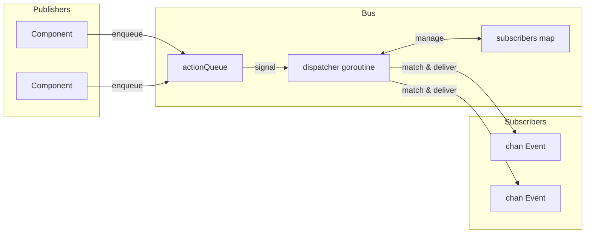

# Event Bus

O event bus e um sistema pub/sub usando uma unica goroutine de dispatcher. Publishers enfileiram acoes, o dispatcher as processa sequencialmente, e subscribers recebem eventos correspondentes em channels.

## Estrutura de Evento

```go
type Event struct {
    System string  // Componente/modulo (ex: "registry", "process")
    Kind   string  // Tipo de evento (ex: "create", "update", "exit")
    Path   string  // Identificador da entidade
    Data   any     // Payload
}
```

## Arquitetura do Bus



O bus armazena estado em uma estrutura simples:

```go
type Bus struct {
    subscribers       map[SubscriberID]sub
    subscriberCounter uint64

    actionQueue []action
    spareQueue  []action
    actionMu    sync.Mutex
    actionReady chan struct{}  // buffered=1

    closed atomic.Bool
}
```

Todas as mutacoes passam pela goroutine do dispatcher, eliminando race conditions sem locking complexo.

## Acoes

Quatro tipos de acao fluem pela fila:

| Acao | Comportamento |
|------|---------------|
| Subscribe | Adiciona subscriber ao map, responde no done channel |
| Unsubscribe | Remove subscriber, responde no done channel |
| Send | Entrega evento para subscribers correspondentes |
| Stop | Limpa subscribers, drena fila, sai do loop |

Subscribe e Unsubscribe bloqueiam ate o dispatcher confirmar. Send e fire-and-forget.

## Troca de Fila

O dispatcher usa troca de slices para evitar alocacoes em estado estavel:

```go
func (b *Bus) processActions() bool {
    b.actionMu.Lock()
    actions := b.actionQueue
    b.actionQueue = b.spareQueue[:0]
    b.spareQueue = nil
    b.actionMu.Unlock()

    for i := range actions {
        // processar acao
    }

    clear(actions)
    b.actionMu.Lock()
    b.spareQueue = actions[:0]
    b.actionMu.Unlock()
    return true
}
```

Dois slices alternam: um para processamento, um para novas chegadas. O channel `actionReady` tem buffer de 1, entao sinalizar nunca bloqueia e multiplos enqueues coalescem em um wakeup.

## Pattern Matching

Inscricoes compilam padroes uma vez no momento da inscricao:

```go
type sub struct {
    subID   SubscriberID
    ctx     context.Context
    system  *wildcard.Wildcard
    kind    *wildcard.Wildcard
    eventCh chan<- Event
}
```

O pacote wildcard suporta tres tipos de padrao:

| Padrao | Corresponde |
|--------|-------------|
| `registry` | Apenas match exato |
| `*` | Qualquer segmento unico |
| `**` | Zero ou mais segmentos |
| `(a\|b)` | Alternacao dentro do segmento |

Padroes dividem em `.` entao `registry.*` corresponde `registry.create` mas nao `registry.entry.create`. O padrao `registry.**` corresponde todos os tres de `registry`, `registry.create`, e `registry.entry.create`.

## Entrega de Eventos

Durante processamento de Send, o dispatcher itera subscribers:

```go
for id, s := range b.subscribers {
    if s.system != nil && !s.system.Match(a.event.System) {
        continue
    }
    if s.kind != nil && !s.kind.Match(a.event.Kind) {
        continue
    }

    select {
    case <-a.ctx.Done():
        goto cleanup
    case <-s.ctx.Done():
        expiredSubs = append(expiredSubs, id)
    case s.eventCh <- a.event:
    }
}
```

Se o contexto de um subscriber for cancelado, ele e marcado para remocao durante aquela passagem de entrega. O contexto do evento tambem pode cancelar entrega no meio da iteracao.

## Ponte de Processo Lua

O dispatcher de eventos faz ponte de eventos Go para processos Lua. Ele se inscreve uma vez em todos os eventos (`"**"`) e roteia internamente baseado em inscricoes de processos:

```go
type Dispatcher struct {
    bus    event.Bus
    node   relay.Node
    subID  SubscriberID
    eventC chan event.Event

    mu   sync.RWMutex
    subs map[string]*subscription  // topico -> inscricao
}
```

Quando um processo Lua se inscreve via `events.subscribe()`, o dispatcher armazena o padrao e PID alvo. Eventos correspondentes sao empacotados e enviados via relay:

```go
func (d *Dispatcher) routeEvent(evt event.Event) {
    d.mu.RLock()
    defer d.mu.RUnlock()

    for _, sub := range d.subs {
        if !matchPattern(sub.system, evt.System) {
            continue
        }
        if sub.kind != "" && !matchPattern(sub.kind, evt.Kind) {
            continue
        }

        data := map[string]any{
            "system": evt.System,
            "kind":   evt.Kind,
            "path":   evt.Path,
        }
        if evt.Data != nil {
            data["data"] = evt.Data
        }

        pkg := relay.NewPackage(pid.PID{}, sub.pid, sub.topic, payload.New(data))
        d.node.Send(pkg)
    }
}
```

## Tipos Auxiliares

### Subscriber

Encapsula inscricao de channel com callback:

```go
handler, err := eventbus.NewSubscriber(ctx, bus, "registry", "*.created",
    func(evt Event) {
        // tratar
    })
defer handler.Close()
```

Cria duas goroutines: uma le eventos e chama o handler, outra aguarda cancelamento de contexto para desinscricao.

### EventRouter

Gerencia multiplos handlers com ciclo de vida centralizado:

```go
router, err := eventbus.StartRouter(ctx, bus,
    WithHandlers(handler1, handler2),
    WithLogger(log))
defer router.Stop()
```

Cada handler implementa `Pattern()` e `Handle()`. O router cria um Subscriber para cada e fecha todos em Stop.

### Awaiter

Espera sincrona por um evento especifico:

```go
awaiter := eventbus.NewAwaiter(bus, "registry", "accept")
waiter, _ := awaiter.Prepare(ctx, "service-id")
defer waiter.Close()

bus.Send(ctx, triggeringEvent)

result := waiter.Wait()  // bloqueia ate match ou timeout
```

O padrao Prepare-then-Wait evita race conditions: inscricao antes de acionar o evento que produz a resposta.

## Shutdown

1. `Stop()` atomicamente define flag closed e enfileira acao Stop
2. Dispatcher limpa mapa de subscribers
3. Acoes restantes na fila sao drenadas:
   - Requisicoes Subscribe recebem erro "bus is closed"
   - Requisicoes Unsubscribe completam imediatamente
   - Eventos Send sao descartados
4. WaitGroup completa

## Veja Tambem

- [Registry](internal-registry.md) - Principal produtor de eventos
- [Command Dispatch](internal-dispatch.md) - Roteamento processo-para-handler
