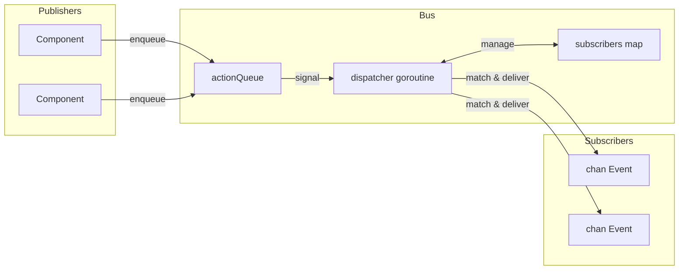

# Event Bus

O event bus processa ações pub/sub enfileiradas em uma única goroutine de dispatcher e entrega eventos correspondentes aos channels dos subscribers.

Os exemplos em Go são fragmentos de implementação e extensão. Eles pressupõem um contexto de componentes, logger, handlers e tipos de eventos da aplicação já existentes.

## Estrutura de Evento

```go
type Event struct {
    System string  // Component/module (e.g., "registry", "process")
    Kind   string  // Event type (e.g., "create", "update", "exit")
    Path   string  // Entity identifier
    Data   any     // Payload
    Aux    any     // In-process dispatcher context; not propagated to processes
}
```

## Arquitetura do Bus


```mermaid
flowchart LR
    subgraph Publishers
        P1[Component]
        P2[Component]
    end

    subgraph Bus
        Q[actionQueue]
        D[dispatcher goroutine]
        S[subscribers map]
    end

    subgraph Subscribers
        S1[chan Event]
        S2[chan Event]
    end

    P1 & P2 -->|enqueue| Q
    Q -->|signal| D
    D -->|match & deliver| S1 & S2
    D <-->|manage| S
```

O bus armazena estado em uma estrutura simples:

```go
type Bus struct {
    subscribers       map[SubscriberID]sub
    subscriberCounter uint64

    actionQueue []action
    spareQueue  []action
    actionMu    sync.Mutex
    actionReady chan struct{}  // buffered=1

    closed atomic.Bool
}
```

Todas as mutações passam pela goroutine do dispatcher, eliminando race conditions sem locking complexo.

## Ações

Quatro tipos de ação fluem pela fila:

| Ação | Comportamento |
|------|---------------|
| Subscribe | Adiciona subscriber ao map, responde no done channel |
| Unsubscribe | Remove subscriber, responde no done channel |
| Send | Entrega evento para subscribers correspondentes |
| Stop | Limpa subscribers, drena fila, sai do loop |

Subscribe e Unsubscribe bloqueiam até que o dispatcher confirme. Send é fire-and-forget. O bus aceita no máximo `DefaultMaxSubscribers` inscrições (4096 por padrão); inscrições além desse limite falham com `ErrSubscribersCapReached`.

## Troca de Fila

O dispatcher usa troca de slices para evitar alocações em estado estável:

```go
func (b *Bus) processActions() bool {
    b.actionMu.Lock()
    actions := b.actionQueue
    b.actionQueue = b.spareQueue[:0]
    b.spareQueue = nil
    b.actionMu.Unlock()

    for i := range actions {
        // process action
    }

    clear(actions)
    b.actionMu.Lock()
    b.spareQueue = actions[:0]
    b.actionMu.Unlock()
    return true
}
```

Dois slices alternam: um para processamento, um para novas chegadas. O channel `actionReady` tem buffer de 1, então sinalizar nunca bloqueia e múltiplos enqueues coalescem em um wakeup.

## Correspondência de padrões

Inscrições compilam padrões uma vez no momento da inscrição:

```go
type sub struct {
    subID   SubscriberID
    ctx     context.Context
    system  *wildcard.Wildcard
    kind    *wildcard.Wildcard
    eventCh chan<- Event
}
```

O pacote wildcard oferece quatro tipos de padrão:

| Padrão | Corresponde |
|--------|-------------|
| `registry` | Apenas match exato |
| `*` | Qualquer segmento único |
| `**` | Zero ou mais segmentos |
| `(a\|b)` | Alternação dentro do segmento |

Padrões dividem em `.` então `registry.*` corresponde `registry.create` mas não `registry.entry.create`. O padrão `registry.**` corresponde todos os três de `registry`, `registry.create`, e `registry.entry.create`.

## Entrega de Eventos

Durante processamento de Send, o dispatcher itera subscribers:

```go
for id, s := range b.subscribers {
    if s.system != nil && !s.system.Match(a.event.System) {
        continue
    }
    if s.kind != nil && !s.kind.Match(a.event.Kind) {
        continue
    }

    select {
    case <-a.ctx.Done():
        goto cleanup
    case <-s.ctx.Done():
        expiredSubs = append(expiredSubs, id)
    case s.eventCh <- a.event:
    }
}
```

Se o contexto de um subscriber for cancelado, ele é marcado para remoção durante aquela passagem de entrega. O contexto do evento também pode cancelar entrega no meio da iteração.

## Ponte de Processo Lua

O dispatcher de eventos faz ponte de eventos Go para processos Lua. Ele se inscreve uma vez em todos os eventos (`"**"`) e roteia internamente baseado em inscrições de processos:

```go
type Dispatcher struct {
    bus    event.Bus
    node   relay.Node
    subID  SubscriberID
    eventC chan event.Event

    mu   sync.RWMutex
    subs map[string]*subscription  // topic -> subscription
}
```

Quando um processo Lua se inscreve via `events.subscribe()`, o dispatcher armazena o padrão e PID alvo. Eventos correspondentes são empacotados e enviados via relay:

```go
func (d *Dispatcher) routeEvent(evt event.Event) {
    d.mu.RLock()
    defer d.mu.RUnlock()

    for _, sub := range d.subs {
        if !matchPattern(sub.system, evt.System) {
            continue
        }
        if sub.kind != "" && sub.kind != "*" && !matchPattern(sub.kind, evt.Kind) {
            continue
        }

        data := map[string]any{
            "system": evt.System,
            "kind":   evt.Kind,
            "path":   evt.Path,
        }
        if evt.Data != nil {
            data["data"] = evt.Data
        }

        pkg := relay.NewPackage(pid.PID{}, sub.pid, sub.topic, payload.New(data))
        d.node.Send(pkg)
    }
}
```

## Tipos Auxiliares

### Subscriber

Encapsula inscrição de channel com callback:

```go
handler, err := eventbus.NewSubscriber(ctx, bus, "registry", "entry.*",
    func(evt Event) {
        // handle
    })
if err != nil {
    return err
}
defer handler.Close()
```

Cria duas goroutines: uma lê eventos e chama o handler, outra aguarda cancelamento de contexto para desinscrição.

### EventRouter

Gerencia múltiplos handlers com ciclo de vida centralizado:

```go
router, err := eventbus.StartRouter(ctx, bus,
    WithHandlers(handler1, handler2),
    WithLogger(log))
if err != nil {
    return err
}
defer router.Stop()
```

Cada handler implementa `Pattern()` e `Handle()`. O router cria um Subscriber para cada e fecha todos em Stop.

### AwaitService

Implementa request-response sobre pub/sub. Mantém uma única inscrição para cada par `(system, kind)` e roteia eventos aos waiters por `Path`:

```go
svc := eventbus.NewAwaitService(bus)
if err := svc.Start(ctx); err != nil {
    return err
}
defer svc.Stop()

waiter, err := svc.Prepare(ctx, "test", "response.(accept|reject)", "test/path", 5*time.Second)
if err != nil {
    return err
}
defer waiter.Close()

bus.Send(ctx, triggeringEvent)

result := waiter.Wait()  // returns AwaitResult{Event, Accepted, Error}
```

`Prepare` registra o waiter antes do envio do evento que dispara a resposta, evitando a race na qual a resposta chega antes de o waiter ser registrado. `Wait` bloqueia até chegar um evento com `Path` correspondente ou até expirar o timeout — quando o valor não é positivo, o padrão é `DefaultAwaitTimeout`, de 30 segundos. `Accepted` é verdadeiro quando o kind do evento é `accept`, `*.accept` ou `*.accepted`; qualquer outro kind é tratado como rejeição, e um campo `error` em `Data` é exposto como `Error`. O helper `Await(ctx, system, kind, path, timeout)` combina Prepare e Wait. A infraestrutura de boot registra um AwaitService no contexto (`event.GetAwaitService`).

## Encerramento

1. `Stop()` atomicamente define flag closed e enfileira ação Stop
2. Dispatcher limpa mapa de subscribers
3. Ações restantes na fila são drenadas:
   - Requisições Subscribe recebem erro "bus is closed"
   - Requisições Unsubscribe completam imediatamente
   - Eventos Send são descartados
4. WaitGroup completa

## Consulte também

- [Registro](./registry.md) — Principal produtor de eventos
- [Despacho de comandos](./dispatch.md) — Roteamento de processos para handlers
