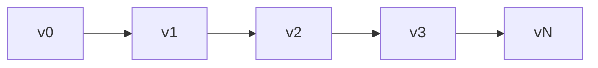

# Registry Internals

O registry é um armazenamento de estado versionado e orientado a eventos. Ele mantém histórico completo de versões, suporta transações e propaga mudanças através do event bus.

## Armazenamento de Entradas

Entradas são armazenadas como um slice ordenado com um índice de hash map para lookups O(1):

```go
type Entry struct {
    ID   ID              // namespace:name
    Kind Kind            // Tipo da entrada
    Meta attrs.Bag       // Metadados
    Data payload.Payload // Conteúdo
}
```

IDs de entrada usam o pacote `unique` do Go para interning - IDs idênticos compartilham memória.

## Cadeia de Versões

Cada versão aponta para seu pai. Computação de caminho usa um algoritmo de grafo para encontrar a rota mais curta entre quaisquer duas versões:



## ChangeSets

Um changeset é uma lista ordenada de operações transformando um estado em outro:

| Operação | OriginalEntry | Propósito |
|----------|---------------|-----------|
| Create | nil | Adicionar nova entrada |
| Update | valor antigo | Modificar existente |
| Delete | valor deletado | Remover entrada |

`OriginalEntry` permite reversão - updates armazenam o valor anterior, deletes armazenam o que foi removido.

### Construindo Deltas

`BuildDelta(oldState, newState)` gera operações mínimas:

1. Comparar estados, identificar mudanças
2. Ordenar deletes em ordem reversa de dependência (dependentes primeiro)
3. Ordenar creates/updates em ordem direta de dependência (dependências primeiro)

### Squashing

Múltiplos changesets mesclam rastreando estado final por entrada:

```
Create + Update = Create (com valor atualizado)
Create + Delete = vazio (cancelam)
Update + Delete = Delete
Delete + Create = Update
```

## Transações


Handlers tem 30 segundos para aceitar ou rejeitar cada operação. Em rejeição, o registry faz rollback computando e aplicando o delta inverso.

### Entradas que Não Propagam

Alguns tipos pulam o event bus completamente:
- `registry.entry` - Configs de aplicação
- `ns.requirement` - Requirements de namespace
- `ns.dependency` - Dependências de módulo

## Resolução de Dependências

Entradas podem declarar dependências de outras entradas. O resolver extrai dependências via padrões registrados:

```go
resolver.RegisterPattern(PathConfig{
    Path: "meta.server",
    AllowWildcard: true,
})
```

Dependências são extraídas dos campos Meta e Data da entrada, depois usadas para ordenação topológica durante transições de estado.

## Histórico de Versões

Backends de histórico:

| Implementação | Caso de Uso |
|---------------|-------------|
| SQLite | Persistência de produção |
| Memory | Testes |
| Nil | Sem histórico |

SQLite usa modo WAL com tabelas para versões, changesets (codificados em MessagePack) e metadados.

### Navegação

Computação de caminho encontra a rota mais curta entre versões:

```go
Path(v0, v3) = [v1, v2, v3]  // Aplicar changesets para frente
Path(v3, v1) = [v2, v1]      // Aplicar changesets reversos
```

`LoadState()` reproduz histórico de um baseline sem criar novas versões - usado durante boot.

## Finder

Motor de busca com caching LRU para pesquisar entradas:

| Operador | Prefixo | Exemplo |
|----------|---------|---------|
| Glob | (nenhum) | `.kind=function.*` |
| Regex | `~` | `~meta.path=/api/.*` |
| Contains | `*` | `*meta.tags=backend` |
| Prefix | `^` | `^meta.name=user` |
| Suffix | `$` | `$meta.path=Handler` |

Cache invalida em mudança de versão.

## Veja Também

- [Registry](concepts/registry.md) - Conceitos de alto nível
- [Events](internals/events.md) - Detalhes do event bus
