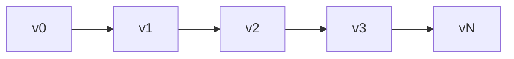
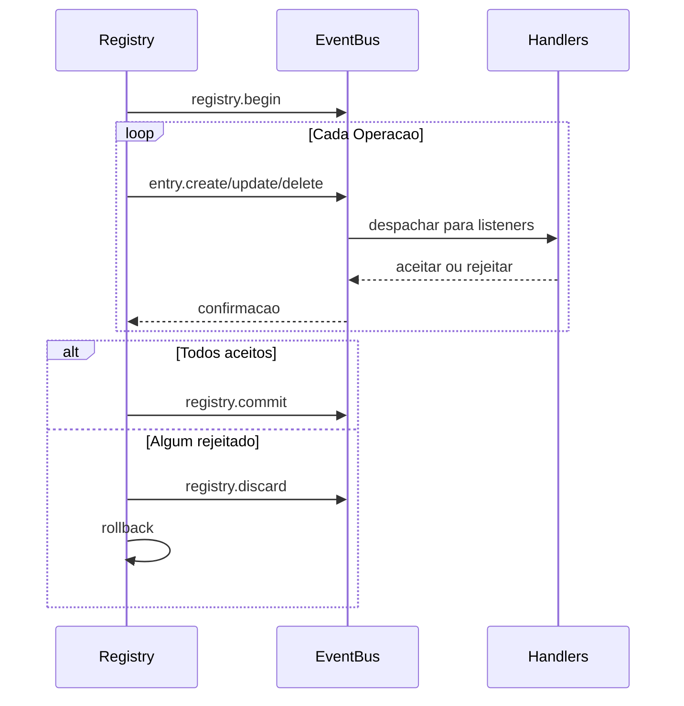

# Registry Internals

O registry e um armazenamento de estado versionado e orientado a eventos. Ele mantem historico completo de versoes, suporta transacoes e propaga mudancas atraves do event bus.

## Armazenamento de Entradas

Entradas sao armazenadas como um slice ordenado com um indice de hash map para lookups O(1):

```go
type Entry struct {
    ID   ID              // namespace:name
    Kind Kind            // Tipo da entrada
    Meta attrs.Bag       // Metadados
    Data payload.Payload // Conteudo
}
```

IDs de entrada usam o pacote `unique` do Go para interning - IDs identicos compartilham memoria.

## Cadeia de Versoes

Cada versao aponta para seu pai. Computacao de caminho usa um algoritmo de grafo para encontrar a rota mais curta entre quaisquer duas versoes:



## ChangeSets

Um changeset e uma lista ordenada de operacoes transformando um estado em outro:

| Operacao | OriginalEntry | Proposito |
|----------|---------------|-----------|
| Create | nil | Adicionar nova entrada |
| Update | valor antigo | Modificar existente |
| Delete | valor deletado | Remover entrada |

`OriginalEntry` permite reversao - updates armazenam o valor anterior, deletes armazenam o que foi removido.

### Construindo Deltas

`BuildDelta(oldState, newState)` gera operacoes minimas:

1. Comparar estados, identificar mudancas
2. Ordenar deletes em ordem reversa de dependencia (dependentes primeiro)
3. Ordenar creates/updates em ordem direta de dependencia (dependencias primeiro)

### Squashing

Multiplos changesets mesclam rastreando estado final por entrada:

```
Create + Update = Create (com valor atualizado)
Create + Delete = vazio (cancelam)
Update + Delete = Delete
Delete + Create = Update
```

## Transacoes



Handlers tem 30 segundos para aceitar ou rejeitar cada operacao. Em rejeicao, o registry faz rollback computando e aplicando o delta inverso.

### Entradas que Nao Propagam

Alguns tipos pulam o event bus completamente:
- `registry.entry` - Configs de aplicacao
- `ns.requirement` - Requirements de namespace
- `ns.dependency` - Dependencias de modulo

## Resolucao de Dependencias

Entradas podem declarar dependencias de outras entradas. O resolver extrai dependencias via padroes registrados:

```go
resolver.RegisterPattern(PathConfig{
    Path: "meta.server",
    AllowWildcard: true,
})
```

Dependencias sao extraidas dos campos Meta e Data da entrada, depois usadas para ordenacao topologica durante transicoes de estado.

## Historico de Versoes

Backends de historico:

| Implementacao | Caso de Uso |
|---------------|-------------|
| SQLite | Persistencia de producao |
| Memory | Testes |
| Nil | Sem historico |

SQLite usa modo WAL com tabelas para versoes, changesets (codificados em MessagePack) e metadados.

### Navegacao

Computacao de caminho encontra a rota mais curta entre versoes:

```go
Path(v0, v3) = [v1, v2, v3]  // Aplicar changesets para frente
Path(v3, v1) = [v2, v1]      // Aplicar changesets reversos
```

`LoadState()` reproduz historico de um baseline sem criar novas versoes - usado durante boot.

## Finder

Motor de busca com caching LRU para pesquisar entradas:

| Operador | Prefixo | Exemplo |
|----------|---------|---------|
| Glob | (nenhum) | `.kind=function.*` |
| Regex | `~` | `~meta.path=/api/.*` |
| Contains | `*` | `*meta.tags=backend` |
| Prefix | `^` | `^meta.name=user` |
| Suffix | `$` | `$meta.path=Handler` |

Cache invalida em mudanca de versao.

## Veja Tambem

- [Registry](concept-registry.md) - Conceitos de alto nivel
- [Events](internal-events.md) - Detalhes do event bus
