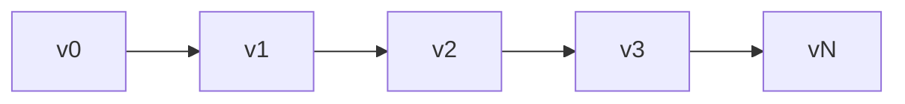
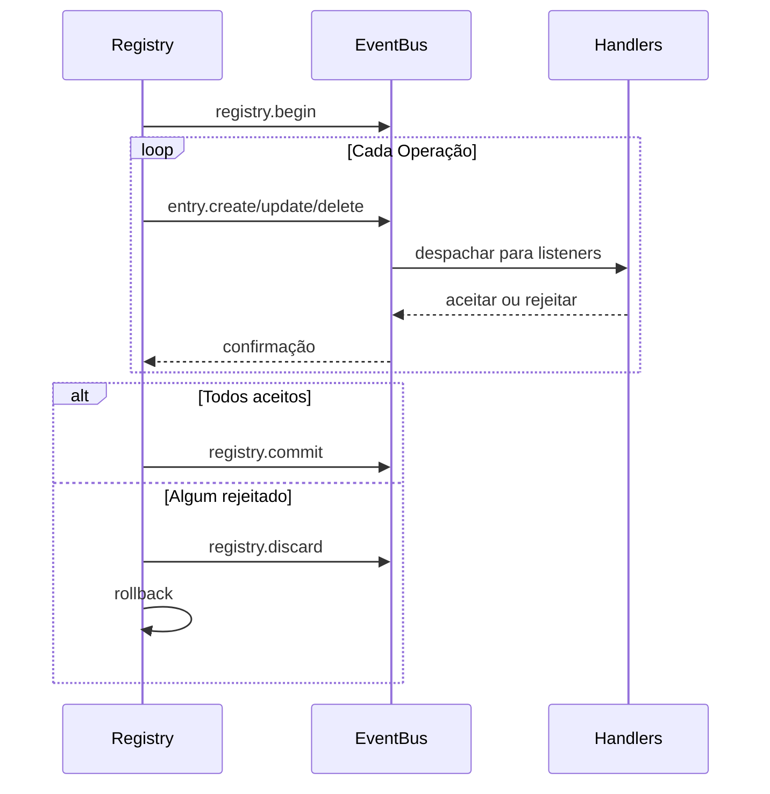

# Registry Internals

O registry é um armazenamento de estado versionado e orientado a eventos. Ele mantém histórico completo de versões, suporta transações e propaga mudanças através do event bus.

## Armazenamento de Entradas

Entradas são armazenadas como um slice ordenado com um índice de hash map para lookups O(1):

```go
type Entry struct {
    ID       ID              // namespace:name
    Kind     Kind            // Tipo da entrada
    Meta     attrs.Bag       // Metadados do autor
    Data     payload.Payload // Conteúdo
    Registry EntryMetadata   // Proveniência de propriedade do registry
}

type EntryMetadata struct {
    Owner string // Fonte de deployment que forneceu a entrada
    Root  bool   // Declaração de dependência selecionada pelo deployment
}
```

IDs de entrada usam o pacote `unique` do Go para interning - IDs idênticos compartilham memória.

`Registry` pertence ao registry, não ao autor da entrada. `Owner` é atribuído a partir da fonte de deployment; `Root` é definido a partir do campo de escrita `dependency_root` em uma entrada `ns.dependency`. As APIs comuns de entrada retornam apenas `ID`, `Kind`, `Meta` e `Data`; a proveniência é lida através da API de estado do snapshot.

## Snapshot

`Registry.Snapshot()` retorna uma visão atômica: a versão, as entradas naquela versão e os metadados de estado de propriedade do registry para essa mesma versão.

```go
type Snapshot struct {
    Registry StateMetadata
    Version  Version
    Entries  State
}

type StateMetadata struct {
    Resolution *DependencyResolution
}
```

Ler versão, entradas e resolução como um único valor impede que um chamador combine entradas com uma resolução de outra versão. O grafo de módulos selecionado é armazenado uma vez por snapshot em vez de repetido em cada entrada.

## Overlays

`OverlayWriter` é uma capacidade opcional do registry para entradas locais ao processo:

```go
type OverlayWriter interface {
    ApplyOverlay(context.Context, string, uint64, ChangeSet) (uint64, error)
    GetOverlay(string) (State, uint64, error)
}
```

Entradas de overlay são agrupadas sob uma string de owner lógico. Elas se juntam ao estado efetivo e passam pela mesma ordenação topológica e pelas mesmas transições de handler que as entradas duráveis, então serviços iniciam e param normalmente para elas, mas nunca produzem uma versão de histórico. Elas ficam vazias após um cold boot e devem ser reconciliadas pelo serviço de controle que as possui.

As escritas são otimisticamente concorrentes: `GetOverlay` retorna a geração atual do owner, e `ApplyOverlay` só faz commit se essa geração ainda for a atual, caso contrário retorna um `Conflict` retentável. Cada aplicação bem-sucedida emite uma nova geração única no processo, e um tombstone é retido para owners que sofreram mutação, de modo que uma sequência ABA não possa ser confundida com um overlay inalterado.

As regras de composição validadas em cada aplicação:

- Uma entrada só pode ser criada se nenhuma entrada durável e nenhuma entrada de overlay detiver seu ID.
- Apenas a identidade proprietária pode atualizar ou deletar suas entradas de overlay.
- Entradas de overlay não podem carregar metadados de propriedade do registry, nem usar kinds reivindicados por diretivas do registry.
- Um delete não pode remover uma entrada da qual uma entrada sobrevivente depende.
- Arestas de dependência não podem cruzar fronteiras de owner, e entradas duráveis não podem depender de entradas de overlay.

## Cadeia de Versões

Cada versão aponta para seu pai. Computação de caminho usa um algoritmo de grafo para encontrar a rota mais curta entre quaisquer duas versões:


```mermaid
flowchart LR
    v0[v0] --> v1[v1] --> v2[v2] --> v3[v3] --> vN[vN]
```

## ChangeSets

Um changeset é uma lista ordenada de operações transformando um estado em outro:

| Operação | OriginalEntry | Propósito |
|----------|---------------|-----------|
| Create | nil | Adicionar nova entrada |
| Update | valor antigo | Modificar existente |
| Delete | valor deletado | Remover entrada |

`OriginalEntry` permite reversão - updates armazenam o valor anterior, deletes armazenam o que foi removido.

### Construindo Deltas

`BuildDelta(oldState, newState)` gera operações mínimas:

1. Comparar estados, identificar mudanças
2. Ordenar deletes em ordem reversa de dependência (dependentes primeiro)
3. Ordenar creates/updates em ordem direta de dependência (dependências primeiro)

### Squashing

Múltiplos changesets mesclam rastreando estado final por entrada:

```
Create + Update = Create (com valor atualizado)
Create + Delete = vazio (cancelam)
Update + Delete = Delete
Delete + Create = Update
```

## Transações


```mermaid
sequenceDiagram
    participant R as Registry
    participant B as EventBus
    participant H as Handlers

    R->>B: registry.begin
    loop Cada Operação
        R->>B: entry.create/update/delete
        B->>H: despachar para listeners
        H-->>B: aceitar ou rejeitar
        B-->>R: confirmação
    end
    alt Todos aceitos
        R->>B: registry.commit
    else Algum rejeitado
        R->>B: registry.discard
        R->>R: rollback
    end
```

Handlers tem 30 segundos para aceitar ou rejeitar cada operação. Em rejeição, o registry faz rollback computando e aplicando o delta inverso.

### Entradas que Não Propagam

Alguns tipos pulam o event bus completamente:
- `registry.entry` - Configs de aplicação
- `ns.requirement` - Requirements de namespace
- `ns.dependency` - Dependências de módulo
- `ns.definition` - Metadados do módulo (readme, wiki, licença, autores)

## Resolução de Dependências

Entradas podem declarar dependências de outras entradas. O resolver extrai dependências via padrões registrados:

```go
resolver.RegisterPattern(registry.DependencyPattern{
    Path: "meta.server",
    AllowWildcard: true,
})
```

Dependências são extraídas dos campos Meta e Data da entrada, depois usadas para ordenação topológica durante transições de estado.

### Política de Acesso a Dependências

O acesso a dependências externas é um valor de contexto com escopo de requisição, não uma flag global:

| Política | Efeito |
|--------|--------|
| `DependencyAccessUnspecified` | Os chamadores escolhem; o padrão do próprio chamador se aplica |
| `DependencyAccessOnline` | Resolução externa e download de artefatos são permitidos |
| `DependencyAccessVerifiedOffline` | Acesso externo é proibido; a resolução usa manifestos travados e artefatos presentes localmente |

`LoadState()` assume verified-offline quando o contexto não especifica nada, então o boot reproduz um grafo armazenado sem alcançar a rede. Restaurar uma baseline de deployment muda o contexto para online porque precisa buscar os módulos que essa baseline nomeia. Sob verified-offline, um provedor de manifestos que serve apenas módulos travados substitui o provedor do hub, e um artefato ausente falha como evidência ausente em vez de disparar um download.

## Histórico de Versões

Backends de histórico:

| Implementação | Caso de Uso |
|---------------|-------------|
| SQLite | Persistência de produção |
| PostgreSQL | Persistência de produção, compartilhada entre nós |
| Memory | Default quando `history_type` não está definido; testes |
| Nil | Sem histórico |

SQLite usa modo WAL com tabelas para versões, changesets (codificados em MessagePack) e metadados. PostgreSQL é selecionado com `registry.history_type: postgres` mais `history_dsn`/`history_schema` (veja [Configuração](guides/configuration.md#registry)).

O histórico também persiste a resolução exata de dependências de cada versão: quando uma mudança de `ns.dependency` é aplicada, o grafo de módulos resolvido é armazenado endereçado por conteúdo junto ao changeset. Boot e rollback reproduzem o grafo armazenado em vez de resolver de novo, então uma versão sempre se reconcilia com as versões com que foi resolvida. O schema do histórico migra automaticamente no primeiro boot após um upgrade; uma versão pré-existente é resolvida uma vez na primeira visita e registrada como checkpoint.

### Navegação

Computação de caminho encontra a rota mais curta entre versões:

```go
Path(v0, v3) = [v1, v2, v3]  // Aplicar changesets para frente
Path(v3, v1) = [v2, v1]      // Aplicar changesets reversos
```

`LoadState()` reproduz histórico de um baseline sem criar novas versões - usado durante boot.

## Finder

Motor de busca com caching LRU para pesquisar entradas:

| Operador | Prefixo | Exemplo |
|----------|---------|---------|
| Glob | (nenhum) | `.kind=function.*` |
| Regex | `~` | `~meta.path=/api/.*` |
| Contains | `*` | `*meta.tags=backend` |
| Prefix | `^` | `^meta.name=user` |
| Suffix | `$` | `$meta.path=Handler` |

Cache invalida em mudança de versão.

## Veja Também

- [Registry](concepts/registry.md) - Conceitos de alto nível
- [Events](internals/events.md) - Detalhes do event bus
