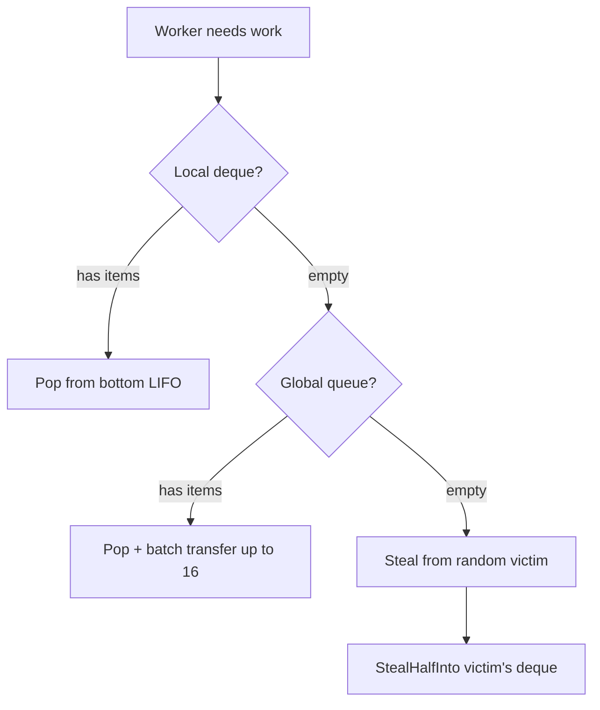
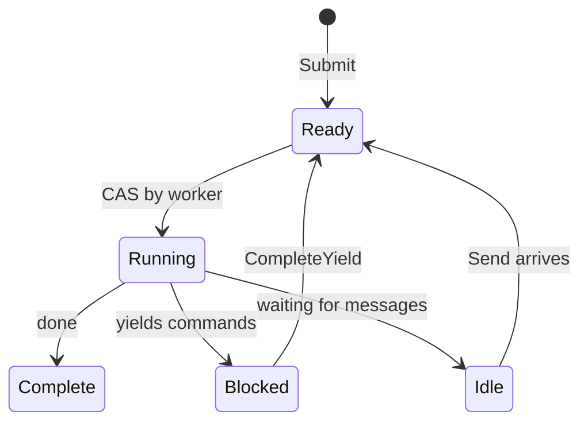

# Scheduler

O scheduler executa processos usando um design de work-stealing. Workers mantem deques locais e roubam uns dos outros quando ociosos.

## Interface Process

O scheduler trabalha com qualquer tipo que implemente a interface `Process`:

```go
type Process interface {
    Init(ctx context.Context, method string, input payload.Payloads) error
    Step(events []Event, out *StepOutput) error
    Close()
}
```

| Metodo | Proposito |
|--------|-----------|
| `Init` | Preparar processo com nome do metodo de entrada e argumentos de entrada |
| `Step` | Avancar maquina de estado com eventos de entrada, escrever yields na saida |
| `Close` | Liberar recursos |

O parametro `method` em `Init` especifica qual ponto de entrada invocar. Uma instancia de processo pode expor multiplos pontos de entrada, e o chamador seleciona qual executar. Isso tambem serve como verificacao de que o scheduler esta iniciando o processo corretamente.

O scheduler chama `Step()` repetidamente, passando eventos (completacoes de yield, mensagens) e coletando yields (comandos para despachar). O processo escreve seu status e quaisquer yields no buffer `StepOutput`.

```go
type Event struct {
    Type  EventType  // EventYieldComplete ou EventMessage
    Tag   uint64     // Tag de correlacao para completacoes de yield
    Data  any        // Dados de resultado ou payload de mensagem
    Error error      // Erro se yield falhou
}
```

## Estrutura

O scheduler cria `GOMAXPROCS` workers por padrao. Cada worker tem um deque local para acesso LIFO amigavel ao cache. Uma fila global FIFO trata novas submissoes e transferencias entre workers. Processos sao rastreados por PID para roteamento de mensagens.

## Busca de Trabalho



Workers verificam fontes em ordem de prioridade:

| Prioridade | Fonte | Padrao |
|------------|-------|--------|
| 1 | Deque local | LIFO pop, sem lock, amigavel ao cache |
| 2 | Fila global | FIFO pop com transferencia em batch |
| 3 | Outros workers | Roubar metade do deque da vitima |

Ao fazer pop da global, workers pegam um item e transferem em batch ate 16 mais para seu deque local.

## Deque Chase-Lev

Cada worker possui um deque de work-stealing Chase-Lev:

```go
type Deque struct {
    buffer atomic.Pointer[dequeBuffer]
    top    atomic.Int64  // Ladroes roubam daqui (CAS)
    bottom atomic.Int64  // Dono faz push/pop aqui
}
```

O dono faz push e pop do fundo (LIFO) sem sincronizacao. Ladroes roubam do topo (FIFO) usando CAS. Isso da ao dono acesso amigavel ao cache para itens recentemente empurrados enquanto distribui trabalho mais antigo para ladroes.

`StealHalfInto` pega metade dos itens em uma operacao CAS, reduzindo contencao.

## Spinning Adaptativo

Antes de bloquear na variavel de condicao, workers fazem spinning adaptativo:

| Contagem de Spin | Acao |
|------------------|------|
| < 4 | Loop tight |
| 4-15 | Yield de thread (`runtime.Gosched`) |
| >= 16 | Bloquear na variavel de condicao |

## Estados de Processo



| Estado | Descricao |
|--------|-----------|
| Ready | Enfileirado para execucao |
| Running | Worker esta executando Step() |
| Blocked | Aguardando completacao de yield |
| Idle | Aguardando mensagens |
| Complete | Execucao finalizada |

Uma flag de wakeup trata corridas: se um handler chama `CompleteYield` enquanto o worker ainda possui o processo (Running), ele define a flag. O worker verifica a flag apos despachar e re-enfileira se definida.

## Fila de Eventos

Cada processo tem uma fila de eventos MPSC (multi-producer, single-consumer):

- **Produtores**: Handlers de comando (`CompleteYield`), remetentes de mensagem (`Send`)
- **Consumidor**: Worker drena eventos em `Step()`

## Roteamento de Mensagens

O scheduler implementa `relay.Receiver` para rotear mensagens para processos. Quando `Send()` e chamado, ele busca o PID alvo no mapa `byPID`, empurra a mensagem como um evento na fila do processo, e acorda o processo se ocioso empurrando-o para a fila global.

## Shutdown

No shutdown, o scheduler envia eventos de cancelamento para todos os processos em execucao e aguarda eles completarem ou timeout. Workers saem quando nao ha mais trabalho.

## Veja Tambem

- [Command Dispatch](internal-dispatch.md) - Como yields chegam aos handlers
- [Process Model](concept-process-model.md) - Conceitos de alto nivel
