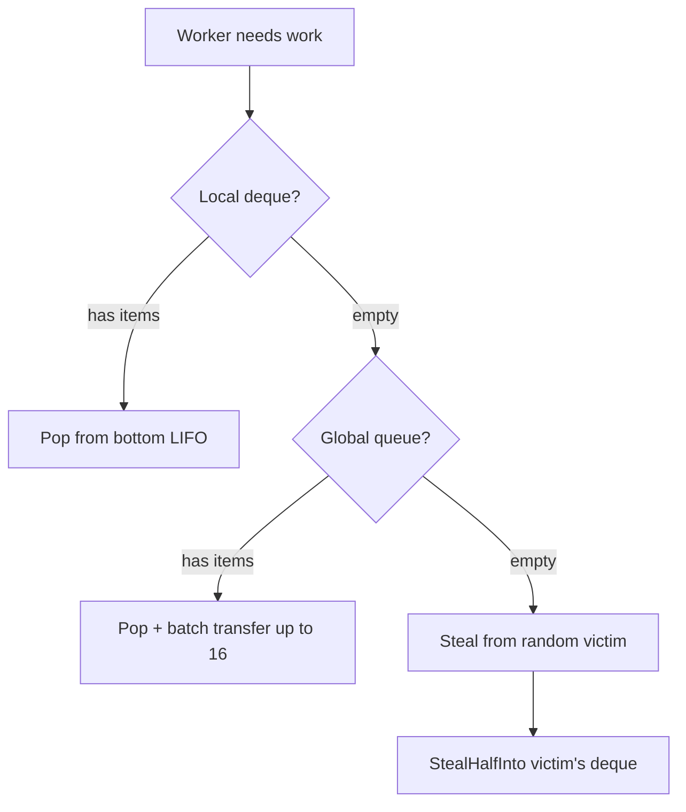
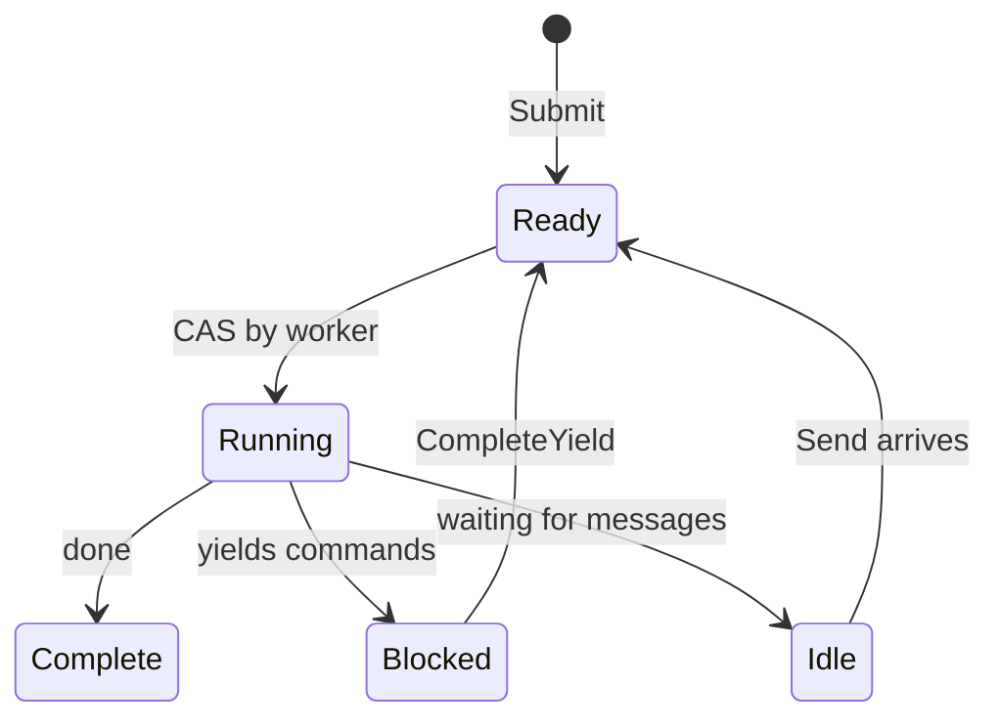

# Scheduler

O scheduler executa processos usando um design de work-stealing. Workers mantêm deques locais e roubam uns dos outros quando ociosos.

## Interface Process

O scheduler trabalha com qualquer tipo que implemente a interface `Process`:

```go
type Process interface {
    Init(ctx context.Context, method string, input payload.Payloads) error
    Step(events []Event, out *StepOutput) error
    Close()
}
```

| Método | Propósito |
|--------|-----------|
| `Init` | Preparar processo com nome do método de entrada e argumentos de entrada |
| `Step` | Avançar máquina de estado com eventos de entrada, escrever yields na saída |
| `Close` | Liberar recursos |

O parâmetro `method` em `Init` especifica qual ponto de entrada invocar. Uma instância de processo pode expor múltiplos pontos de entrada, e o chamador seleciona qual executar. Isso também serve como verificação de que o scheduler está iniciando o processo corretamente.

O scheduler chama `Step()` repetidamente, passando eventos (completações de yield, mensagens) e coletando yields (comandos para despachar). O processo escreve seu status e quaisquer yields no buffer `StepOutput`.

```go
type Event struct {
    Type  EventType  // EventYieldComplete ou EventMessage
    Tag   uint64     // Tag de correlação para completações de yield
    Data  any        // Dados de resultado ou payload de mensagem
    Error error      // Erro se yield falhou
}
```

## Estrutura

O scheduler cria `GOMAXPROCS` workers por padrão. Cada worker tem um deque local para acesso LIFO amigável ao cache. Uma fila global FIFO trata novas submissões e transferências entre workers. Processos são rastreados por PID para roteamento de mensagens.

## Busca de Trabalho



Workers verificam fontes em ordem de prioridade:

| Prioridade | Fonte | Padrão |
|------------|-------|--------|
| 1 | Deque local | LIFO pop, sem lock, amigável ao cache |
| 2 | Fila global | FIFO pop com transferência em batch |
| 3 | Outros workers | Roubar metade do deque da vítima |

Ao fazer pop da global, workers pegam um item e transferem em batch até 16 mais para seu deque local.

## Deque Chase-Lev

Cada worker possui um deque de work-stealing Chase-Lev:

```go
type Deque struct {
    buffer atomic.Pointer[dequeBuffer]
    top    atomic.Int64  // Ladrões roubam daqui (CAS)
    bottom atomic.Int64  // Dono faz push/pop aqui
}
```

O dono faz push e pop do fundo (LIFO) sem sincronização. Ladrões roubam do topo (FIFO) usando CAS. Isso dá ao dono acesso amigável ao cache para itens recentemente empurrados enquanto distribui trabalho mais antigo para ladrões.

`StealHalfInto` pega metade dos itens em uma operação CAS, reduzindo contenção.

## Spinning Adaptativo

Antes de bloquear na variável de condição, workers fazem spinning adaptativo:

| Contagem de Spin | Ação |
|------------------|------|
| < 4 | Loop tight |
| 4-15 | Yield de thread (`runtime.Gosched`) |
| >= 16 | Bloquear na variável de condição |

## Estados de Processo



| Estado | Descrição |
|--------|-----------|
| Ready | Enfileirado para execução |
| Running | Worker está executando Step() |
| Blocked | Aguardando completação de yield |
| Idle | Aguardando mensagens |
| Complete | Execução finalizada |

Uma flag de wakeup trata corridas: se um handler chama `CompleteYield` enquanto o worker ainda possui o processo (Running), ele define a flag. O worker verifica a flag após despachar e re-enfileira se definida.

## Fila de Eventos

Cada processo tem uma fila de eventos MPSC (multi-producer, single-consumer):

- **Produtores**: Handlers de comando (`CompleteYield`), remetentes de mensagem (`Send`)
- **Consumidor**: Worker drena eventos em `Step()`

## Roteamento de Mensagens

O scheduler implementa `relay.Receiver` para rotear mensagens para processos. Quando `Send()` é chamado, ele busca o PID alvo no mapa `byPID`, empurra a mensagem como um evento na fila do processo, e acorda o processo se ocioso empurrando-o para a fila global.

## Shutdown

No shutdown, o scheduler envia eventos de cancelamento para todos os processos em execução e aguarda eles completarem ou timeout. Workers saem quando não há mais trabalho.

## Veja Também

- [Command Dispatch](internal-dispatch.md) - Como yields chegam aos handlers
- [Process Model](concept-process-model.md) - Conceitos de alto nível
