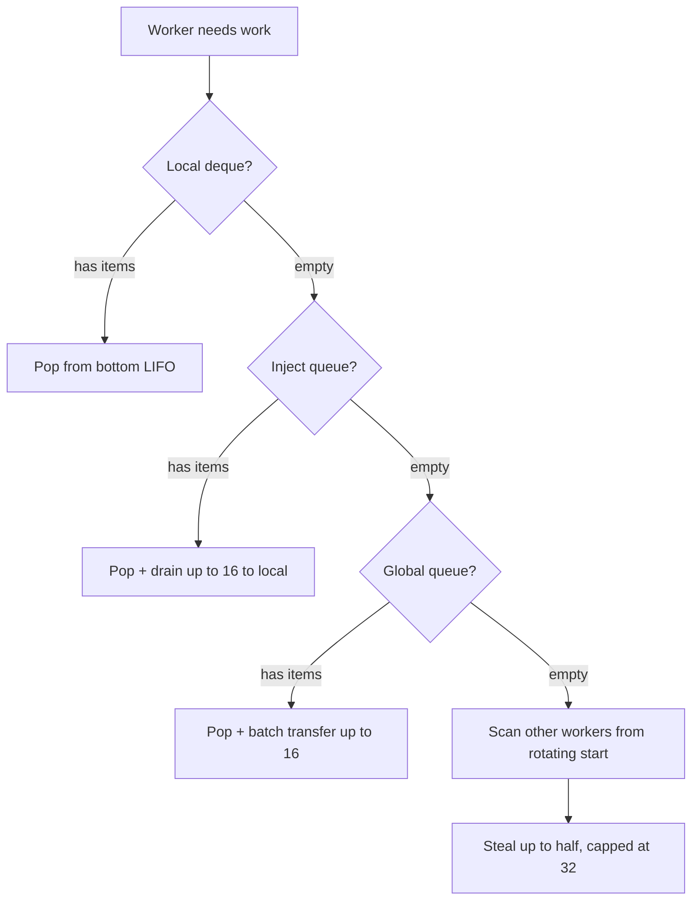
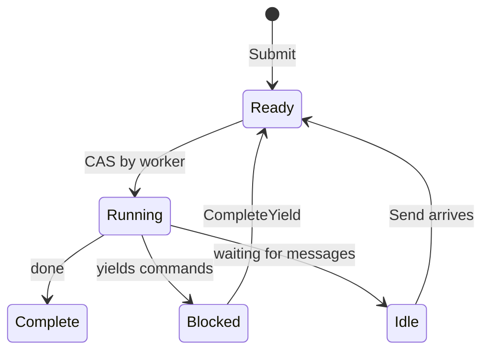

# Scheduler

O scheduler executa processos em workers com deques locais, filas de injeção, uma fila global e work stealing.

Esta é uma referência de implementação. As estruturas Go e os diagramas descrevem o scheduler da versão fixada do runtime, e não APIs implementadas pelo código da aplicação.

## Interface Process

O scheduler trabalha com qualquer tipo que implemente a interface `Process`:

```go
type Process interface {
    Init(ctx context.Context, method string, input payload.Payloads) error
    Step(events []Event, out *StepOutput) error
    Close()
}
```

| Método | Propósito |
|--------|-----------|
| `Init` | Preparar processo com nome do método de entrada e argumentos de entrada |
| `Step` | Avançar máquina de estado com eventos de entrada, escrever yields na saída |
| `Close` | Liberar recursos |

O parâmetro `method` de `Init` especifica qual ponto de entrada invocar. Uma instância de processo pode expor vários pontos de entrada, e o chamador escolhe qual executar.

O scheduler chama `Step()` repetidamente, passando eventos (completações de yield, mensagens) e coletando yields (comandos para despachar). O processo escreve seu status e quaisquer yields no buffer `StepOutput`.

```go
type Event struct {
    Type  EventType  // EventYieldComplete or EventMessage
    Tag   uint64     // Correlation tag for yield completions
    Data  any        // Result data or message payload
    Error error      // Error if yield failed
}
```

## Estrutura

O scheduler cria `GOMAXPROCS` workers por padrão. Cada worker tem um deque local para acesso LIFO amigável ao cache e uma fila de injeção MPSC por worker para completações assíncronas que têm afinidade com aquele worker. Uma fila global FIFO trata novas submissões e re-enfileiramentos sem afinidade. Processos são rastreados por PID para roteamento de mensagens.

## Busca de Trabalho


```mermaid
flowchart TD
    W[Worker needs work] --> L{Local deque?}
    L -->|has items| LP[Pop from bottom LIFO]
    L -->|empty| I{Inject queue?}
    I -->|has items| IP[Pop + drain up to 16 to local]
    I -->|empty| G{Global queue?}
    G -->|has items| GP[Pop + batch transfer up to 16]
    G -->|empty| S[Scan other workers from rotating start]
    S --> SH[Steal up to half, capped at 32]
```

Workers verificam fontes em ordem de prioridade:

| Prioridade | Fonte | Padrão |
|------------|-------|--------|
| 1 | Deque local | LIFO pop, sem lock, amigável ao cache |
| 2 | Fila de injeção | MPSC pop de completações assíncronas afins, drena até 16 para o local |
| 3 | Fila global | FIFO pop com transferência em batch |
| 4 | Outros workers | Roubar metade do deque da vítima |

Ao fazer pop da fila de injeção ou da global, workers pegam um item e movem até 16 mais para seu deque local.

## Deque Chase-Lev

Cada worker possui um deque de work-stealing Chase-Lev:

```go
type Deque struct {
    buffer atomic.Pointer[dequeBuffer]
    top    atomic.Int64  // Thieves steal from here (CAS)
    bottom atomic.Int64  // Owner pushes/pops here
}
```

O proprietário insere e remove itens pelo fundo (LIFO) sem mutex; a remoção do último item usa CAS para coordenar com os workers que tentam roubá-lo. Esses workers roubam pelo topo (FIFO) usando CAS. Isso dá ao proprietário acesso eficiente em cache aos itens inseridos recentemente e distribui o trabalho mais antigo entre os demais workers.

`StealHalfInto` retira até metade dos itens disponíveis em uma operação CAS, limitado pelo buffer de destino. As tentativas de roubo dos workers usam um buffer de 32 itens.

## Spinning Adaptativo

Antes de bloquear na variável de condição, workers fazem spinning adaptativo:

| Contagem de Spin | Ação |
|------------------|------|
| < 4 | Loop apertado |
| 4-15 | Cede a thread (`runtime.Gosched`) |
| >= 16 | Bloquear na variável de condição |

## Estados de Processo


```mermaid
stateDiagram-v2
    [*] --> Ready: Submit
    Ready --> Running: CAS by worker
    Running --> Complete: done
    Running --> Blocked: yields commands
    Running --> Idle: waiting for messages
    Blocked --> Ready: CompleteYield
    Idle --> Ready: Send arrives
```

| Estado | Descrição |
|--------|-----------|
| Ready | Enfileirado para execução |
| Running | Worker está executando Step() |
| Blocked | Aguardando completação de yield |
| Idle | Aguardando mensagens |
| Complete | Execução finalizada |

Uma flag de wakeup trata corridas: se um handler chama `CompleteYield` enquanto o worker ainda possui o processo (Running), ele define a flag. O worker verifica a flag após despachar e re-enfileira se definida.

## Fila de Eventos

Cada processo tem uma fila de eventos MPSC (multi-producer, single-consumer):

- **Produtores**: Handlers de comando (`CompleteYield`), remetentes de mensagem (`Send`)
- **Consumidor**: Worker drena eventos em `Step()`

Um contador de geração protege a fila. Todo produtor se vincula à geração que observou; `Reset` a incrementa, então um remetente remanescente de uma execução anterior não pode empurrar para uma fila reutilizada.

O tráfego comum de eventos é ilimitado. A contabilização é opcional por mensagem: uma mensagem que carrega `MaxItems` ou `MaxBytes` é admitida contra um orçamento por tópico, e o limite mais restrito visto para um tópico vence. Uma mensagem mantém sua reserva até o processo consumidor liberá-la, e terminais nunca consomem capacidade de backlog.

Quando o orçamento de um tópico se esgota, a fila anexa uma mensagem sintética no lugar da mensagem que transbordou, carregando `message queue limit exceeded` seguido de um payload terminal. O tráfego seguinte nesse tópico é descartado até a fila ser reiniciada, então uma inscrição limitada termina com um terminal de erro em vez de crescer sem limite.

## Roteamento de Mensagens

O scheduler implementa `relay.Receiver` para rotear mensagens para processos. `Send` delega para `SendContext` com um contexto de background; `SendContext` verifica o cancelamento antes da busca do alvo e antes da admissão, porque a admissão em si é não bloqueante e irreversível uma vez bem-sucedida.

Ambos buscam o PID alvo no mapa `byPID` e empurram o pacote para a fila do processo sob a geração atual do processador. A admissão tem três resultados:

| Resultado | Significado | Posse do pacote |
|--------|---------|-------------------|
| Aceito | A fila assumiu o pacote | Fila, liberado pelo scheduler após o processamento |
| Descartado | Um orçamento por tópico transbordou e a fila não reteve nada além de seu próprio terminal de overflow | Chamador, liberado imediatamente |
| Rejeitado | A fila está fechada ou a geração está obsoleta | Chamador; `SendContext` retorna `ErrProcessClosed` |

Um push aceito ou descartado então acorda o processo se ele estiver ocioso ou bloqueado. Ele reenfileira via injectOrGlobal, que empurra para a fila de injeção do último worker quando o processo tem afinidade de worker conhecida, e recorre à fila global caso contrário.

## Encerramento :id=shutdown

Durante o encerramento, o scheduler envia eventos de cancelamento a todos os processos rastreados e aguarda que terminem ou que o timeout expire. Os workers saem quando não há mais trabalho.

## Consulte também

- [Despacho de comandos](internals/dispatch.md) — Como os yields chegam aos handlers
- [Modelo de processos](concepts/process-model.md) — Conceitos de alto nível
