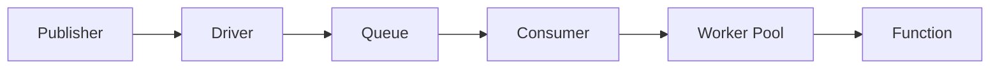

# Fila

O Wippy fornece um sistema de filas para processamento assincrono de mensagens com drivers e consumidores configuraveis.

## Arquitetura



- **Driver** - Implementacao de backend (memoria, AMQP, Redis)
- **Queue** - Fila logica vinculada a um driver
- **Consumer** - Conecta fila ao handler com configuracoes de concorrencia
- **Worker Pool** - Processadores de mensagens concorrentes

Multiplas filas podem compartilhar um driver. Multiplos consumidores podem processar da mesma fila.

## Tipos de Entradas

| Tipo | Descricao |
|------|-----------|
| `queue.driver.memory` | Driver de fila em memoria |
| `queue.queue` | Declaracao de fila com referencia ao driver |
| `queue.consumer` | Consumidor que processa mensagens |

## Configuracao do Driver

### Driver de Memoria

Driver em memoria para desenvolvimento e testes.

```yaml
- name: memory_driver
  kind: queue.driver.memory
  lifecycle:
    auto_start: true
```

<note>
Drivers adicionais (AMQP, Redis, SQS) estao planejados. A interface de driver permite trocar backends sem mudar configuracao de fila ou consumidor.
</note>

## Configuracao de Fila

```yaml
- name: tasks
  kind: queue.queue
  driver: app.queue:memory_driver
```

| Campo | Tipo | Obrigatorio | Descricao |
|-------|------|-------------|-----------|
| `driver` | ID do Registro | Sim | Referencia ao driver de fila |
| `options` | Map | Nao | Opcoes especificas do driver |

<note>
O driver de memoria nao tem opcoes de configuracao. Drivers externos (AMQP, Redis, SQS) definem suas proprias opcoes para comportamento de fila como durabilidade, tamanho maximo e TTL.
</note>

## Configuracao do Consumidor

```yaml
- name: task_consumer
  kind: queue.consumer
  queue: app.queue:tasks
  func: app.queue:task_handler
  concurrency: 4
  prefetch: 20
  lifecycle:
    auto_start: true
    depends_on:
      - app.queue:tasks
```

| Campo | Padrao | Max | Descricao |
|-------|--------|-----|-----------|
| `queue` | Obrigatorio | - | ID do registro da fila |
| `func` | Obrigatorio | - | ID do registro da funcao handler |
| `concurrency` | 1 | 1000 | Contagem de workers paralelos |
| `prefetch` | 10 | 10000 | Tamanho do buffer de mensagens |

<tip>
Consumidores respeitam contexto de chamada e podem estar sujeitos a politicas de seguranca. Configure ator e politicas no nivel de ciclo de vida. Veja <a href="system-security.md">Seguranca</a>.
</tip>

### Pool de Workers

Workers executam como goroutines concorrentes:

```
concurrency: 3, prefetch: 10

1. Driver entrega ate 10 mensagens para o buffer
2. 3 workers pegam do buffer concorrentemente
3. Conforme workers terminam, buffer reabastece
4. Contrapressao quando todos workers ocupados e buffer cheio
```

## Funcao Handler

Funcoes de consumidor recebem dados da mensagem e retornam sucesso ou erro:

```lua
local json = require("json")
local logger = require("logger")

local function handler(body)
    local data = json.decode(body)

    logger.info("Processando", {task_id = data.id})

    local result, err = process_task(data)
    if err then
        return nil, err  -- Nack: reenfileira mensagem
    end

    return result  -- Ack: remove da fila
end

return handler
```

```yaml
- name: task_handler
  kind: function.lua
  source: file://task_handler.lua
  modules:
    - json
    - logger
```

### Reconhecimento

| Resultado do Handler | Acao | Efeito |
|----------------------|------|--------|
| Valor de retorno | Ack | Mensagem removida da fila |
| Retorna erro | Nack | Mensagem reenfileirada (dependente do driver) |

## Publicando Mensagens

A partir de codigo Lua:

```lua
local queue = require("queue")

queue.publish("app.queue:tasks", {
    id = "task-123",
    action = "process",
    data = payload
})
```

Veja [Modulo Queue](lua-queue.md) para API completa.

## Encerramento Gracioso

Ao parar consumidor:

1. Para de aceitar novas entregas
2. Cancela contextos de workers
3. Aguarda mensagens em voo (com timeout)
4. Retorna erro se workers nao terminarem a tempo

## Veja Tambem

- [Modulo Queue](lua/storage/queue.md) - Referencia da API Lua
- [Guia de Consumidores de Filas](guides/queue-consumers.md) - Padroes de consumidor e pools de workers
- [Supervisao](guides/supervision.md) - Gerenciamento de ciclo de vida do consumidor
