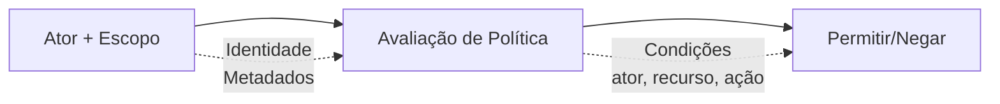

# Modelo de Segurança

O Wippy implementa controle de acesso baseado em atributos. Toda requisição carrega um ator (quem) e um escopo (quais políticas se aplicam). Políticas avaliam acesso baseado na ação, recurso e metadados tanto do ator quanto do recurso.



## Tipos de Entradas

| Tipo | Descrição |
|------|-----------|
| `security.policy` | Política declarativa com condições |
| `security.policy.expr` | Política baseada em expressão |
| `security.token_store` | Armazenamento e validação de tokens |

## Atores

Um ator representa quem está executando uma ação.

```lua
local security = require("security")

-- Cria ator com metadados
local actor = security.new_actor("user:123", {
    role = "admin",
    team = "backend",
    department = "engineering",
    clearance = 3
})

-- Acessa propriedades do ator
local id = actor:id()        -- "user:123"
local meta = actor:meta()    -- {role="admin", ...}
```

### Ator no Contexto

```lua
-- Obtém ator atual do contexto
local actor = security.actor()
if not actor then
    return nil, errors.new("UNAUTHORIZED", "Sem ator no contexto")
end
```

## Políticas

Políticas definem regras de acesso com ações, recursos, condições e efeitos.

### Política Declarativa

```yaml
# src/security/_index.yaml
version: "1.0"
namespace: app.security

entries:
  # Acesso total de admin
  - name: admin_policy
    kind: security.policy
    policy:
      actions: "*"
      resources: "*"
      effect: allow
      conditions:
        - field: actor.meta.role
          operator: eq
          value: admin
    groups:
      - admin

  # Acesso somente leitura
  - name: readonly_policy
    kind: security.policy
    policy:
      actions:
        - "*.read"
        - "*.get"
        - "*.list"
      resources: "*"
      effect: allow
    groups:
      - default

  # Acesso do proprietário do recurso
  - name: owner_policy
    kind: security.policy
    policy:
      actions:
        - read
        - write
        - delete
      resources: "document:*"
      effect: allow
      conditions:
        - field: meta.owner
          operator: eq
          value_from: actor.id
    groups:
      - default

  # Nega confidencial sem autorização
  - name: deny_confidential
    kind: security.policy
    policy:
      actions: "*"
      resources: "document:*"
      effect: deny
      conditions:
        - field: meta.classification
          operator: eq
          value: confidential
        - field: actor.meta.clearance
          operator: lt
          value: 3
    groups:
      - security
```

### Estrutura da Política

```yaml
policy:
  actions: "*" | "action" | ["action1", "action2"]
  resources: "*" | "resource" | ["res1", "res2"]
  effect: allow | deny
  conditions:  # Opcional
    - field: "field.path"
      operator: "eq"
      value: "static_value"
      # OU
      value_from: "other.field.path"
```

### Política Baseada em Expressão

Para lógica complexa, use políticas de expressão:

```yaml
- name: flexible_access
  kind: security.policy.expr
  policy:
    actions:
      - read
      - write
    resources: "file:*"
    effect: allow
    expression: |
      (actor.meta.role == "editor" && action == "write") ||
      (action == "read" && meta.public == true) ||
      actor.id == meta.owner
  groups:
    - editors
```

## Condições

Condições permitem avaliação dinâmica de políticas baseada em ator, ação, recurso e metadados.

### Caminhos de Campo

| Caminho | Descrição |
|---------|-----------|
| `actor.id` | Identificador único do ator |
| `actor.meta.*` | Metadados do ator (suporta aninhamento) |
| `action` | A ação sendo executada |
| `resource` | O identificador do recurso |
| `meta.*` | Metadados do recurso |

### Operadores

| Operador | Descrição | Exemplo |
|----------|-----------|---------|
| `eq` | Igual | `actor.meta.role eq "admin"` |
| `ne` | Diferente | `meta.status ne "deleted"` |
| `lt` | Menor que | `meta.priority lt 5` |
| `gt` | Maior que | `actor.meta.clearance gt 2` |
| `lte` | Menor ou igual | `meta.size lte 1000` |
| `gte` | Maior ou igual | `actor.meta.level gte 3` |
| `in` | Valor em array | `action in ["read", "write"]` |
| `nin` | Valor não em array | `meta.status nin ["deleted", "archived"]` |
| `exists` | Campo existe | `meta.owner exists true` |
| `nexists` | Campo não existe | `meta.deleted nexists true` |
| `contains` | String contém | `resource contains "sensitive"` |
| `ncontains` | String não contém | `resource ncontains "public"` |
| `matches` | Correspondência regex | `resource matches "^doc:.*"` |
| `nmatches` | Não corresponde regex | `actor.id nmatches "^system:.*"` |

### Exemplos de Condições

```yaml
# Corresponde role do ator
conditions:
  - field: actor.meta.role
    operator: eq
    value: admin

# Compara campos
conditions:
  - field: meta.owner
    operator: eq
    value_from: actor.id

# Comparação numérica
conditions:
  - field: actor.meta.clearance
    operator: gte
    value: 3

# Pertencimento a array
conditions:
  - field: actor.meta.role
    operator: in
    value:
      - admin
      - moderator

# Correspondência de padrão
conditions:
  - field: resource
    operator: matches
    value: "^api:/v[0-9]+/admin/.*"

# Múltiplas condições (AND)
conditions:
  - field: actor.meta.department
    operator: eq
    value: engineering
  - field: meta.environment
    operator: eq
    value: production
```

## Escopos

Escopos combinam múltiplas políticas em um contexto de segurança.

```lua
local security = require("security")

-- Obtém políticas
local admin_policy = security.policy("app.security:admin_policy")
local readonly_policy = security.policy("app.security:readonly_policy")

-- Cria escopo com políticas
local scope = security.new_scope()
scope = scope:with(admin_policy)
scope = scope:with(readonly_policy)

-- Escopos são imutáveis - :with() retorna novo escopo
```

### Escopos Nomeados (Grupos de Políticas)

Carrega todas as políticas de um grupo:

```lua
-- Carrega escopo com todas as políticas do grupo
local scope, err = security.named_scope("app.security:admin")
```

Políticas são atribuídas a grupos via campo `groups`:

```yaml
- name: admin_policy
  kind: security.policy
  policy:
    # ...
  groups:
    - admin      # Esta política está no grupo "admin"
    - default    # Pode estar em múltiplos grupos
```

### Operações de Escopo

```lua
-- Adiciona política
local new_scope = scope:with(policy)

-- Remove política
local new_scope = scope:without("app.security:temp_policy")

-- Verifica se política está no escopo
local has = scope:contains("app.security:admin_policy")

-- Obtém todas as políticas
local policies = scope:policies()
```

## Avaliação de Políticas

### Fluxo de Avaliação

```
1. Verifica cada política no escopo
2. Se QUALQUER política retorna Deny -> Resultado é Deny
3. Se pelo menos um Allow e nenhum Deny -> Resultado é Allow
4. Nenhuma política aplicável -> Resultado é Undefined
```

### Resultados de Avaliação

| Resultado | Significado |
|-----------|-------------|
| `allow` | Acesso concedido |
| `deny` | Acesso explicitamente negado |
| `undefined` | Nenhuma política correspondeu |

```lua
-- Avalia diretamente
local result = scope:evaluate(actor, "read", "document:123", {
    owner = "user:456",
    classification = "internal"
})

if result == "deny" then
    return nil, errors.new("FORBIDDEN", "Acesso negado")
elseif result == "undefined" then
    -- Nenhuma política correspondeu - depende do modo estrito
end
```

### Verificação Rápida de Permissão

```lua
-- Verifica contra ator e escopo do contexto atual
local allowed = security.can("read", "document:123", {
    owner = "user:456"
})

if not allowed then
    return nil, errors.new("FORBIDDEN", "Acesso negado")
end
```

## Token Stores

Token stores fornecem criação, validação e revogação seguras de tokens.

### Configuração

```yaml
# src/auth/_index.yaml
version: "1.0"
namespace: app.auth

entries:
  # Registra variável de ambiente
  - name: os_env
    kind: env.storage.os

  - name: AUTH_SECRET_KEY
    kind: env.variable
    variable: AUTH_SECRET_KEY
    storage: app.auth:os_env

  # Store de apoio para tokens
  - name: token_data
    kind: store.memory
    lifecycle:
      auto_start: true

  # Token store
  - name: tokens
    kind: security.token_store
    store: app.auth:token_data
    token_length: 32
    default_expiration: "24h"
    token_key_env: "AUTH_SECRET_KEY"
```

### Opções do Token Store

| Opção | Padrão | Descrição |
|-------|--------|-----------|
| `store` | obrigatório | Referência do store chave-valor de apoio |
| `token_length` | 32 | Tamanho do token em bytes (256 bits) |
| `default_expiration` | 24h | TTL padrão do token |
| `token_key` | nenhum | Chave de assinatura HMAC-SHA256 (valor direto) |
| `token_key_env` | nenhum | Nome da variável de ambiente para chave de assinatura |

Use `token_key_env` em produção para evitar embutir segredos em entradas. Veja [Sistema de Ambiente](system/env.md) para registrar variáveis de ambiente.

### Criando Tokens

```lua
local security = require("security")

-- Obtém token store
local store, err = security.token_store("app.auth:tokens")
if err then
    return nil, err
end

-- Cria ator e escopo
local actor = security.new_actor("user:123", {
    role = "user",
    email = "user@example.com"
})

local scope, _ = security.named_scope("app.security:default")

-- Cria token
local token, err = store:create(actor, scope, {
    expiration = "7d",  -- Sobrescreve expiração padrão
    meta = {
        device = "mobile",
        ip = "192.168.1.1"
    }
})

if err then
    return nil, err
end

-- Formato do token: base64_token.hmac_signature (se token_key definido)
-- Exemplo: "dGVzdHRva2VuMTIz.a1b2c3d4e5f6"
```

### Validando Tokens

```lua
-- Valida token
local actor, scope, err = store:validate(token)
if err then
    return nil, errors.new("UNAUTHORIZED", "Token inválido")
end

-- Ator e escopo são reconstruídos dos dados armazenados
print(actor:id())  -- "user:123"
```

### Revogando Tokens

```lua
-- Revoga token único
local ok, err = store:revoke(token)

-- Fecha store quando terminar
store:close()
```

## Fluxo de Contexto

O contexto de segurança se propaga através de chamadas de função.

### Definindo Contexto

```lua
local funcs = require("funcs")

-- Chama função com contexto de segurança
local result, err = funcs.new()
    :with_actor(actor)
    :with_scope(scope)
    :call("app.api:protected_endpoint", data)
```

### Herança de Contexto

| Componente | Herda |
|------------|-------|
| Ator | Sim - passa para chamadas filhas |
| Escopo | Sim - passa para chamadas filhas |
| Modo estrito | Não - aplicação-wide |

Funções herdam contexto de segurança do chamador. Processos criados iniciam do zero.

## Segurança em Nível de Serviço

Configure segurança padrão para serviços:

```yaml
- name: worker_service
  kind: process.lua
  source: file://worker.lua
  lifecycle:
    auto_start: true
    security:
      actor:
        id: "service:worker"
        meta:
          role: worker
          service: true
      policies:
        - app.security:worker_policy
      groups:
        - workers
```

## Modo Estrito

Habilite modo estrito para negar acesso quando contexto de segurança está ausente:

```yaml
# wippy.yaml
security:
  strict_mode: true
```

| Modo | Contexto Ausente | Comportamento |
|------|------------------|---------------|
| Normal | Sem ator/escopo | Permite (permissivo) |
| Estrito | Sem ator/escopo | Nega (padrão seguro) |

## Fluxo de Autenticação

Validação de token em um handler HTTP:

```lua
local http = require("http")
local security = require("security")

local function protected_handler()
    local req = http.request()
    local res = http.response()

    -- Extrai e valida token
    local auth = req:header("Authorization")
    if not auth then
        return res:set_status(401):write_json({error = "Autorização ausente"})
    end

    local token = auth:gsub("^Bearer%s+", "")
    local store, _ = security.token_store("app.auth:tokens")
    local actor, scope, err = store:validate(token)
    if err then
        return res:set_status(401):write_json({error = "Token inválido"})
    end

    -- Verifica permissão
    if not security.can("api.users.read", "users") then
        return res:set_status(403):write_json({error = "Proibido"})
    end

    res:write_json({user = actor:id()})
end

return { handler = protected_handler }
```

Criação de token durante login:

```lua
local actor = security.new_actor("user:" .. user.id, {role = user.role})
local scope, _ = security.named_scope("app.security:" .. user.role)

local store, _ = security.token_store("app.auth:tokens")
local token, err = store:create(actor, scope, {expiration = "24h"})
```

## Boas Práticas

1. **Menor privilégio** - Conceda permissões mínimas necessárias
2. **Negue por padrão** - Use políticas de allow explícitas, habilite modo estrito
3. **Use grupos de políticas** - Organize políticas por role/função
4. **Assine tokens** - Sempre defina `token_key_env` em produção
5. **Expiração curta** - Use tempos de vida de token mais curtos para operações sensíveis
6. **Condicione no contexto** - Use condições dinâmicas sobre políticas estáticas
7. **Audite ações sensíveis** - Registre operações relevantes para segurança

## Referência do Módulo Security

| Função | Descrição |
|--------|-----------|
| `security.actor()` | Obtém ator atual do contexto |
| `security.scope()` | Obtém escopo atual do contexto |
| `security.can(action, resource, meta?)` | Verifica permissão |
| `security.new_actor(id, meta?)` | Cria novo ator |
| `security.new_scope(policies?)` | Cria escopo vazio ou semeado |
| `security.policy(id)` | Obtém política por ID |
| `security.named_scope(group_id)` | Obtém escopo com todas as políticas do grupo |
| `security.token_store(id)` | Obtém token store |
