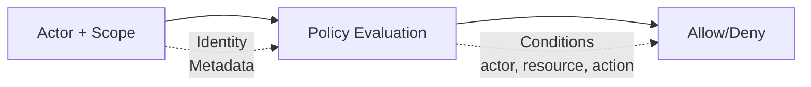

# Modelo de Segurança

O Wippy implementa controle de acesso baseado em atributos com atores e escopos de políticas. As políticas avaliam ações e recursos usando metadados do ator e do recurso.

Esta página é uma referência de configuração e API. Exemplos completos nomeiam as entradas de registro necessárias; blocos Lua e YAML menores ilustram uma operação ou fragmento em um contexto de segurança existente.


```mermaid
flowchart LR
    A[Actor + Scope] --> PE[Policy Evaluation] --> AD[Allow/Deny]
    A -.->|Identity<br/>Metadata| PE
    PE -.->|Conditions<br/>actor, resource, action| AD
```

## Tipos de Entradas

| Tipo | Descrição |
|------|-----------|
| `security.policy` | Política declarativa com condições |
| `security.policy.expr` | Política baseada em expressão |
| `security.token_store` | Armazenamento e validação de tokens |

## Atores

Um ator identifica o principal que executa uma ação.

```lua
local security = require("security")

-- Create actor with metadata
local actor = security.new_actor("user:123", {
    role = "admin",
    team = "backend",
    department = "engineering",
    clearance = 3
})

-- Access actor properties
local id = actor:id()        -- "user:123"
local meta = actor:meta()    -- {role="admin", ...}
```

### Ator no Contexto

```lua
-- Get current actor from context
local errors = require("errors")

local actor = security.actor()
if not actor then
    return nil, errors.new({ kind = errors.PERMISSION_DENIED, message = "Sem ator no contexto" })
end
```

## Políticas

Políticas definem regras de acesso com ações, recursos, condições e efeitos.

### Política Declarativa

```yaml
# src/security/_index.yaml
version: "1.0"
namespace: app.security

entries:
  # Admin full access
  - name: admin_policy
    kind: security.policy
    policy:
      actions: "*"
      resources: "*"
      effect: allow
      conditions:
        - field: actor.meta.role
          operator: eq
          value: admin
    groups:
      - admin

  # Read-only access
  - name: readonly_policy
    kind: security.policy
    policy:
      actions:
        - "*.read"
        - "*.get"
        - "*.list"
      resources: "*"
      effect: allow
    groups:
      - default

  # Resource owner access
  - name: owner_policy
    kind: security.policy
    policy:
      actions:
        - read
        - write
        - delete
      resources: "document:*"
      effect: allow
      conditions:
        - field: meta.owner
          operator: eq
          value_from: actor.id
    groups:
      - default

  # Deny confidential without clearance
  - name: deny_confidential
    kind: security.policy
    policy:
      actions: "*"
      resources: "document:*"
      effect: deny
      conditions:
        - field: meta.classification
          operator: eq
          value: confidential
        - field: actor.meta.clearance
          operator: lt
          value: 3
    groups:
      - security
```

### Estrutura da Política

```text
policy:
  actions: "*" | "action" | ["action1", "action2"]
  resources: "*" | "resource" | ["res1", "res2"]
  effect: allow | deny
  conditions:  # Optional
    - field: "field.path"
      operator: "eq"
      value: "static_value"
      # OR
      value_from: "other.field.path"
```

### Política Baseada em Expressão

Para lógica complexa, use políticas de expressão:

```yaml
- name: flexible_access
  kind: security.policy.expr
  policy:
    actions:
      - read
      - write
    resources: "file:*"
    effect: allow
    expression: |
      (actor.meta.role == "editor" && action == "write") ||
      (action == "read" && meta.public == true) ||
      actor.id == meta.owner
  groups:
    - editors
```

## Condições

Condições avaliam campos do ator, da ação, do recurso e dos metadados em runtime.

### Caminhos de Campo

| Caminho | Descrição |
|---------|-----------|
| `actor.id` | Identificador único do ator |
| `actor.meta.*` | Metadados do ator (suporta aninhamento) |
| `action` | A ação sendo executada |
| `resource` | O identificador do recurso |
| `meta.*` | Metadados do recurso |

### Operadores

| Operador | Descrição | Exemplo |
|----------|-----------|---------|
| `eq` | Igual | `actor.meta.role eq "admin"` |
| `ne` | Diferente | `meta.status ne "deleted"` |
| `lt` | Menor que | `meta.priority lt 5` |
| `gt` | Maior que | `actor.meta.clearance gt 2` |
| `lte` | Menor ou igual | `meta.size lte 1000` |
| `gte` | Maior ou igual | `actor.meta.level gte 3` |
| `in` | Valor em array | `action in ["read", "write"]` |
| `nin` | Valor não em array | `meta.status nin ["deleted", "archived"]` |
| `exists` | Campo existe | `meta.owner exists true` |
| `nexists` | Campo não existe | `meta.deleted nexists true` |
| `contains` | String contém | `resource contains "sensitive"` |
| `ncontains` | String não contém | `resource ncontains "public"` |
| `matches` | Correspondência regex | `resource matches "^doc:.*"` |
| `nmatches` | Não corresponde regex | `actor.id nmatches "^system:.*"` |

### Exemplos de Condições

```yaml
# Match actor role
conditions:
  - field: actor.meta.role
    operator: eq
    value: admin

# Compare fields
conditions:
  - field: meta.owner
    operator: eq
    value_from: actor.id

# Numeric comparison
conditions:
  - field: actor.meta.clearance
    operator: gte
    value: 3

# Array membership
conditions:
  - field: actor.meta.role
    operator: in
    value:
      - admin
      - moderator

# Pattern matching
conditions:
  - field: resource
    operator: matches
    value: "^api:/v[0-9]+/admin/.*"

# Multiple conditions (AND)
conditions:
  - field: actor.meta.department
    operator: eq
    value: engineering
  - field: meta.environment
    operator: eq
    value: production
```

## Escopos

Um escopo combina políticas em um contexto de segurança.

```lua
local security = require("security")

-- Get policies
local admin_policy, admin_err = security.policy("app.security:admin_policy")
if admin_err then return nil, admin_err end
local readonly_policy, readonly_err = security.policy("app.security:readonly_policy")
if readonly_err then return nil, readonly_err end

-- Create scope with policies
local scope = security.new_scope()
scope = scope:with(admin_policy)
scope = scope:with(readonly_policy)

-- Scopes are immutable - :with() returns new scope
```

### Escopos Nomeados (Grupos de Políticas)

Carrega as políticas atribuídas a um grupo:

```lua
-- Load scope with all policies in group
local scope, err = security.named_scope("app.security:admin")
if err then return nil, err end
```

Políticas são atribuídas a grupos via campo `groups`:

```yaml
- name: admin_policy
  kind: security.policy
  policy:
    # ...
  groups:
    - admin      # This policy is in "admin" group
    - default    # Can be in multiple groups
```

### Operações de Escopo

```lua
-- Add policy
local new_scope = scope:with(policy)

-- Remove policy
local new_scope = scope:without("app.security:temp_policy")

-- Check if policy is in scope
local has = scope:contains("app.security:admin_policy")

-- Get all policies
local policies = scope:policies()
```

### Permissões do Módulo

O modo estrito aplica verificações de permissão à criação de atores, políticas e escopos, além das operações de token:

| Ação | Recurso | Usado por | Comportamento em negação |
|------|---------|-----------|--------------------------|
| `security.actor.create` | ID do ator | `security.new_actor` | Gera um erro Lua |
| `security.policy.get` | ID da política no registro | `security.policy` | Retorna `nil, error` |
| `security.policy_group.get` | ID do grupo de políticas | `security.named_scope` | Retorna `nil, error` |
| `security.scope.create` | `custom`, `with` ou `without` | `security.new_scope`, `scope:with` e `scope:without`, respectivamente | Gera um erro Lua |

Conceda somente as operações e IDs necessários. Os exemplos de ator, escopo e token desta página pressupõem essas permissões, além das permissões específicas das operações de token.

## Avaliação de Políticas

### Fluxo de Avaliação

```
1. Sem ator ou sem escopo no contexto → o modo estrito decide (nega por padrão)
2. Verifica cada política no escopo
3. Se QUALQUER política retorna Deny → Resultado é Deny
4. Se pelo menos um Allow e nenhum Deny → Resultado é Allow
5. Nenhuma política aplicável → Resultado é Undefined
```

Uma verificação de acesso só passa com `Allow`. `Undefined` nega o acesso, exatamente como `Deny` — o modo estrito não participa uma vez que um ator e um escopo estejam ambos presentes.

### Resultados de Avaliação

| Resultado | Significado |
|-----------|-------------|
| `allow` | Acesso concedido |
| `deny` | Acesso explicitamente negado |
| `undefined` | Nenhuma política correspondeu |

```lua
local errors = require("errors")

-- Evaluate directly
local result = scope:evaluate(actor, "read", "document:123", {
    owner = "user:456",
    classification = "internal"
})

if result == "deny" then
    return nil, errors.new({ kind = errors.PERMISSION_DENIED, message = "Acesso negado" })
elseif result == "undefined" then
    -- Nenhuma política correspondeu - verificações de acesso tratam isso como negado
end
```

### Verificação Rápida de Permissão

```lua
local errors = require("errors")

-- Check against current context's actor and scope
local allowed = security.can("read", "document:123", {
    owner = "user:456"
})

if not allowed then
    return nil, errors.new({ kind = errors.PERMISSION_DENIED, message = "Acesso negado" })
end
```

## Token Stores

Token stores criam, validam e revogam tokens de autenticação.

As operações Lua exigem permissões. O escopo ativo deve permitir `security.token_store.get` para obter o store e `security.token.create`, `security.token.validate` ou `security.token.revoke` para a operação correspondente. Isso vale tanto no modo estrito padrão quanto em contextos configurados explicitamente. Exemplos que criam ator ou carregam escopo nomeado também exigem `security.actor.create` e `security.policy_group.get`.

### Configuração

```yaml
# src/auth/_index.yaml
version: "1.0"
namespace: app.auth

entries:
  # Register environment variable
  - name: os_env
    kind: env.storage.os

  - name: AUTH_SECRET_KEY
    kind: env.variable
    variable: AUTH_SECRET_KEY
    storage: app.auth:os_env

  # Backing store for tokens
  - name: token_data
    kind: store.memory
    lifecycle:
      auto_start: true

  # Token store
  - name: tokens
    kind: security.token_store
    store: app.auth:token_data
    token_length: 32
    default_expiration: "24h"
    token_key: ${env:AUTH_SECRET_KEY}
```

### Opções do Token Store

| Opção | Padrão | Descrição |
|-------|--------|-----------|
| `store` | obrigatório | Referência do store chave-valor de apoio |
| `token_length` | 32 | Tamanho do token em bytes (256 bits) |
| `default_expiration` | 24h | TTL padrão do token |
| `token_key` | nenhum | Chave de assinatura HMAC-SHA256 (valor direto, ou `${env:NAME}` para obter do [registro env](system/env.md)) |

Use `token_key: ${env:NAME}` em produção para evitar embutir segredos em entradas. A diretiva legada `token_key_env` resolve da mesma forma, mas está deprecada; prefira `${env:NAME}`.

### Criando Tokens

```lua
local security = require("security")

-- Get token store
local store, err = security.token_store("app.auth:tokens")
if err then
    return nil, err
end

-- Create actor and scope
local actor = security.new_actor("user:123", {
    role = "user",
    email = "user@example.com"
})

local scope, scope_err = security.named_scope("app.security:default")
if scope_err then
    store:close()
    return nil, scope_err
end

-- Create token
local token, create_err = store:create(actor, scope, {
    expiration = "7d",  -- Override default expiration
    meta = {
        device = "mobile",
        ip = "192.168.1.1"
    }
})
store:close()
if create_err then return nil, create_err end
return token

-- Token format: base64_token.hmac_signature (if token_key set)
-- Example: "dGVzdHRva2VuMTIz.a1b2c3d4e5f6"
```

### Validando Tokens

```lua
local errors = require("errors")

-- Validate token
local actor, scope, err = store:validate(token)
store:close()
if err then
    return nil, errors.new({ kind = errors.PERMISSION_DENIED, message = "Token inválido" })
end

-- Actor and scope are reconstructed from stored data
print(actor:id())  -- "user:123"
```

### Revogando Tokens

```lua
-- Revoke single token
local ok, err = store:revoke(token)
if err then
    store:close()
    return nil, err
end

-- Close store when done
store:close()
return ok
```

## Fluxo de Contexto

Ator e escopo fazem parte do contexto herdável do frame. Chamadas de função e processos gerados herdam ambos, salvo quando o chamador fornece um contexto substituto. Alterar explicitamente o ator ou escopo de um processo gerado exige `process.security`. Alterar o contexto de uma chamada com `funcs.new():with_actor(...)` ou `:with_scope(...)` exige `funcs.security` sobre o recurso `security`.

### Definindo Contexto

```lua
local funcs = require("funcs")

-- Call function with security context
local caller, err = funcs.new():with_actor(actor)
if err then return nil, err end
caller, err = caller:with_scope(scope)
if err then return nil, err end
local result, call_err = caller:call("app.api:protected_endpoint", data)
if call_err then return nil, call_err end
```

### Herança de Contexto

| Componente | Herda |
|------------|-------|
| Ator | Sim - passa para chamadas filhas e processos gerados |
| Escopo | Sim - passa para chamadas filhas e processos gerados |
| Modo estrito | Não - aplicação-wide |

Funções e processos criados herdam ambos o contexto de segurança do chamador. Um processo criado inicia em um frame bifurcado a partir do frame de quem o criou, que carrega o ator e o escopo de quem o criou, e o bloco `security:` de sua própria entrada modifica esse contexto herdado. Quando a entrada não declara bloco algum, o processo mantém inalterados o ator e o escopo de quem o criou; um criador que não tem nenhum dos dois produz um filho sem nenhum dos dois, o que o modo estrito nega. Um bloco declarado que nomeia um `actor` substitui o ator herdado, e seus `policies` e `groups` são mesclados ao escopo herdado; um bloco que omite `actor` mantém o ator de quem o criou, e um que omite tanto `policies` quanto `groups` mantém o escopo de quem o criou.

## Declarando Segurança em Entradas

Um bloco de segurança tem a mesma forma em todos os lugares onde aparece:

| Campo | Tipo | Descrição |
|-------|------|-----------|
| `actor.id` | string | Identidade do ator; substitui o ator herdado |
| `actor.meta` | map | Atributos do ator avaliados pelas políticas |
| `policies` | list | Registry IDs de políticas, mesclados no escopo |
| `groups` | list | Registry IDs de grupos de políticas, cujas políticas são mescladas no escopo |

`policies` e `groups` são **registry IDs no formato `namespace:name`**. Um nome simples não resolve — diferente do campo `groups:` em uma entrada de política, que assume o namespace da própria política, essas referências não têm namespace padrão.

A resolução é atômica e fail-closed. Toda política e todo grupo listado é resolvido antes de qualquer coisa ser instalada; se algum deles estiver ausente, vazio, ou não contiver políticas, toda a configuração falha e nenhum ator e nenhum escopo parcial é aplicado. Um chamador portanto nunca cruza uma fronteira carregando meio contexto.

### Entradas de Processo

Entradas `process.lua`, `process.lua.bc`, `function.lua` e `function.lua.bc` aceitam um bloco `security:` de nível superior que se aplica a toda execução daquela entrada:

```yaml
- name: worker_process
  kind: process.lua
  source: file://worker.lua
  method: main
  security:
    actor:
      id: "service:worker"
      meta:
        role: worker
        service: true
    policies:
      - app.security:worker_policy
    groups:
      - app.security:workers
```

O bloco é aplicado quando o processo inicia, tanto em `process.host` quanto em `terminal.host`. Uma falha de resolução aborta o spawn em vez de iniciar o processo com um contexto mais fraco.

### Ciclo de Vida de Serviço

Serviços supervisionados aceitam o mesmo bloco sob `lifecycle`, resolvido uma vez quando o controller do serviço é criado e selado pelo tempo de vida do serviço:

```yaml
- name: worker
  kind: process.service
  process: app:worker_process
  host: app:processes
  lifecycle:
    auto_start: true
    security:
      actor:
        id: "service:worker"
      groups:
        - app.security:workers
```

### Comandos da CLI

Uma entrada de comando declara `meta.command.security`, aplicado apenas quando a entrada é lançada como comando da CLI — o operador executando `wippy run <name>` é a âncora de confiança para esse contexto. Isso nunca afeta um spawn comum da mesma entrada. O bloco é validado estritamente: campos desconhecidos são rejeitados, um bloco vazio é rejeitado, e `security` sem um `name` de comando é rejeitado. Veja [Segurança de comandos](guides/cli.md#command-security).

## Modo Estrito

O modo estrito decide o que acontece quando uma requisição não carrega ator nem escopo. Ele está **ligado por padrão**, então um contexto incompleto é negado. Desligá-lo é uma escolha explícita, feita no arquivo de configuração do runtime (`.wippy.yaml`), não no manifesto de módulo `wippy.yaml`:

```yaml
# .wippy.yaml
security:
  strict_mode: false
```

| Modo | Contexto Ausente | Comportamento |
|------|------------------|---------------|
| Estrito (padrão) | Sem ator/escopo | Nega |
| Permissivo (`strict_mode: false`) | Sem ator/escopo | Permite |

O modo estrito não muda nada uma vez que um ator e um escopo estejam presentes: a avaliação nega por padrão de qualquer forma. Ele governa apenas o caso incompleto, e é por isso que um processo que executa sem um contexto de segurança declarado falha em toda verificação sob o padrão. Dê a esse processo um bloco `security:`, ou inicie-o por um caminho que forneça um.

## Fluxo de Autenticação

Validação de token em um handler HTTP:

```lua
local http = require("http")
local security = require("security")

local function protected_handler()
    local req, req_err = http.request()
    if req_err then return nil, req_err end
    local res, res_err = http.response()
    if res_err then return nil, res_err end

    local function respond(status, body)
        local content_type_err = res:set_header("Content-Type", "application/json")
        if content_type_err then return nil, content_type_err end
        local status_err = res:set_status(status)
        if status_err then return nil, status_err end
        local write_err = res:write_json(body)
        if write_err then return nil, write_err end
        return true
    end

    -- Extract and validate token
    local auth, header_err = req:header("Authorization")
    if header_err then return nil, header_err end
    if not auth then
        return respond(http.STATUS.UNAUTHORIZED, {error = "Missing authorization"})
    end

    local token = auth:match("^Bearer%s+(.+)$")
    if not token then
        return respond(http.STATUS.UNAUTHORIZED, {error = "Expected a bearer token"})
    end
    local store, store_err = security.token_store("app.auth:tokens")
    if store_err then
        return respond(http.STATUS.INTERNAL_ERROR, {error = "Token store unavailable"})
    end

    local actor, scope, validate_err = store:validate(token)
    store:close()
    if validate_err then
        return respond(http.STATUS.UNAUTHORIZED, {error = "Invalid token"})
    end

    -- Evaluate the actor and scope reconstructed from this token.
    if scope:evaluate(actor, "api.users.read", "users") ~= "allow" then
        return respond(http.STATUS.FORBIDDEN, {error = "Forbidden"})
    end

    return respond(http.STATUS.OK, {user = actor:id()})
end

return { handler = protected_handler }
```

Criação de token durante login:

```lua
local actor = security.new_actor("user:" .. user.id, {role = user.role})
local scope, scope_err = security.named_scope("app.security:" .. user.role)
if scope_err then return nil, scope_err end

local store, store_err = security.token_store("app.auth:tokens")
if store_err then return nil, store_err end
local token, token_err = store:create(actor, scope, {expiration = "24h"})
store:close()
if token_err then return nil, token_err end
return token
```

## Fronteiras de Confiança do Runtime

A avaliação de políticas governa o que o código pode fazer. Três mecanismos separados governam qual código é admitido e para onde um contexto pode viajar.

### Integridade de Módulos

Todo módulo no `wippy.lock` carrega um digest de artefato. No boot, um download é verificado contra o digest fixado no lock e contra o digest servido pelo hub, e packs já vendorizados são reverificados contra o lock antes de serem carregados; uma divergência é uma falha de integridade não retentável que não é contornada — o módulo não é carregado. `wippy install` verifica um download novo apenas contra o digest e o tamanho servidos pelo hub, apaga o arquivo e falha em caso de divergência, e então grava o digest servido de volta no lock, de modo que um digest fixado é restabelecido pelo install em vez de imposto por ele; apenas packs já presentes no diretório de vendor são conferidos contra o digest do lock. Diretórios de módulo extraídos carregam seu próprio digest e digest de árvore registrados e são verificados da mesma forma, então uma árvore vendorizada modificada é detectada em vez de considerada confiável. Veja [Gerenciamento de Dependências](guides/dependency-management.md#integrity-verification).

### Identidade Internodal do Cluster

Nós em um cluster se autenticam mutuamente. Cada nó guarda uma chave de identidade ed25519 e o mapa de chaves públicas de pares em que confia; o handshake da malha é mútuo, vinculando um HMAC sobre o segredo de gossip compartilhado a uma assinatura ed25519 sobre um transcript cobrindo ambos os IDs de nó e ambos os nonces. Um par que não está no mapa confiável, ou cuja chave anunciada por gossip discorda da entrada confiável, é rejeitado. Não existe modo não autenticado: um nó sem identidade não pode entrar na malha. Veja [Identidade internodal](guides/cluster.md#internode-identity).

### Propagação para o Temporal

Um contexto de segurança que cruza para o Temporal é carregado como um header assinado, e não como entrada comum de workflow. O ator, seus metadados e os IDs de política são serializados em um envelope `wippy-security` e assinados com a chave HMAC do cliente, com audiência para o ID específico de workflow ou activity. O worker receptor verifica a assinatura e a audiência e resolve localmente toda política nomeada antes de o workflow ou a activity executar; qualquer falha faz a execução falhar. Um workflow executando sob um contexto de segurança também recusa signals não assinados, então um cliente Temporal externo não pode conduzi-lo. Veja [Workflows](temporal/workflows.md#security-context) e [Visão geral do Temporal](temporal/overview.md#security-context-propagation).

## Boas Práticas

1. **Menor privilégio** - Conceda permissões mínimas necessárias
2. **Negue por padrão** - Use políticas de allow explícitas, habilite modo estrito
3. **Use grupos de políticas** - Organize políticas por role/função
4. **Assine tokens** - Sempre defina `token_key` a partir de uma referência `${env:NAME}` em produção
5. **Expiração curta** - Use tempos de vida de token mais curtos para operações sensíveis
6. **Condicione no contexto** - Use condições dinâmicas sobre políticas estáticas
7. **Audite ações sensíveis** - Registre operações relevantes para segurança

## Referência do Módulo Security

| Função | Descrição |
|--------|-----------|
| `security.actor()` | Obtém ator atual do contexto |
| `security.scope()` | Obtém escopo atual do contexto |
| `security.can(action, resource, meta?)` | Verifica permissão |
| `security.new_actor(id, meta?)` | Cria novo ator |
| `security.new_scope(policies?)` | Cria escopo vazio ou semeado |
| `security.policy(id)` | Obtém política por ID |
| `security.named_scope(group_id)` | Obtém escopo com todas as políticas do grupo |
| `security.token_store(id)` | Obtém token store |
