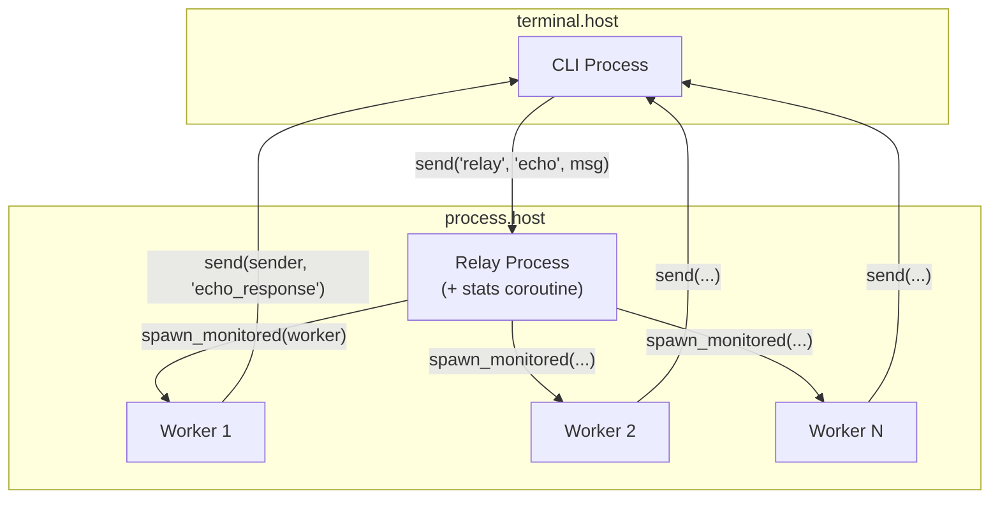

# Serviço de Eco

Crie um serviço de echo via CLI que usa vários processos Wippy, channels, corrotinas, passagem de mensagens e monitoramento de processos.

**Classificação:** Tutorial executável. Ele fornece o registro completo e os arquivos
Lua de uma aplicação CLI local de nó único, além das etapas de inicialização e
verificação.

## Visão Geral

Este tutorial cria um cliente CLI que envia mensagens para um serviço de relay, que cria workers para processar cada mensagem. Ele demonstra:

- **Criação de processos** — Crie processos filhos dinamicamente
- **Passagem de mensagens** — Comunique processos com operações de envio e recebimento
- **Channels e select** — Aguarde múltiplas fontes de eventos
- **Corrotinas** — Execute trabalho concorrente dentro de um processo
- **Registro de processos** — Encontre processos por nome
- **Monitoramento** — Acompanhe o ciclo de vida de processos filhos

## Pré-requisitos

- Runtime Wippy `v0.3.32a` disponível como `wippy`. Confirme com
  `wippy version --short`.
- Um terminal interativo.
- Um diretório de trabalho vazio. Crie o projeto e o diretório de fontes antes de
  adicionar os arquivos abaixo:

  ```bash
  mkdir echo-service
  cd echo-service
  mkdir src
  ```

## Arquitetura


```mermaid
flowchart TB
    subgraph terminal["terminal.host"]
        CLI["CLI Process"]
    end

    subgraph processes["process.host"]
        Relay["Relay Process<br/>(+ stats coroutine)"]
        W1["Worker 1"]
        W2["Worker 2"]
        W3["Worker N"]
    end

    CLI -->|"send('relay', 'echo', msg)"| Relay
    Relay -->|"spawn_monitored(worker)"| W1
    Relay -->|"spawn_monitored(...)"| W2
    Relay -->|"spawn_monitored(...)"| W3
    W1 -->|"send(sender, 'echo_response')"| CLI
    W2 -->|"send(...)"| CLI
    W3 -->|"send(...)"| CLI
```

## Estrutura do Projeto

```
echo-service/
├── wippy.lock
└── src/
    ├── _index.yaml
    ├── cli.lua
    ├── relay.lua
    └── worker.lua
```

## Definições de Entradas

Crie `src/_index.yaml`:

```yaml
version: "1.0"
namespace: app

entries:
  # Capabilities used by the CLI, relay, and workers in strict mode
  - name: process-policy
    kind: security.policy
    policy:
      actions:
        - process.host
        - process.registry.register
        - process.send
        - process.spawn
        - process.spawn.monitored
      resources: "*"
      effect: allow

  - name: terminal
    kind: terminal.host
    lifecycle:
      auto_start: true

  - name: processes
    kind: process.host
    lifecycle:
      auto_start: true

  - name: cli
    kind: process.lua
    source: file://cli.lua
    method: main
    modules:
      - io
      - time
    security:
      actor:
        id: app:cli
      policies:
        - app:process-policy

  - name: relay
    kind: process.lua
    source: file://relay.lua
    method: main
    modules:
      - logger
      - time
    security:
      actor:
        id: app:relay
      policies:
        - app:process-policy

  - name: relay-service
    kind: process.service
    process: app:relay
    host: app:processes
    lifecycle:
      auto_start: true

  - name: worker
    kind: process.lua
    source: file://worker.lua
    method: main
    modules:
      - time
    security:
      actor:
        id: app:worker
      policies:
        - app:process-policy
```

## O Processo Relay

O relay se registra, trata mensagens, cria workers e executa uma corrotina de estatísticas.

Crie `src/relay.lua`:

```lua
local logger = require("logger")
local time = require("time")

local stats = {
    messages = 0,
    workers_spawned = 0
}

local function stats_reporter()
    while true do
        time.sleep("5s")
        logger:info("stats", {
            messages = stats.messages,
            workers_spawned = stats.workers_spawned
        })
    end
end

local function main()
    local inbox = process.inbox()
    local events = process.events()

    local _, register_err = process.registry.register("relay")
    if register_err then
        error("cannot register relay: " .. tostring(register_err))
    end
    logger:info("relay started", {pid = process.pid()})

    coroutine.spawn(stats_reporter)

    while true do
        local r = channel.select {
            inbox:case_receive(),
            events:case_receive()
        }

        if r.channel == events then
            local event = r.value
            if event.kind == process.event.EXIT then
                logger:info("worker exited", {
                    from = event.from,
                    result = event.result
                })
            end
        else
            local msg = r.value
            if msg:topic() == "echo" then
                local echo = msg:payload():data()
                stats.messages = stats.messages + 1

                local worker_pid, err = process.spawn_monitored(
                    "app:worker",
                    "app:processes",
                    echo.sender,
                    echo.data
                )

                if err then
                    logger:error("spawn failed", {error = tostring(err)})
                else
                    stats.workers_spawned = stats.workers_spawned + 1
                end
            end
        end
    end
end

return { main = main }
```

### Padrões-Chave {id="relay-key-patterns"}

**Spawn de Corrotina**

```lua
coroutine.spawn(stats_reporter)
```

Isso inicia uma corrotina que compartilha memória com a função principal. Corrotinas cedem em operações de I/O como `time.sleep`.

**Seleção de canais**

```lua
local r = channel.select {
    inbox:case_receive(),
    events:case_receive()
}
```

Isso aguarda múltiplos channels. `r.channel` identifica o channel selecionado e `r.value` contém seus dados.

**Extração de Payload**

```lua
local echo = msg:payload():data()
```

Mensagens tem `msg:topic()` para a string do tópico e `msg:payload():data()` para o payload.

**Spawn com Monitoramento**

```lua
local worker_pid, err = process.spawn_monitored("app:worker", "app:processes", ...)
```

Isso cria o worker e começa a monitorá-lo. Quando o worker termina, o relay recebe um evento `EXIT`.

## O Processo Worker

Workers recebem argumentos diretamente e enviam respostas ao remetente.

Crie `src/worker.lua`:

```lua
local function main(sender_pid, data)
    local response = {
        data = string.upper(data),
        worker = process.pid()
    }

    local _, send_err = process.send(sender_pid, "echo_response", response)
    if send_err then
        error("cannot send echo response: " .. tostring(send_err))
    end

    return 0
end

return { main = main }
```

## O Processo CLI

O CLI envia mensagens ao nome registrado do relay e aguarda cada resposta com timeout.

Crie `src/cli.lua`:

```lua
local io = require("io")
local time = require("time")

local reset = "\027[0m"
local function dim(s) return "\027[2m" .. s .. reset end
local function green(s) return "\027[32m" .. s .. reset end
local function yellow(s) return "\027[33m" .. s .. reset end
local function cyan(s) return "\027[36m" .. s .. reset end

local function main()
    local inbox = process.inbox()

    -- Wait for relay to register its name
    local deadline = time.after("5s")
    while not process.registry.lookup("relay") do
        local tick = time.after("50ms")
        local r = channel.select { deadline:case_receive(), tick:case_receive() }
        if r.channel == deadline then
            io.print("relay not ready")
            return 1
        end
    end

    io.print(cyan("Echo Client"))
    io.print(dim("Type messages to echo. Ctrl+C to exit.\n"))

    while true do
        local _, write_err = io.write(yellow("> "))
        if write_err then
            io.eprint("cannot write prompt:", write_err)
            return 1
        end

        local _, flush_err = io.flush()
        if flush_err then
            io.eprint("cannot flush prompt:", flush_err)
            return 1
        end

        local input, read_err = io.readline()
        if read_err then
            io.eprint("cannot read input:", read_err)
            return 1
        end

        if not input or #input == 0 then
            break
        end

        local msg = {
            sender = process.pid(),
            data = input
        }
        local _, err = process.send("relay", "echo", msg)
        if err then
            io.print(dim("  error: " .. tostring(err)))
        else
            local timeout = time.after("2s")
            local r = channel.select {
                inbox:case_receive(),
                timeout:case_receive()
            }

            if r.channel == timeout then
                io.print(dim("  timeout"))
            else
                local msg = r.value
                if msg:topic() == "echo_response" then
                    local resp = msg:payload():data()
                    io.print(green("  " .. resp.data))
                    io.print(dim("  from worker: " .. resp.worker))
                end
            end
        end
    end

    io.print("\nGoodbye!")
    return 0
end

return { main = main }
```

### Padrões-Chave {id="cli-key-patterns"}

**Enviar por Nome**

```lua
process.send("relay", "echo", msg)
```

`process.send` aceita um nome registrado como destino e retorna um erro quando esse nome não pode ser resolvido.

**Padrão de Timeout**

```lua
local timeout = time.after("2s")
local r = channel.select {
    inbox:case_receive(),
    timeout:case_receive()
}
if r.channel == timeout then
    -- timed out
end
```

## Executando

```bash
wippy init
wippy run -x app:cli
```

Exemplo de saída:

```
Echo Client
Type messages to echo. Ctrl+C to exit.

> hello world
  HELLO WORLD
  from worker: {app:processes|0x00004}
```

O PID do worker é gerado durante a execução e será diferente. Digite várias linhas para
confirmar que cada resposta está em maiúsculas. Envie uma linha vazia para sair de
forma limpa.

## Solução de Problemas e Limpeza

- `relay not ready` significa que o relay iniciado automaticamente não se registrou em
  cinco segundos. Verifique no log do runtime um erro de inicialização, política ou
  registro do relay.
- `not allowed to spawn` ou `not allowed to send` significa que as entradas de processo
  não têm o contexto de segurança `app:process-policy` mostrado acima.
- `no terminal host found` significa que falta a entrada `terminal.host`. Se o projeto
  tiver vários hosts de terminal, acrescente `--host app:terminal` ao comando de execução.
- Um timeout após o envio significa que o worker não retornou uma resposta. Procure no
  log do relay uma falha de spawn e confirme que `app:worker` e `app:processes`
  correspondem aos nomes das entradas.
- Envie uma linha vazia para sair do CLI. Pressione Ctrl+C se o runtime continuar ativo;
  depois de sair do diretório, exclua `echo-service/` se ele era apenas um exercício
  descartável.

## Próximos Passos

- [Gerenciamento de Processos](lua/core/process.md) — Referência da API de processos
- [Channels](lua/core/channel.md) — Referência da API de channels
- [Tempo e Duração](lua/core/time.md) — Referência da API de tempo
