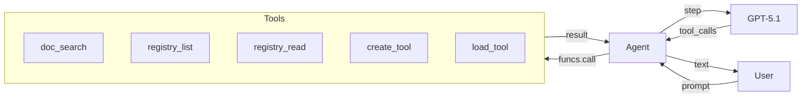
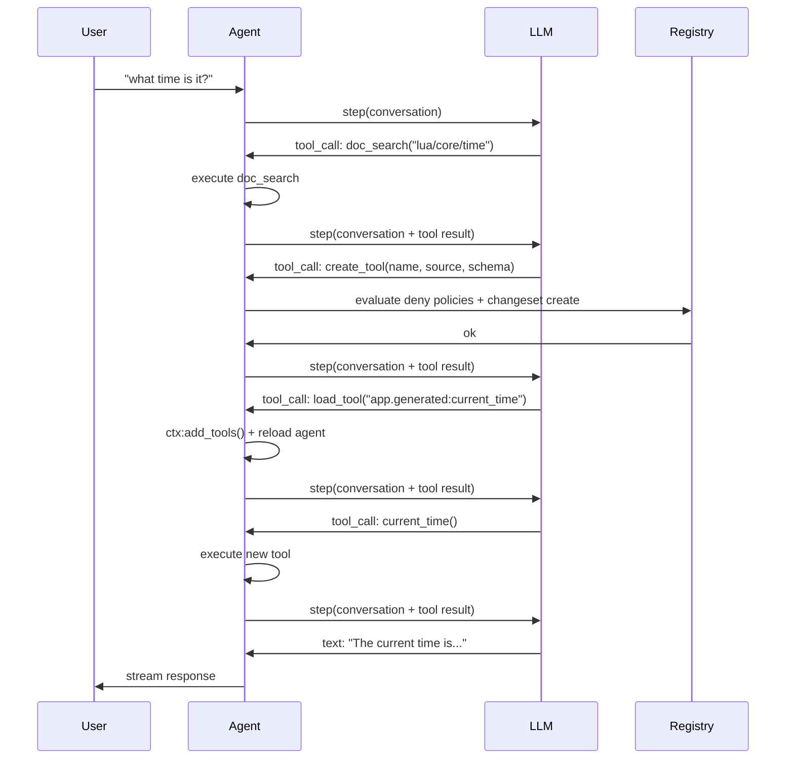
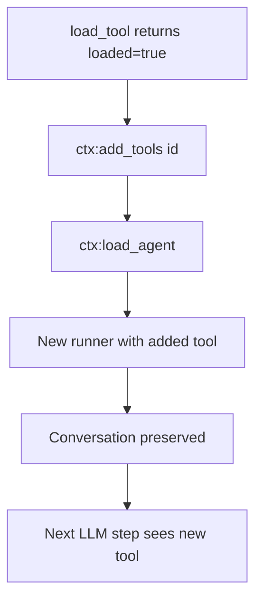
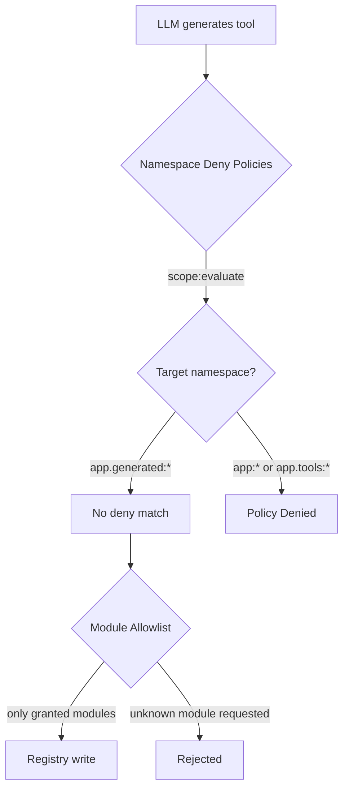

# Micro AGI

Construa um agente auto-modificável que cria suas próprias ferramentas em tempo de execução — lendo a documentação, escrevendo Lua, registrando entradas no registro e carregando-as na sessão ativa.

## O Que Estamos Construindo

Um agente de terminal que:
- Responde perguntas usando um LLM com streaming
- Pesquisa a documentação Wippy para aprender APIs
- Inspeciona o registro para descobrir capacidades existentes
- Constrói novas ferramentas dinamicamente quando lhe falta uma capacidade
- Gerencia sua própria janela de contexto via compressão



## Arquitetura

O agente executa como um processo Wippy com acesso ao registro. Quando o LLM decide que precisa de uma capacidade que não possui, ele usa o loop de auto-modificação:



A ideia central: ferramentas são entradas do registro. Criar uma ferramenta é apenas escrever uma entrada `function.lua` com código-fonte Lua inline em `data.source`. O runtime do agente compila e carrega isso como qualquer outra entrada.

## Estrutura do Projeto

```
micro-agi/
├── .wippy.yaml
├── wippy.yaml
└── src/
    ├── _index.yaml
    ├── README.md
    ├── agent.lua
    └── tools/
        ├── _index.yaml
        ├── doc_search.lua
        ├── registry_list.lua
        ├── registry_read.lua
        ├── create_tool.lua
        └── load_tool.lua
```

## Infraestrutura

Crie `.wippy.yaml`:

```yaml
version: "1.0"

logger:
  encoding: console
```

## Definições de Entradas

Crie `src/_index.yaml` com infraestrutura, políticas de segurança, modelos, agente e processo:

```yaml
version: "1.0"
namespace: app

entries:
  - name: definition
    kind: ns.definition
    readme: file://README.md
    meta:
      title: Micro AGI
      description: Self-modifying development agent that builds its own tools at runtime
      depends_on: [wippy/llm, wippy/agent]

  - name: os_env
    kind: env.storage.os

  - name: processes
    kind: process.host
    lifecycle:
      auto_start: true

  - name: __dep.llm
    kind: ns.dependency
    component: wippy/llm
    version: "*"
    parameters:
      - name: env_storage
        value: app:os_env
      - name: process_host
        value: app:processes

  - name: __dep.agent
    kind: ns.dependency
    component: wippy/agent
    version: "*"
    parameters:
      - name: process_host
        value: app:processes
```

### Políticas de Segurança

Duas entradas `security.policy` restringem em quais namespaces o agente pode escrever:

```yaml
  - name: deny_core_ns
    kind: security.policy
    policy:
      actions: "*"
      resources: "app:*"
      effect: deny
    groups:
      - agent_security

  - name: deny_tools_ns
    kind: security.policy
    policy:
      actions: "*"
      resources: "app.tools:*"
      effect: deny
    groups:
      - agent_security
```

Essas políticas são carregadas como um escopo nomeado (`app:agent_security`) por `create_tool` e avaliadas antes de qualquer escrita no registro. O agente pode escrever em `app.generated:*` (nenhuma política deny corresponde), mas não pode escrever em `app:*` (entradas centrais, modelos, definição do agente) ou `app.tools:*` (ferramentas embutidas).

Veja [Modelo de Segurança](system/security.md) para detalhes sobre a avaliação de políticas.

### Modelos

Dois modelos servem a propósitos diferentes:

```yaml
  - name: gpt-5.1
    kind: registry.entry
    meta:
      name: gpt-5.1
      type: llm.model
      title: GPT-5.1
      comment: Reasoning model
      capabilities: [generate, tool_use, structured_output, vision, thinking]
      class: [reasoning]
      priority: 210
    max_tokens: 128000
    output_tokens: 32768
    pricing:
      input: 2.5
      output: 10
    providers:
      - id: wippy.llm.openai:provider
        options:
          reasoning_model_request: true
        provider_model: gpt-5.1
    thinking_effort: 10

  - name: gpt-4.1-nano
    kind: registry.entry
    meta:
      name: gpt-4.1-nano
      type: llm.model
      title: GPT-4.1 Nano
      comment: Compression model
      capabilities: [generate, tool_use, structured_output]
      class: [fast]
      priority: 100
    max_tokens: 1047576
    output_tokens: 32768
    pricing:
      input: 0.1
      output: 0.4
    providers:
      - id: wippy.llm.openai:provider
        provider_model: gpt-4.1-nano
```

GPT-5.1 trata raciocínio e uso de ferramentas. GPT-4.1 Nano trata a compressão de contexto a um custo 25x menor.

### Definição do Agente

```yaml
  - name: dev_assistant
    kind: registry.entry
    meta:
      type: agent.gen1
      name: dev_assistant
      title: Dev Assistant
      comment: Wippy development assistant
    prompt: |
      Self-modifying Wippy development agent. You run inside Wippy runtime
      with access to docs, registry, and dynamic tool creation.

      Rules:
      - NEVER fabricate, guess, or hallucinate facts. If you need real data,
        use or build a tool to get it. Only state what a tool actually returned.
      - Maximum 2-3 sentences per response. No bullet lists. No disclaimers.
      - Never say "I can't" or "I don't have". Build the tool and do it.
      - Act first, explain only if asked.

      To gain new capabilities: doc_search the API, create_tool with Lua source,
      load_tool, call it. All in one turn.
    model: gpt-5.1
    max_tokens: 2048
    tools:
      - "app.tools:*"
```

O prompt é deliberadamente conciso. Regras principais:
- **Sem alucinação** — o agente deve usar ferramentas para dados reais
- **Auto-modificação** — construa ferramentas em vez de recusar
- **Ação sobre explicação** — faça primeiro, explique se solicitado

### Processo

```yaml
  - name: agent
    kind: process.lua
    meta:
      command:
        name: agent
        short: Start dev assistant
    source: file://agent.lua
    method: main
    modules: [io, json, process, funcs, registry, time, security]
    imports:
      prompt: wippy.llm:prompt
      agent_context: wippy.agent:context
      compress: wippy.llm.util:compress
```

O processo executa como um comando de terminal. A imposição de segurança ocorre dentro de `create_tool`, que carrega o grupo de políticas `agent_security` e o avalia antes de escrever.

Imports:
- `prompt` — construtor de conversação
- `agent_context` — carregamento do agente e gerenciamento dinâmico de ferramentas
- `compress` — compressão de texto baseada em LLM para gerenciamento de contexto

## Ferramentas

Crie `src/tools/_index.yaml` com cinco ferramentas:

### doc_search

Busca a documentação Wippy via a API `wippy.ai/llm`. Suporta dois modos: buscar uma página por caminho ou pesquisar por consulta.

```lua
local http_client = require("http_client")
local json = require("json")

local BASE_URL = "https://wippy.ai/llm"
local MAX_CHARS = 8000

local function fetch_page(path)
    local url = BASE_URL .. "/path/en/" .. path
    local resp, err = http_client.get(url, {
        headers = { ["User-Agent"] = "wippy-agent/1.0" },
    })
    if err then
        return nil, tostring(err)
    end
    if resp.status_code ~= 200 then
        return nil, "HTTP " .. resp.status_code
    end

    local body = resp.body or ""
    if #body > MAX_CHARS then
        body = body:sub(1, MAX_CHARS) .. "\n... (truncated)"
    end
    return body, nil
end

local function search_docs(query)
    local url = BASE_URL .. "/search?q=" .. query
    local resp, err = http_client.get(url, {
        headers = { ["User-Agent"] = "wippy-agent/1.0" },
    })
    if err then
        return { error = tostring(err) }
    end
    if resp.status_code ~= 200 then
        return { error = "HTTP " .. resp.status_code }
    end

    local body = resp.body or ""
    if #body > MAX_CHARS then
        body = body:sub(1, MAX_CHARS) .. "\n... (truncated)"
    end

    return { results = body }
end

local function handler(input)
    if input.path then
        local content, err = fetch_page(input.path)
        if err then
            return { error = err }
        end
        return { path = input.path, content = content }
    end

    if input.query then
        return search_docs(input.query)
    end

    return { error = "provide either 'path' or 'query'" }
end

return { handler = handler }
```

### create_tool

O núcleo da auto-modificação. Avalia as políticas deny do namespace e cria uma entrada `function.lua` no registro com código Lua inline.

O campo `modules` na entrada gerada controla o que a ferramenta pode acessar. Módulos não listados simplesmente não existem para essa entrada — não há nada a bloquear ou escanear.

```lua
local registry = require("registry")
local json = require("json")
local security = require("security")

local NAMESPACE = "app.generated"
local MAX_SOURCE_LEN = 16000
local MAX_NAME_LEN = 64

local ALLOWED_MODULES = {
    time = true, json = true, http_client = true, expr = true,
    text = true, base64 = true, yaml = true, crypto = true,
    hash = true, uuid = true, url = true,
}
```

**Avaliação de política** — `create_tool` carrega o escopo nomeado `agent_security` e avalia as políticas deny contra o ID da entrada alvo. Escritas em `app:*` ou `app.tools:*` são negadas; escritas em `app.generated:*` passam (nenhuma política deny correspondente):

```lua
local actor = security.new_actor("service:agent", { role = "agent" })
local scope, scope_err = security.named_scope("app:agent_security")
if scope_err then
    return { error = "failed to load security scope: " .. tostring(scope_err) }
end

local result = scope:evaluate(actor, action, id)
if result == "deny" then
    return { error = "policy denied: " .. action .. " on " .. id }
end
```

**Escrita no registro** — a entrada é escrita com o código em `data.source` e apenas os módulos permitidos:

```lua
local entry = {
    id = id,
    kind = "function.lua",
    meta = {
        type = "tool",
        title = input.name,
        comment = input.description,
        input_schema = schema,
        llm_alias = input.name,
        llm_description = input.description,
    },
    data = {
        source = input.source,
        modules = modules,
        method = "handler",
    },
}

local snap = registry.snapshot()
local changes = snap:changes()
if existing then
    changes:update(entry)
else
    changes:create(entry)
end
changes:apply()
```

Sem arquivos em disco. A ferramenta vive inteiramente no registro.

### load_tool

Valida que a entrada é uma ferramenta e sinaliza ao loop do agente para recarregar:

```lua
local function handler(input)
    local entry, err = registry.get(input.id)
    if err then
        return { error = tostring(err) }
    end
    if not entry then
        return { error = "not found: " .. input.id }
    end
    if not entry.meta or entry.meta.type ~= "tool" then
        return { error = "not a tool (meta.type != 'tool'): " .. input.id }
    end

    return {
        loaded = true,
        id = entry.id,
        alias = entry.meta.llm_alias or input.id,
        description = entry.meta.llm_description or "",
    }
end
```

O loop do agente detecta `loaded = true` no resultado e chama `ctx:add_tools(id)` seguido por `ctx:load_agent()` para recompilar o agente com a nova ferramenta.

## Loop do Agente

O loop do agente em `src/agent.lua` trata streaming, execução de ferramentas, carregamento dinâmico e compressão de contexto.

### Streaming

Usa o mesmo padrão de coroutine + channel do [tutorial Agente LLM](tutorials/llm-agent.md):

```lua
coroutine.spawn(function()
    local response, err = session.runner:step(session.conversation, {
        stream_target = {
            reply_to = process.pid(),
            topic = STREAM_TOPIC,
        },
    })
    done_ch:send({ response = response, err = err })
end)
```

### Execução de Ferramentas

Ferramentas são chamadas via `funcs.call()` com `pcall` para segurança:

```lua
local ok, result = pcall(funcs.call, tc.registry_id, args)
```

### Carregamento Dinâmico de Ferramentas

Quando `load_tool` retorna `loaded = true`, o agente se recarrega:



```lua
local function handle_tool_loading(tool_calls, results)
    local reload_needed = false
    for _, tc in ipairs(tool_calls) do
        if tc.name == "load_tool" then
            local result = results[tc.id]
            if result and result.loaded then
                session.ctx:add_tools(result.id)
                reload_needed = true
            end
        end
    end
    if reload_needed then
        reload_agent()
    end
end
```

A conversação é preservada entre recargas porque vive no construtor de prompt, não no runner.

### Compressão de Contexto

Quando os tokens do prompt excedem 96K (75% da janela de contexto de 128K), a conversação é comprimida usando GPT-4.1 Nano:

```lua
if response.tokens and response.tokens.prompt_tokens
    and response.tokens.prompt_tokens > PROMPT_TOKEN_LIMIT then
    try_compress()
end
```

A compressão extrai o conteúdo das mensagens, chama `compress.to_size()` direcionando 4000 caracteres e substitui a conversação por um resumo:

```lua
local summary = compress.to_size(COMPRESS_MODEL, full_text, COMPRESS_TARGET)
session.conversation = prompt.new()
session.conversation:add_system("Conversation summary:\n\n" .. summary)
```

## Modelo de Segurança

O agente é protegido por políticas deny de namespace e controle de acesso a nível de módulo.



### Políticas Deny de Namespace

| Política | Recursos | Efeito |
|--------|-----------|--------|
| `deny_core_ns` | `app:*` | deny |
| `deny_tools_ns` | `app.tools:*` | deny |

`create_tool` carrega o grupo de políticas `agent_security` e avalia contra o ID da entrada alvo. Como as políticas deny só correspondem a `app:*` e `app.tools:*`, escritas em `app.generated:*` passam (resultado é `undefined`, significando "não negado").

Isso impede que o agente:
- Modifique seu próprio prompt ou definição do agente (`app:dev_assistant`)
- Sobrescreva suas ferramentas embutidas (`app.tools:*`)
- Altere entradas de infraestrutura (`app:processes`, etc.)

### Controle de Acesso a Módulos

Ferramentas geradas declaram seus `modules` em `data.modules`. Apenas módulos do conjunto `ALLOWED_MODULES` são permitidos. O runtime Wippy impõe isso a nível de módulo — se um módulo não está listado na entrada, `require()` retorna um erro. Não há escaneamento do código-fonte porque não há nada a escanear: módulos não concedidos não existem no contexto de execução.

## Executar

Execute diretamente do hub:

```bash
wippy run wippy/micro-agi agent
```

Ou clone e execute localmente:

```bash
cd micro-agi
wippy init && wippy update
wippy run agent
```

```
dev assistant (quit to exit)

> what time is it?
  [doc_search] ok
  [create_tool] ok
  [load_tool] ok
  [+] app.generated:current_time_utc
  [current_time_utc] ok
The current UTC time is 2026-02-13T03:13:41Z.

> fetch https://httpbin.org/get and show my ip
  [create_tool] ok
  [load_tool] ok
  [+] app.generated:http_get
  [http_get] ok
Your IP is 203.0.113.42.
```

## Próximos Passos

- [Agente LLM](tutorials/llm-agent.md) — Construa um agente básico do zero
- [Módulo Agent](framework/agents.md) — Referência do framework de agentes
- [Registro](concepts/registry.md) — Como o registro funciona
- [Modelo de Segurança](system/security.md) — Políticas de segurança declarativas
- [Tipos de Entradas](guides/entry-kinds.md) — Tipos de entradas disponíveis
