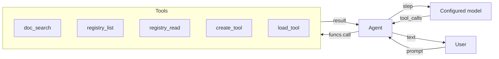
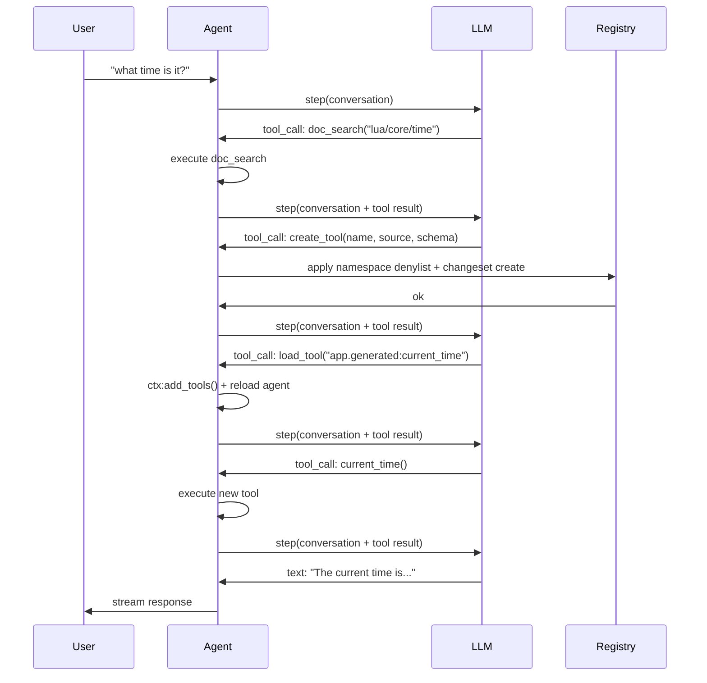
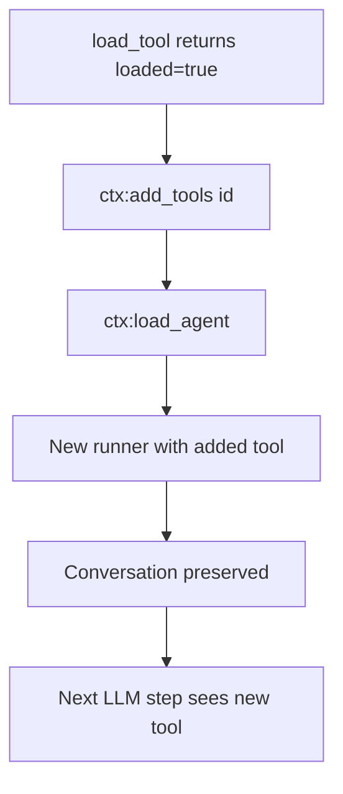
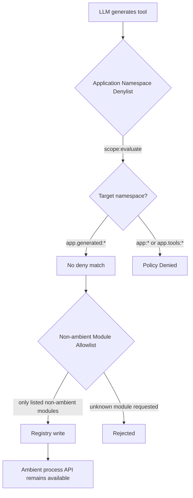

# Micro AGI

Estude um agente que lê documentação, gera ferramentas Lua, registra-as em runtime e as carrega na sessão ativa.

**Classificação: walkthrough de implementação de referência.** Os snippets explicam o
módulo publicado `wippy/micro-agi`, mas intencionalmente não formam uma árvore de fontes
completa. Execute o módulo do Hub para exercitar a implementação; use o tutorial Agente
LLM quando precisar de uma construção autocontida.

## O que o Pacote Demonstra

Um agente de terminal que:

- Transmite respostas de um LLM em streaming.
- Pesquisa APIs na documentação Wippy.
- Inspeciona o registro em busca de capacidades existentes.
- Cria e carrega ferramentas quando falta uma capacidade.
- Comprime o histórico da conversa ao se aproximar do limite de contexto.


```mermaid
flowchart LR
    User -->|prompt| Agent
    Agent -->|step| LLM[Configured model]
    LLM -->|tool_calls| Agent
    Agent -->|funcs.call| Tools
    Tools -->|result| Agent
    Agent -->|text| User

    subgraph Tools
        doc_search
        registry_list
        registry_read
        create_tool
        load_tool
    end
```

## Arquitetura

O agente executa como um processo Wippy com acesso ao registro. Quando o LLM decide que precisa de uma capacidade que não possui, ele usa o loop de auto-modificação:


```mermaid
sequenceDiagram
    participant U as User
    participant A as Agent
    participant L as LLM
    participant R as Registry

    U->>A: "what time is it?"
    A->>L: step(conversation)
    L->>A: tool_call: doc_search("lua/core/time")
    A->>A: execute doc_search
    A->>L: step(conversation + tool result)
    L->>A: tool_call: create_tool(name, source, schema)
    A->>R: apply namespace denylist + changeset create
    R->>A: ok
    A->>L: step(conversation + tool result)
    L->>A: tool_call: load_tool("app.generated:current_time")
    A->>A: ctx:add_tools() + reload agent
    A->>L: step(conversation + tool result)
    L->>A: tool_call: current_time()
    A->>A: execute new tool
    A->>L: step(conversation + tool result)
    L->>A: text: "The current time is..."
    A->>U: stream response
```

Ferramentas são entradas do registro. Para criar uma, o agente grava uma entrada `function.lua` com código-fonte Lua inline em `data.source`; o runtime então compila e carrega essa entrada.

## Estrutura do Pacote Publicado

O pacote é responsável por todos esses arquivos. Esta página reproduz `doc_search.lua`
e os contratos importantes para a arquitetura, mas abrevia helpers de registro, plumbing
de changesets, helpers de carregamento dinâmico e o loop do agente. Em particular, as
seções `create_tool`, `load_tool` e `agent.lua` são excertos, não arquivos que podem ser
copiados literalmente. As definições completas de registro de `registry_list` e
`registry_read` também permanecem no módulo publicado.

```
micro-agi/
├── .wippy.yaml
├── wippy.yaml
└── src/
    ├── _index.yaml
    ├── README.md
    ├── agent.lua
    └── tools/
        ├── _index.yaml
        ├── doc_search.lua
        ├── registry_list.lua
        ├── registry_read.lua
        ├── create_tool.lua
        └── load_tool.lua
```

## Infraestrutura

O pacote usa esta configuração `.wippy.yaml`:

```yaml
version: "1.0"

logger:
  encoding: console
```

## Definições de Entradas

As entradas selecionadas de `src/_index.yaml` a seguir mostram infraestrutura,
políticas de segurança, modelos, agente e processo:

```yaml
version: "1.0"
namespace: app

entries:
  - name: definition
    kind: ns.definition
    readme: file://README.md
    meta:
      title: Micro AGI
      description: Self-modifying development agent that builds its own tools at runtime
      depends_on: [wippy/llm, wippy/agent]

  - name: os_env
    kind: env.storage.os

  - name: processes
    kind: process.host
    lifecycle:
      auto_start: true

  - name: __dep.llm
    kind: ns.dependency
    component: wippy/llm
    version: "*"
    parameters:
      - name: env_storage
        value: app:os_env
      - name: process_host
        value: app:processes

  - name: __dep.agent
    kind: ns.dependency
    component: wippy/agent
    version: "*"
    parameters:
      - name: process_host
        value: app:processes
```

### Políticas de Segurança

Duas entradas `security.policy` formam uma denylist de namespaces no nível da aplicação:

```yaml
  - name: deny_core_ns
    kind: security.policy
    policy:
      actions: "*"
      resources: "app:*"
      effect: deny
    groups:
      - agent_security

  - name: deny_tools_ns
    kind: security.policy
    policy:
      actions: "*"
      resources: "app.tools:*"
      effect: deny
    groups:
      - agent_security
```

Essas políticas são carregadas como um escopo nomeado (`app:agent_security`) por
`create_tool`. O helper rejeita um `deny` explícito para `app:*` (entradas centrais,
modelos e definição do agente) ou `app.tools:*` (ferramentas embutidas), mas trata o
resultado `undefined` sem correspondência para `app.generated:*` como aprovado por seu
filtro próprio. Isso não é autorização do runtime Wippy: operações protegidas exigem
um `allow` explícito do contexto de execução, incluindo as operações do módulo de
segurança abaixo e `registry.apply` dentro de `changes:apply()`.

Veja [Modelo de Segurança](system/security.md) para detalhes sobre a avaliação de políticas.

### Modelos

Dois modelos servem a propósitos diferentes:

```yaml
  - name: gpt-5.1
    kind: registry.entry
    meta:
      name: gpt-5.1
      type: llm.model
      title: GPT-5.1
      comment: Reasoning model
      capabilities: [generate, tool_use, structured_output, vision, thinking]
      class: [reasoning]
      priority: 210
    max_tokens: 400000
    output_tokens: 128000
    pricing:
      input: 1.25
      output: 10
    providers:
      - id: wippy.llm.openai:provider
        options:
          reasoning_model_request: true
        provider_model: gpt-5.1

  - name: gpt-4.1-nano
    kind: registry.entry
    meta:
      name: gpt-4.1-nano
      type: llm.model
      title: GPT-4.1 Nano
      comment: Compression model
      capabilities: [generate, tool_use, structured_output]
      class: [fast]
      priority: 100
    max_tokens: 1047576
    output_tokens: 32768
    pricing:
      input: 0.1
      output: 0.4
    providers:
      - id: wippy.llm.openai:provider
        provider_model: gpt-4.1-nano
```

GPT-5.1 trata raciocínio e uso de ferramentas. GPT-4.1 Nano trata a compressão de contexto.

### Definição do Agente

```yaml
  - name: dev_assistant
    kind: registry.entry
    meta:
      type: agent.gen1
      name: dev_assistant
      title: Dev Assistant
      comment: Wippy development assistant
    prompt: |
      Self-modifying Wippy development agent. You run inside Wippy runtime
      with access to docs, registry, and dynamic tool creation.

      Rules:
      - NEVER fabricate, guess, or hallucinate facts. If you need real data,
        use or build a tool to get it. Only state what a tool actually returned.
      - Maximum 2-3 sentences per response. No bullet lists. No disclaimers.
      - Never say "I can't" or "I don't have". Build the tool and do it.
      - Act first, explain only if asked.

      To gain new capabilities: doc_search the API, create_tool with Lua source,
      load_tool, call it. All in one turn.
    model: gpt-5.1
    thinking_effort: 10
    max_tokens: 2048
    tools:
      - "app.tools:*"
```

O prompt fornece três regras operacionais ao agente:

- **Use dados recuperados** — Use ferramentas para fatos externos.
- **Crie capacidades ausentes** — Crie uma ferramenta quando faltar uma capacidade permitida.
- **Priorize ações** — Execute a operação solicitada antes de explicá-la.

### Processo

```yaml
  - name: agent
    kind: process.lua
    meta:
      command:
        name: agent
        short: Start dev assistant
    source: file://agent.lua
    method: main
    modules: [io, json, funcs, registry, time, security]
    imports:
      prompt: wippy.llm:prompt
      agent_context: wippy.agent:context
      compress: wippy.llm.util:compress
```

O processo executa como um comando de terminal. `create_tool` aplica a denylist do
pacote antes de gravar, mas esse filtro não fornece o contexto de segurança do runtime
ao comando.

Imports:

- `prompt` — Construtor de conversas
- `agent_context` — Carregamento do agente e gerenciamento dinâmico de ferramentas
- `compress` — Compressão de texto baseada em LLM para gerenciamento de contexto

## Ferramentas

Crie `src/tools/_index.yaml` com cinco ferramentas:

### doc_search

Busca a documentação Wippy via a API `wippy.ai/llm`. Suporta dois modos: buscar uma página por caminho ou pesquisar por consulta.

```lua
local http_client = require("http_client")
local json = require("json")

local BASE_URL = "https://wippy.ai/llm"
local MAX_CHARS = 8000

local function fetch_page(path)
    local url = BASE_URL .. "/path/en/" .. path
    local resp, err = http_client.get(url, {
        headers = { ["User-Agent"] = "wippy-agent/1.0" },
    })
    if err then
        return nil, tostring(err)
    end
    if resp.status_code ~= 200 then
        return nil, "HTTP " .. resp.status_code
    end

    local body = resp.body or ""
    if #body > MAX_CHARS then
        body = body:sub(1, MAX_CHARS) .. "\n... (truncated)"
    end
    return body, nil
end

local function search_docs(query)
    local url = BASE_URL .. "/search?q=" .. http_client.encode_uri(query)
    local resp, err = http_client.get(url, {
        headers = { ["User-Agent"] = "wippy-agent/1.0" },
    })
    if err then
        return { error = tostring(err) }
    end
    if resp.status_code ~= 200 then
        return { error = "HTTP " .. resp.status_code }
    end

    local body = resp.body or ""
    if #body > MAX_CHARS then
        body = body:sub(1, MAX_CHARS) .. "\n... (truncated)"
    end

    return { results = body }
end

local function handler(input)
    if input.path then
        local content, err = fetch_page(input.path)
        if err then
            return { error = err }
        end
        return { path = input.path, content = content }
    end

    if input.query then
        return search_docs(input.query)
    end

    return { error = "provide either 'path' or 'query'" }
end

return { handler = handler }
```

### create_tool

Esta ferramenta avalia a denylist de namespaces do pacote e cria uma entrada
`function.lua` no registro com código-fonte Lua inline.

O campo `modules` da entrada gerada controla quais módulos não ambientais do runtime a
ferramenta pode exigir. O módulo `process` é ambiental para toda entrada Lua executável,
portanto omiti-lo não é uma fronteira de segurança; operações de processo ainda dependem
de políticas de segurança do runtime.

```lua
local registry = require("registry")
local json = require("json")
local security = require("security")

local NAMESPACE = "app.generated"
local MAX_SOURCE_LEN = 16000
local MAX_NAME_LEN = 64

local ALLOWED_MODULES = {
    time = true, json = true, http_client = true, expr = true,
    text = true, base64 = true, yaml = true, crypto = true,
    hash = true, uuid = true,
}
```

**Avaliação da denylist** — `create_tool` carrega o escopo nomeado `agent_security`.
Escritas em `app:*` ou `app.tools:*` são rejeitadas quando o escopo retorna `deny`;
um destino `app.generated:*` sem correspondência retorna `undefined` e passa por este
filtro da aplicação:

```lua
local actor = security.new_actor("service:agent", { role = "agent" })
local scope, scope_err = security.named_scope("app:agent_security")
if scope_err then
    return { error = "failed to load security scope: " .. tostring(scope_err) }
end

local result = scope:evaluate(actor, action, id)
if result == "deny" then
    return { error = "policy denied: " .. action .. " on " .. id }
end
```

Essa verificação não autoriza a mutação do registro. O comando atual também precisa de
um ator e escopo de runtime que permitam explicitamente as chamadas do módulo de
segurança e `registry.apply`.

**Escrita no registro** — a entrada é escrita com o código em `data.source` e apenas os módulos permitidos:

```lua
local entry = {
    id = id,
    kind = "function.lua",
    meta = {
        type = "tool",
        title = input.name,
        comment = input.description,
        input_schema = schema,
        llm_alias = input.name,
        llm_description = input.description,
    },
    data = {
        source = input.source,
        modules = modules,
        method = "handler",
    },
}

local snap = registry.snapshot()
local changes = snap:changes()
if existing then
    changes:update(entry)
else
    changes:create(entry)
end
local _, apply_err = changes:apply()
if apply_err then
    return { error = "failed to apply registry change: " .. tostring(apply_err) }
end
```

A ferramenta gerada é armazenada no registro, não gravada em um arquivo-fonte.

### load_tool

Valida que a entrada é uma ferramenta e sinaliza ao loop do agente para recarregar:

```lua
local function handler(input)
    local entry, err = registry.get(input.id)
    if err then
        return { error = tostring(err) }
    end
    if not entry then
        return { error = "not found: " .. input.id }
    end
    if not entry.meta or entry.meta.type ~= "tool" then
        return { error = "not a tool (meta.type != 'tool'): " .. input.id }
    end

    return {
        loaded = true,
        id = entry.id,
        alias = entry.meta.llm_alias or input.id,
        description = entry.meta.llm_description or "",
    }
end
```

O loop do agente detecta `loaded = true` no resultado e chama `ctx:add_tools(id)` seguido por `ctx:load_agent()` para recompilar o agente com a nova ferramenta.

## Loop do Agente

O loop do agente em `src/agent.lua` trata streaming, execução de ferramentas, carregamento dinâmico e compressão de contexto.

### Streaming

Usa o mesmo padrão de coroutine + channel do [tutorial Agente LLM](tutorials/llm-agent.md):

```lua
coroutine.spawn(function()
    local response, err = session.runner:step(session.conversation, {
        stream_target = {
            reply_to = process.pid(),
            topic = STREAM_TOPIC,
        },
    })
    done_ch:send({ response = response, err = err })
end)
```

### Execução de Ferramentas

As ferramentas são chamadas por `funcs.call()`. `pcall` captura erros Lua lançados,
enquanto o segundo retorno normal de `funcs.call()` carrega erros de invocação:

```lua
local ok, result, call_err = pcall(funcs.call, tc.registry_id, args)
if not ok then
    results[tc.id] = { error = tostring(result) }
elseif call_err then
    results[tc.id] = { error = tostring(call_err) }
else
    results[tc.id] = result
end
```

### Carregamento Dinâmico de Ferramentas

Quando `load_tool` retorna `loaded = true`, o agente se recarrega:


```mermaid
flowchart TD
    A[load_tool returns loaded=true] --> B[ctx:add_tools id]
    B --> C[ctx:load_agent]
    C --> D[New runner with added tool]
    D --> E[Conversation preserved]
    E --> F[Next LLM step sees new tool]
```

```lua
local function handle_tool_loading(tool_calls, results)
    local reload_needed = false
    for _, tc in ipairs(tool_calls) do
        if tc.name == "load_tool" then
            local result = results[tc.id]
            if result and result.loaded then
                session.ctx:add_tools(result.id)
                reload_needed = true
            end
        end
    end
    if reload_needed then
        reload_agent()
    end
end
```

A conversação é preservada entre recargas porque vive no construtor de prompt, não no runner.

### Compressão de Contexto

Quando os tokens do prompt excedem 300K (75% da janela de contexto de 400K), a conversa é comprimida usando GPT-4.1 Nano:

```lua
if response.tokens and response.tokens.prompt_tokens
    and response.tokens.prompt_tokens > PROMPT_TOKEN_LIMIT then
    try_compress()
end
```

A compressão extrai o conteúdo das mensagens, chama `compress.to_size()` direcionando 4000 caracteres e substitui a conversação por um resumo:

```lua
local summary, compress_err = compress.to_size(COMPRESS_MODEL, full_text, COMPRESS_TARGET)
if compress_err then
    return nil, compress_err
end
session.conversation = prompt.new()
session.conversation:add_system("Conversation summary:\n\n" .. summary)
```

## Modelo de Segurança

Uma denylist de aplicação e controles de acesso a módulos restringem as ferramentas
geradas, mas não substituem a autorização do runtime.


```mermaid
flowchart TD
    LLM[LLM generates tool] --> P{Application Namespace Denylist}
    P -->|scope:evaluate| Check{Target namespace?}
    Check -->|app.generated:*| OK[No deny match]
    Check -->|app:* or app.tools:*| Deny[Policy Denied]

    OK --> M{Non-ambient Module Allowlist}
    M -->|only listed non-ambient modules| R[Registry write]
    M -->|unknown module requested| Err[Rejected]
    R --> A[Ambient process API remains available]
```

### Denylist de Namespaces

| Política | Recursos | Efeito |
|--------|-----------|--------|
| `deny_core_ns` | `app:*` | deny |
| `deny_tools_ns` | `app.tools:*` | deny |

`create_tool` carrega o grupo de políticas `agent_security` e avalia o ID da entrada
alvo. Ele trata deliberadamente `undefined` como "não negado" para esse filtro no nível
da aplicação. A autorização protegida do Wippy não faz isso: só permite uma operação
com `allow` explícito. O contexto que executa esse código ainda precisa carregar as
permissões necessárias do runtime.

Isso impede que o agente:
- Modifique seu próprio prompt ou definição do agente (`app:dev_assistant`)
- Sobrescreva suas ferramentas embutidas (`app.tools:*`)
- Altere entradas de infraestrutura (`app:processes`, etc.)

### Controle de Acesso a Módulos

Ferramentas geradas declaram capacidades não ambientais em `data.modules`, e
`create_tool` aceita apenas nomes de `ALLOWED_MODULES`. Um módulo não ambiental não
declarado não pode ser importado. O runtime ainda injeta `process` em toda entrada Lua
executável, inclusive uma ferramenta gerada; portanto, restrinja operações de processo
com políticas de segurança, não omitindo `process` de `data.modules`.

Este tutorial não define políticas para `process.spawn` ou `process.exec`. Assim, suas
ferramentas geradas não são um sandbox completo: adicione políticas de runtime para
operações ambientais de processo antes de permitir código de ferramenta não confiável.

## Execução e Limitação Atual do Pacote

O artefato publicado é o módulo do Hub. Comece em um diretório vazio que não contenha
`wippy.lock`; o bootstrap do Hub rejeita um lock não relacionado ou com múltiplas raízes.
A primeira execução cria o lock de implantação, e execuções posteriores no mesmo
diretório reutilizam esse lock correspondente.

```bash
mkdir micro-agi-deploy
cd micro-agi-deploy
wippy run wippy/micro-agi agent
```

O comando baixa a versão selecionada do módulo, resolve suas dependências declaradas e
invoca seu comando `agent`.

Ele ainda exige as credenciais de provedor e a configuração de modelo esperadas pelo
módulo, além de acesso ao registro e à rede para baixar do Hub e pesquisar a documentação.
Esta página não fornece clone local nem lockfile, portanto não afirma oferecer uma
compilação de fontes reproduzível.

Na versão revisada, `wippy/micro-agi` v0.3.1 não declara contexto
`meta.command.security` para `agent`. Com o modo estrito padrão, os caminhos protegidos
das ferramentas — incluindo `funcs.call`, leituras e escritas no registro e a solicitação
HTTP de pesquisa da documentação — não recebem os allows explícitos exigidos. Assim, os
fluxos de ferramentas e automodificação acima são designs de referência, não execuções
bem-sucedidas no modo estrito padrão. Não desative o modo estrito para fazer um gerador
de código não confiável funcionar; o pacote deve primeiro adicionar um escopo de comando
de privilégio mínimo para as ações necessárias.

## Próximos Passos

- [Agente LLM](tutorials/llm-agent.md) — Construa um agente básico do zero
- [Módulo Agent](framework/agents.md) — Referência do framework de agentes
- [Registro](concepts/registry.md) — Conceitos do registro
- [Modelo de Segurança](system/security.md) — Políticas de segurança declarativas
- [Tipos de Entradas](guides/entry-kinds.md) — Tipos de entradas disponíveis
