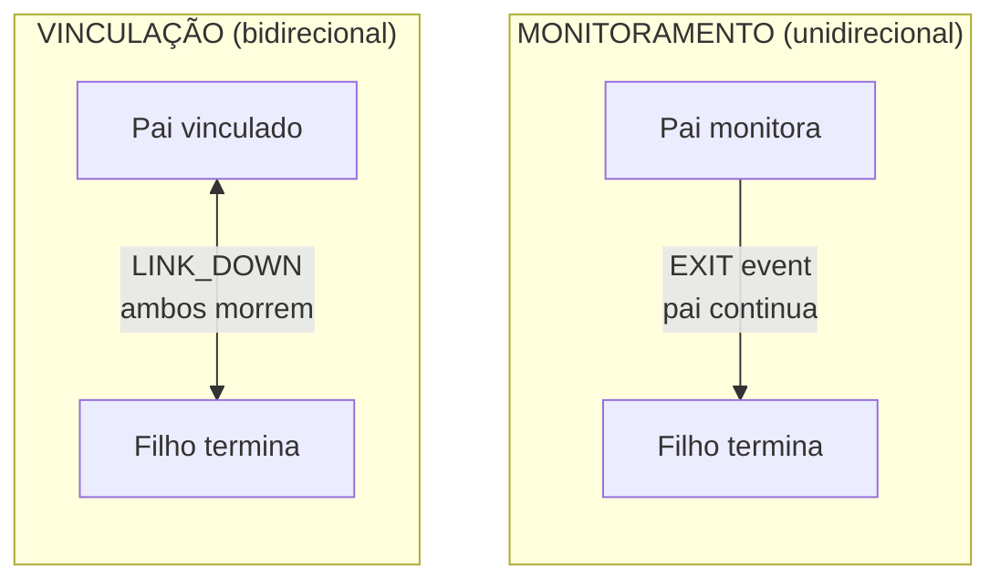

# Supervisão de Processos

Monitore e vincule processos para construir sistemas tolerantes a falhas.

## Monitoramento vs Vinculação

**Monitoramento** fornece observação unidirecional:
- Pai monitora filho
- Filho termina, pai recebe evento EXIT
- Pai continua executando

**Vinculação** cria compartilhamento bidirecional de destino:
- Pai e filho estão vinculados
- Qualquer processo falha, ambos terminam
- A menos que `trap_links=true` esteja definido



## Monitoramento de Processos

### Spawn com Monitoramento

Use `process.spawn_monitored()` para criar e monitorar em uma chamada:

```lua
local function main()
    local events_ch = process.events()

    -- Criar worker e iniciar monitoramento
    local worker_pid, err = process.spawn_monitored(
        "app.workers:task_worker",
        "app:processes"
    )
    if err then
        return nil, "spawn failed: " .. tostring(err)
    end

    -- Aguardar worker completar
    local event = events_ch:receive()

    if event.kind == process.event.EXIT then
        print("Worker exited:", event.from)
        if event.result then
            print("Result:", event.result.value)
        end
        if event.result and event.result.error then
            print("Error:", event.result.error)
        end
    end
end
```

### Monitorar Processo Existente

Chame `process.monitor()` para iniciar monitoramento de um processo já em execução:

```lua
local function main()
    local time = require("time")
    local events_ch = process.events()

    -- Spawn sem monitoramento
    local worker_pid, err = process.spawn(
        "app.workers:long_worker",
        "app:processes"
    )
    if err then
        return nil, "spawn failed: " .. tostring(err)
    end

    -- Iniciar monitoramento depois
    local ok, monitor_err = process.monitor(worker_pid)
    if monitor_err then
        return nil, "monitor failed: " .. tostring(monitor_err)
    end

    -- Cancelar o worker
    time.sleep("5ms")
    process.cancel(worker_pid, "100ms")

    -- Receber evento EXIT
    local event = events_ch:receive()
    if event.kind == process.event.EXIT then
        print("Worker terminated:", event.from)
    end
end
```

### Parar Monitoramento

Use `process.unmonitor()` para parar de receber eventos EXIT:

```lua
local function main()
    local time = require("time")
    local events_ch = process.events()

    -- Spawn e monitorar
    local worker_pid, err = process.spawn_monitored(
        "app.workers:long_worker",
        "app:processes"
    )

    time.sleep("5ms")

    -- Parar monitoramento
    local ok, unmon_err = process.unmonitor(worker_pid)
    if unmon_err then
        return nil, "unmonitor failed: " .. tostring(unmon_err)
    end

    -- Cancelar worker
    process.cancel(worker_pid, "100ms")

    -- Nenhum evento EXIT será recebido (desmonitoramos)
    local timeout = time.after("200ms")
    local result = channel.select {
        events_ch:case_receive(),
        timeout:case_receive(),
    }

    if result.channel == events_ch then
        return nil, "should not receive event after unmonitor"
    end
end
```

## Vinculação de Processos

### Vinculação Explícita

Use `process.link()` para criar um vínculo bidirecional:

```lua
-- Worker que vincula a um processo alvo
local function worker_main()
    local time = require("time")
    local events_ch = process.events()
    local inbox_ch = process.inbox()

    -- Ativar trap_links para receber eventos LINK_DOWN
    process.set_options({ trap_links = true })

    -- Receber PID alvo do remetente
    local msg = inbox_ch:receive()
    local target_pid = msg:payload():data()
    local sender = msg:from()

    -- Criar vínculo bidirecional
    local ok, err = process.link(target_pid)
    if err then
        return nil, "link failed: " .. tostring(err)
    end

    -- Notificar remetente que estamos vinculados
    process.send(sender, "linked", process.pid())

    -- Aguardar LINK_DOWN quando alvo terminar
    local timeout = time.after("3s")
    local result = channel.select {
        events_ch:case_receive(),
        timeout:case_receive(),
    }

    if result.channel == events_ch then
        local event = result.value
        if event.kind == process.event.LINK_DOWN then
            return "LINK_DOWN_RECEIVED"
        end
    end

    return nil, "no LINK_DOWN received"
end
```

### Spawn com Vínculo

Use `process.spawn_linked()` para criar e vincular em uma chamada:

```lua
local function parent_main()
    -- Ativar trap_links para tratar morte do filho
    process.set_options({ trap_links = true })

    local events_ch = process.events()

    -- Criar e vincular ao filho
    local child_pid, err = process.spawn_linked(
        "app.workers:child_worker",
        "app:processes"
    )
    if err then
        return nil, "spawn_linked failed: " .. tostring(err)
    end

    -- Se filho morrer, recebemos LINK_DOWN
    local event = events_ch:receive()
    if event.kind == process.event.LINK_DOWN then
        print("Child died:", event.from)
    end
end
```

## Trap Links

Por padrão, quando um processo vinculado falha, o processo atual também falha. Defina `trap_links=true` para receber eventos LINK_DOWN em vez disso.

### Comportamento Padrão (trap_links=false)

Sem `trap_links`, falha de processo vinculado termina o processo atual:

```lua
local function worker_main()
    local events_ch = process.events()

    -- trap_links é false por padrão
    local opts = process.get_options()
    print("trap_links:", opts.trap_links)  -- false

    -- Criar worker vinculado que vai falhar
    local child_pid, err = process.spawn_linked(
        "app.workers:error_worker",
        "app:processes"
    )

    -- Quando filho der erro, ESTE processo termina
    -- Nunca chegamos a este ponto
    local event = events_ch:receive()
end
```

### Com trap_links=true

Ative `trap_links` para receber eventos LINK_DOWN e sobreviver:

```lua
local function worker_main()
    -- Ativar trap_links
    process.set_options({ trap_links = true })

    local events_ch = process.events()

    -- Criar worker vinculado que vai falhar
    local child_pid, err = process.spawn_linked(
        "app.workers:error_worker",
        "app:processes"
    )

    -- Aguardar evento LINK_DOWN
    local event = events_ch:receive()

    if event.kind == process.event.LINK_DOWN then
        print("Child failed, handling gracefully")
        return "LINK_DOWN_RECEIVED"
    end
end
```

## Cancelamento

### Enviar Sinal de Cancelamento

Use `process.cancel()` para terminar graciosamente um processo:

```lua
local function main()
    local time = require("time")
    local events_ch = process.events()

    -- Criar e monitorar worker
    local worker_pid, err = process.spawn_monitored(
        "app.workers:long_worker",
        "app:processes"
    )

    time.sleep("5ms")

    -- Cancelar com timeout de 100ms para limpeza
    local ok, cancel_err = process.cancel(worker_pid, "100ms")
    if cancel_err then
        return nil, "cancel failed: " .. tostring(cancel_err)
    end

    -- Aguardar evento EXIT
    local event = events_ch:receive()
    if event.kind == process.event.EXIT then
        print("Worker cancelled:", event.from)
    end
end
```

### Tratar Cancelamento

Worker recebe evento CANCEL através de `process.events()`:

```lua
local function worker_main()
    local events_ch = process.events()
    local inbox_ch = process.inbox()

    while true do
        local result = channel.select {
            inbox_ch:case_receive(),
            events_ch:case_receive(),
        }

        if result.channel == events_ch then
            local event = result.value
            if event.kind == process.event.CANCEL then
                -- Limpar recursos
                cleanup()
                return "cancelled gracefully"
            end
        else
            -- Processar mensagem da inbox
            handle_message(result.value)
        end
    end
end
```

## Topologias de Supervisão

### Topologia Estrela

Pai com múltiplos filhos vinculando de volta a ele:

```lua
-- Worker pai cria filhos que vinculam AO pai
local function star_parent_main()
    local time = require("time")
    local events_ch = process.events()
    local child_count = 10

    -- Ativar trap_links para ver filhos morrerem
    process.set_options({ trap_links = true })

    local children = {}

    -- Criar filhos
    for i = 1, child_count do
        local child_pid, err = process.spawn(
            "app.workers:linker_child",
            "app:processes"
        )
        if err then
            error("spawn child failed: " .. tostring(err))
        end

        -- Enviar PID do pai para filho
        process.send(child_pid, "inbox", process.pid())
        children[child_pid] = true
    end

    -- Aguardar todos os filhos confirmarem vínculo
    for i = 1, child_count do
        local msg = process.inbox():receive()
        if msg:topic() ~= "linked" then
            error("expected linked confirmation")
        end
    end

    -- Acionar falha - todos os filhos devem receber LINK_DOWN
    error("PARENT_STAR_FAILURE")
end
```

Worker filho que vincula ao pai:

```lua
local function linker_child_main()
    local events_ch = process.events()
    local inbox_ch = process.inbox()

    -- Receber PID do pai
    local msg = inbox_ch:receive()
    local parent_pid = msg:payload():data()

    -- Vincular ao pai
    process.link(parent_pid)

    -- Confirmar vínculo
    process.send(parent_pid, "linked", process.pid())

    -- Aguardar LINK_DOWN quando pai morrer
    local event = events_ch:receive()
    if event.kind == process.event.LINK_DOWN then
        return "parent_died"
    end
end
```

### Topologia de Cadeia

Cadeia linear onde cada nó vincula ao seu pai:

```lua
-- Raiz da cadeia: A -> B -> C -> D -> E
local function chain_root_main()
    local time = require("time")

    -- Criar primeiro filho
    local child_pid, err = process.spawn_linked(
        "app.workers:chain_node",
        "app:processes",
        4  -- profundidade restante
    )
    if err then
        error("spawn failed: " .. tostring(err))
    end

    -- Aguardar cadeia ser construída
    time.sleep("100ms")

    -- Acionar cascata - todos os processos vinculados morrem
    error("CHAIN_ROOT_FAILURE")
end
```

Nó da cadeia cria próximo nó e vincula:

```lua
local function chain_node_main(depth)
    local time = require("time")

    if depth > 0 then
        -- Criar próximo na cadeia
        local child_pid, err = process.spawn_linked(
            "app.workers:chain_node",
            "app:processes",
            depth - 1
        )
        if err then
            error("spawn failed: " .. tostring(err))
        end
    end

    -- Aguardar pai morrer (aciona nossa morte via LINK_DOWN)
    time.sleep("5s")
end
```

## Pool de Workers com Supervisão

### Configuração

```yaml
# src/_index.yaml
version: "1.0"
namespace: app

entries:
  - name: processes
    kind: process.host
    host:
      workers: 16
    lifecycle:
      auto_start: true
```

```yaml
# src/supervisor/_index.yaml
version: "1.0"
namespace: app.supervisor

entries:
  - name: pool
    kind: process.lua
    source: file://pool.lua
    method: main
    modules:
      - time
    lifecycle:
      auto_start: true
```

### Implementação do Supervisor

```lua
-- src/supervisor/pool.lua
local function main(worker_count)
    local time = require("time")
    worker_count = worker_count or 4

    -- Ativar trap_links para tratar mortes de workers
    process.set_options({ trap_links = true })

    local events_ch = process.events()
    local workers = {}

    local function start_worker(id)
        local pid, err = process.spawn_linked(
            "app.workers:task_worker",
            "app:processes",
            id
        )
        if err then
            print("Failed to start worker " .. id .. ": " .. tostring(err))
            return nil
        end

        workers[pid] = {id = id, started_at = os.time()}
        print("Worker " .. id .. " started: " .. pid)
        return pid
    end

    -- Iniciar pool inicial
    for i = 1, worker_count do
        start_worker(i)
    end

    print("Supervisor started with " .. worker_count .. " workers")

    -- Loop de supervisão
    while true do
        local timeout = time.after("60s")
        local result = channel.select {
            events_ch:case_receive(),
            timeout:case_receive(),
        }

        if result.channel == timeout then
            -- Verificação periódica de saúde
            local count = 0
            for _ in pairs(workers) do count = count + 1 end
            print("Health check: " .. count .. " active workers")

        elseif result.channel == events_ch then
            local event = result.value

            if event.kind == process.event.LINK_DOWN then
                local dead_worker = workers[event.from]
                if dead_worker then
                    workers[event.from] = nil
                    local uptime = os.time() - dead_worker.started_at
                    print("Worker " .. dead_worker.id .. " died after " .. uptime .. "s, restarting")

                    -- Breve atraso antes de reiniciar
                    time.sleep("100ms")
                    start_worker(dead_worker.id)
                end
            end
        end
    end
end

return { main = main }
```

## Configuração de Processo

### Definição do Worker

```yaml
# src/workers/_index.yaml
version: "1.0"
namespace: app.workers

entries:
  - name: task_worker
    kind: process.lua
    source: file://task_worker.lua
    method: main
    modules:
      - time
```

### Implementação do Worker

```lua
-- src/workers/task_worker.lua
local function main(worker_id)
    local time = require("time")
    local events_ch = process.events()
    local inbox_ch = process.inbox()

    print("Task worker " .. worker_id .. " started")

    while true do
        local timeout = time.after("5s")
        local result = channel.select {
            inbox_ch:case_receive(),
            events_ch:case_receive(),
            timeout:case_receive(),
        }

        if result.channel == events_ch then
            local event = result.value
            if event.kind == process.event.CANCEL then
                print("Worker " .. worker_id .. " cancelled")
                return "cancelled"
            elseif event.kind == process.event.LINK_DOWN then
                print("Worker " .. worker_id .. " linked process died")
                return nil, "linked_process_died"
            end

        elseif result.channel == inbox_ch then
            local msg = result.value
            local topic = msg:topic()
            local payload = msg:payload():data()

            if topic == "work" then
                print("Worker " .. worker_id .. " processing: " .. payload)
                time.sleep("100ms")
                process.send(msg:from(), "result", "completed: " .. payload)
            end

        elseif result.channel == timeout then
            -- Timeout de ociosidade
            print("Worker " .. worker_id .. " idle")
        end
    end
end

return { main = main }
```

## Configuração do Host de Processos

O host de processos controla quantas threads de SO executam processos:

```yaml
# src/_index.yaml
version: "1.0"
namespace: app

entries:
  - name: processes
    kind: process.host
    host:
      workers: 16  # Número de threads de SO
    lifecycle:
      auto_start: true
```

Configuração de workers:
- Controla paralelismo para trabalho CPU-bound
- Tipicamente definido para o número de núcleos de CPU
- Todos os processos compartilham este pool de threads

## Conceitos-Chave

**Monitoramento** (observação unidirecional):
- Use `process.spawn_monitored()` ou `process.monitor()`
- Receba eventos EXIT quando processo monitorado terminar
- Pai continua executando após filho terminar

**Vinculação** (compartilhamento bidirecional de destino):
- Use `process.spawn_linked()` ou `process.link()`
- Por padrão: se qualquer processo falhar, ambos terminam
- Com `trap_links=true`: receba eventos LINK_DOWN em vez disso

**Cancelamento**:
- Use `process.cancel(pid, timeout)` para shutdown gracioso
- Worker recebe evento CANCEL via `process.events()`
- Tem duração de timeout para limpeza antes de terminação forçada

## Tipos de Evento

| Evento | Acionado Por | Configuração Necessária |
|--------|--------------|-------------------------|
| `EXIT` | Processo monitorado termina | `spawn_monitored()` ou `monitor()` |
| `LINK_DOWN` | Processo vinculado falha | `spawn_linked()` ou `link()` com `trap_links=true` |
| `CANCEL` | `process.cancel()` chamado | Nenhuma (sempre entregue) |

## Próximos Passos

- [Processes](processes.md) - Fundamentos de processos
- [Channels](channels.md) - Padrões de passagem de mensagens
- [Process Module](lua/core/process.md) - Referência da API
