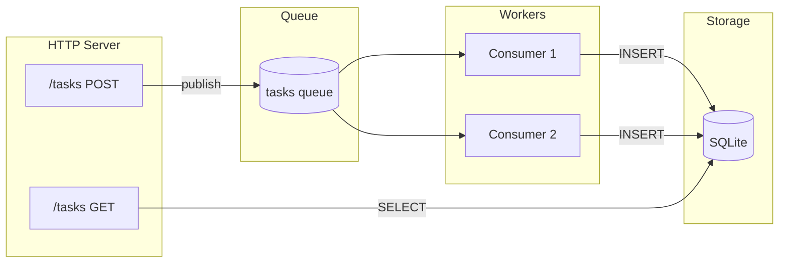

# Task Queue

Construa uma REST API que enfileira tarefas para processamento em background com persistência em banco de dados.

## Visão Geral

Este tutorial cria uma API de gerenciamento de tarefas demonstrando:

- **Endpoints REST** - POST tarefas, GET resultados
- **Publicação em fila** - Despacho assíncrono de jobs
- **Consumidores de fila** - Workers em background
- **Persistência em banco** - Armazenamento SQLite
- **Migrações** - Processo único que termina



## Estrutura do Projeto

```
task-queue/
├── wippy.lock
└── src/
    ├── _index.yaml
    ├── migrate.lua
    ├── create_task.lua
    ├── list_tasks.lua
    └── process_task.lua
```

## Definições de Entradas

Crie `src/_index.yaml`:

```yaml
version: "1.0"
namespace: app

entries:
  # Banco de dados SQLite
  - name: db
    kind: db.sql.sqlite
    file: "./data/tasks.db"
    lifecycle:
      auto_start: true

  # Driver de fila em memória
  - name: queue_driver
    kind: queue.driver.memory
    lifecycle:
      auto_start: true

  # Fila de tarefas
  - name: tasks_queue
    kind: queue.queue
    driver: app:queue_driver

  # Servidor HTTP
  - name: gateway
    kind: http.service
    addr: ":8080"
    lifecycle:
      auto_start: true

  # Router
  - name: router
    kind: http.router
    meta:
      server: app:gateway

  # Processo de migração (executa uma vez, termina)
  - name: migrate
    kind: process.lua
    source: file://migrate.lua
    method: main
    modules:
      - sql
      - logger

  # Serviço de migração (auto-inicia, termina em sucesso)
  - name: migrate-service
    kind: process.service
    process: app:migrate
    host: app:processes
    lifecycle:
      auto_start: true

  # Host de processos
  - name: processes
    kind: process.host
    lifecycle:
      auto_start: true

  # Handlers da API
  - name: create_task
    kind: function.lua
    source: file://create_task.lua
    method: handler
    modules:
      - http
      - queue
      - uuid

  - name: list_tasks
    kind: function.lua
    source: file://list_tasks.lua
    method: handler
    modules:
      - http
      - sql

  # Worker da fila
  - name: process_task
    kind: function.lua
    source: file://process_task.lua
    method: main
    modules:
      - queue
      - sql
      - logger
      - time
      - json

  # Endpoints
  - name: create_task.endpoint
    kind: http.endpoint
    meta:
      router: app:router
    method: POST
    path: /tasks
    func: app:create_task

  - name: list_tasks.endpoint
    kind: http.endpoint
    meta:
      router: app:router
    method: GET
    path: /tasks
    func: app:list_tasks

  # Consumidor da fila
  - name: task_consumer
    kind: queue.consumer
    queue: app:tasks_queue
    func: app:process_task
    concurrency: 2
    prefetch: 5
    lifecycle:
      auto_start: true
```

## Processo de Migração

Crie `src/migrate.lua`:

```lua
local sql = require("sql")
local logger = require("logger")

local function main()
    local db, err = sql.get("app:db")
    if err then
        logger:error("failed to connect", {error = tostring(err)})
        return 1
    end

    local _, exec_err = db:execute([[
        CREATE TABLE IF NOT EXISTS tasks (
            id TEXT PRIMARY KEY,
            payload TEXT NOT NULL,
            status TEXT NOT NULL DEFAULT 'pending',
            result TEXT,
            created_at INTEGER NOT NULL,
            processed_at INTEGER
        )
    ]])

    db:release()

    if exec_err then
        logger:error("migration failed", {error = tostring(exec_err)})
        return 1
    end

    logger:info("migration complete")
    return 0
end

return { main = main }
```

<tip>
Retornar 0 sinaliza sucesso. O supervisor não reiniciará um processo que termina normalmente com código 0.
</tip>

## Endpoint de Criação de Tarefa

Crie `src/create_task.lua`:

```lua
local http = require("http")
local queue = require("queue")
local uuid = require("uuid")

local function handler()
    local req, req_err = http.request()
    local res, res_err = http.response()

    if not req or not res then
        return nil, "failed to get HTTP context"
    end

    local body, parse_err = req:body_json()
    if parse_err then
        res:set_status(http.STATUS.BAD_REQUEST)
        res:write_json({error = "invalid JSON"})
        return
    end

    if not body.action then
        res:set_status(http.STATUS.BAD_REQUEST)
        res:write_json({error = "action required"})
        return
    end

    local task_id = uuid.v4()
    local task = {
        id = task_id,
        action = body.action,
        data = body.data or {},
        created_at = os.time()
    }

    local ok, err = queue.publish("app:tasks_queue", task)
    if err then
        res:set_status(http.STATUS.INTERNAL_SERVER_ERROR)
        res:write_json({error = "failed to queue task"})
        return
    end

    res:set_status(http.STATUS.ACCEPTED)
    res:write_json({
        id = task_id,
        status = "queued"
    })
end

return { handler = handler }
```

## Endpoint de Listagem de Tarefas

Crie `src/list_tasks.lua`:

```lua
local http = require("http")
local sql = require("sql")

local function handler()
    local req, req_err = http.request()
    local res, res_err = http.response()

    if not req or not res then
        return nil, "failed to get HTTP context"
    end

    local db, db_err = sql.get("app:db")
    if db_err then
        res:set_status(http.STATUS.INTERNAL_SERVER_ERROR)
        res:write_json({error = "database unavailable"})
        return
    end

    local status_filter = req:query("status")

    local query = sql.builder.select("id", "payload", "status", "result", "created_at", "processed_at")
        :from("tasks")
        :order_by("created_at DESC")
        :limit(100)

    if status_filter then
        query = query:where({status = status_filter})
    end

    local rows, query_err = query:run_with(db):query()
    db:release()

    if query_err then
        res:set_status(http.STATUS.INTERNAL_SERVER_ERROR)
        res:write_json({error = "query failed"})
        return
    end

    res:set_status(http.STATUS.OK)
    res:write_json({
        tasks = rows,
        count = #rows
    })
end

return { handler = handler }
```

## Worker da Fila

Crie `src/process_task.lua`:

```lua
local queue = require("queue")
local sql = require("sql")
local logger = require("logger")
local time = require("time")
local json = require("json")

local function main(task)
    local msg, msg_err = queue.message()
    if msg_err then
        logger:error("failed to get message", {error = tostring(msg_err)})
        return false
    end

    logger:info("processing task", {
        id = task.id,
        action = task.action
    })

    -- Simular trabalho
    time.sleep("100ms")

    -- Processar baseado na ação
    local result
    if task.action == "uppercase" then
        result = {output = string.upper(task.data.text or "")}
    elseif task.action == "sum" then
        local nums = task.data.numbers or {}
        local total = 0
        for _, n in ipairs(nums) do
            total = total + n
        end
        result = {output = total}
    else
        result = {output = "processed"}
    end

    -- Armazenar no banco de dados
    local db, db_err = sql.get("app:db")
    if db_err then
        logger:error("database unavailable", {error = tostring(db_err)})
        return false
    end

    local insert = sql.builder.insert("tasks")
        :columns("id", "payload", "status", "result", "created_at", "processed_at")
        :values(
            task.id,
            json.encode(task),
            "completed",
            json.encode(result),
            task.created_at,
            os.time()
        )

    local _, exec_err = insert:run_with(db):exec()
    db:release()

    if exec_err then
        logger:error("failed to store result", {error = tostring(exec_err)})
        return false
    end

    logger:info("task completed", {id = task.id})
    return true
end

return { main = main }
```

<note>
Retornar `true` confirma a mensagem. Retornar `false` faz com que a mensagem seja reenfileirada ou enviada para uma fila de dead-letter.
</note>

## Executando o Serviço

Inicialize e execute:

```bash
mkdir -p data
wippy init
wippy run
```

Teste a API:

```bash
# Criar uma tarefa
curl -X POST http://localhost:8080/tasks \
  -H "Content-Type: application/json" \
  -d '{"action": "uppercase", "data": {"text": "hello world"}}'

# Resposta: {"id": "550e8400-...", "status": "queued"}

# Aguarde um momento para processamento, depois liste as tarefas
curl http://localhost:8080/tasks

# Resposta: {"tasks": [...], "count": 1}

# Filtrar por status
curl "http://localhost:8080/tasks?status=completed"
```

## Fluxo de Mensagens

1. **POST /tasks** recebe requisição, gera UUID, publica na fila
2. **Consumidor da fila** pega a mensagem (2 workers concorrentes)
3. **Worker** processa tarefa, escreve resultado no SQLite
4. **GET /tasks** lê tarefas completadas do banco de dados

## Conceitos Demonstrados

| Conceito | API | Descrição |
|----------|-----|-----------|
| Endpoints REST | `http.request()`, `http.response()` | Tratar requisições HTTP |
| Publicação em fila | `queue.publish(id, data)` | Enviar jobs assíncronos |
| Consumo de fila | `queue.message()` | Acessar mensagem no handler |
| Consultas ao banco | `sql.get()`, `db:query()` | Ler dados |
| Query builder | `sql.builder.insert()` | Construir SQL com segurança |
| Migrações | Processo retornando 0 | Tarefas de setup únicas |
| Concorrência | `concurrency: 2` | Workers paralelos |

## Próximos Passos

- [HTTP Module](lua-http.md) - Tratamento de request/response
- [Queue Module](lua-queue.md) - Operações de fila de mensagens
- [SQL Module](lua-sql.md) - Acesso a banco de dados
- [Queue Consumers](guide-queue-consumers.md) - Configuração de filas
