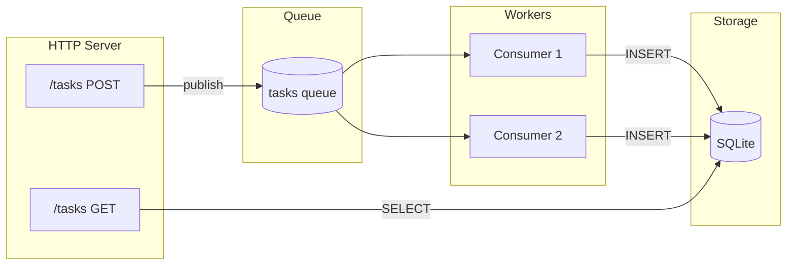

# Fila de Tarefas

Crie uma API REST que publica tarefas em uma fila em memória, processa-as em workers em segundo plano e armazena os resultados concluídos no SQLite.

**Classificação:** Tutorial executável. A página fornece o registro completo, os
arquivos Lua, os comandos de inicialização e as verificações HTTP para uma demonstração
local de nó único.

## Visão Geral

Este tutorial cria uma API de gerenciamento de tarefas demonstrando:

- **Endpoints REST** — Envie tarefas e liste resultados
- **Publicação em fila** — Despache jobs de forma assíncrona
- **Consumidores de fila** — Processe jobs em workers em segundo plano
- **Persistência em banco** — Armazene resultados concluídos no SQLite
- **Preparação do esquema** — Crie a tabela do banco em um processo de execução única


```mermaid
flowchart LR
    subgraph api["HTTP Server"]
        POST["/tasks POST"]
        GET["/tasks GET"]
    end

    subgraph queue["Queue"]
        Q[("tasks queue")]
    end

    subgraph workers["Workers"]
        W1["Consumer 1"]
        W2["Consumer 2"]
    end

    subgraph storage["Storage"]
        DB[(SQLite)]
    end

    POST -->|publish| Q
    Q --> W1
    Q --> W2
    W1 -->|INSERT| DB
    W2 -->|INSERT| DB
    GET -->|SELECT| DB
```

## Pré-requisitos

- Runtime Wippy `v0.3.32a`.
- `curl` ou outro cliente HTTP.
- Um diretório de trabalho vazio. Crie o projeto e o diretório de fontes antes de
  adicionar os arquivos abaixo:

  ```bash
  mkdir task-queue
  cd task-queue
  mkdir src
  ```

## Estrutura do Projeto

```
task-queue/
├── wippy.lock
├── data/                    # created before startup
└── src/
    ├── _index.yaml
    ├── migrate.lua
    ├── create_task.lua
    ├── list_tasks.lua
    └── process_task.lua
```

## Definições de Entradas

Crie `src/_index.yaml`:

```yaml
version: "1.0"
namespace: app

entries:
  # Capabilities used by the tutorial's Lua entries in strict mode
  - name: runtime_policy
    kind: security.policy
    policy:
      actions:
        - db.get
        - queue.publish
        - queue.publish.queue
      resources: "*"
      effect: allow

  # SQLite database
  - name: db
    kind: db.sql.sqlite
    file: "./data/tasks.db"
    lifecycle:
      auto_start: true

  # Memory queue driver
  - name: queue_driver
    kind: queue.driver.memory
    lifecycle:
      auto_start: true

  # Tasks queue
  - name: tasks_queue
    kind: queue.queue
    driver: app:queue_driver

  # HTTP server
  - name: gateway
    kind: http.service
    addr: ":8080"
    lifecycle:
      auto_start: true

  # Router
  - name: router
    kind: http.router
    meta:
      server: app:gateway

  # Migration process (runs once, exits)
  - name: migrate
    kind: process.lua
    source: file://migrate.lua
    method: main
    modules:
      - sql
      - logger
    security:
      actor:
        id: app:migrate
      policies:
        - app:runtime_policy

  # Migration service (auto-starts, exits on success)
  - name: migrate-service
    kind: process.service
    process: app:migrate
    host: app:processes
    lifecycle:
      auto_start: true

  # Process host
  - name: processes
    kind: process.host
    lifecycle:
      auto_start: true

  # API handlers
  - name: create_task
    kind: function.lua
    source: file://create_task.lua
    method: handler
    modules:
      - http
      - queue
      - uuid
    security:
      actor:
        id: app:create_task
      policies:
        - app:runtime_policy

  - name: list_tasks
    kind: function.lua
    source: file://list_tasks.lua
    method: handler
    modules:
      - http
      - sql
    security:
      actor:
        id: app:list_tasks
      policies:
        - app:runtime_policy

  # Queue worker
  - name: process_task
    kind: function.lua
    source: file://process_task.lua
    method: main
    modules:
      - sql
      - logger
      - json
    security:
      actor:
        id: app:process_task
      policies:
        - app:runtime_policy

  # Endpoints
  - name: create_task.endpoint
    kind: http.endpoint
    meta:
      router: app:router
    method: POST
    path: /tasks
    func: app:create_task

  - name: list_tasks.endpoint
    kind: http.endpoint
    meta:
      router: app:router
    method: GET
    path: /tasks
    func: app:list_tasks

  # Queue consumer
  - name: task_consumer
    kind: queue.consumer
    queue: app:tasks_queue
    func: app:process_task
    concurrency: 2
    prefetch: 5
    lifecycle:
      auto_start: true
```

## Processo de Migração

Crie `src/migrate.lua`:

```lua
local sql = require("sql")
local logger = require("logger")

local function main()
    local db, err = sql.get("app:db")
    if err then
        logger:error("failed to connect", {error = tostring(err)})
        error("failed to connect: " .. tostring(err))
    end

    local _, exec_err = db:execute([[
        CREATE TABLE IF NOT EXISTS tasks (
            id TEXT PRIMARY KEY,
            payload TEXT NOT NULL,
            status TEXT NOT NULL DEFAULT 'pending',
            result TEXT,
            created_at INTEGER NOT NULL,
            processed_at INTEGER
        )
    ]])

    db:release()

    if exec_err then
        logger:error("migration failed", {error = tostring(exec_err)})
        error("migration failed: " .. tostring(exec_err))
    end

    logger:info("migration complete")
    return 0
end

return { main = main }
```

<tip>
Um retorno normal encerra um filho de `process.service` sem reiniciá-lo; o supervisor
só tenta novamente quando o processo lança um erro. Retornar `0` também corresponde a
um status de saída bem-sucedido quando o mesmo processo é iniciado como comando CLI.
</tip>

## Endpoint de Criação de Tarefa

Crie `src/create_task.lua`:

```lua
local http = require("http")
local queue = require("queue")
local uuid = require("uuid")

local function handler()
    local req = http.request()
    local res = http.response()

    local body, parse_err = req:body_json()
    if parse_err then
        res:set_status(http.STATUS.BAD_REQUEST)
        res:write_json({error = "invalid JSON"})
        return
    end

    if not body.action then
        res:set_status(http.STATUS.BAD_REQUEST)
        res:write_json({error = "action required"})
        return
    end

    local task_id = uuid.v4()
    local task = {
        id = task_id,
        action = body.action,
        data = body.data or {},
        created_at = os.time()
    }

    local ok, err = queue.publish("app:tasks_queue", task)
    if err then
        res:set_status(http.STATUS.INTERNAL_ERROR)
        res:write_json({error = "failed to queue task"})
        return
    end

    res:set_status(http.STATUS.ACCEPTED)
    res:write_json({
        id = task_id,
        status = "queued"
    })
end

return { handler = handler }
```

## Endpoint de Listagem de Tarefas

Crie `src/list_tasks.lua`:

```lua
local http = require("http")
local sql = require("sql")

local function handler()
    local req = http.request()
    local res = http.response()

    local db, db_err = sql.get("app:db")
    if db_err then
        res:set_status(http.STATUS.INTERNAL_ERROR)
        res:write_json({error = "database unavailable"})
        return
    end

    local status_filter = req:query("status")

    local query = sql.builder.select("id", "payload", "status", "result", "created_at", "processed_at")
        :from("tasks")
        :order_by("created_at DESC")
        :limit(100)

    if status_filter then
        query = query:where({status = status_filter})
    end

    local rows, query_err = query:run_with(db):query()
    db:release()

    if query_err then
        res:set_status(http.STATUS.INTERNAL_ERROR)
        res:write_json({error = "query failed"})
        return
    end

    res:set_status(http.STATUS.OK)
    res:write_json({
        tasks = rows,
        count = #rows
    })
end

return { handler = handler }
```

## Worker da Fila

Crie `src/process_task.lua`:

```lua
local sql = require("sql")
local logger = require("logger")
local json = require("json")

local function main(task)
    logger:info("processing task", {
        id = task.id,
        action = task.action
    })

    local result
    if task.action == "uppercase" then
        result = {output = string.upper(task.data.text or "")}
    elseif task.action == "sum" then
        local nums = task.data.numbers or {}
        local total = 0
        for _, n in ipairs(nums) do
            total = total + n
        end
        result = {output = total}
    else
        result = {output = "processed"}
    end

    local db, db_err = sql.get("app:db")
    if db_err then
        error("database unavailable: " .. tostring(db_err))
    end

    local _, exec_err = db:execute(
        "INSERT OR REPLACE INTO tasks (id, payload, status, result, created_at, processed_at) VALUES (?, ?, ?, ?, ?, ?)",
        { task.id, json.encode(task), "completed", json.encode(result), task.created_at, os.time() }
    )
    db:release()

    if exec_err then
        error("failed to store result: " .. tostring(exec_err))
    end

    logger:info("task completed", {id = task.id})
end

return { main = main }
```

<note>
O consumidor confirma automaticamente quando o handler retorna normalmente e nega automaticamente quando lança um erro. Chame `msg:ack()` ou `msg:nack()` via `queue.message()` apenas quando precisar de controle explícito antes do handler terminar.
</note>

## Executando o Serviço

Crie o diretório de dados, inicialize o projeto e inicie o runtime:

```bash
mkdir data
wippy init
wippy run
```

Deixe o runtime em execução enquanto usa um segundo terminal para as verificações HTTP.
Aguarde até os logs informarem que o serviço HTTP está escutando e que a migração foi
concluída; a migração de execução única e o serviço HTTP iniciam de forma independente
durante o boot.

Envie uma tarefa e consulte seu resultado:

```bash
# Create a task
curl -X POST http://localhost:8080/tasks \
  -H "Content-Type: application/json" \
  -d '{"action": "uppercase", "data": {"text": "hello world"}}'

# Response: {"id":"<generated-uuid>","status":"queued"}

# Wait a moment for processing, then list tasks
curl http://localhost:8080/tasks

# Response includes one completed task and "count":1

# Filter by status
curl "http://localhost:8080/tasks?status=completed"
```

A linha retornada deve ter `status: "completed"`; seu campo `result` é uma string JSON
com `{"output":"HELLO WORLD"}`. A fila em memória é intencionalmente não durável, mas
as linhas concluídas sobrevivem a reinicializações em `data/tasks.db`.

## Solução de Problemas e Limpeza

- `no such table: tasks` significa que a solicitação chegou ao SQLite antes do fim da
  migração. Aguarde `migration complete` e tente novamente. Um erro de migração
  interrompe o serviço de migração e aparece nos logs do runtime.
- `failed to queue task` normalmente significa que `app:queue_driver` ou
  `app:task_consumer` não iniciou. Verifique nos logs de inicialização o primeiro erro
  de recurso em vez de repetir a solicitação.
- `address already in use` significa que outro processo ocupa a porta 8080. Interrompa-o
  ou altere `app:gateway.addr` e use a mesma porta nos comandos `curl`.
- Interrompa o runtime com Ctrl+C. Remova `data/tasks.db` para redefinir os dados do
  tutorial; a próxima inicialização recria o esquema.

## Fluxo de Mensagens

1. **POST /tasks** recebe a solicitação, gera um UUID e publica a tarefa.
2. Um **consumidor da fila** recebe a mensagem; até dois handlers são executados concorrentemente.
3. O **worker** processa a tarefa e grava seu resultado no SQLite.
4. **GET /tasks** lê as tarefas concluídas do banco de dados.

## Próximos Passos

- [Módulo HTTP](lua/http/http.md) — Tratamento de solicitações e respostas
- [Módulo Queue](lua/storage/queue.md) — Operações de fila de mensagens
- [Módulo SQL](lua/storage/sql.md) — Acesso ao banco de dados
- [Consumidores de Fila](guides/queue-consumers.md) — Configuração de filas
