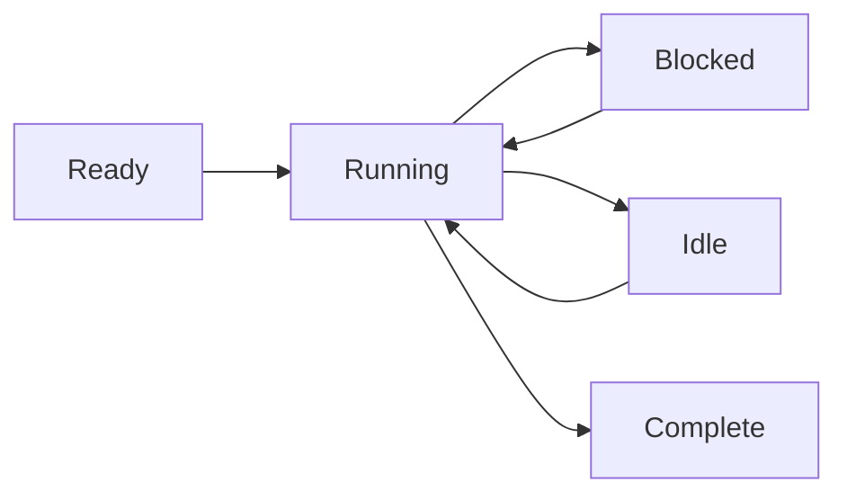

# Модель процессов

Wippy выполняет код в изолированных процессах — легковесных конечных автоматах, общающихся через передачу сообщений. Такой подход на основе акторной модели устраняет баги разделяемого состояния и делает конкурентное программирование предсказуемым.

## Выполнение как конечный автомат

Каждый процесс следует одному паттерну: инициализация, пошаговое выполнение с yield на блокирующих операциях, завершение по окончании. Планировщик мультиплексирует тысячи процессов на пуле воркеров, запуская другие процессы, пока один ждёт I/O.

Процессы поддерживают множественные параллельные yield — можно запустить несколько асинхронных операций и ждать завершения любой или всех. Это обеспечивает эффективный параллельный I/O без порождения дополнительных процессов.



Процессы не ограничены Lua. Среда исполнения поддерживает любую реализацию конечного автомата — Go-процессы и WebAssembly-модули в планах.

<warning>
Процессы легковесны, но не бесплатны. Каждый процесс стартует с базовым оверхедом примерно 13KB. Динамические аллокации и рост кучи добавляются к этому в процессе выполнения.
</warning>

## Хосты процессов

Wippy запускает несколько хостов процессов в одной среде исполнения, каждый с разными возможностями и границами безопасности. Системные процессы с привилегированными функциями могут жить в одном хосте, изолированном от хостов с пользовательскими сессиями. Хосты могут ограничивать, что процессам разрешено делать — в Erlang для такого уровня изоляции понадобились бы отдельные ноды.

Некоторые хосты специализированы. Хост Terminal, например, запускает один процесс, но даёт ему доступ к I/O-операциям, которые другие хосты запрещают. Это позволяет совмещать разные уровни доверия в одном деплое — системные сервисы с полным доступом рядом с изолированным пользовательским кодом.

## Модель безопасности

Каждый процесс выполняется под идентичностью актора и политикой безопасности. Обычно это пользователь, инициировавший вызов, но системные процессы работают под системным актором с другими привилегиями.

Контроль доступа работает на нескольких уровнях. У отдельных процессов свои уровни доступа. Отправка сообщений между хостами может быть запрещена политикой безопасности — изолированному пользовательскому процессу может быть вообще не разрешено отправлять сообщения системным хостам. Политика, привязанная к текущему актору, определяет, какие операции разрешены.

## Создание процессов

Создавайте фоновые процессы через `process.spawn()`:

```lua
local pid = process.spawn("app.workers:handler", "app:processes", arg1, arg2)
```

Первый аргумент — запись в реестре, второй — хост процессов, остальные передаются процессу.

Варианты spawn управляют отношениями жизненного цикла:

| Функция | Поведение |
|---------|-----------|
| `spawn` | Fire and forget |
| `spawn_monitored` | Получать события EXIT при завершении потомка |
| `spawn_linked` | Двунаправленная связь — падение любого уведомляет другого |

## Передача сообщений

Процессы общаются через сообщения, не через разделяемую память:

```lua
process.send(target_pid, "topic", payload)
```

Сообщения от одного отправителя приходят по порядку. Сообщения от разных отправителей могут чередоваться. Доставка — fire-and-forget; используйте паттерн запрос-ответ, когда нужно подтверждение.

<note>
Процессы могут регистрироваться в локальном реестре имён и адресоваться по имени вместо PID (например, <code>session_manager</code>). Глобальный реестр для межнодовой адресации в планах.
</note>

## Супервизия

Любой процесс может супервизировать другие, мониторя их. Процесс порождает потомков с мониторингом, отслеживает события EXIT и перезапускает их при сбое. Это следует философии Erlang «let it crash»: процессы падают на неожиданных условиях, а мониторящий процесс обрабатывает восстановление.

```lua
local worker = process.spawn_monitored("app.workers:handler", "app:processes")
local event = process.events():receive()

if event.kind == process.event.EXIT and event.result.error then
    worker = process.spawn_monitored("app.workers:handler", "app:processes")
end
```

На корневом уровне среда исполнения предоставляет сервисы, которые запускают и супервизируют долгоживущие процессы — аналогично systemd в Linux. Определите запись `process.service`, чтобы среда исполнения управляла процессом:

```yaml
- name: worker.service
  kind: process.service
  process: app.workers:handler
  host: app:processes
  lifecycle:
    auto_start: true
    restart:
      max_attempts: 5
      delay: 1s
```

Сервис запускается автоматически, перезапускается при падении с backoff и интегрируется с управлением жизненным циклом среды исполнения.

## Обновление процессов

Работающие процессы могут обновлять свой код без потери идентичности. Вызовите `process.upgrade()` для перехода на новое определение с сохранением PID, почтового ящика и отношений супервизии:

```lua
process.upgrade("app.workers:v2", current_state)
```

Первый аргумент — новая запись в реестре (или nil для перезагрузки текущего определения). Дополнительные аргументы передаются новой версии, позволяя переносить состояние через обновление. Процесс немедленно продолжает выполнение с новым кодом.

Это обеспечивает горячую перезагрузку кода при разработке и обновления без простоя в продакшене. Среда исполнения кэширует скомпилированные прототипы, так что обновления не платят стоимость компиляции повторно. Если обновление по какой-то причине не удаётся, процесс падает и применяется обычная семантика супервизии — мониторящий родитель может перезапустить его с предыдущей версией или эскалировать сбой.

## Планирование

Планировщик акторов использует work-stealing между ядрами CPU. У каждого воркера локальная очередь для локальности кэша, с глобальной очередью для распределения. Процессы делают yield на блокирующих операциях, позволяя тысячам работать конкурентно на нескольких потоках.
