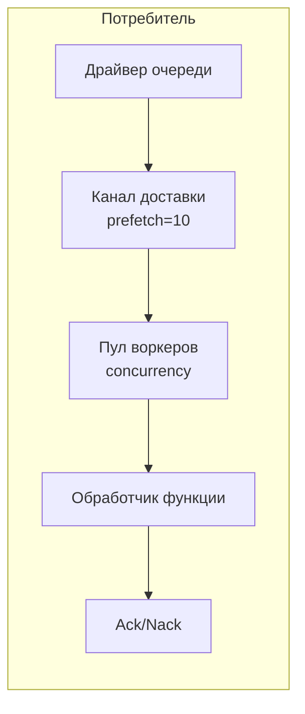

# Потребители очередей

Потребители очередей обрабатывают сообщения с помощью пулов воркеров.

## Обзор



## Конфигурация

| Параметр | По умолчанию | Максимум | Описание |
|----------|--------------|----------|----------|
| `queue` | Обязательно | - | ID очереди в реестре |
| `func` | Обязательно | - | ID функции-обработчика в реестре |
| `concurrency` | 1 | 1000 | Количество воркеров |
| `prefetch` | 10 | 10000 | Размер буфера сообщений |
| `auto_ack` | false | - | Автоматически подтверждать до запуска обработчика |
| `driver_options` | `{}` | - | Специфичные для драйвера опции потребителя |

## Определение записи

```yaml
- name: order_consumer
  kind: queue.consumer
  queue: app:orders
  func: app:process_order
  concurrency: 5
  prefetch: 20
  lifecycle:
    auto_start: true
    depends_on:
      - app:orders
```

## Функция-обработчик

Обработчик получает тело сообщения:

```lua
-- process_order.lua
local json = require("json")

local function handler(body)
    local order = json.decode(body)

    -- Обработка заказа
    local result, err = process_order(order)
    if err then
        -- Возврат ошибки вызывает Nack (повторная постановка в очередь)
        return nil, err
    end

    -- Успех вызывает Ack
    return result
end

return handler
```

```yaml
- name: process_order
  kind: function.lua
  source: file://process_order.lua
  modules:
    - json
```

## Подтверждение

| Результат | Действие | Эффект |
|-----------|----------|--------|
| Успех | Ack | Сообщение удаляется из очереди |
| Ошибка | Nack | Сообщение возвращается в очередь (зависит от драйвера) |

## Пул воркеров

- Воркеры работают как параллельные горутины
- Каждый воркер обрабатывает одно сообщение за раз
- Сообщения распределяются round-robin из канала доставки
- Буфер prefetch позволяет драйверу доставлять сообщения заранее

### Пример

```
concurrency: 3
prefetch: 10

Поток:
1. Драйвер доставляет до 10 сообщений в буфер
2. 3 воркера параллельно забирают из буфера
3. По мере завершения воркеров буфер пополняется
4. Backpressure, когда все воркеры заняты и буфер полон
```

## Корректное завершение

При остановке:
1. Прекращение приёма новых сообщений
2. Отмена контекстов воркеров
3. Ожидание обрабатываемых сообщений (с таймаутом)
4. Возврат ошибки таймаута, если воркеры не завершились

## Объявление очереди

```yaml
# Драйвер очереди (memory для разработки/тестов)
- name: queue_driver
  kind: queue.driver.memory
  lifecycle:
    auto_start: true

# Определение очереди
- name: orders
  kind: queue.queue
  driver: app:queue_driver
  queue_name: orders        # Переопределить имя (по умолчанию: имя записи)
  codec: json               # Кодек полезной нагрузки (опционально)
  dead_letter:              # Обработка dead-letter (опционально)
    queue: app:dlq
    max_attempts: 5
  driver_options:
    memory:
      max_length: 10000     # Memory-драйвер: ограниченный размер очереди
```

| Поле | Описание |
|------|----------|
| `queue_name` | Переопределить имя очереди (по умолчанию: имя записи) |
| `codec` | Имя кодека полезной нагрузки |
| `dead_letter.queue` | ID очереди dead-letter в реестре |
| `dead_letter.max_attempts` | Максимальное число попыток доставки до маршрутизации в DLQ |
| `driver_options` | Специфичные для драйвера настройки, сгруппированные по имени драйвера |

<note>
Маршрутизация dead-letter зависит от драйвера. AMQP учитывает конфигурацию DLX на уровне брокера; memory-драйвер не направляет сообщения в DLQ.
</note>

## Memory-драйвер

Встроенная in-memory очередь для разработки и тестирования:

- Тип: `queue.driver.memory`
- Сообщения хранятся в памяти
- Nack возвращает сообщение в конец очереди
- Не сохраняется между перезапусками

## См. также

- [Очереди сообщений](lua/storage/queue.md) — справочник модуля Queue
- [Конфигурация очередей](system/queue.md) — драйверы и определения записей
- [Деревья супервизии](guides/supervision.md) — жизненный цикл потребителей
- [Управление процессами](lua/core/process.md) — создание процессов и взаимодействие
