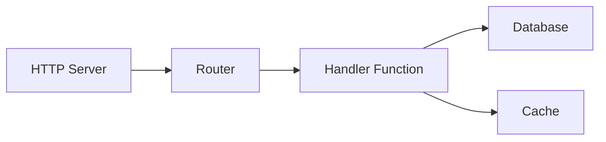
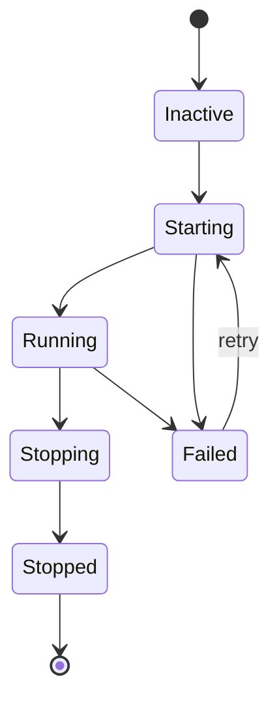

# Супервизия

Супервизор управляет жизненным циклом сервисов: порядком запуска, автоматическими перезапусками и корректным завершением. Сервисы с `auto_start: true` запускаются при старте приложения.

## Настройка жизненного цикла

Сервисы регистрируются в супервизоре через блок `lifecycle`. Для процессов используйте `process.service` как обёртку над определением процесса:

```yaml
# Определение процесса (код)
- name: worker_process
  kind: process.lua
  source: file://worker.lua
  method: main

# Супервизируемый сервис (обёртка процесса с управлением жизненным циклом)
- name: worker
  kind: process.service
  process: app:worker_process
  host: app:processes
  lifecycle:
    auto_start: true
    start_timeout: 30s
    stop_timeout: 10s
    stable_threshold: 5s
    depends_on:
      - app:database
    restart:
      initial_delay: 2s
      max_delay: 60s
      max_attempts: 10
```

| Поле | По умолчанию | Описание |
|------|--------------|----------|
| `auto_start` | `false` | Запускать автоматически при старте супервизора |
| `start_timeout` | `10s` | Максимальное время на запуск |
| `stop_timeout` | `10s` | Максимальное время на корректное завершение |
| `stable_threshold` | `5s` | Время работы до признания сервиса стабильным |
| `depends_on` | `[]` | Сервисы, которые должны быть запущены первыми |

## Разрешение зависимостей

Супервизор определяет зависимости из двух источников:

1. **Явные зависимости**, объявленные в `depends_on`
2. **Зависимости из реестра**, извлечённые из ссылок записей (например, `database: app:db` в конфиге)



Зависимости запускаются раньше зависимых. Если сервис C зависит от A и B, оба должны перейти в состояние `Running` перед запуском C.

<tip>
Не нужно объявлять инфраструктурные записи вроде баз данных в <code>depends_on</code>. Супервизор автоматически извлекает зависимости из ссылок реестра в конфигурации записи.
</tip>

## Политика перезапуска

При сбое сервиса супервизор повторяет попытки с экспоненциальной задержкой:

```yaml
lifecycle:
  restart:
    initial_delay: 1s      # Ожидание первой попытки
    max_delay: 90s         # Максимальная задержка
    backoff_factor: 2.0    # Множитель задержки за попытку
    jitter: 0.1            # ±10% рандомизация
    max_attempts: 0        # 0 = бесконечные попытки
```

| Попытка | Базовая задержка | С jitter (±10%) |
|---------|------------------|-----------------|
| 1 | 1s | 0.9s - 1.1s |
| 2 | 2s | 1.8s - 2.2s |
| 3 | 4s | 3.6s - 4.4s |
| 4 | 8s | 7.2s - 8.8s |
| ... | ... | ... |
| N | 90s | 81s - 99s (ограничено) |

Когда сервис работает дольше `stable_threshold`, счётчик попыток сбрасывается. Это предотвращает постоянную эскалацию задержек из-за временных сбоев.

### Терминальные ошибки

Эти ошибки прекращают попытки перезапуска:

- Отмена контекста
- Явный запрос на завершение
- Ошибки, помеченные как не подлежащие повтору

## Контекст безопасности

Сервисы могут работать с определённой идентичностью:

```yaml
# Определение процесса
- name: admin_worker_process
  kind: process.lua
  source: file://admin_worker.lua
  method: main

# Супервизируемый сервис с контекстом безопасности
- name: admin_worker
  kind: process.service
  process: app:admin_worker_process
  host: app:processes
  lifecycle:
    auto_start: true
    security:
      actor:
        id: "service:admin-worker"
        meta:
          role: admin
      groups:
        - app:admin_policies
      policies:
        - app:data_access
```

Контекст безопасности задаёт:

| Поле | Описание |
|------|----------|
| `actor.id` | Строка идентичности сервиса |
| `actor.meta` | Метаданные ключ-значение (роль, разрешения и т.д.) |
| `groups` | Группы политик для применения |
| `policies` | Отдельные политики для применения |

Код, выполняющийся в сервисе, наследует этот контекст безопасности. Модуль `security` может проверять разрешения:

```lua
local security = require("security")

if security.can("delete", "users") then
    -- разрешено
end
```

<note>
Без настроенного контекста безопасности сервис работает без актора. В строгом режиме (по умолчанию) проверки безопасности будут отклонены. Настройте контекст безопасности для сервисов, которым нужна авторизация.
</note>

## Состояния сервиса



Супервизор переводит сервисы через эти состояния:

| Состояние | Описание |
|-----------|----------|
| `Inactive` | Зарегистрирован, но не запущен |
| `Starting` | Идёт запуск |
| `Running` | Работает нормально |
| `Stopping` | Идёт корректное завершение |
| `Stopped` | Чисто завершён |
| `Failed` | Произошла ошибка, возможен повтор |

## Порядок запуска и остановки

**Запуск**: сначала зависимости, потом зависимые. Сервисы на одном уровне зависимостей могут запускаться параллельно.

**Остановка**: сначала зависимые, потом зависимости. Это гарантирует, что зависимые сервисы завершатся до остановки их зависимостей.

```
Запуск:   database → cache → handler → http_server
Остановка: http_server → handler → cache → database
```

## См. также

- [Модель процессов](concept-process-model.md) — жизненный цикл процессов
- [Конфигурация](guide-configuration.md) — формат YAML
- [Модуль Security](lua-security.md) — проверка разрешений в Lua
