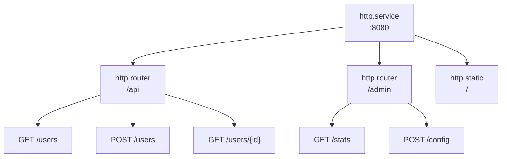

# Маршрутизация

Роутеры группируют эндпоинты под URL-префиксами и применяют общие middleware. Эндпоинты определяют HTTP-обработчики.

## Архитектура



Записи ссылаются на родителей через metadata:
- Роутеры: `meta.server: app:gateway`
- Эндпоинты: `meta.router: app:api`

## Конфигурация роутера

```yaml
- name: api
  kind: http.router
  meta:
    server: gateway
  prefix: /api/v1
  middleware:
    - cors
    - compress
  options:
    cors.allow.origins: "*"
  post_middleware:
    - endpoint_firewall
```

| Поле | Тип | Описание |
|------|-----|----------|
| `meta.server` | Registry ID | Родительский HTTP-сервер |
| `prefix` | string | URL-префикс для всех маршрутов |
| `middleware` | []string | Pre-match middleware |
| `options` | map | Опции middleware |
| `post_middleware` | []string | Post-match middleware |
| `post_options` | map | Опции post-match middleware |

## Конфигурация эндпоинта

```yaml
- name: get_user
  kind: http.endpoint
  meta:
    router: api
  method: GET
  path: /users/{id}
  func: app.users:get_user
```

| Поле | Тип | Описание |
|------|-----|----------|
| `meta.router` | Registry ID | Родительский роутер |
| `method` | string | HTTP-метод (GET, POST, PUT, DELETE, PATCH, HEAD) |
| `path` | string | Шаблон URL-пути (начинается с `/`) |
| `func` | Registry ID | Функция-обработчик |

## Параметры пути

Используйте синтаксис `{param}` для URL-параметров:

```yaml
- name: get_post
  kind: http.endpoint
  meta:
    router: api
  method: GET
  path: /users/{user_id}/posts/{post_id}
  func: get_user_post
```

Доступ в обработчике:

```lua
local http = require("http")

local function handler()
    local req = http.request()
    local user_id = req:param("user_id")
    local post_id = req:param("post_id")

    -- ...
end
```

### Wildcard-пути

Захват оставшихся сегментов пути через `{param...}`:

```yaml
- name: serve_files
  kind: http.endpoint
  meta:
    router: api
  method: GET
  path: /files/{filepath...}
  func: serve_file
```

```lua
-- Запрос: GET /api/v1/files/docs/guides/readme.md
local file_path = req:param("filepath")  -- "docs/guides/readme.md"
```

Wildcard должен быть последним сегментом пути.

## Функции-обработчики

Обработчики эндпоинтов используют модуль `http` для доступа к объектам запроса и ответа. См. [Модуль HTTP](lua-http.md) для полного API.

```lua
local http = require("http")
local json = require("json")

local function handler()
    local req = http.request()
    local res = http.response()

    local user_id = req:param("id")
    local user = get_user(user_id)

    res:status(200)
    res:write(json.encode(user))
end

return { handler = handler }
```

## Опции middleware

Опции middleware используют точечную нотацию с именем middleware в качестве префикса:

```yaml
middleware:
  - cors
  - ratelimit
  - token_auth
options:
  cors.allow.origins: "https://app.example.com"
  cors.allow.methods: "GET,POST,PUT,DELETE"
  ratelimit.requests: "100"
  ratelimit.window: "1m"
  token_auth.store: "app:tokens"
  token_auth.header.name: "Authorization"
```

Post-match middleware используют `post_options`:

```yaml
post_middleware:
  - endpoint_firewall
post_options:
  endpoint_firewall.default_policy: "deny"
```

## Pre-Match vs Post-Match Middleware

**Pre-match** (`middleware`) выполняется до сопоставления маршрута:
- CORS (обработка OPTIONS preflight)
- Сжатие
- Rate limiting
- Определение реального IP
- Token authentication (обогащение контекста)

**Post-match** (`post_middleware`) выполняется после сопоставления маршрута:
- Endpoint firewall (нужна информация о маршруте для авторизации)
- Resource firewall
- WebSocket relay

```yaml
middleware:        # Pre-match: все запросы к этому роутеру
  - cors
  - compress
  - token_auth     # Обогащает контекст актёром/областью

post_middleware:   # Post-match: только сопоставленные маршруты
  - endpoint_firewall  # Использует актёра из token_auth
```

<tip>
Token authentication может быть pre-match, потому что только обогащает контекст — не блокирует запросы. Авторизация происходит в post-match middleware вроде <code>endpoint_firewall</code>, который использует актёра, установленного <code>token_auth</code>.
</tip>

## Полный пример

```yaml
version: "1.0"
namespace: app

entries:
  # Сервер
  - name: gateway
    kind: http.service
    addr: ":8080"
    lifecycle:
      auto_start: true

  # API-роутер
  - name: api
    kind: http.router
    meta:
      server: gateway
    prefix: /api/v1
    middleware:
      - cors
      - compress
      - ratelimit
    options:
      cors.allow.origins: "https://app.example.com"
      ratelimit.requests: "100"
      ratelimit.window: "1m"

  # Функция-обработчик
  - name: get_users
    kind: function.lua
    source: file://handlers/users.lua
    method: list
    modules:
      - http
      - json
      - sql

  # Эндпоинты
  - name: list_users
    kind: http.endpoint
    meta:
      router: api
    method: GET
    path: /users
    func: get_users

  - name: get_user
    kind: http.endpoint
    meta:
      router: api
    method: GET
    path: /users/{id}
    func: app:get_user_by_id

  - name: create_user
    kind: http.endpoint
    meta:
      router: api
    method: POST
    path: /users
    func: app:create_user
```

## Защищённые маршруты

Типовой паттерн с аутентификацией:

```yaml
entries:
  # Публичные маршруты (без auth)
  - name: public
    kind: http.router
    meta:
      server: gateway
    prefix: /api/public
    middleware:
      - cors

  # Защищённые маршруты
  - name: protected
    kind: http.router
    meta:
      server: gateway
    prefix: /api
    middleware:
      - cors
      - token_auth
    options:
      token_store: app:tokens
    post_middleware:
      - endpoint_firewall
```

## См. также

- [Сервер](http-server.md) — конфигурация HTTP-сервера
- [Статические файлы](http-static.md) — раздача статики
- [Middleware](http-middleware.md) — доступные middleware
- [Модуль HTTP](lua-http.md) — Lua HTTP API
