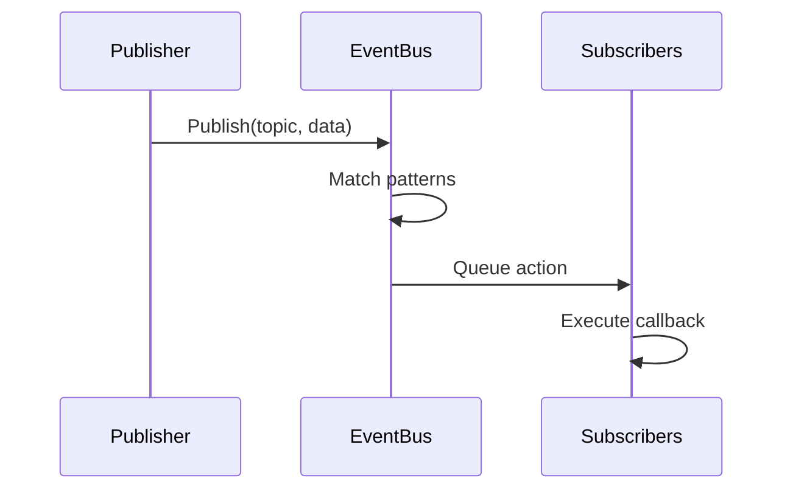
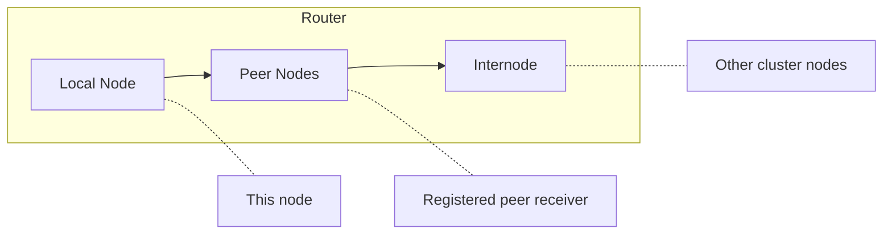

# Архитектура

<note>
Эта страница находится в разработке. Содержимое может быть неполным или измениться.
</note>

Wippy — многослойная система, построенная на Go. Компоненты инициализируются в порядке зависимостей, взаимодействуют через шину событий и выполняют Lua-процессы через планировщик с work-stealing.

## Слои

| Слой | Компоненты |
|-------|------------|
| Приложение | Lua-процессы, функции, воркфлоу |
| Рантайм | Lua-движок (wippyai/go-lua), 40+ модулей |
| Сервисы | HTTP, Queue, Storage, Temporal |
| Система | Topology, Factory, Functions, Contracts |
| Ядро | Scheduler, Registry, Dispatcher, EventBus, Relay |
| Инфраструктура | AppContext, Logger, Transcoder |

Каждый слой зависит только от слоёв ниже него. Слой ядра предоставляет базовые примитивы, а сервисы строят поверх них абстракции более высокого уровня.

## Последовательность загрузки

Запуск приложения проходит четыре фазы.

### Фаза 1: Инфраструктура

Создаёт базовую инфраструктуру до загрузки каких-либо компонентов:

| Компонент | Назначение |
|-----------|---------|
| AppContext | Запечатываемый словарь ссылок на компоненты |
| EventBus | Pub/sub для взаимодействия между компонентами |
| Transcoder | Сериализация payload (JSON, YAML, Lua) |
| Logger | Структурированное логирование с потоковой передачей событий |
| Relay | Маршрутизация сообщений (Node, Router, Mailbox) |

### Фаза 2: Загрузка компонентов

Loader разрешает зависимости топологической сортировкой и загружает компоненты уровень за уровнем, по одному компоненту за раз.

Сначала инициализируются компоненты ядра (PIDGen, Dispatcher, Registry, Finder, Supervisor), затем системные компоненты (Topology, Lifecycle, Factory, Functions, Contracts). Конкретные уровни вычисляются во время выполнения из графа зависимостей, поэтому порядок адаптируется при добавлении или удалении компонентов.

Каждый компонент привязывает себя к контексту во время Load, делая сервисы доступными зависимым компонентам.

### Фаза 3: Активация

После загрузки всех компонентов:

1. **Заморозка Dispatcher** - Блокирует реестр обработчиков команд для поиска без блокировок
2. **Запечатывание AppContext** - Запись больше не допускается, включается чтение без блокировок
3. **Запуск компонентов** - Вызывает `Start()` у каждого компонента с интерфейсом `Starter`

### Фаза 4: Загрузка записей

Записи реестра (из YAML-файлов) загружаются и валидируются:

1. Записи разбираются из файлов проекта
2. Этапы конвейера преобразуют записи (override, link, bytecode)
3. Сервисы с пометкой `auto_start: true` начинают работу
4. Супервизор наблюдает за зарегистрированными сервисами

## Компоненты

Компоненты — это Go-сервисы, участвующие в жизненном цикле приложения.

### Фазы жизненного цикла

| Фаза | Метод | Назначение |
|-------|--------|---------|
| Load | `Load(ctx) (ctx, error)` | Инициализация и привязка к контексту |
| Start | `Start(ctx) error` | Начало активной работы |
| Stop | `Stop(ctx) error` | Корректное завершение |

Компоненты объявляют зависимости. Loader строит направленный ациклический граф и выполняет их в топологическом порядке. Остановка происходит в обратном порядке.

### Стандартные компоненты

| Компонент | Зависимости | Назначение |
|-----------|--------------|---------|
| PIDGen | нет | Генерация ID процессов |
| Dispatcher | нет | Диспатчинг обработчиков команд |
| Registry | Artifact | Хранение и версионирование записей |
| Finder | Registry | Поиск и выборка записей |
| Supervisor | Registry | Политики перезапуска сервисов |
| Topology | нет | Дерево родитель/потомок процессов |
| Lifecycle | Topology | Управление жизненным циклом сервисов |
| Factory | нет | Порождение процессов |
| Functions | Registry | Вызовы функций без состояния |

## Шина событий

Асинхронный pub/sub для взаимодействия между компонентами.

### Устройство

- Единственная горутина диспатчера обрабатывает все события
- Доставка действий через очередь не блокирует публикаторов
- Сопоставление паттернов поддерживает точные топики и подстановки (`*`)
- Жизненный цикл на основе контекста привязывает подписки к отмене

### Поток событий

### Основные топики

Каждое событие несёт `System` и `Kind`. Встроенные системы публикуют:

| Система | Kind | Назначение |
|--------|------|---------|
| `registry` | `entry.create`, `entry.update`, `entry.delete`, `entry.accept`, `entry.reject` | Изменения записей |
| `registry` | `registry.begin`, `registry.commit`, `registry.discard` | Границы транзакций |
| `process` | `factory.register`, `factory.delete`, `factory.accept`, `factory.reject` | Регистрация фабрик для видов процессов |
| `supervisor` | `service.register`, `service.remove`, `service.update`, `service.start`, `service.stop` | Жизненный цикл сервисов |

## Реестр

Версионированное хранилище определений записей.

### Возможности

- **Версионированное состояние** - Каждое изменение создаёт новую версию
- **История** - По умолчанию история в памяти; опционально история на SQLite для долговременного аудита (history_type: sqlite)
- **Событийность** - Публикация событий при изменениях

### Жизненный цикл записи

Этапы конвейера преобразуют записи:

| Этап | Назначение |
|-------|---------|
| Override | Применение переопределений из конфигурации |
| Disable | Удаление записей по паттерну |
| Link | Разрешение требований и зависимостей |
| Bytecode | Компиляция Lua в байткод |
| EmbedFS | Сбор записей файловой системы |

## Relay

Маршрутизация сообщений между процессами на разных узлах.

### Трёхуровневая маршрутизация

1. **Local** - Прямая доставка в пределах одного узла
2. **Peer** - Доставка получателю, зарегистрированному для этого ID узла (внешний пир, например Temporal-воркер)
3. **Internode** - Откат на межузловой транспорт кластера, устанавливаемый компонентом кластера после загрузки

### Mailbox

У каждого узла есть mailbox с пулом воркеров:

- Хеширование FNV-1a закрепляет отправителей за воркерами
- Сохраняется порядок сообщений для каждого отправителя
- Воркеры обрабатывают сообщения параллельно
- Back-pressure при заполнении очереди

## AppContext

Запечатываемый словарь ссылок на компоненты.

| Свойство | Поведение |
|----------|----------|
| До запечатывания | Однопоточная запись во время загрузки |
| После запечатывания | Чтение без блокировок, паника при записи |
| Дублирующиеся ключи | Паника |
| Типобезопасность | Типизированные функции-геттеры |

Компоненты привязывают сервисы на фазе Load. После завершения загрузки AppContext запечатывается для оптимальной производительности чтения.

## Завершение работы

Корректное завершение происходит в обратном порядке зависимостей:

1. SIGINT/SIGTERM запускает завершение
2. Супервизор останавливает управляемые сервисы
3. Компоненты с интерфейсом `Stopper` получают `Stop()`
4. Очистка инфраструктуры

Повторный сигнал принудительно завершает процесс немедленно.

## См. также

- [Планировщик](internals/scheduler.md) - Выполнение процессов
- [Шина событий](internals/events.md) - Система pub/sub
- [Реестр](internals/registry.md) - Управление состоянием
- [Диспатчинг команд](internals/dispatch.md) - Обработка yield'ов
