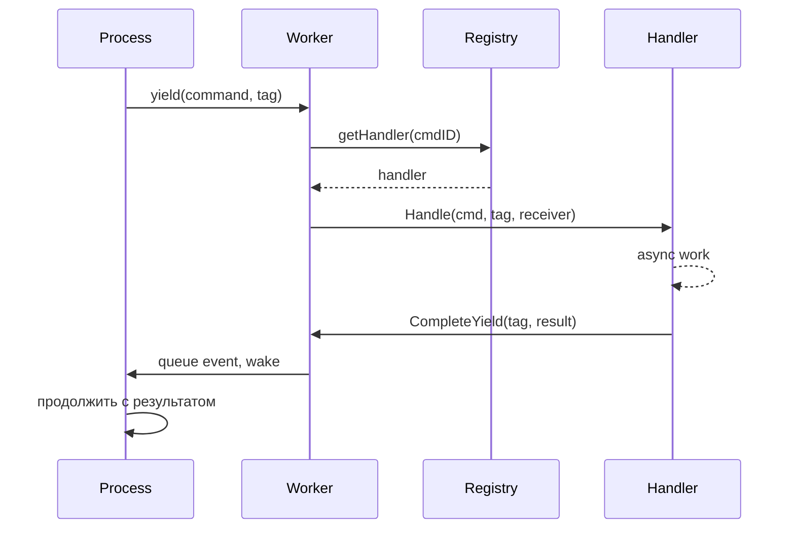

# Диспатчинг команд

Система диспатчинга маршрутизирует команды от процессов к обработчикам. Процессы yield'ят команды с корреляционными тегами, обработчики выполняют асинхронную работу, результаты возвращаются через очереди событий.

## Поток



## Реестр команд

Реестр хранит обработчики в гибридной структуре:

```go
type Registry struct {
    handlers [256]Handler         // Системные команды: O(1) по индексу
    extended map[CommandID]Handler // Расширенные команды: lookup по карте
    frozen   atomic.Bool          // Lock-free после загрузки
}
```

Системные команды (0-255) используют индексацию массива. Расширенные команды используют lookup по карте. После `Freeze()` все lookup'ы lock-free.

### Диапазоны Command ID

| Диапазон | Модуль | Примеры |
|----------|--------|---------|
| 1-9 | process | Send, Spawn, Terminate, Monitor, Link |
| 10-29 | clock | Sleep, Ticker, Timer |
| 50-59 | stream | Read, Write, Close, Seek |
| 60-79 | http | Request, RequestBatch |
| 80-89 | websocket | Connect, Send, Receive |
| 90-99 | event | Subscribe, Send |
| 100-119 | sql | Query, Execute, Transaction ops |
| 120-129 | store | Get, Set, Delete, Has |
| 130-139 | security | ValidateToken, CreateToken |
| 140-149 | function | Call, AsyncStart, AsyncCancel |
| 150-159 | exec | ProcessWait |
| 160-169 | cloudstorage | Upload, Download, List, Presigned URLs |
| 170-179 | eval | Compile, Run, CreateProcess |
| 180-189 | workflow | SideEffect, Call, Version, UpsertAttrs |
| 190-199 | contract | Open, Call, AsyncCall, AsyncCancel |
| 256+ | custom | Пользовательские сервисы |

Регистрация происходит при загрузке через `MustRegisterCommands()`. Коллизии вызывают panic при старте.

## Определение команд

Команды — это структуры данных с уникальным `CommandID`:

```go
const MyCommand dispatcher.CommandID = 200

type MyCmd struct {
    Input  string
    Option int
}

var myCmdPool = sync.Pool{New: func() any { return &MyCmd{} }}

func (c *MyCmd) CmdID() dispatcher.CommandID { return MyCommand }

func (c *MyCmd) Release() {
    c.Input = ""
    c.Option = 0
    myCmdPool.Put(c)
}
```

Переиспользование пула устраняет аллокации на горячих путях. Регистрация при инициализации пакета:

```go
func init() {
    dispatcher.MustRegisterCommands("myservice", MyCommand)
}
```

## Диспатчеры

Диспатчер группирует связанные обработчики. Он реализует `RegisterAll` для регистрации обработчиков и методы жизненного цикла для setup/teardown:

```go
type Handler interface {
    Handle(ctx context.Context, cmd Command, tag uint64, receiver ResultReceiver) error
}

type ResultReceiver interface {
    CompleteYield(tag uint64, data any, err error)
}
```

```go
type Dispatcher struct {
    // состояние сервиса
}

func (d *Dispatcher) RegisterAll(register func(id dispatcher.CommandID, h dispatcher.Handler)) {
    register(myapi.MyCommand, dispatcher.HandlerFunc(d.handleMyCommand))
}

func (d *Dispatcher) handleMyCommand(ctx context.Context, cmd Command, tag uint64, receiver ResultReceiver) error {
    c := cmd.(*myapi.MyCmd)
    go func() {
        result := doWork(c)
        if ctx.Err() == nil {
            receiver.CompleteYield(tag, result, nil)
        }
    }()
    return nil
}
```

Регистрация как boot-компонента:

```go
func MyDispatcher() boot.Component {
    return boot.New(boot.P{
        Name:      "dispatcher.myservice",
        DependsOn: []boot.Name{DispatcherName},
        Load: func(ctx context.Context) (context.Context, error) {
            reg := dispatcher.GetRegistrar(ctx)
            svc := myservice.NewDispatcher()
            svc.RegisterAll(reg.Register)
            return ctx, nil
        },
    })
}
```

## Yield'ы и корреляция

Когда процессу нужна асинхронная работа, он yield'ит команду с корреляционным тегом:

```go
type Yield struct {
    Cmd Command
    Tag uint64    // Локальный для процесса счётчик для корреляции
}
```

Воркер извлекает yield'ы из `StepOutput` после каждого шага и диспатчит их обработчикам. Каждый тег уникально идентифицирует запрос для сопоставления результатов.

## См. также

- [Планировщик](internals/scheduler.md) — выполнение процессов
- [Модули](internals/modules.md) — интеграция Lua-модулей
- [Модель процессов](concepts/process-model.md) — концепции высокого уровня
