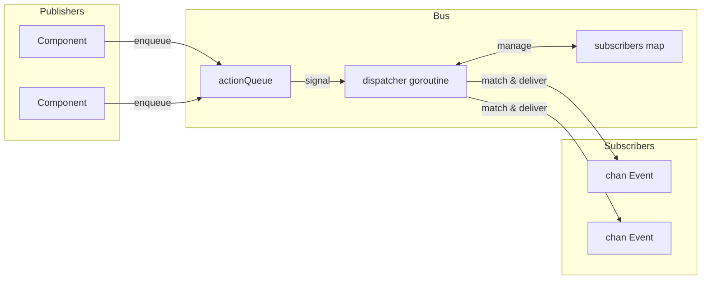

# Шина событий

Шина событий — система pub/sub с единственной горутиной диспатчера. Публикаторы ставят действия в очередь, диспатчер обрабатывает их последовательно, подписчики получают соответствующие события на каналах.

## Структура события

```go
type Event struct {
    System string  // Компонент/модуль (напр. "registry", "process")
    Kind   string  // Тип события (напр. "create", "update", "exit")
    Path   string  // Идентификатор сущности
    Data   any     // Payload
}
```

## Архитектура шины



Шина хранит состояние в простой структуре:

```go
type Bus struct {
    subscribers       map[SubscriberID]sub
    subscriberCounter uint64

    actionQueue []action
    spareQueue  []action
    actionMu    sync.Mutex
    actionReady chan struct{}  // buffered=1

    closed atomic.Bool
}
```

Все мутации проходят через горутину диспатчера, устраняя гонки без сложной блокировки.

## Действия

Четыре типа действий проходят через очередь:

| Действие | Поведение |
|----------|-----------|
| Subscribe | Добавляет подписчика в карту, отвечает на done-канал |
| Unsubscribe | Удаляет подписчика, отвечает на done-канал |
| Send | Доставляет событие соответствующим подписчикам |
| Stop | Очищает подписчиков, сливает очередь, выходит из цикла |

Subscribe и Unsubscribe блокируются до подтверждения диспатчером. Send — fire-and-forget.

## Обмен очередей

Диспатчер использует обмен срезов для избежания аллокаций в устойчивом состоянии:

```go
func (b *Bus) processActions() bool {
    b.actionMu.Lock()
    actions := b.actionQueue
    b.actionQueue = b.spareQueue[:0]
    b.spareQueue = nil
    b.actionMu.Unlock()

    for i := range actions {
        // обработка действия
    }

    clear(actions)
    b.actionMu.Lock()
    b.spareQueue = actions[:0]
    b.actionMu.Unlock()
    return true
}
```

Два среза чередуются: один для обработки, один для новых поступлений. Канал `actionReady` буферизован до 1, поэтому сигнализация никогда не блокирует и множественные enqueue объединяются в одно пробуждение.

## Сопоставление паттернов

Подписки компилируют паттерны один раз при подписке:

```go
type sub struct {
    subID   SubscriberID
    ctx     context.Context
    system  *wildcard.Wildcard
    kind    *wildcard.Wildcard
    eventCh chan<- Event
}
```

Пакет wildcard поддерживает три типа паттернов:

| Паттерн | Совпадает |
|---------|-----------|
| `registry` | Только точное совпадение |
| `*` | Любой один сегмент |
| `**` | Ноль или более сегментов |
| `(a\|b)` | Альтернация внутри сегмента |

Паттерны разделяются по `.`, поэтому `registry.*` совпадает с `registry.create`, но не с `registry.entry.create`. Паттерн `registry.**` совпадает со всеми тремя: `registry`, `registry.create` и `registry.entry.create`.

## Доставка событий

При обработке Send диспатчер итерирует подписчиков:

```go
for id, s := range b.subscribers {
    if s.system != nil && !s.system.Match(a.event.System) {
        continue
    }
    if s.kind != nil && !s.kind.Match(a.event.Kind) {
        continue
    }

    select {
    case <-a.ctx.Done():
        goto cleanup
    case <-s.ctx.Done():
        expiredSubs = append(expiredSubs, id)
    case s.eventCh <- a.event:
    }
}
```

Если контекст подписчика отменён, он помечается для удаления во время этого прохода доставки. Контекст события также может отменить доставку в середине итерации.

## Мост к Lua-процессам

Диспатчер событий связывает Go-события с Lua-процессами. Он подписывается один раз на все события (`"**"`) и маршрутизирует внутри на основе подписок процессов:

```go
type Dispatcher struct {
    bus    event.Bus
    node   relay.Node
    subID  SubscriberID
    eventC chan event.Event

    mu   sync.RWMutex
    subs map[string]*subscription  // topic -> subscription
}
```

Когда Lua-процесс подписывается через `events.subscribe()`, диспатчер сохраняет паттерн и целевой PID. Соответствующие события упаковываются и отправляются через relay:

```go
func (d *Dispatcher) routeEvent(evt event.Event) {
    d.mu.RLock()
    defer d.mu.RUnlock()

    for _, sub := range d.subs {
        if !matchPattern(sub.system, evt.System) {
            continue
        }
        if sub.kind != "" && !matchPattern(sub.kind, evt.Kind) {
            continue
        }

        data := map[string]any{
            "system": evt.System,
            "kind":   evt.Kind,
            "path":   evt.Path,
        }
        if evt.Data != nil {
            data["data"] = evt.Data
        }

        pkg := relay.NewPackage(pid.PID{}, sub.pid, sub.topic, payload.New(data))
        d.node.Send(pkg)
    }
}
```

## Вспомогательные типы

### Subscriber

Оборачивает канальную подписку с callback:

```go
handler, err := eventbus.NewSubscriber(ctx, bus, "registry", "*.created",
    func(evt Event) {
        // обработка
    })
defer handler.Close()
```

Порождает две горутины: одна читает события и вызывает обработчик, другая ждёт отмены контекста для отписки.

### EventRouter

Управляет несколькими обработчиками с централизованным жизненным циклом:

```go
router, err := eventbus.StartRouter(ctx, bus,
    WithHandlers(handler1, handler2),
    WithLogger(log))
defer router.Stop()
```

Каждый обработчик реализует `Pattern()` и `Handle()`. Роутер создаёт Subscriber для каждого и закрывает все при Stop.

### Awaiter

Синхронное ожидание конкретного события:

```go
awaiter := eventbus.NewAwaiter(bus, "registry", "accept")
waiter, _ := awaiter.Prepare(ctx, "service-id")
defer waiter.Close()

bus.Send(ctx, triggeringEvent)

result := waiter.Wait()  // блокирует до совпадения или таймаута
```

Паттерн Prepare-then-Wait избегает гонок: подписка до запуска события, которое производит ответ.

## Завершение работы

1. `Stop()` атомарно устанавливает флаг closed и ставит в очередь Stop-действие
2. Диспатчер очищает карту подписчиков
3. Оставшиеся действия в очереди сливаются:
   - Subscribe-запросы получают ошибку "bus is closed"
   - Unsubscribe-запросы завершаются немедленно
   - Send-события отбрасываются
4. WaitGroup завершается

## См. также

- [Реестр](internals/registry.md) — основной производитель событий
- [Диспатчинг команд](internals/dispatch.md) — маршрутизация процесс-обработчик
