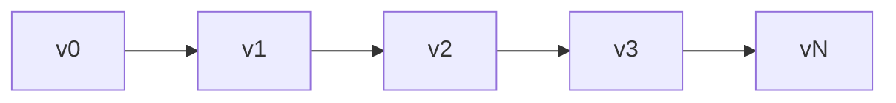
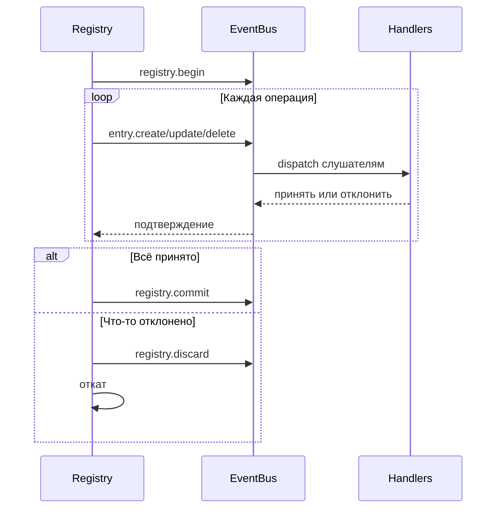

# Внутренности реестра

Реестр — это версионированное хранилище состояния, управляемое событиями. Он хранит полную историю версий, поддерживает транзакции и распространяет изменения через шину событий.

## Хранение записей

Записи хранятся как упорядоченный срез с хеш-картой для O(1) поиска:

```go
type Entry struct {
    ID   ID              // namespace:name
    Kind Kind            // Тип записи
    Meta attrs.Bag       // Метаданные
    Data payload.Payload // Содержимое
}
```

ID записей используют пакет Go `unique` для интернирования — идентичные ID разделяют память.

## Цепочка версий

Каждая версия указывает на родительскую. Вычисление пути использует графовый алгоритм для поиска кратчайшего маршрута между любыми двумя версиями:



## ChangeSets

Changeset — это упорядоченный список операций, трансформирующих одно состояние в другое:

| Операция | OriginalEntry | Назначение |
|----------|---------------|------------|
| Create | nil | Добавление новой записи |
| Update | старое значение | Изменение существующей |
| Delete | удалённое значение | Удаление записи |

`OriginalEntry` позволяет откат — обновления хранят предыдущее значение, удаления хранят что было удалено.

### Построение дельт

`BuildDelta(oldState, newState)` генерирует минимальные операции:

1. Сравнивает состояния, определяет изменения
2. Сортирует удаления в обратном порядке зависимостей (зависимые сначала)
3. Сортирует создания/обновления в прямом порядке зависимостей (зависимости сначала)

### Сжатие

Несколько changeset'ов объединяются отслеживанием финального состояния каждой записи:

```
Create + Update = Create (с обновлённым значением)
Create + Delete = ∅ (взаимоуничтожаются)
Update + Delete = Delete
Delete + Create = Update
```

## Транзакции



У обработчиков 30 секунд на принятие или отклонение каждой операции. При отклонении реестр откатывается, вычисляя и применяя обратную дельту.

### Непропагируемые записи

Некоторые виды полностью обходят шину событий:
- `registry.entry` — конфигурации приложения
- `ns.requirement` — требования namespace
- `ns.dependency` — зависимости модулей

## Разрешение зависимостей

Записи могут объявлять зависимости от других записей. Резолвер извлекает зависимости через зарегистрированные паттерны:

```go
resolver.RegisterPattern(PathConfig{
    Path: "meta.server",
    AllowWildcard: true,
})
```

Зависимости извлекаются из полей Meta и Data записи, затем используются для топологической сортировки при переходах состояний.

## История версий

Бэкенды истории:

| Реализация | Применение |
|------------|------------|
| SQLite | Продакшен-персистентность |
| Memory | Тестирование |
| Nil | Без истории |

SQLite использует WAL-режим с таблицами для версий, changeset'ов (кодированных MessagePack) и метаданных.

### Навигация

Вычисление пути находит кратчайший маршрут между версиями:

```go
Path(v0, v3) = [v1, v2, v3]  // Применить changeset'ы вперёд
Path(v3, v1) = [v2, v1]      // Применить обращённые changeset'ы
```

`LoadState()` воспроизводит историю от базовой линии без создания новых версий — используется при загрузке.

## Finder

Движок запросов с LRU-кешированием для поиска записей:

| Оператор | Префикс | Пример |
|----------|---------|--------|
| Glob | (нет) | `.kind=function.*` |
| Regex | `~` | `~meta.path=/api/.*` |
| Contains | `*` | `*meta.tags=backend` |
| Prefix | `^` | `^meta.name=user` |
| Suffix | `$` | `$meta.path=Handler` |

Кеш инвалидируется при изменении версии.

## См. также

- [Реестр](concepts/registry.md) — концепции высокого уровня
- [События](internals/events.md) — детали шины событий
