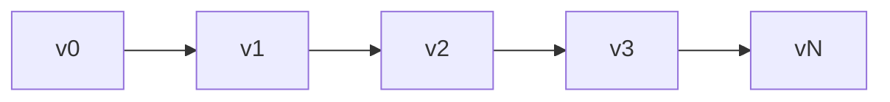
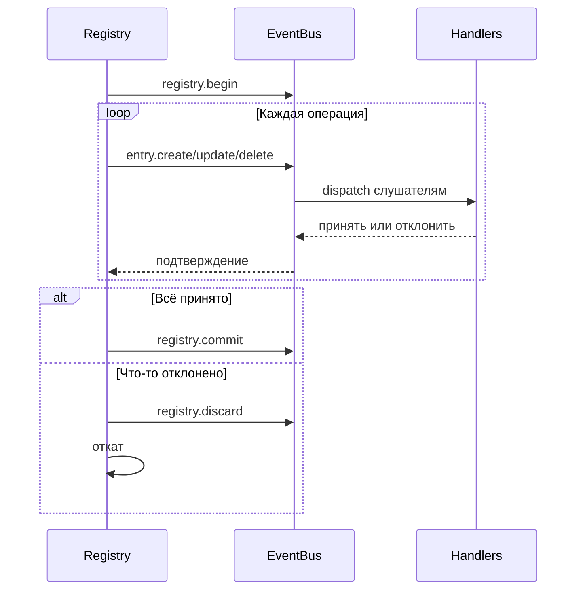

# Внутренности реестра

Реестр — это версионированное хранилище состояния, управляемое событиями. Он хранит полную историю версий, поддерживает транзакции и распространяет изменения через шину событий.

## Хранение записей

Записи хранятся как упорядоченный срез с хеш-картой для O(1) поиска:

```go
type Entry struct {
    ID       ID              // namespace:name
    Kind     Kind            // Тип записи
    Meta     attrs.Bag       // Метаданные автора
    Data     payload.Payload // Содержимое
    Registry EntryMetadata   // Происхождение, принадлежащее реестру
}

type EntryMetadata struct {
    Owner string // Источник развёртывания, поставивший запись
    Root  bool   // Объявление зависимости, выбранное развёртыванием
}
```

ID записей используют пакет Go `unique` для интернирования — идентичные ID разделяют память.

`Registry` принадлежит реестру, а не автору записи. `Owner` назначается из источника развёртывания; `Root` устанавливается из поля записи `dependency_root` на записи `ns.dependency`. Обычные API записей возвращают только `ID`, `Kind`, `Meta` и `Data`; происхождение читается через API состояния снимка.

## Snapshot

`Registry.Snapshot()` возвращает одно атомарное представление: версию, записи на этой версии и принадлежащие реестру метаданные состояния для той же версии.

```go
type Snapshot struct {
    Registry StateMetadata
    Version  Version
    Entries  State
}

type StateMetadata struct {
    Resolution *DependencyResolution
}
```

Чтение версии, записей и разрешения как одного значения не даёт вызывающему сопоставить записи с разрешением от другой версии. Выбранный граф модулей хранится один раз на снимок, а не повторяется в каждой записи.

## Оверлеи

`OverlayWriter` — необязательная возможность реестра для записей, локальных для процесса:

```go
type OverlayWriter interface {
    ApplyOverlay(context.Context, string, uint64, ChangeSet) (uint64, error)
    GetOverlay(string) (State, uint64, error)
}
```

Записи оверлея группируются под строкой логического владельца. Они входят в эффективное состояние и проходят ту же топологическую сортировку и те же переходы обработчиков, что и долговременные записи, поэтому сервисы для них запускаются и останавливаются обычным образом, но они никогда не порождают версию истории. После холодной загрузки они пусты и должны быть согласованы владеющим ими управляющим сервисом.

Записи оптимистично конкурентны: `GetOverlay` возвращает текущее поколение владельца, а `ApplyOverlay` фиксирует изменения, только если это поколение всё ещё актуально, иначе возвращает повторяемый `Conflict`. Каждое успешное применение выдаёт новое уникальное в пределах процесса поколение, а для изменявшихся владельцев сохраняется tombstone, чтобы последовательность ABA нельзя было принять за неизменённый оверлей.

Правила композиции, проверяемые при каждом применении:

- Запись может быть создана, только если её ID не занят ни долговременной записью, ни записью оверлея.
- Обновлять или удалять записи оверлея может только владеющая идентичность.
- Записи оверлея не могут нести метаданные, принадлежащие реестру, и не могут использовать виды, занятые директивами реестра.
- Удаление не может убрать запись, от которой зависит сохраняющаяся запись.
- Рёбра зависимостей не могут пересекать границы владельцев, а долговременные записи не могут зависеть от записей оверлея.

## Цепочка версий

Каждая версия указывает на родительскую. Вычисление пути использует графовый алгоритм для поиска кратчайшего маршрута между любыми двумя версиями:


```mermaid
flowchart LR
    v0[v0] --> v1[v1] --> v2[v2] --> v3[v3] --> vN[vN]
```

## ChangeSets

Changeset — это упорядоченный список операций, трансформирующих одно состояние в другое:

| Операция | OriginalEntry | Назначение |
|----------|---------------|------------|
| Create | nil | Добавление новой записи |
| Update | старое значение | Изменение существующей |
| Delete | удалённое значение | Удаление записи |

`OriginalEntry` позволяет откат — обновления хранят предыдущее значение, удаления хранят что было удалено.

### Построение дельт

`BuildDelta(oldState, newState)` генерирует минимальные операции:

1. Сравнивает состояния, определяет изменения
2. Сортирует удаления в обратном порядке зависимостей (зависимые сначала)
3. Сортирует создания/обновления в прямом порядке зависимостей (зависимости сначала)

### Сжатие

Несколько changeset'ов объединяются отслеживанием финального состояния каждой записи:

```
Create + Update = Create (с обновлённым значением)
Create + Delete = ∅ (взаимоуничтожаются)
Update + Delete = Delete
Delete + Create = Update
```

## Транзакции


```mermaid
sequenceDiagram
    participant R as Registry
    participant B as EventBus
    participant H as Handlers

    R->>B: registry.begin
    loop Каждая операция
        R->>B: entry.create/update/delete
        B->>H: dispatch слушателям
        H-->>B: принять или отклонить
        B-->>R: подтверждение
    end
    alt Всё принято
        R->>B: registry.commit
    else Что-то отклонено
        R->>B: registry.discard
        R->>R: откат
    end
```

У обработчиков 30 секунд на принятие или отклонение каждой операции. При отклонении реестр откатывается, вычисляя и применяя обратную дельту.

### Непропагируемые записи

Некоторые виды полностью обходят шину событий:
- `registry.entry` — конфигурации приложения
- `ns.requirement` — требования namespace
- `ns.dependency` — зависимости модулей
- `ns.definition` — метаданные модуля (readme, вики, лицензия, авторы)

## Разрешение зависимостей

Записи могут объявлять зависимости от других записей. Резолвер извлекает зависимости через зарегистрированные паттерны:

```go
resolver.RegisterPattern(registry.DependencyPattern{
    Path:          "meta.server",
    AllowWildcard: true,
})
```

Зависимости извлекаются из полей Meta и Data записи, затем используются для топологической сортировки при переходах состояний.

### Политика доступа к зависимостям

Доступ к внешним зависимостям — это значение контекста в рамках запроса, а не глобальный флаг:

| Политика | Эффект |
|----------|--------|
| `DependencyAccessUnspecified` | Выбирают вызывающие; применяется собственное значение по умолчанию вызывающего |
| `DependencyAccessOnline` | Внешнее разрешение и загрузка артефактов разрешены |
| `DependencyAccessVerifiedOffline` | Внешний доступ запрещён; разрешение использует закреплённые манифесты и локально имеющиеся артефакты |

`LoadState()` по умолчанию использует verified-offline, когда контекст ничего не задаёт, поэтому загрузка воспроизводит сохранённый граф без обращения к сети. Восстановление базовой линии развёртывания переключает контекст на online, потому что оно обязано скачать модули, названные в этой базовой линии. В режиме verified-offline провайдер манифестов, отдающий только закреплённые модули, заменяет провайдер хаба, а отсутствующий артефакт падает как отсутствующее свидетельство, а не запускает загрузку.

## История версий

Бэкенды истории:

| Реализация | Применение |
|------------|------------|
| SQLite | Продакшен-персистентность |
| PostgreSQL | Продакшен-персистентность, общая для нескольких нод |
| Memory | По умолчанию, когда `history_type` не задан; тестирование |
| Nil | Без истории |

SQLite использует WAL-режим с таблицами для версий, changeset'ов (кодированных MessagePack) и метаданных. PostgreSQL выбирается через `registry.history_type: postgres` плюс `history_dsn`/`history_schema` (см. [Конфигурация](guides/configuration.md#registry)).

История также сохраняет точное разрешение зависимостей для каждой версии: когда применяется изменение `ns.dependency`, разрешённый граф модулей сохраняется с адресацией по содержимому рядом с changeset'ом. Загрузка и откат воспроизводят сохранённый граф вместо повторного разрешения, поэтому версия всегда согласуется с версиями, с которыми она была разрешена. Схема истории мигрирует автоматически при первой загрузке после обновления; ранее существовавшая версия разрешается один раз при первом обращении и фиксируется контрольной точкой.

### Навигация

Вычисление пути находит кратчайший маршрут между версиями:

```go
Path(v0, v3) = [v1, v2, v3]  // Применить changeset'ы вперёд
Path(v3, v1) = [v2, v1]      // Применить обращённые changeset'ы
```

`LoadState()` воспроизводит историю от базовой линии без создания новых версий — используется при загрузке.

## Finder

Движок запросов с LRU-кешированием для поиска записей:

| Оператор | Префикс | Пример |
|----------|---------|--------|
| Glob | (нет) | `.kind=function.*` |
| Regex | `~` | `~meta.path=/api/.*` |
| Contains | `*` | `*meta.tags=backend` |
| Prefix | `^` | `^meta.name=user` |
| Suffix | `$` | `$meta.path=Handler` |

Кеш инвалидируется при изменении версии.

## См. также

- [Реестр](concepts/registry.md) — концепции высокого уровня
- [События](internals/events.md) — детали шины событий
