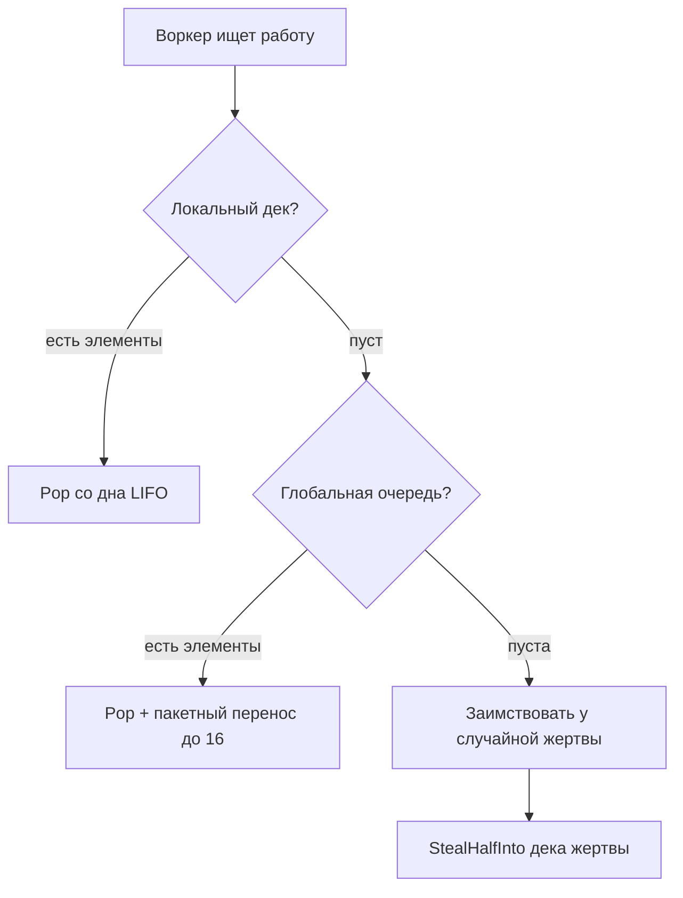
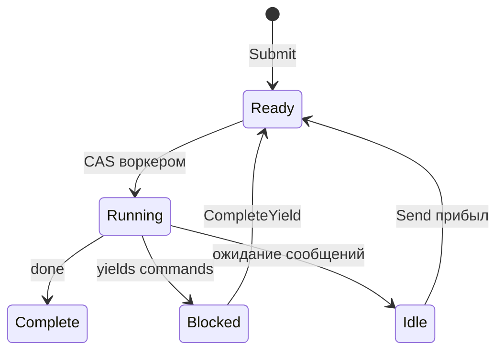

# Планировщик

Планировщик выполняет процессы по принципу work-stealing. Воркеры поддерживают локальные деки и заимствуют работу друг у друга при простое.

## Интерфейс Process

Планировщик работает с любым типом, реализующим интерфейс `Process`:

```go
type Process interface {
    Init(ctx context.Context, method string, input payload.Payloads) error
    Step(events []Event, out *StepOutput) error
    Close()
}
```

| Метод | Назначение |
|-------|------------|
| `Init` | Подготовка процесса с именем метода и входными аргументами |
| `Step` | Продвижение автомата состояний входящими событиями, запись yields в output |
| `Close` | Освобождение ресурсов |

Параметр `method` в `Init` указывает, какую точку входа вызывать. Экземпляр процесса может предоставлять несколько точек входа, и вызывающий выбирает нужную. Это также служит проверкой корректности инициации процесса планировщиком.

Планировщик вызывает `Step()` многократно, передавая события (завершения yield'ов, сообщения) и собирая yield'ы (команды для диспатчинга). Процесс записывает свой статус и yield'ы в буфер `StepOutput`.

```go
type Event struct {
    Type  EventType  // EventYieldComplete или EventMessage
    Tag   uint64     // Корреляционный тег для завершений yield
    Data  any        // Данные результата или payload сообщения
    Error error      // Ошибка, если yield завершился неудачей
}
```

## Структура

Планировщик порождает `GOMAXPROCS` воркеров по умолчанию. У каждого воркера локальный дек для кеш-дружественного LIFO-доступа. Глобальная FIFO-очередь обрабатывает новые submissions и межворкерные переносы. Процессы отслеживаются по PID для маршрутизации сообщений.

## Поиск работы



Воркеры проверяют источники в порядке приоритета:

| Приоритет | Источник | Паттерн |
|-----------|----------|---------|
| 1 | Локальный дек | LIFO pop, lock-free, кеш-дружественный |
| 2 | Глобальная очередь | FIFO pop с пакетным переносом |
| 3 | Другие воркеры | Заимствовать половину из дека жертвы |

При pop из глобальной очереди воркеры берут один элемент и пакетно переносят до 16 дополнительных в свой локальный дек.

## Дек Chase-Lev

У каждого воркера дек Chase-Lev для work-stealing:

```go
type Deque struct {
    buffer atomic.Pointer[dequeBuffer]
    top    atomic.Int64  // Воры заимствуют отсюда (CAS)
    bottom atomic.Int64  // Владелец push/pop отсюда
}
```

Владелец push'ит и pop'ит со дна (LIFO) без синхронизации. Воры заимствуют с верха (FIFO) через CAS. Это даёт владельцу кеш-дружественный доступ к недавно добавленным элементам, распределяя более старую работу ворам.

`StealHalfInto` забирает половину элементов одной CAS-операцией, снижая конкуренцию.

## Адаптивное вращение

Перед блокировкой на condition variable воркеры адаптивно вращаются:

| Счётчик вращений | Действие |
|------------------|----------|
| < 4 | Тесный цикл |
| 4-15 | Уступить поток (`runtime.Gosched`) |
| >= 16 | Заблокироваться на condition variable |

## Состояния процесса



| Состояние | Описание |
|-----------|----------|
| Ready | В очереди на выполнение |
| Running | Воркер выполняет Step() |
| Blocked | Ожидание завершения yield |
| Idle | Ожидание сообщений |
| Complete | Выполнение завершено |

Флаг wakeup обрабатывает гонки: если обработчик вызывает `CompleteYield`, пока воркер ещё владеет процессом (Running), он устанавливает флаг. Воркер проверяет флаг после диспатчинга и перепланирует, если установлен.

## Очередь событий

У каждого процесса MPSC (multi-producer, single-consumer) очередь событий:

- **Producers**: обработчики команд (`CompleteYield`), отправители сообщений (`Send`)
- **Consumer**: воркер сливает события в `Step()`

## Маршрутизация сообщений

Планировщик реализует `relay.Receiver` для маршрутизации сообщений процессам. При вызове `Send()` он находит целевой PID в карте `byPID`, push'ит сообщение как событие в очередь процесса и будит процесс, если тот Idle, push'ом в глобальную очередь.

## Завершение работы

При завершении планировщик отправляет события отмены всем выполняющимся процессам и ждёт их завершения или таймаута. Воркеры завершаются, когда работы больше нет.

## См. также

- [Диспатчинг команд](internals/dispatch.md) — как yield'ы достигают обработчиков
- [Модель процессов](concepts/process-model.md) — концепции высокого уровня
