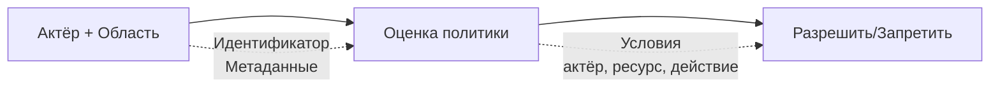

# Модель безопасности

Wippy реализует контроль доступа на основе атрибутов. Каждый запрос несёт актёра (кто) и область (какие политики применяются). Политики оценивают доступ на основе действия, ресурса и метаданных актёра и ресурса.



## Типы записей

| Тип | Описание |
|-----|----------|
| `security.policy` | Декларативная политика с условиями |
| `security.policy.expr` | Политика на основе выражений |
| `security.token_store` | Хранение и валидация токенов |

## Актёры

Актёр представляет того, кто выполняет действие.

```lua
local security = require("security")

-- Создаём актёра с метаданными
local actor = security.new_actor("user:123", {
    role = "admin",
    team = "backend",
    department = "engineering",
    clearance = 3
})

-- Доступ к свойствам актёра
local id = actor:id()        -- "user:123"
local meta = actor:meta()    -- {role="admin", ...}
```

### Актёр в контексте

```lua
-- Получаем текущего актёра из контекста
local actor = security.actor()
if not actor then
    return nil, errors.new("UNAUTHORIZED", "No actor in context")
end
```

## Политики

Политики определяют правила доступа с действиями, ресурсами, условиями и эффектами.

### Декларативная политика

```yaml
# src/security/_index.yaml
version: "1.0"
namespace: app.security

entries:
  # Полный доступ для админов
  - name: admin_policy
    kind: security.policy
    policy:
      actions: "*"
      resources: "*"
      effect: allow
      conditions:
        - field: actor.meta.role
          operator: eq
          value: admin
    groups:
      - admin

  # Доступ только на чтение
  - name: readonly_policy
    kind: security.policy
    policy:
      actions:
        - "*.read"
        - "*.get"
        - "*.list"
      resources: "*"
      effect: allow
    groups:
      - default

  # Доступ владельца ресурса
  - name: owner_policy
    kind: security.policy
    policy:
      actions:
        - read
        - write
        - delete
      resources: "document:*"
      effect: allow
      conditions:
        - field: meta.owner
          operator: eq
          value_from: actor.id
    groups:
      - default

  # Запрет конфиденциальных без допуска
  - name: deny_confidential
    kind: security.policy
    policy:
      actions: "*"
      resources: "document:*"
      effect: deny
      conditions:
        - field: meta.classification
          operator: eq
          value: confidential
        - field: actor.meta.clearance
          operator: lt
          value: 3
    groups:
      - security
```

### Структура политики

```yaml
policy:
  actions: "*" | "action" | ["action1", "action2"]
  resources: "*" | "resource" | ["res1", "res2"]
  effect: allow | deny
  conditions:  # Необязательно
    - field: "field.path"
      operator: "eq"
      value: "static_value"
      # ИЛИ
      value_from: "other.field.path"
```

### Политика на основе выражений

Для сложной логики используйте политики с выражениями:

```yaml
- name: flexible_access
  kind: security.policy.expr
  policy:
    actions:
      - read
      - write
    resources: "file:*"
    effect: allow
    expression: |
      (actor.meta.role == "editor" && action == "write") ||
      (action == "read" && meta.public == true) ||
      actor.id == meta.owner
  groups:
    - editors
```

## Условия

Условия позволяют динамически оценивать политики на основе актёра, действия, ресурса и метаданных.

### Пути к полям

| Путь | Описание |
|------|----------|
| `actor.id` | Уникальный идентификатор актёра |
| `actor.meta.*` | Метаданные актёра (поддерживает вложенность) |
| `action` | Выполняемое действие |
| `resource` | Идентификатор ресурса |
| `meta.*` | Метаданные ресурса |

### Операторы

| Оператор | Описание | Пример |
|----------|----------|--------|
| `eq` | Равно | `actor.meta.role eq "admin"` |
| `ne` | Не равно | `meta.status ne "deleted"` |
| `lt` | Меньше | `meta.priority lt 5` |
| `gt` | Больше | `actor.meta.clearance gt 2` |
| `lte` | Меньше или равно | `meta.size lte 1000` |
| `gte` | Больше или равно | `actor.meta.level gte 3` |
| `in` | Значение в массиве | `action in ["read", "write"]` |
| `nin` | Значение не в массиве | `meta.status nin ["deleted", "archived"]` |
| `exists` | Поле существует | `meta.owner exists true` |
| `nexists` | Поле не существует | `meta.deleted nexists true` |
| `contains` | Строка содержит | `resource contains "sensitive"` |
| `ncontains` | Строка не содержит | `resource ncontains "public"` |
| `matches` | Совпадение по regex | `resource matches "^doc:.*"` |
| `nmatches` | Несовпадение по regex | `actor.id nmatches "^system:.*"` |

### Примеры условий

```yaml
# Проверка роли актёра
conditions:
  - field: actor.meta.role
    operator: eq
    value: admin

# Сравнение полей
conditions:
  - field: meta.owner
    operator: eq
    value_from: actor.id

# Числовое сравнение
conditions:
  - field: actor.meta.clearance
    operator: gte
    value: 3

# Членство в массиве
conditions:
  - field: actor.meta.role
    operator: in
    value:
      - admin
      - moderator

# Сопоставление по шаблону
conditions:
  - field: resource
    operator: matches
    value: "^api:/v[0-9]+/admin/.*"

# Несколько условий (AND)
conditions:
  - field: actor.meta.department
    operator: eq
    value: engineering
  - field: meta.environment
    operator: eq
    value: production
```

## Области

Области объединяют несколько политик в контекст безопасности.

```lua
local security = require("security")

-- Получаем политики
local admin_policy = security.policy("app.security:admin_policy")
local readonly_policy = security.policy("app.security:readonly_policy")

-- Создаём область с политиками
local scope = security.new_scope()
scope = scope:with(admin_policy)
scope = scope:with(readonly_policy)

-- Области иммутабельны — :with() возвращает новую область
```

### Именованные области (группы политик)

Загрузка всех политик из группы:

```lua
-- Загружаем область со всеми политиками группы
local scope, err = security.named_scope("app.security:admin")
```

Политики назначаются группам через поле `groups`:

```yaml
- name: admin_policy
  kind: security.policy
  policy:
    # ...
  groups:
    - admin      # Эта политика в группе "admin"
    - default    # Может быть в нескольких группах
```

### Операции с областями

```lua
-- Добавить политику
local new_scope = scope:with(policy)

-- Удалить политику
local new_scope = scope:without("app.security:temp_policy")

-- Проверить наличие политики
local has = scope:contains("app.security:admin_policy")

-- Получить все политики
local policies = scope:policies()
```

## Вычисление политик

### Порядок вычисления

```
1. Нет актора или нет области в контексте → решает строгий режим (по умолчанию запрет)
2. Проверяем каждую политику в области
3. Если ЛЮБАЯ политика возвращает Deny → Результат Deny
4. Если хотя бы один Allow и нет Deny → Результат Allow
5. Нет применимых политик → Результат Undefined
```

Проверка доступа проходит только при `Allow`. `Undefined` запрещает доступ ровно как `Deny` — строгий режим не играет никакой роли, когда актор и область оба присутствуют.

### Результаты вычисления

| Результат | Значение |
|-----------|----------|
| `allow` | Доступ разрешён |
| `deny` | Доступ явно запрещён |
| `undefined` | Ни одна политика не сработала |

```lua
-- Прямое вычисление
local result = scope:evaluate(actor, "read", "document:123", {
    owner = "user:456",
    classification = "internal"
})

if result == "deny" then
    return nil, errors.new("FORBIDDEN", "Access denied")
elseif result == "undefined" then
    -- Ни одна политика не сработала — проверки доступа считают это запретом
end
```

### Быстрая проверка прав

```lua
-- Проверка относительно текущего актёра и области из контекста
local allowed = security.can("read", "document:123", {
    owner = "user:456"
})

if not allowed then
    return nil, errors.new("FORBIDDEN", "Access denied")
end
```

## Хранилища токенов

Хранилища токенов обеспечивают безопасное создание, валидацию и отзыв токенов.

### Конфигурация

```yaml
# src/auth/_index.yaml
version: "1.0"
namespace: app.auth

entries:
  # Регистрация переменной окружения
  - name: os_env
    kind: env.storage.os

  - name: AUTH_SECRET_KEY
    kind: env.variable
    variable: AUTH_SECRET_KEY
    storage: app.auth:os_env

  # Хранилище для данных токенов
  - name: token_data
    kind: store.memory
    lifecycle:
      auto_start: true

  # Хранилище токенов
  - name: tokens
    kind: security.token_store
    store: app.auth:token_data
    token_length: 32
    default_expiration: "24h"
    token_key_env: "AUTH_SECRET_KEY"
```

### Параметры хранилища токенов

| Параметр | По умолчанию | Описание |
|----------|--------------|----------|
| `store` | обязательно | Ссылка на key-value хранилище |
| `token_length` | 32 | Размер токена в байтах (256 бит) |
| `default_expiration` | 24h | TTL токена по умолчанию |
| `token_key` | нет | Ключ подписи HMAC-SHA256 (прямое значение) |
| `token_key_env` | нет | Имя переменной окружения для ключа подписи |

В продакшене используйте `token_key_env`, чтобы не хранить секреты в записях. См. [Система окружения](system/env.md) для регистрации переменных окружения.

### Создание токенов

```lua
local security = require("security")

-- Получаем хранилище токенов
local store, err = security.token_store("app.auth:tokens")
if err then
    return nil, err
end

-- Создаём актёра и область
local actor = security.new_actor("user:123", {
    role = "user",
    email = "user@example.com"
})

local scope, _ = security.named_scope("app.security:default")

-- Создаём токен
local token, err = store:create(actor, scope, {
    expiration = "7d",  -- Переопределяем срок действия
    meta = {
        device = "mobile",
        ip = "192.168.1.1"
    }
})

if err then
    return nil, err
end

-- Формат токена: base64_token.hmac_signature (если задан token_key)
-- Пример: "dGVzdHRva2VuMTIz.a1b2c3d4e5f6"
```

### Валидация токенов

```lua
-- Валидация токена
local actor, scope, err = store:validate(token)
if err then
    return nil, errors.new("UNAUTHORIZED", "Invalid token")
end

-- Актёр и область восстанавливаются из сохранённых данных
print(actor:id())  -- "user:123"
```

### Отзыв токенов

```lua
-- Отзыв отдельного токена
local ok, err = store:revoke(token)

-- Закрыть хранилище по завершении
store:close()
```

## Передача контекста

Контекст безопасности передаётся через вызовы функций.

### Установка контекста

```lua
local funcs = require("funcs")

-- Вызов функции с контекстом безопасности
local result, err = funcs.new()
    :with_actor(actor)
    :with_scope(scope)
    :call("app.api:protected_endpoint", data)
```

### Наследование контекста

| Компонент | Наследуется |
|-----------|-------------|
| Actor | Да — передаётся дочерним вызовам |
| Scope | Да — передаётся дочерним вызовам |
| Strict mode | Нет — уровень приложения |

Функции наследуют контекст безопасности вызывающего. Порождённый процесс — нет: он начинает на свежем фрейме, и его контекст берётся из блока `security:` его собственной записи. Когда эта запись не объявляет блок, процесс работает без актора и без области, что строгий режим запрещает. Объявленный блок, опускающий `actor`, наследует актора породившего, а опускающий и `policies`, и `groups` — наследует его область; таким образом «начинает с чистого листа» означает «нет неявного наследования», а не «нельзя передать контекст».

## Объявление безопасности на записях

Блок безопасности имеет одинаковую форму везде, где встречается:

| Поле | Тип | Описание |
|------|-----|----------|
| `actor.id` | string | Идентичность актора; заменяет унаследованного актора |
| `actor.meta` | map | Атрибуты актора, вычисляемые политиками |
| `policies` | list | Registry ID политик, объединяемых в область |
| `groups` | list | Registry ID групп политик, чьи политики объединяются в область |

`policies` и `groups` — это **registry ID в форме `namespace:name`**. Голое имя не разрешается: в отличие от поля `groups:` на записи политики, которое по умолчанию берёт пространство имён самой политики, эти ссылки не имеют пространства имён по умолчанию.

Разрешение атомарно и fail-closed. Каждая перечисленная политика и группа разрешается до того, как что-либо будет установлено; если хотя бы одна отсутствует, пуста или не содержит политик, вся конфигурация падает, и ни актор, ни частичная область не применяются. Поэтому вызывающий никогда не пересекает границу с половиной контекста.

### Записи процессов

Записи `process.lua`, `process.lua.bc`, `function.lua` и `function.lua.bc` принимают блок `security:` верхнего уровня, применяемый к каждому выполнению этой записи:

```yaml
- name: worker_process
  kind: process.lua
  source: file://worker.lua
  method: main
  security:
    actor:
      id: "service:worker"
      meta:
        role: worker
        service: true
    policies:
      - app.security:worker_policy
    groups:
      - app.security:workers
```

Блок применяется при старте процесса, как на `process.host`, так и на `terminal.host`. Сбой разрешения прерывает spawn, а не запускает процесс с более слабым контекстом.

### Жизненный цикл сервиса

Супервизируемые сервисы принимают тот же блок под `lifecycle`; он разрешается один раз при создании контроллера сервиса и запечатывается на всё время жизни сервиса:

```yaml
- name: worker
  kind: process.service
  process: app:worker_process
  host: app:processes
  lifecycle:
    auto_start: true
    security:
      actor:
        id: "service:worker"
      groups:
        - app.security:workers
```

### CLI-команды

Запись команды объявляет `meta.command.security`, применяемый только при запуске записи как CLI-команды: якорем доверия для этого контекста является оператор, выполняющий `wippy run <name>`. На обычный spawn той же записи он не влияет. Блок проверяется строго: неизвестные поля отклоняются, пустой блок отклоняется, а `security` без `name` команды отклоняется. См. [Безопасность команды](guides/cli.md#command-security).

## Строгий режим

Строгий режим решает, что происходит, когда запрос не несёт ни актора, ни области. Он **включён по умолчанию**, поэтому неполный контекст запрещается. Его отключение — явный выбор, делаемый в файле конфигурации среды выполнения (`.wippy.yaml`), а не в манифесте модуля `wippy.yaml`:

```yaml
# .wippy.yaml
security:
  strict_mode: false
```

| Режим | Отсутствует контекст | Поведение |
|-------|---------------------|-----------|
| Строгий (по умолчанию) | Нет actor/scope | Запретить |
| Permissive (`strict_mode: false`) | Нет actor/scope | Разрешить |

Строгий режим ничего не меняет, когда актор и область присутствуют: вычисление в любом случае запрещает по умолчанию. Он управляет только неполным случаем — именно поэтому процесс, работающий без объявленного контекста безопасности, при значении по умолчанию проваливает все проверки. Дайте такому процессу блок `security:` или запускайте его через путь, который контекст предоставляет.

## Поток аутентификации

Валидация токена в HTTP-обработчике:

```lua
local http = require("http")
local security = require("security")

local function protected_handler()
    local req = http.request()
    local res = http.response()

    -- Извлекаем и валидируем токен
    local auth = req:header("Authorization")
    if not auth then
        return res:set_status(401):write_json({error = "Missing authorization"})
    end

    local token = auth:gsub("^Bearer%s+", "")
    local store, _ = security.token_store("app.auth:tokens")
    local actor, scope, err = store:validate(token)
    if err then
        return res:set_status(401):write_json({error = "Invalid token"})
    end

    -- Проверяем права
    if not security.can("api.users.read", "users") then
        return res:set_status(403):write_json({error = "Forbidden"})
    end

    res:write_json({user = actor:id()})
end

return { handler = protected_handler }
```

Создание токена при логине:

```lua
local actor = security.new_actor("user:" .. user.id, {role = user.role})
local scope, _ = security.named_scope("app.security:" .. user.role)

local store, _ = security.token_store("app.auth:tokens")
local token, err = store:create(actor, scope, {expiration = "24h"})
```

## Границы доверия среды выполнения

Вычисление политик управляет тем, что код может делать. Три отдельных механизма управляют тем, какой код допускается и куда может путешествовать контекст.

### Целостность модулей

Каждый модуль в `wippy.lock` несёт дайджест артефакта. Загрузки промежуточные: они проверяются и по дайджесту, закреплённому в lock-файле, и по дайджесту, отданному хабом, и только затем перемещаются на место; уже вендорные пакеты перепроверяются при загрузке. Несовпадение — это сбой `PermissionDenied`, который не повторяется и не обходится: модуль не загружается. Распакованные каталоги модулей несут собственные записанные дайджест и дайджест дерева и проверяются так же, поэтому изменённое вендорное дерево обнаруживается, а не принимается на веру. См. [Управление зависимостями](guides/dependency-management.md#integrity-verification).

### Идентичность узлов кластера

Узлы кластера аутентифицируют друг друга. Каждый узел держит ed25519-ключ идентичности и карту публичных ключей пиров, которым он доверяет; рукопожатие в mesh взаимное и связывает HMAC над общим gossip-секретом с ed25519-подписью над транскриптом, покрывающим оба ID узлов и оба nonce. Пир, которого нет в доверенной карте, либо чей объявленный через gossip ключ расходится с доверенной записью, отклоняется. Неаутентифицированного режима нет: узел без идентичности не может присоединиться к mesh. См. [Идентичность узлов](guides/cluster.md#internode-identity).

### Распространение в Temporal

Контекст безопасности, пересекающий границу Temporal, переносится как подписанный заголовок, а не как обычный вход workflow. Актор, его метаданные и ID политик сериализуются в конверт `wippy-security` и подписываются HMAC-ключом клиента с привязкой к конкретному ID workflow или activity. Принимающий worker проверяет подпись и аудиторию и разрешает каждую названную политику локально до запуска workflow или activity; любой сбой обрушивает выполнение. Workflow, работающий под контекстом безопасности, также отказывается принимать неподписанные сигналы, поэтому внешний Temporal-клиент не может им управлять. См. [Workflows](temporal/workflows.md#security-context) и [Обзор Temporal](temporal/overview.md#security-context-propagation).

## Лучшие практики

1. **Минимальные привилегии** — выдавайте минимально необходимые права
2. **Запрет по умолчанию** — используйте явные allow-политики, включайте строгий режим
3. **Группы политик** — организуйте политики по ролям/функциям
4. **Подпись токенов** — всегда задавайте `token_key_env` в продакшене
5. **Короткий срок действия** — используйте меньший TTL для критичных операций
6. **Условия по контексту** — предпочитайте динамические условия статическим политикам
7. **Аудит критичных действий** — логируйте операции, связанные с безопасностью

## Справочник модуля Security

| Функция | Описание |
|---------|----------|
| `security.actor()` | Получить текущего актёра из контекста |
| `security.scope()` | Получить текущую область из контекста |
| `security.can(action, resource, meta?)` | Проверить права |
| `security.new_actor(id, meta?)` | Создать нового актёра |
| `security.new_scope(policies?)` | Создать пустую или заполненную область |
| `security.policy(id)` | Получить политику по ID |
| `security.named_scope(group_id)` | Получить область со всеми политиками группы |
| `security.token_store(id)` | Получить хранилище токенов |
