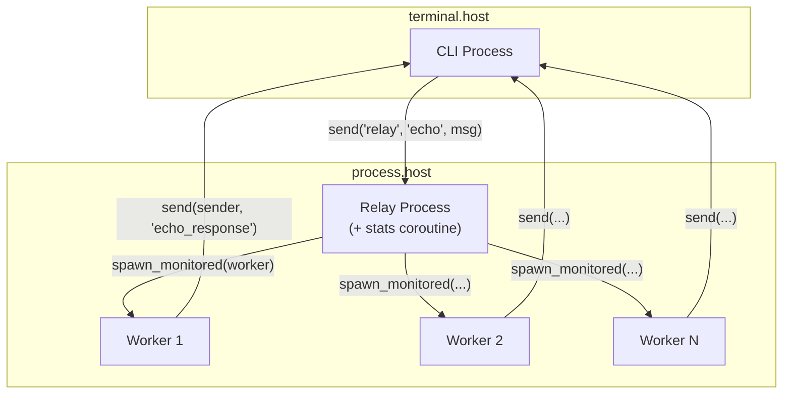

# Echo Service

Создание распределённого echo-сервиса, демонстрирующего процессы, каналы, корутины, обмен сообщениями и супервизию.

## Обзор

В этом руководстве создаётся CLI-клиент, отправляющий сообщения relay-сервису, который порождает воркеров для обработки каждого сообщения. Демонстрируются:

- **Порождение процессов** — динамическое создание дочерних процессов
- **Обмен сообщениями** — коммуникация между процессами через send/receive
- **Каналы и select** — мультиплексирование нескольких источников событий
- **Корутины** — параллельное выполнение внутри процесса
- **Регистрация процессов** — поиск процессов по имени
- **Мониторинг** — отслеживание жизненного цикла дочерних процессов

## Архитектура



## Структура проекта

```
echo-service/
├── wippy.lock
└── src/
    ├── _index.yaml
    ├── cli.lua
    ├── relay.lua
    └── worker.lua
```

## Определения записей

Создайте `src/_index.yaml`:

```yaml
version: "1.0"
namespace: app

entries:
  - name: terminal
    kind: terminal.host
    lifecycle:
      auto_start: true

  - name: processes
    kind: process.host
    lifecycle:
      auto_start: true

  - name: cli
    kind: process.lua
    source: file://cli.lua
    method: main
    modules:
      - io
      - process
      - time
      - channel

  - name: relay
    kind: process.lua
    source: file://relay.lua
    method: main
    modules:
      - process
      - logger
      - channel
      - time

  - name: relay-service
    kind: process.service
    process: app:relay
    host: app:processes
    lifecycle:
      auto_start: true

  - name: worker
    kind: process.lua
    source: file://worker.lua
    method: main
    modules:
      - process
      - time
```

## Процесс Relay

Relay регистрирует себя, обрабатывает сообщения, порождает воркеров и запускает корутину статистики.

Создайте `src/relay.lua`:

```lua
local logger = require("logger")
local time = require("time")

local stats = {
    messages = 0,
    workers_spawned = 0
}

local function stats_reporter()
    while true do
        time.sleep("5s")
        logger:info("stats", {
            messages = stats.messages,
            workers_spawned = stats.workers_spawned
        })
    end
end

local function main()
    local inbox = process.inbox()
    local events = process.events()

    process.registry.register("relay")
    logger:info("relay started", {pid = process.pid()})

    coroutine.spawn(stats_reporter)

    while true do
        local r = channel.select {
            inbox:case_receive(),
            events:case_receive()
        }

        if r.channel == events then
            local event = r.value
            if event.kind == process.event.EXIT then
                logger:info("worker exited", {
                    from = event.from,
                    result = event.result
                })
            end
        else
            local msg = r.value
            if msg:topic() == "echo" then
                local echo = msg:payload():data()
                stats.messages = stats.messages + 1

                local worker_pid, err = process.spawn_monitored(
                    "app:worker",
                    "app:processes",
                    echo.sender,
                    echo.data
                )

                if err then
                    logger:error("spawn failed", {error = err})
                else
                    stats.workers_spawned = stats.workers_spawned + 1
                end
            end
        end
    end
end

return { main = main }
```

### Ключевые паттерны {id="relay-key-patterns"}

**Порождение корутин**

```lua
coroutine.spawn(stats_reporter)
```

Создаёт параллельную корутину, разделяющую память с главной функцией. Корутины уступают выполнение на I/O-операциях вроде `time.sleep`.

**Channel Select**

```lua
local r = channel.select {
    inbox:case_receive(),
    events:case_receive()
}
```

Ожидает несколько каналов. `r.channel` указывает, какой сработал, `r.value` содержит данные.

**Извлечение payload**

```lua
local echo = msg:payload():data()
```

У сообщений есть `msg:topic()` для строки топика и `msg:payload():data()` для данных.

**Spawn с мониторингом**

```lua
local worker_pid, err = process.spawn_monitored("app:worker", "app:processes", ...)
```

Объединяет spawn и monitor. При завершении воркера мы получаем событие EXIT.

## Процесс Worker

Воркеры получают аргументы напрямую и отправляют ответы отправителю.

Создайте `src/worker.lua`:

```lua
local time = require("time")

local function main(sender_pid, data)
    time.sleep("100ms")

    local response = {
        data = string.upper(data),
        worker = process.pid()
    }

    process.send(sender_pid, "echo_response", response)

    return 0
end

return { main = main }
```

## Процесс CLI

CLI отправляет сообщения по зарегистрированному имени и ждёт ответа с таймаутом.

Создайте `src/cli.lua`:

```lua
local io = require("io")
local time = require("time")

local reset = "\027[0m"
local function dim(s) return "\027[2m" .. s .. reset end
local function green(s) return "\027[32m" .. s .. reset end
local function yellow(s) return "\027[33m" .. s .. reset end
local function cyan(s) return "\027[36m" .. s .. reset end

local function main()
    local inbox = process.inbox()

    -- Ждём регистрации relay
    time.sleep("200ms")

    io.print(cyan("Echo Client"))
    io.print(dim("Type messages to echo. Ctrl+C to exit.\n"))

    while true do
        io.write(yellow("> "))
        local input = io.readline()

        if not input or #input == 0 then
            break
        end

        local msg = {
            sender = process.pid(),
            data = input
        }
        local ok, err = process.send("relay", "echo", msg)
        if err then
            io.print(dim("  error: relay not available"))
        else
            local timeout = time.after("2s")
            local r = channel.select {
                inbox:case_receive(),
                timeout:case_receive()
            }

            if r.channel == timeout then
                io.print(dim("  timeout"))
            else
                local msg = r.value
                if msg:topic() == "echo_response" then
                    local resp = msg:payload():data()
                    io.print(green("  " .. resp.data))
                    io.print(dim("  from worker: " .. resp.worker))
                end
            end
        end
    end

    io.print("\nGoodbye!")
    return 0
end

return { main = main }
```

### Ключевые паттерны {id="cli-key-patterns"}

**Отправка по имени**

```lua
process.send("relay", "echo", msg)
```

`process.send` принимает зарегистрированные имена напрямую. Возвращает ошибку, если не найден.

**Паттерн таймаута**

```lua
local timeout = time.after("2s")
local r = channel.select {
    inbox:case_receive(),
    timeout:case_receive()
}
if r.channel == timeout then
    -- таймаут
end
```

## Запуск

```bash
wippy init
wippy run -x app:terminal/app:cli
```

Пример вывода:

```
Echo Client
Type messages to echo. Ctrl+C to exit.

> hello world
  HELLO WORLD
  from worker: {app:processes|0x00004}
```

## Сводка по концепциям

| Концепция | API |
|-----------|-----|
| Порождение процессов | `process.spawn_monitored(entry, host, ...)` |
| Обмен сообщениями | `process.send(dest, topic, data)` |
| Inbox | `process.inbox()` |
| События | `process.events()` |
| Регистрация | `process.registry.register(name)` |
| Channel select | `channel.select {...}` |
| Таймаут | `time.after(duration)` |
| Корутины | `coroutine.spawn(fn)` |

## Следующие шаги

- [Управление процессами](lua/core/process.md)
- [Каналы](lua/core/channel.md)
- [Время и длительности](lua/core/time.md)
