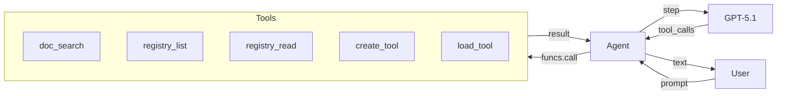
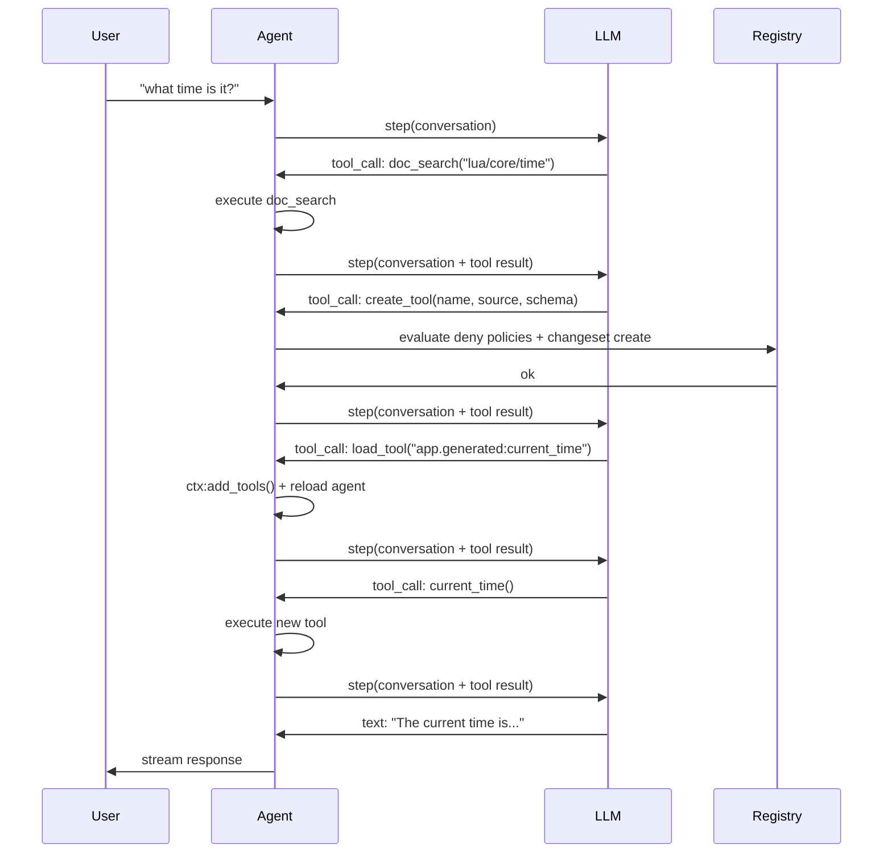
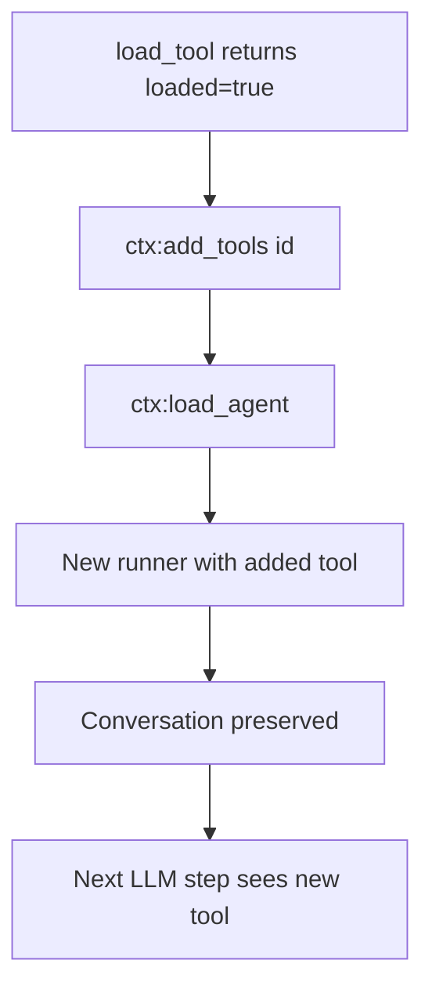
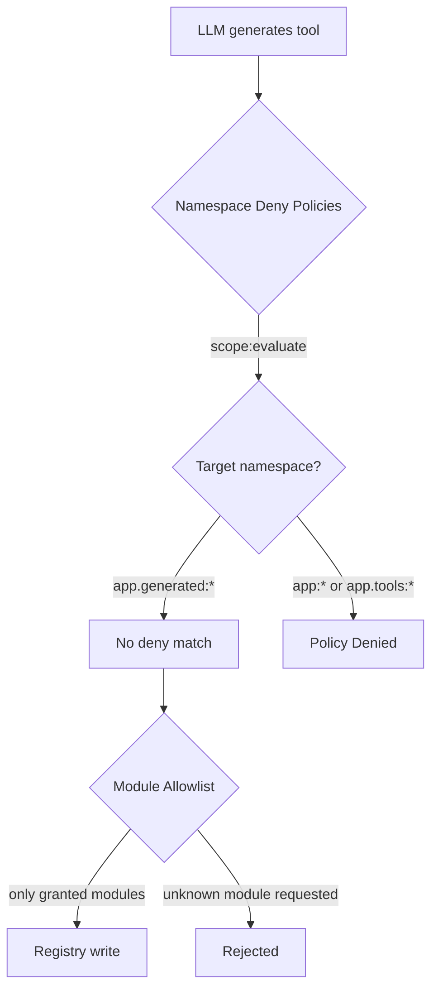

# Micro AGI

Создайте самомодифицирующегося агента, который создаёт собственные инструменты во время выполнения — читает документацию, пишет Lua, регистрирует записи в реестре и загружает их в активную сессию.

## Что мы строим

Терминальный агент, который:
- Отвечает на вопросы, используя LLM со стримингом
- Ищет документацию Wippy для изучения API
- Инспектирует реестр для обнаружения существующих возможностей
- Создаёт новые инструменты на лету, когда не хватает возможности
- Управляет собственным контекстным окном через сжатие



## Архитектура

Агент работает как процесс Wippy с доступом к реестру. Когда LLM решает, что ему нужна возможность, которой у него нет, он использует цикл самомодификации:



Ключевая идея: инструменты — это записи реестра. Создание инструмента — это просто запись `function.lua` с inline-исходником на Lua в `data.source`. Среда исполнения агента компилирует и загружает его как любую другую запись.

## Структура проекта

```
micro-agi/
├── .wippy.yaml
├── wippy.yaml
└── src/
    ├── _index.yaml
    ├── README.md
    ├── agent.lua
    └── tools/
        ├── _index.yaml
        ├── doc_search.lua
        ├── registry_list.lua
        ├── registry_read.lua
        ├── create_tool.lua
        └── load_tool.lua
```

## Инфраструктура

Создайте `.wippy.yaml`:

```yaml
version: "1.0"

logger:
  encoding: console
```

## Определения записей

Создайте `src/_index.yaml` с инфраструктурой, политиками безопасности, моделями, агентом и процессом:

```yaml
version: "1.0"
namespace: app

entries:
  - name: definition
    kind: ns.definition
    readme: file://README.md
    meta:
      title: Micro AGI
      description: Self-modifying development agent that builds its own tools at runtime
      depends_on: [wippy/llm, wippy/agent]

  - name: os_env
    kind: env.storage.os

  - name: processes
    kind: process.host
    lifecycle:
      auto_start: true

  - name: __dep.llm
    kind: ns.dependency
    component: wippy/llm
    version: "*"
    parameters:
      - name: env_storage
        value: app:os_env
      - name: process_host
        value: app:processes

  - name: __dep.agent
    kind: ns.dependency
    component: wippy/agent
    version: "*"
    parameters:
      - name: process_host
        value: app:processes
```

### Политики безопасности

Две записи `security.policy` ограничивают, в какие пространства имён агент может писать:

```yaml
  - name: deny_core_ns
    kind: security.policy
    policy:
      actions: "*"
      resources: "app:*"
      effect: deny
    groups:
      - agent_security

  - name: deny_tools_ns
    kind: security.policy
    policy:
      actions: "*"
      resources: "app.tools:*"
      effect: deny
    groups:
      - agent_security
```

Эти политики загружаются как именованная область (`app:agent_security`) функцией `create_tool` и вычисляются перед любой записью в реестр. Агент может писать в `app.generated:*` (нет совпадающих deny-политик), но не может писать в `app:*` (основные записи, модели, определение агента) или `app.tools:*` (встроенные инструменты).

См. [Модель безопасности](system/security.md) для подробностей о вычислении политик.

### Модели

Две модели служат разным целям:

```yaml
  - name: gpt-5.1
    kind: registry.entry
    meta:
      name: gpt-5.1
      type: llm.model
      title: GPT-5.1
      comment: Reasoning model
      capabilities: [generate, tool_use, structured_output, vision, thinking]
      class: [reasoning]
      priority: 210
    max_tokens: 128000
    output_tokens: 32768
    pricing:
      input: 2.5
      output: 10
    providers:
      - id: wippy.llm.openai:provider
        options:
          reasoning_model_request: true
        provider_model: gpt-5.1
    thinking_effort: 10

  - name: gpt-4.1-nano
    kind: registry.entry
    meta:
      name: gpt-4.1-nano
      type: llm.model
      title: GPT-4.1 Nano
      comment: Compression model
      capabilities: [generate, tool_use, structured_output]
      class: [fast]
      priority: 100
    max_tokens: 1047576
    output_tokens: 32768
    pricing:
      input: 0.1
      output: 0.4
    providers:
      - id: wippy.llm.openai:provider
        provider_model: gpt-4.1-nano
```

GPT-5.1 обрабатывает рассуждения и использование инструментов. GPT-4.1 Nano выполняет сжатие контекста при стоимости в 25 раз ниже.

### Определение агента

```yaml
  - name: dev_assistant
    kind: registry.entry
    meta:
      type: agent.gen1
      name: dev_assistant
      title: Dev Assistant
      comment: Wippy development assistant
    prompt: |
      Self-modifying Wippy development agent. You run inside Wippy runtime
      with access to docs, registry, and dynamic tool creation.

      Rules:
      - NEVER fabricate, guess, or hallucinate facts. If you need real data,
        use or build a tool to get it. Only state what a tool actually returned.
      - Maximum 2-3 sentences per response. No bullet lists. No disclaimers.
      - Never say "I can't" or "I don't have". Build the tool and do it.
      - Act first, explain only if asked.

      To gain new capabilities: doc_search the API, create_tool with Lua source,
      load_tool, call it. All in one turn.
    model: gpt-5.1
    max_tokens: 2048
    tools:
      - "app.tools:*"
```

Промпт намеренно лаконичен. Ключевые правила:
- **Никаких галлюцинаций** — агент должен использовать инструменты для получения реальных данных
- **Самомодификация** — создавать инструменты вместо отказа
- **Действие важнее объяснения** — сначала действуй, объясняй, если попросят

### Процесс

```yaml
  - name: agent
    kind: process.lua
    meta:
      command:
        name: agent
        short: Start dev assistant
    source: file://agent.lua
    method: main
    modules: [io, json, process, funcs, registry, time, security]
    imports:
      prompt: wippy.llm:prompt
      agent_context: wippy.agent:context
      compress: wippy.llm.util:compress
```

Процесс запускается как терминальная команда. Контроль безопасности выполняется внутри `create_tool`, который загружает группу политик `agent_security` и вычисляет её перед записью.

Импорты:
- `prompt` — построитель диалога
- `agent_context` — загрузка агента и динамическое управление инструментами
- `compress` — сжатие текста на основе LLM для управления контекстом

## Инструменты

Создайте `src/tools/_index.yaml` с пятью инструментами:

### doc_search

Получает документацию Wippy через API `wippy.ai/llm`. Поддерживает два режима: получение страницы по пути или поиск по запросу.

```lua
local http_client = require("http_client")
local json = require("json")

local BASE_URL = "https://wippy.ai/llm"
local MAX_CHARS = 8000

local function fetch_page(path)
    local url = BASE_URL .. "/path/en/" .. path
    local resp, err = http_client.get(url, {
        headers = { ["User-Agent"] = "wippy-agent/1.0" },
    })
    if err then
        return nil, tostring(err)
    end
    if resp.status_code ~= 200 then
        return nil, "HTTP " .. resp.status_code
    end

    local body = resp.body or ""
    if #body > MAX_CHARS then
        body = body:sub(1, MAX_CHARS) .. "\n... (truncated)"
    end
    return body, nil
end

local function search_docs(query)
    local url = BASE_URL .. "/search?q=" .. query
    local resp, err = http_client.get(url, {
        headers = { ["User-Agent"] = "wippy-agent/1.0" },
    })
    if err then
        return { error = tostring(err) }
    end
    if resp.status_code ~= 200 then
        return { error = "HTTP " .. resp.status_code }
    end

    local body = resp.body or ""
    if #body > MAX_CHARS then
        body = body:sub(1, MAX_CHARS) .. "\n... (truncated)"
    end

    return { results = body }
end

local function handler(input)
    if input.path then
        local content, err = fetch_page(input.path)
        if err then
            return { error = err }
        end
        return { path = input.path, content = content }
    end

    if input.query then
        return search_docs(input.query)
    end

    return { error = "provide either 'path' or 'query'" }
end

return { handler = handler }
```

### create_tool

Ядро самомодификации. Вычисляет deny-политики пространств имён и создаёт запись `function.lua` в реестре с inline-исходником на Lua.

Поле `modules` сгенерированной записи контролирует, к чему может обращаться инструмент. Модули, не указанные в списке, просто не существуют для этой записи — нечего блокировать или сканировать.

```lua
local registry = require("registry")
local json = require("json")
local security = require("security")

local NAMESPACE = "app.generated"
local MAX_SOURCE_LEN = 16000
local MAX_NAME_LEN = 64

local ALLOWED_MODULES = {
    time = true, json = true, http_client = true, expr = true,
    text = true, base64 = true, yaml = true, crypto = true,
    hash = true, uuid = true, url = true,
}
```

**Вычисление политик** — `create_tool` загружает именованную область `agent_security` и вычисляет deny-политики для целевого ID записи. Запись в `app:*` или `app.tools:*` запрещена; запись в `app.generated:*` проходит (нет совпадающей deny-политики):

```lua
local actor = security.new_actor("service:agent", { role = "agent" })
local scope, scope_err = security.named_scope("app:agent_security")
if scope_err then
    return { error = "failed to load security scope: " .. tostring(scope_err) }
end

local result = scope:evaluate(actor, action, id)
if result == "deny" then
    return { error = "policy denied: " .. action .. " on " .. id }
end
```

**Запись в реестр** — запись пишется с исходником в `data.source` и только с разрешёнными модулями:

```lua
local entry = {
    id = id,
    kind = "function.lua",
    meta = {
        type = "tool",
        title = input.name,
        comment = input.description,
        input_schema = schema,
        llm_alias = input.name,
        llm_description = input.description,
    },
    data = {
        source = input.source,
        modules = modules,
        method = "handler",
    },
}

local snap = registry.snapshot()
local changes = snap:changes()
if existing then
    changes:update(entry)
else
    changes:create(entry)
end
changes:apply()
```

Никаких файлов на диске. Инструмент полностью живёт в реестре.

### load_tool

Проверяет, что запись является инструментом, и сигнализирует циклу агента о перезагрузке:

```lua
local function handler(input)
    local entry, err = registry.get(input.id)
    if err then
        return { error = tostring(err) }
    end
    if not entry then
        return { error = "not found: " .. input.id }
    end
    if not entry.meta or entry.meta.type ~= "tool" then
        return { error = "not a tool (meta.type != 'tool'): " .. input.id }
    end

    return {
        loaded = true,
        id = entry.id,
        alias = entry.meta.llm_alias or input.id,
        description = entry.meta.llm_description or "",
    }
end
```

Цикл агента обнаруживает `loaded = true` в результате и вызывает `ctx:add_tools(id)`, после чего `ctx:load_agent()`, чтобы перекомпилировать агента с новым инструментом.

## Цикл агента

Цикл агента в `src/agent.lua` обрабатывает стриминг, выполнение инструментов, динамическую загрузку и сжатие контекста.

### Стриминг

Использует тот же паттерн «coroutine + channel» из [туториала LLM Agent](tutorials/llm-agent.md):

```lua
coroutine.spawn(function()
    local response, err = session.runner:step(session.conversation, {
        stream_target = {
            reply_to = process.pid(),
            topic = STREAM_TOPIC,
        },
    })
    done_ch:send({ response = response, err = err })
end)
```

### Выполнение инструментов

Инструменты вызываются через `funcs.call()` с `pcall` для безопасности:

```lua
local ok, result = pcall(funcs.call, tc.registry_id, args)
```

### Динамическая загрузка инструментов

Когда `load_tool` возвращает `loaded = true`, агент перезагружает себя:



```lua
local function handle_tool_loading(tool_calls, results)
    local reload_needed = false
    for _, tc in ipairs(tool_calls) do
        if tc.name == "load_tool" then
            local result = results[tc.id]
            if result and result.loaded then
                session.ctx:add_tools(result.id)
                reload_needed = true
            end
        end
    end
    if reload_needed then
        reload_agent()
    end
end
```

Диалог сохраняется между перезагрузками, потому что он живёт в построителе промптов, а не в runner-е.

### Сжатие контекста

Когда токены промпта превышают 96K (75% от контекстного окна 128K), диалог сжимается с помощью GPT-4.1 Nano:

```lua
if response.tokens and response.tokens.prompt_tokens
    and response.tokens.prompt_tokens > PROMPT_TOKEN_LIMIT then
    try_compress()
end
```

Сжатие извлекает содержимое сообщений, вызывает `compress.to_size()` с целью в 4000 символов и заменяет диалог сводкой:

```lua
local summary = compress.to_size(COMPRESS_MODEL, full_text, COMPRESS_TARGET)
session.conversation = prompt.new()
session.conversation:add_system("Conversation summary:\n\n" .. summary)
```

## Модель безопасности

Агент защищён через deny-политики пространств имён и контроль доступа на уровне модулей.



### Deny-политики пространств имён

| Политика | Ресурсы | Эффект |
|--------|-----------|--------|
| `deny_core_ns` | `app:*` | deny |
| `deny_tools_ns` | `app.tools:*` | deny |

`create_tool` загружает группу политик `agent_security` и вычисляет её для целевого ID записи. Поскольку deny-политики совпадают только с `app:*` и `app.tools:*`, записи в `app.generated:*` проходят (результат — `undefined`, что означает «не запрещено»).

Это не позволяет агенту:
- Изменять собственный промпт или определение агента (`app:dev_assistant`)
- Перезаписывать встроенные инструменты (`app.tools:*`)
- Изменять инфраструктурные записи (`app:processes` и т. д.)

### Контроль доступа к модулям

Сгенерированные инструменты объявляют свои `modules` в `data.modules`. Разрешены только модули из набора `ALLOWED_MODULES`. Среда исполнения Wippy обеспечивает это на уровне модулей — если модуль не указан в записи, `require()` возвращает ошибку. Сканирования исходного кода нет, потому что нечего сканировать: модули, не предоставленные в контексте выполнения, не существуют.

## Запуск

Запуск напрямую из hub:

```bash
wippy run wippy/micro-agi agent
```

Или клонирование и локальный запуск:

```bash
cd micro-agi
wippy init && wippy update
wippy run agent
```

```
dev assistant (quit to exit)

> what time is it?
  [doc_search] ok
  [create_tool] ok
  [load_tool] ok
  [+] app.generated:current_time_utc
  [current_time_utc] ok
The current UTC time is 2026-02-13T03:13:41Z.

> fetch https://httpbin.org/get and show my ip
  [create_tool] ok
  [load_tool] ok
  [+] app.generated:http_get
  [http_get] ok
Your IP is 203.0.113.42.
```

## Следующие шаги

- [LLM Agent](tutorials/llm-agent.md) — Создание базового агента с нуля
- [Модуль Agent](framework/agents.md) — Справочник фреймворка агентов
- [Реестр](concepts/registry.md) — Как работает реестр
- [Модель безопасности](system/security.md) — Декларативные политики безопасности
- [Виды записей](guides/entry-kinds.md) — Доступные типы записей
