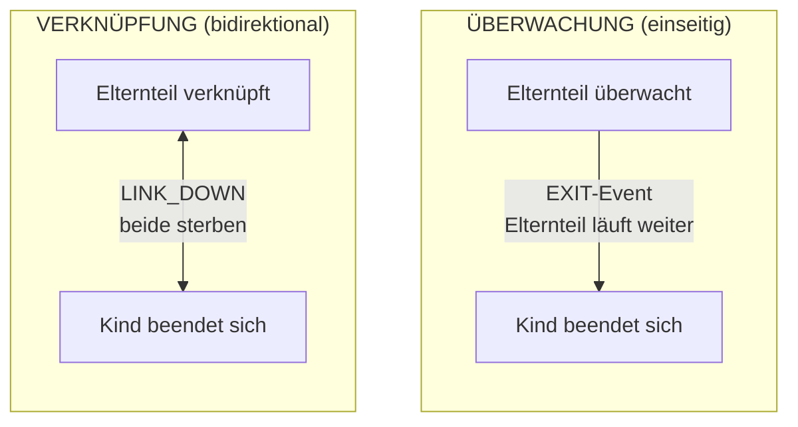

# Prozess-Supervision

Prozesse überwachen und verknüpfen, um fehlertolerante Systeme aufzubauen.

## Überwachung vs. Verknüpfung

**Überwachung** bietet einseitige Beobachtung:
- Elternteil überwacht Kind
- Kind beendet sich, Elternteil erhält EXIT-Event
- Elternteil läuft weiter

**Verknüpfung** erzeugt bidirektionales Schicksal:
- Elternteil und Kind sind verknüpft
- Entweder Prozess schlägt fehl, beide werden beendet
- Außer wenn `trap_links=true` gesetzt ist



## Prozessüberwachung

### Spawn mit Überwachung

`process.spawn_monitored()` verwenden, um in einem Aufruf zu spawnen und zu überwachen:

```lua
local function main()
    local events_ch = process.events()

    -- Worker spawnen und Überwachung starten
    local worker_pid, err = process.spawn_monitored(
        "app.workers:task_worker",
        "app:processes"
    )
    if err then
        return nil, "spawn failed: " .. tostring(err)
    end

    -- Auf Abschluss des Workers warten
    local event = events_ch:receive()

    if event.kind == process.event.EXIT then
        print("Worker exited:", event.from)
        if event.result then
            print("Result:", event.result.value)
        end
        if event.result and event.result.error then
            print("Error:", event.result.error)
        end
    end
end
```

### Bestehenden Prozess überwachen

`process.monitor()` aufrufen, um einen bereits laufenden Prozess zu überwachen:

```lua
local function main()
    local time = require("time")
    local events_ch = process.events()

    -- Ohne Überwachung spawnen
    local worker_pid, err = process.spawn(
        "app.workers:long_worker",
        "app:processes"
    )
    if err then
        return nil, "spawn failed: " .. tostring(err)
    end

    -- Überwachung später starten
    local ok, monitor_err = process.monitor(worker_pid)
    if monitor_err then
        return nil, "monitor failed: " .. tostring(monitor_err)
    end

    -- Worker kanzellieren
    time.sleep("5ms")
    process.cancel(worker_pid)

    -- EXIT-Event empfangen
    local event = events_ch:receive()
    if event.kind == process.event.EXIT then
        print("Worker terminated:", event.from)
    end
end
```

### Überwachung beenden

`process.unmonitor()` verwenden, um keine EXIT-Events mehr zu empfangen:

```lua
local function main()
    local time = require("time")
    local events_ch = process.events()

    -- Spawnen und überwachen
    local worker_pid, err = process.spawn_monitored(
        "app.workers:long_worker",
        "app:processes"
    )

    time.sleep("5ms")

    -- Überwachung beenden
    local ok, unmon_err = process.unmonitor(worker_pid)
    if unmon_err then
        return nil, "unmonitor failed: " .. tostring(unmon_err)
    end

    -- Worker kanzellieren
    process.cancel(worker_pid)

    -- Kein EXIT-Event wird empfangen (Überwachung beendet)
    local timeout = time.after("200ms")
    local result = channel.select {
        events_ch:case_receive(),
        timeout:case_receive(),
    }

    if result.channel == events_ch then
        return nil, "should not receive event after unmonitor"
    end
end
```

## Prozessverknüpfung

### Explizite Verknüpfung

`process.link()` verwenden, um eine bidirektionale Verknüpfung herzustellen:

```lua
-- Worker, der sich mit einem Zielprozess verknüpft
local function worker_main()
    local time = require("time")
    local events_ch = process.events()
    local inbox_ch = process.inbox()

    -- trap_links aktivieren, um LINK_DOWN-Events zu empfangen
    process.set_options({ trap_links = true })

    -- Ziel-PID vom Absender empfangen
    local msg = inbox_ch:receive()
    local target_pid = msg:payload():data()
    local sender = msg:from()

    -- Bidirektionale Verknüpfung herstellen
    local ok, err = process.link(target_pid)
    if err then
        return nil, "link failed: " .. tostring(err)
    end

    -- Absender benachrichtigen, dass wir verknüpft sind
    process.send(sender, "linked", process.pid())

    -- Auf LINK_DOWN warten, wenn Ziel endet
    local timeout = time.after("3s")
    local result = channel.select {
        events_ch:case_receive(),
        timeout:case_receive(),
    }

    if result.channel == events_ch then
        local event = result.value
        if event.kind == process.event.LINK_DOWN then
            return "LINK_DOWN_RECEIVED"
        end
    end

    return nil, "no LINK_DOWN received"
end
```

### Spawn mit Verknüpfung

`process.spawn_linked()` verwenden, um in einem Aufruf zu spawnen und zu verknüpfen:

```lua
local function parent_main()
    -- trap_links aktivieren, um den Tod des Kindes zu verarbeiten
    process.set_options({ trap_links = true })

    local events_ch = process.events()

    -- Kind spawnen und verknüpfen
    local child_pid, err = process.spawn_linked(
        "app.workers:child_worker",
        "app:processes"
    )
    if err then
        return nil, "spawn_linked failed: " .. tostring(err)
    end

    -- Wenn Kind stirbt, erhalten wir LINK_DOWN
    local event = events_ch:receive()
    if event.kind == process.event.LINK_DOWN then
        print("Child died:", event.from)
    end
end
```

## Trap Links

Standardmäßig schlägt der aktuelle Prozess fehl, wenn ein verknüpfter Prozess fehlschlägt. `trap_links=true` setzen, um stattdessen LINK_DOWN-Events zu empfangen.

### Standardverhalten (trap_links=false)

Ohne `trap_links` beendet ein Fehlschlag des verknüpften Prozesses den aktuellen Prozess:

```lua
local function worker_main()
    local events_ch = process.events()

    -- trap_links ist standardmäßig false
    local opts = process.get_options()
    print("trap_links:", opts.trap_links)  -- false

    -- Verknüpften Worker spawnen, der fehlschlagen wird
    local child_pid, err = process.spawn_linked(
        "app.workers:error_worker",
        "app:processes"
    )

    -- Wenn Kind fehlschlägt, wird DIESER Prozess beendet
    -- Wir erreichen diesen Punkt nie
    local event = events_ch:receive()
end
```

### Mit trap_links=true

`trap_links` aktivieren, um LINK_DOWN-Events zu empfangen und zu überleben:

```lua
local function worker_main()
    -- trap_links aktivieren
    process.set_options({ trap_links = true })

    local events_ch = process.events()

    -- Verknüpften Worker spawnen, der fehlschlagen wird
    local child_pid, err = process.spawn_linked(
        "app.workers:error_worker",
        "app:processes"
    )

    -- Auf LINK_DOWN-Event warten
    local event = events_ch:receive()

    if event.kind == process.event.LINK_DOWN then
        print("Child failed, handling gracefully")
        return "LINK_DOWN_RECEIVED"
    end
end
```

## Kanzellierung

### Kanzellierungssignal senden

`process.cancel()` verwenden, um einen Prozess ordnungsgemäß zu beenden:

```lua
local function main()
    local time = require("time")
    local events_ch = process.events()

    -- Worker spawnen und überwachen
    local worker_pid, err = process.spawn_monitored(
        "app.workers:long_worker",
        "app:processes"
    )

    time.sleep("5ms")

    -- Worker kanzellieren
    local ok, cancel_err = process.cancel(worker_pid)
    if cancel_err then
        return nil, "cancel failed: " .. tostring(cancel_err)
    end

    -- Auf EXIT-Event warten
    local event = events_ch:receive()
    if event.kind == process.event.EXIT then
        print("Worker cancelled:", event.from)
    end
end
```

### Kanzellierung verarbeiten

Worker empfängt CANCEL-Event über `process.events()`:

```lua
local function worker_main()
    local events_ch = process.events()
    local inbox_ch = process.inbox()

    while true do
        local result = channel.select {
            inbox_ch:case_receive(),
            events_ch:case_receive(),
        }

        if result.channel == events_ch then
            local event = result.value
            if event.kind == process.event.CANCEL then
                -- Ressourcen bereinigen
                cleanup()
                return "cancelled gracefully"
            end
        else
            -- Inbox-Nachricht verarbeiten
            handle_message(result.value)
        end
    end
end
```

## Supervisions-Topologien

### Stern-Topologie

Elternteil mit mehreren Kindern, die sich zurück mit ihm verknüpfen:

```lua
-- Eltern-Worker spawnt Kinder, die sich mit dem Elternteil verknüpfen
local function star_parent_main()
    local time = require("time")
    local events_ch = process.events()
    local child_count = 10

    -- trap_links aktivieren, um den Tod der Kinder zu sehen
    process.set_options({ trap_links = true })

    local children = {}

    -- Kinder spawnen
    for i = 1, child_count do
        local child_pid, err = process.spawn(
            "app.workers:linker_child",
            "app:processes"
        )
        if err then
            error("spawn child failed: " .. tostring(err))
        end

        -- Eltern-PID an Kind senden
        process.send(child_pid, "inbox", process.pid())
        children[child_pid] = true
    end

    -- Warten, bis alle Kinder Verknüpfung bestätigen
    for i = 1, child_count do
        local msg = process.inbox():receive()
        if msg:topic() ~= "linked" then
            error("expected linked confirmation")
        end
    end

    -- Fehler auslösen - alle Kinder sollten LINK_DOWN erhalten
    error("PARENT_STAR_FAILURE")
end
```

Kind-Worker, der sich mit dem Elternteil verknüpft:

```lua
local function linker_child_main()
    local events_ch = process.events()
    local inbox_ch = process.inbox()

    -- Eltern-PID empfangen
    local msg = inbox_ch:receive()
    local parent_pid = msg:payload():data()

    -- Mit Elternteil verknüpfen
    process.link(parent_pid)

    -- Verknüpfung bestätigen
    process.send(parent_pid, "linked", process.pid())

    -- Auf LINK_DOWN warten, wenn Elternteil stirbt
    local event = events_ch:receive()
    if event.kind == process.event.LINK_DOWN then
        return "parent_died"
    end
end
```

### Ketten-Topologie

Lineare Kette, bei der jeder Knoten sich mit seinem Elternteil verknüpft:

```lua
-- Kettenwurzel: A -> B -> C -> D -> E
local function chain_root_main()
    local time = require("time")

    -- Erstes Kind spawnen
    local child_pid, err = process.spawn_linked(
        "app.workers:chain_node",
        "app:processes",
        4  -- verbleibende Tiefe
    )
    if err then
        error("spawn failed: " .. tostring(err))
    end

    -- Warten, bis Kette aufgebaut ist
    time.sleep("100ms")

    -- Kaskade auslösen - alle verknüpften Prozesse sterben
    error("CHAIN_ROOT_FAILURE")
end
```

Kettenknoten spawnt nächsten Knoten und verknüpft sich:

```lua
local function chain_node_main(depth)
    local time = require("time")

    if depth > 0 then
        -- Nächsten in der Kette spawnen
        local child_pid, err = process.spawn_linked(
            "app.workers:chain_node",
            "app:processes",
            depth - 1
        )
        if err then
            error("spawn failed: " .. tostring(err))
        end
    end

    -- Blockieren bis Tod des Elternteils uns über LINK_DOWN beendet (Standard trap_links=false)
    process.inbox():receive()
end
```

## Worker-Pool mit Supervision

### Konfiguration

```yaml
# src/_index.yaml
version: "1.0"
namespace: app

entries:
  - name: processes
    kind: process.host
    host:
      workers: 16
    lifecycle:
      auto_start: true
```

```yaml
# src/supervisor/_index.yaml
version: "1.0"
namespace: app.supervisor

entries:
  - name: pool
    kind: process.lua
    source: file://pool.lua
    method: main
    modules:
      - time
    lifecycle:
      auto_start: true
```

### Supervisor-Implementierung

```lua
-- src/supervisor/pool.lua
local function main(worker_count)
    local time = require("time")
    worker_count = worker_count or 4

    -- trap_links aktivieren, um Worker-Tode zu verarbeiten
    process.set_options({ trap_links = true })

    local events_ch = process.events()
    local workers = {}

    local function start_worker(id)
        local pid, err = process.spawn_linked(
            "app.workers:task_worker",
            "app:processes",
            id
        )
        if err then
            print("Failed to start worker " .. id .. ": " .. tostring(err))
            return nil
        end

        workers[pid] = {id = id, started_at = os.time()}
        print("Worker " .. id .. " started: " .. pid)
        return pid
    end

    -- Initialen Pool starten
    for i = 1, worker_count do
        start_worker(i)
    end

    print("Supervisor started with " .. worker_count .. " workers")

    -- Supervision-Schleife
    while true do
        local timeout = time.after("60s")
        local result = channel.select {
            events_ch:case_receive(),
            timeout:case_receive(),
        }

        if result.channel == timeout then
            -- Periodischer Health-Check
            local count = 0
            for _ in pairs(workers) do count = count + 1 end
            print("Health check: " .. count .. " active workers")

        elseif result.channel == events_ch then
            local event = result.value

            if event.kind == process.event.LINK_DOWN then
                local dead_worker = workers[event.from]
                if dead_worker then
                    workers[event.from] = nil
                    local uptime = os.time() - dead_worker.started_at
                    print("Worker " .. dead_worker.id .. " died after " .. uptime .. "s, restarting")

                    -- Kurze Verzögerung vor Neustart
                    time.sleep("100ms")
                    start_worker(dead_worker.id)
                end
            end
        end
    end
end

return { main = main }
```

## Prozesskonfiguration

### Worker-Definition

```yaml
# src/workers/_index.yaml
version: "1.0"
namespace: app.workers

entries:
  - name: task_worker
    kind: process.lua
    source: file://task_worker.lua
    method: main
    modules:
      - time
```

### Worker-Implementierung

```lua
-- src/workers/task_worker.lua
local function main(worker_id)
    local time = require("time")
    local events_ch = process.events()
    local inbox_ch = process.inbox()

    print("Task worker " .. worker_id .. " started")

    while true do
        local timeout = time.after("5s")
        local result = channel.select {
            inbox_ch:case_receive(),
            events_ch:case_receive(),
            timeout:case_receive(),
        }

        if result.channel == events_ch then
            local event = result.value
            if event.kind == process.event.CANCEL then
                print("Worker " .. worker_id .. " cancelled")
                return "cancelled"
            elseif event.kind == process.event.LINK_DOWN then
                print("Worker " .. worker_id .. " linked process died")
                return nil, "linked_process_died"
            end

        elseif result.channel == inbox_ch then
            local msg = result.value
            local topic = msg:topic()
            local payload = msg:payload():data()

            if topic == "work" then
                print("Worker " .. worker_id .. " processing: " .. payload)
                time.sleep("100ms")
                process.send(msg:from(), "result", "completed: " .. payload)
            end

        elseif result.channel == timeout then
            -- Leerlauf-Timeout
            print("Worker " .. worker_id .. " idle")
        end
    end
end

return { main = main }
```

## Prozess-Host-Konfiguration

Der Prozess-Host steuert, wie viele OS-Threads Prozesse ausführen:

```yaml
# src/_index.yaml
version: "1.0"
namespace: app

entries:
  - name: processes
    kind: process.host
    host:
      workers: 16  # Anzahl OS-Threads
    lifecycle:
      auto_start: true
```

Workers-Einstellung:
- Steuert Parallelität für CPU-gebundene Arbeit
- Typischerweise auf die Anzahl der CPU-Kerne gesetzt
- Alle Prozesse teilen diesen Thread-Pool

## Ereignistypen

| Ereignis | Ausgelöst durch | Erforderliche Einrichtung |
|----------|-----------------|--------------------------|
| `EXIT` | Überwachter Prozess beendet sich | `spawn_monitored()` oder `monitor()` |
| `LINK_DOWN` | Verknüpfter Prozess schlägt fehl | `spawn_linked()` oder `link()` mit `trap_links=true` |
| `CANCEL` | `process.cancel()` aufgerufen | Keine (immer zugestellt) |

## Den Supervisor-Pool ausführen

Die Pool-Dateien in die in [Konfiguration](#konfiguration) gezeigte Struktur ablegen, dann:

```bash
wippy init
wippy run
```

Der Supervisor startet automatisch, spawnt vier Worker und protokolliert Neustarts, wenn einer davon stirbt. Einen Neustart auslösen, indem ein Worker aus einem anderen Prozess beendet wird:

```lua
-- in einem Ad-hoc-Prozess oder Chat-Befehl
process.cancel("<pid-from-supervisor-log>")
```

Der Pool empfängt `LINK_DOWN`, wartet 100 ms und respawnt den Worker unter derselben ID.

## Nächste Schritte

- [Prozesse](tutorials/processes.md) - Prozessgrundlagen
- [Channels](tutorials/channels.md) - Nachrichtenübergabemuster
- [Prozess-Modul](lua/core/process.md) - API-Referenz
