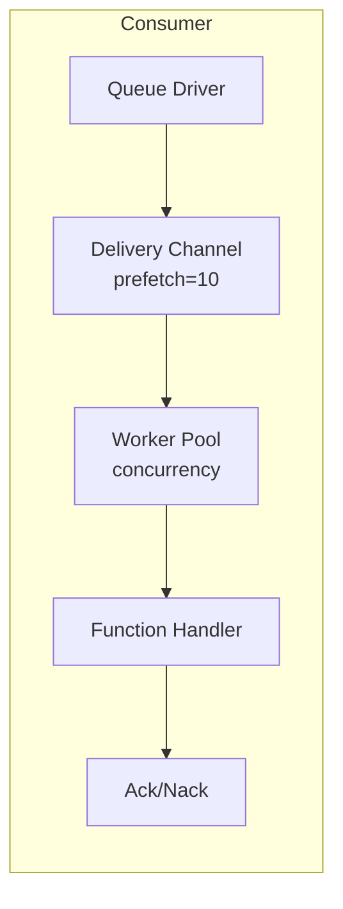

# Queue Consumers

Queue consumers process messages from queues using worker pools.

## Overview



## Configuration

| Option | Default | Max | Description |
|--------|---------|-----|-------------|
| `queue` | Required | - | Queue registry ID |
| `func` | Required | - | Handler function registry ID |
| `concurrency` | 1 | 1000 | Worker count |
| `prefetch` | 10 | 10000 | Message buffer size |
| `auto_ack` | false | - | Ack automatically before running the handler |
| `driver_options` | `{}` | - | Driver-specific consumer options |

## Entry Definition

```yaml
- name: order_consumer
  kind: queue.consumer
  queue: app:orders
  func: app:process_order
  concurrency: 5
  prefetch: 20
  lifecycle:
    auto_start: true
    depends_on:
      - app:orders
```

## Handler Function

The handler function receives the message body:

```lua
-- process_order.lua
local json = require("json")

local function handler(body)
    local order = json.decode(body)

    -- Process the order
    local result, err = process_order(order)
    if err then
        -- Return error to trigger Nack (requeue)
        return nil, err
    end

    -- Success triggers Ack
    return result
end

return handler
```

```yaml
- name: process_order
  kind: function.lua
  source: file://process_order.lua
  modules:
    - json
```

## Acknowledgment

| Result | Action | Effect |
|--------|--------|--------|
| Success | Ack | Message removed from queue |
| Error | Nack | Message requeued (driver-dependent) |

## Worker Pool

- Workers run as concurrent goroutines
- Each worker processes one message at a time
- Workers pull from a shared delivery channel; whichever worker is idle receives the next message (no guaranteed ordering or rotation across workers)
- Prefetch buffer allows driver to deliver ahead

### Example

```
concurrency: 3
prefetch: 10

Flow:
1. Driver delivers up to 10 messages to buffer
2. 3 workers pull from buffer concurrently
3. As workers finish, buffer refills
4. Backpressure when all workers busy and buffer full
```

## Graceful Shutdown

On stop:
1. Stop accepting new deliveries
2. Cancel worker contexts
3. Wait for in-flight messages (with timeout)
4. Return timeout error if workers don't finish

## Queue Declaration

```yaml
# Queue driver (memory for dev/test)
- name: queue_driver
  kind: queue.driver.memory
  lifecycle:
    auto_start: true

# Queue definition
- name: orders
  kind: queue.queue
  driver: app:queue_driver
  queue_name: orders        # Override name (default: entry name)
  codec: json               # Payload codec (optional)
  dead_letter:              # Dead-letter handling (optional)
    queue: app:dlq
    max_attempts: 5
  driver_options:
    memory:
      max_length: 10000     # Memory driver: bounded queue size
```

| Field | Description |
|-------|-------------|
| `queue_name` | Override queue name (default: entry ID name) |
| `codec` | Payload codec name |
| `dead_letter.queue` | Registry ID of dead-letter queue |
| `dead_letter.max_attempts` | Max delivery attempts before routing to DLQ |
| `driver_options` | Driver-specific settings keyed by driver name |

<note>
Dead-letter routing is driver-dependent. The runtime does not translate the dead_letter block into AMQP arguments. Dead-letter routing occurs only if a dead-letter exchange is configured directly on the broker (outside Wippy); the memory driver does not route to a DLQ.
</note>

## Memory Driver

Built-in in-memory queue for development/testing:

- Kind: `queue.driver.memory`
- Messages stored in memory
- Nack re-enqueues the message to the tail of the queue
- No persistence across restarts

## See Also

- [Message Queue](lua/storage/queue.md) - Queue module reference
- [Queue Configuration](system/queue.md) - Queue drivers and entry definitions
- [Supervision Trees](guides/supervision.md) - Consumer lifecycle
- [Process Management](lua/core/process.md) - Process spawning and communication
