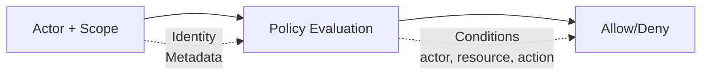

# Modelo de Seguridad

Wippy implementa control de acceso basado en atributos. Cada solicitud lleva un actor (quién) y un scope (qué políticas aplican). Las políticas evalúan el acceso basándose en la acción, el recurso y los metadatos tanto del actor como del recurso.



## Tipos de Entrada

| Tipo | Descripción |
|------|-------------|
| `security.policy` | Política declarativa con condiciones |
| `security.policy.expr` | Política basada en expresiones |
| `security.token_store` | Almacenamiento y validación de tokens |

## Actores

Un actor representa quién está realizando una acción.

```lua
local security = require("security")

-- Crear actor con metadatos
local actor = security.new_actor("user:123", {
    role = "admin",
    team = "backend",
    department = "engineering",
    clearance = 3
})

-- Acceder a propiedades del actor
local id = actor:id()        -- "user:123"
local meta = actor:meta()    -- {role="admin", ...}
```

### Actor en el Contexto

```lua
-- Obtener el actor actual desde el contexto
local actor = security.actor()
if not actor then
    return nil, errors.new("UNAUTHORIZED", "No actor in context")
end
```

## Políticas

Las políticas definen reglas de acceso con acciones, recursos, condiciones y efectos.

### Política Declarativa

```yaml
# src/security/_index.yaml
version: "1.0"
namespace: app.security

entries:
  # Acceso total de administrador
  - name: admin_policy
    kind: security.policy
    policy:
      actions: "*"
      resources: "*"
      effect: allow
      conditions:
        - field: actor.meta.role
          operator: eq
          value: admin
    groups:
      - admin

  # Acceso solo de lectura
  - name: readonly_policy
    kind: security.policy
    policy:
      actions:
        - "*.read"
        - "*.get"
        - "*.list"
      resources: "*"
      effect: allow
    groups:
      - default

  # Acceso del propietario del recurso
  - name: owner_policy
    kind: security.policy
    policy:
      actions:
        - read
        - write
        - delete
      resources: "document:*"
      effect: allow
      conditions:
        - field: meta.owner
          operator: eq
          value_from: actor.id
    groups:
      - default

  # Denegar confidencial sin nivel de autorización
  - name: deny_confidential
    kind: security.policy
    policy:
      actions: "*"
      resources: "document:*"
      effect: deny
      conditions:
        - field: meta.classification
          operator: eq
          value: confidential
        - field: actor.meta.clearance
          operator: lt
          value: 3
    groups:
      - security
```

### Estructura de Política

```yaml
policy:
  actions: "*" | "action" | ["action1", "action2"]
  resources: "*" | "resource" | ["res1", "res2"]
  effect: allow | deny
  conditions:  # Opcional
    - field: "field.path"
      operator: "eq"
      value: "static_value"
      # O
      value_from: "other.field.path"
```

### Política Basada en Expresiones

Para lógica compleja, use políticas de expresión:

```yaml
- name: flexible_access
  kind: security.policy.expr
  policy:
    actions:
      - read
      - write
    resources: "file:*"
    effect: allow
    expression: |
      (actor.meta.role == "editor" && action == "write") ||
      (action == "read" && meta.public == true) ||
      actor.id == meta.owner
  groups:
    - editors
```

## Condiciones

Las condiciones permiten la evaluación dinámica de políticas basada en actor, acción, recurso y metadatos.

### Rutas de Campo

| Ruta | Descripción |
|------|-------------|
| `actor.id` | Identificador único del actor |
| `actor.meta.*` | Metadatos del actor (admite anidamiento) |
| `action` | La acción que se está realizando |
| `resource` | El identificador del recurso |
| `meta.*` | Metadatos del recurso |

### Operadores

| Operador | Descripción | Ejemplo |
|----------|-------------|---------|
| `eq` | Igual | `actor.meta.role eq "admin"` |
| `ne` | No igual | `meta.status ne "deleted"` |
| `lt` | Menor que | `meta.priority lt 5` |
| `gt` | Mayor que | `actor.meta.clearance gt 2` |
| `lte` | Menor o igual | `meta.size lte 1000` |
| `gte` | Mayor o igual | `actor.meta.level gte 3` |
| `in` | Valor en arreglo | `action in ["read", "write"]` |
| `nin` | Valor no en arreglo | `meta.status nin ["deleted", "archived"]` |
| `exists` | El campo existe | `meta.owner exists true` |
| `nexists` | El campo no existe | `meta.deleted nexists true` |
| `contains` | String contiene | `resource contains "sensitive"` |
| `ncontains` | String no contiene | `resource ncontains "public"` |
| `matches` | Coincide con regex | `resource matches "^doc:.*"` |
| `nmatches` | No coincide con regex | `actor.id nmatches "^system:.*"` |

### Ejemplos de Condiciones

```yaml
# Coincidir con rol del actor
conditions:
  - field: actor.meta.role
    operator: eq
    value: admin

# Comparar campos
conditions:
  - field: meta.owner
    operator: eq
    value_from: actor.id

# Comparación numérica
conditions:
  - field: actor.meta.clearance
    operator: gte
    value: 3

# Pertenencia a arreglo
conditions:
  - field: actor.meta.role
    operator: in
    value:
      - admin
      - moderator

# Coincidencia de patrón
conditions:
  - field: resource
    operator: matches
    value: "^api:/v[0-9]+/admin/.*"

# Múltiples condiciones (AND)
conditions:
  - field: actor.meta.department
    operator: eq
    value: engineering
  - field: meta.environment
    operator: eq
    value: production
```

## Scopes

Los scopes combinan múltiples políticas en un contexto de seguridad.

```lua
local security = require("security")

-- Obtener políticas
local admin_policy = security.policy("app.security:admin_policy")
local readonly_policy = security.policy("app.security:readonly_policy")

-- Crear scope con políticas
local scope = security.new_scope()
scope = scope:with(admin_policy)
scope = scope:with(readonly_policy)

-- Los scopes son inmutables - :with() devuelve un nuevo scope
```

### Scopes Nombrados (Grupos de Políticas)

Cargar todas las políticas de un grupo:

```lua
-- Cargar scope con todas las políticas del grupo
local scope, err = security.named_scope("app.security:admin")
```

Las políticas se asignan a grupos mediante el campo `groups`:

```yaml
- name: admin_policy
  kind: security.policy
  policy:
    # ...
  groups:
    - admin      # Esta política está en el grupo "admin"
    - default    # Puede estar en varios grupos
```

### Operaciones de Scope

```lua
-- Agregar política
local new_scope = scope:with(policy)

-- Eliminar política
local new_scope = scope:without("app.security:temp_policy")

-- Verificar si una política está en el scope
local has = scope:contains("app.security:admin_policy")

-- Obtener todas las políticas
local policies = scope:policies()
```

## Evaluación de Políticas

### Flujo de Evaluación

```
1. Verifica cada política en el scope
2. Si ALGUNA política devuelve Deny → El resultado es Deny
3. Si hay al menos un Allow y ningún Deny → El resultado es Allow
4. Sin políticas aplicables → El resultado es Undefined
```

### Resultados de Evaluación

| Resultado | Significado |
|-----------|-------------|
| `allow` | Acceso concedido |
| `deny` | Acceso denegado explícitamente |
| `undefined` | Ninguna política coincidió |

```lua
-- Evaluar directamente
local result = scope:evaluate(actor, "read", "document:123", {
    owner = "user:456",
    classification = "internal"
})

if result == "deny" then
    return nil, errors.new("FORBIDDEN", "Access denied")
elseif result == "undefined" then
    -- Ninguna política coincidió - depende del modo estricto
end
```

### Verificación Rápida de Permisos

```lua
-- Verificar contra el actor y scope del contexto actual
local allowed = security.can("read", "document:123", {
    owner = "user:456"
})

if not allowed then
    return nil, errors.new("FORBIDDEN", "Access denied")
end
```

## Almacenes de Tokens

Los almacenes de tokens proporcionan creación, validación y revocación seguras de tokens.

### Configuración

```yaml
# src/auth/_index.yaml
version: "1.0"
namespace: app.auth

entries:
  # Registrar variable de entorno
  - name: os_env
    kind: env.storage.os

  - name: AUTH_SECRET_KEY
    kind: env.variable
    variable: AUTH_SECRET_KEY
    storage: app.auth:os_env

  # Almacén respaldo para tokens
  - name: token_data
    kind: store.memory
    lifecycle:
      auto_start: true

  # Almacén de tokens
  - name: tokens
    kind: security.token_store
    store: app.auth:token_data
    token_length: 32
    default_expiration: "24h"
    token_key_env: "AUTH_SECRET_KEY"
```

### Opciones del Almacén de Tokens

| Opción | Predeterminado | Descripción |
|--------|----------------|-------------|
| `store` | requerido | Referencia al almacén clave-valor de respaldo |
| `token_length` | 32 | Tamaño del token en bytes (256 bits) |
| `default_expiration` | 24h | TTL predeterminado del token |
| `token_key` | ninguno | Clave de firma HMAC-SHA256 (valor directo) |
| `token_key_env` | ninguno | Nombre de la variable de entorno para la clave de firma |

Use `token_key_env` en producción para evitar incrustar secretos en las entradas. Consulte [Sistema de Entorno](system/env.md) para registrar variables de entorno.

### Creación de Tokens

```lua
local security = require("security")

-- Obtener almacén de tokens
local store, err = security.token_store("app.auth:tokens")
if err then
    return nil, err
end

-- Crear actor y scope
local actor = security.new_actor("user:123", {
    role = "user",
    email = "user@example.com"
})

local scope, _ = security.named_scope("app.security:default")

-- Crear token
local token, err = store:create(actor, scope, {
    expiration = "7d",  -- Sobrescribir expiración predeterminada
    meta = {
        device = "mobile",
        ip = "192.168.1.1"
    }
})

if err then
    return nil, err
end

-- Formato del token: base64_token.hmac_signature (si token_key está definido)
-- Ejemplo: "dGVzdHRva2VuMTIz.a1b2c3d4e5f6"
```

### Validación de Tokens

```lua
-- Validar token
local actor, scope, err = store:validate(token)
if err then
    return nil, errors.new("UNAUTHORIZED", "Invalid token")
end

-- Actor y scope se reconstruyen desde los datos almacenados
print(actor:id())  -- "user:123"
```

### Revocación de Tokens

```lua
-- Revocar un token
local ok, err = store:revoke(token)

-- Cerrar el almacén cuando termine
store:close()
```

## Flujo de Contexto

El contexto de seguridad se propaga a través de las llamadas a funciones.

### Establecer el Contexto

```lua
local funcs = require("funcs")

-- Llamar función con contexto de seguridad
local result, err = funcs.new()
    :with_actor(actor)
    :with_scope(scope)
    :call("app.api:protected_endpoint", data)
```

### Herencia del Contexto

| Componente | Hereda |
|------------|--------|
| Actor | Sí - se pasa a llamadas hijas |
| Scope | Sí - se pasa a llamadas hijas |
| Modo estricto | No - es a nivel de aplicación |

Las funciones heredan el contexto de seguridad del llamador. Los procesos generados comienzan sin contexto.

## Seguridad a Nivel de Servicio

Configure la seguridad predeterminada para servicios:

```yaml
- name: worker_service
  kind: process.lua
  source: file://worker.lua
  lifecycle:
    auto_start: true
    security:
      actor:
        id: "service:worker"
        meta:
          role: worker
          service: true
      policies:
        - app.security:worker_policy
      groups:
        - workers
```

## Modo Estricto

Active el modo estricto para denegar el acceso cuando falte el contexto de seguridad:

```yaml
# wippy.yaml
security:
  strict_mode: true
```

| Modo | Contexto Ausente | Comportamiento |
|------|------------------|----------------|
| Normal | Sin actor/scope | Permite (permisivo) |
| Estricto | Sin actor/scope | Deniega (seguro por defecto) |

## Flujo de Autenticación

Validación de token en un handler HTTP:

```lua
local http = require("http")
local security = require("security")

local function protected_handler()
    local req = http.request()
    local res = http.response()

    -- Extraer y validar token
    local auth = req:header("Authorization")
    if not auth then
        return res:set_status(401):write_json({error = "Missing authorization"})
    end

    local token = auth:gsub("^Bearer%s+", "")
    local store, _ = security.token_store("app.auth:tokens")
    local actor, scope, err = store:validate(token)
    if err then
        return res:set_status(401):write_json({error = "Invalid token"})
    end

    -- Verificar permiso
    if not security.can("api.users.read", "users") then
        return res:set_status(403):write_json({error = "Forbidden"})
    end

    res:write_json({user = actor:id()})
end

return { handler = protected_handler }
```

Creación de token durante el login:

```lua
local actor = security.new_actor("user:" .. user.id, {role = user.role})
local scope, _ = security.named_scope("app.security:" .. user.role)

local store, _ = security.token_store("app.auth:tokens")
local token, err = store:create(actor, scope, {expiration = "24h"})
```

## Mejores Prácticas

1. **Privilegio mínimo** - Otorgue los permisos mínimos requeridos
2. **Denegar por defecto** - Use políticas de permiso explícitas, active el modo estricto
3. **Use grupos de políticas** - Organice las políticas por rol/función
4. **Firme los tokens** - Siempre defina `token_key_env` en producción
5. **Expiración corta** - Use tiempos de vida cortos para operaciones sensibles
6. **Condicione sobre el contexto** - Prefiera condiciones dinámicas frente a políticas estáticas
7. **Audite acciones sensibles** - Registre operaciones relevantes para la seguridad

## Referencia del Módulo security

| Función | Descripción |
|---------|-------------|
| `security.actor()` | Obtiene el actor actual desde el contexto |
| `security.scope()` | Obtiene el scope actual desde el contexto |
| `security.can(action, resource, meta?)` | Verifica permiso |
| `security.new_actor(id, meta?)` | Crea un nuevo actor |
| `security.new_scope(policies?)` | Crea un scope vacío o con políticas iniciales |
| `security.policy(id)` | Obtiene política por ID |
| `security.named_scope(group_id)` | Obtiene scope con todas las políticas del grupo |
| `security.token_store(id)` | Obtiene un almacén de tokens |
