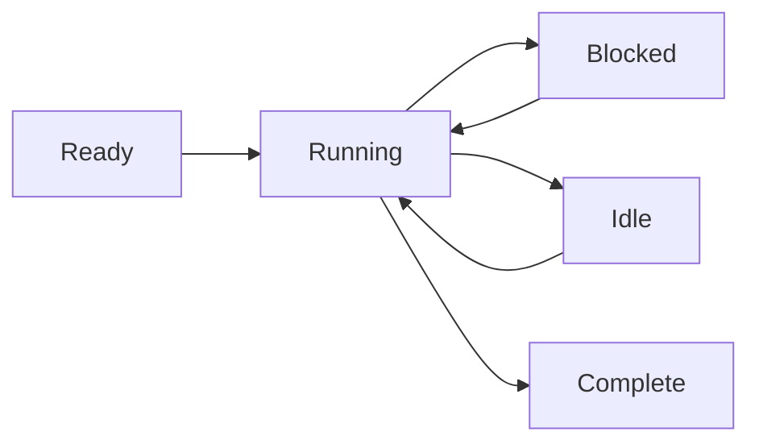

# 进程模型

Wippy 在隔离的进程中执行代码——通过消息传递进行通信的轻量级状态机。这种 Actor 模型方法消除了共享状态的 bug，使并发编程变得可预测。

## 状态机执行

每个进程遵循相同的模式：初始化、在阻塞操作时让出执行权逐步执行、完成时关闭。调度器在工作线程池中多路复用数千个进程，当一个进程等待 I/O 时运行其他进程。

进程支持多个并发让出——你可以启动多个异步操作，等待任意一个或全部完成。这使得无需生成额外进程即可实现高效的并行 I/O。



进程不限于 Lua。运行时支持任何状态机实现——基于 Go 的进程和 WebAssembly 模块已在计划中。

<warning>
进程是轻量级的，但不是零成本的。每个进程启动时大约有 13KB 的基础开销。执行过程中的动态分配和堆增长会增加这个开销。
</warning>

## 进程宿主

Wippy 在单个运行时中运行多个进程宿主，每个宿主具有不同的能力和安全边界。运行特权函数的系统进程可以存在于一个宿主中，与运行用户会话的宿主隔离。宿主可以限制进程被允许执行的操作——在 Erlang 中，你需要单独的节点来实现这种级别的隔离。

一些宿主是专用的。例如，终端宿主运行单个进程，但授予它访问其他宿主禁止的 IO 操作的权限。这让你可以在一个部署中混合不同的信任级别——具有完全访问权限的系统服务与沙盒化的用户代码共存。

## 安全模型

每个进程在一个 Actor 身份和安全策略下执行。通常这是发起调用的用户，但系统进程在具有不同权限的系统 Actor 下运行。

访问控制在多个级别工作。单个进程有自己的访问级别。宿主之间的消息发送可以根据安全策略禁止——沙盒化的用户进程可能根本不被允许向系统宿主发送消息。附加到当前 Actor 的策略决定了哪些操作是被允许的。

## 生成进程

使用 `process.spawn()` 创建后台进程：

```lua
local pid = process.spawn("app.workers:handler", "app:processes", arg1, arg2)
```

第一个参数是注册表记录，第二个是进程宿主，其余参数传递给进程。

生成变体控制生命周期关系：

| 函数 | 行为 |
|------|------|
| `spawn` | 发后即忘 |
| `spawn_monitored` | 子进程退出时接收 EXIT 事件 |
| `spawn_linked` | 双向链接——任一崩溃都会通知另一方 |

## 消息传递

进程通过消息通信，从不使用共享内存：

```lua
process.send(target_pid, "topic", payload)
```

来自同一发送者的消息按顺序到达。来自不同发送者的消息可能交错。投递是发后即忘的——当你需要确认时使用请求-响应模式。

<note>
进程可以在本地名称注册表中注册，并通过名称而不是 PID 来寻址（例如 <code>session_manager</code>）。用于跨节点寻址的全局注册表已在计划中。
</note>

## 监管

任何进程都可以通过监控其他进程来监管它们。一个进程带监控地生成子进程，监视 EXIT 事件，并在失败时重启它们。这遵循 Erlang 的"让它崩溃"哲学：进程在意外情况下崩溃，监控进程处理恢复。

```lua
local worker = process.spawn_monitored("app.workers:handler", "app:processes")
local event = process.events():receive()

if event.kind == process.event.EXIT and event.result.error then
    worker = process.spawn_monitored("app.workers:handler", "app:processes")
end
```

在根级别，运行时提供服务来启动和监管长时间运行的进程——类似于 Linux 中的 systemd。定义 `process.service` 记录让运行时管理进程：

```yaml
- name: worker.service
  kind: process.service
  process: app.workers:handler
  host: app:processes
  lifecycle:
    auto_start: true
    restart:
      max_attempts: 5
      delay: 1s
```

服务自动启动，在崩溃时带退避重启，并与运行时的生命周期管理集成。

## 进程升级

运行中的进程可以在不丢失身份的情况下升级其代码。调用 `process.upgrade()` 来切换到新定义，同时保留 PID、邮箱和监管关系：

```lua
process.upgrade("app.workers:v2", current_state)
```

第一个参数是新的注册表记录（或 nil 以重新加载当前定义）。附加参数传递给新版本，让你可以在升级过程中携带状态。进程立即使用新代码继续执行。

这在开发期间启用热代码重载，在生产环境中实现零停机更新。运行时缓存已编译的原型，因此升级不会重复支付编译成本。如果升级因任何原因失败，进程崩溃并应用正常的监管语义——监控父进程可以用之前的版本重启它或升级失败。

## 调度

Actor 调度器使用跨 CPU 核心的工作窃取。每个工作线程有一个本地队列以保持缓存局部性，还有一个全局队列用于分发。进程在阻塞操作时让出，允许数千个进程在几个线程上并发运行。
