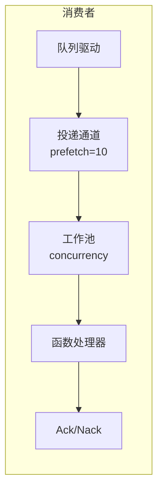

# 队列消费者

队列消费者使用工作池处理队列中的消息。

## 概述



## 配置

| 选项 | 默认值 | 最大值 | 说明 |
|------|--------|--------|------|
| `queue` | 必填 | - | 队列注册表 ID |
| `func` | 必填 | - | 处理函数注册表 ID |
| `concurrency` | 1 | 1000 | 工作线程数 |
| `prefetch` | 10 | 10000 | 消息缓冲区大小 |

## 入口定义

```yaml
- name: order_consumer
  kind: queue.consumer
  queue: app:orders
  func: app:process_order
  concurrency: 5
  prefetch: 20
  lifecycle:
    auto_start: true
    depends_on:
      - app:orders
```

## 处理函数

处理函数接收消息体：

```lua
-- process_order.lua
local json = require("json")

local function handler(body)
    local order = json.decode(body)

    -- 处理订单
    local result, err = process_order(order)
    if err then
        -- 返回错误触发 Nack（重新入队）
        return nil, err
    end

    -- 成功触发 Ack
    return result
end

return handler
```

```yaml
- name: process_order
  kind: function.lua
  source: file://process_order.lua
  modules:
    - json
```

## 确认机制

| 结果 | 动作 | 效果 |
|------|------|------|
| 成功 | Ack | 消息从队列移除 |
| 错误 | Nack | 消息重新入队（取决于驱动） |

## 工作池

- 工作线程作为并发 goroutine 运行
- 每个工作线程一次处理一条消息
- 消息从投递通道轮询分发
- 预取缓冲区允许驱动提前投递
- 当所有工作线程繁忙且缓冲区满时产生背压

### 示例

```
concurrency: 3
prefetch: 10

流程：
1. 驱动向缓冲区投递最多 10 条消息
2. 3 个工作线程并发从缓冲区拉取
3. 工作线程完成后，缓冲区重新填充
4. 所有工作线程繁忙且缓冲区满时产生背压
```

## 优雅关闭

停止时：
1. 停止接收新投递
2. 取消工作线程上下文
3. 等待处理中的消息（带超时）
4. 如果工作线程未完成则返回超时错误

## 队列声明

```yaml
# 队列驱动（开发/测试用内存驱动）
- name: queue_driver
  kind: queue.driver.memory
  lifecycle:
    auto_start: true

# 队列定义
- name: orders
  kind: queue.queue
  driver: app:queue_driver
  options:
    queue_name: orders      # 覆盖名称（默认：入口名称）
    max_length: 10000       # 最大队列大小
    durable: true           # 重启后持久化
```

| 选项 | 说明 |
|------|------|
| `queue_name` | 覆盖队列名称（默认：入口 ID 名称） |
| `max_length` | 最大队列大小 |
| `durable` | 重启后持久化（取决于驱动） |

## 内存驱动

用于开发/测试的内置内存队列：

- 类型：`queue.driver.memory`
- 消息存储在内存中
- Nack 将消息重新放入队列前端
- 重启后不持久化

## 参见

- [消息队列](lua/storage/queue.md) - Queue 模块参考
- [队列配置](system/queue.md) - 队列驱动和入口定义
- [监督树](guides/supervision.md) - 消费者生命周期
- [进程管理](lua/core/process.md) - 进程创建和通信
