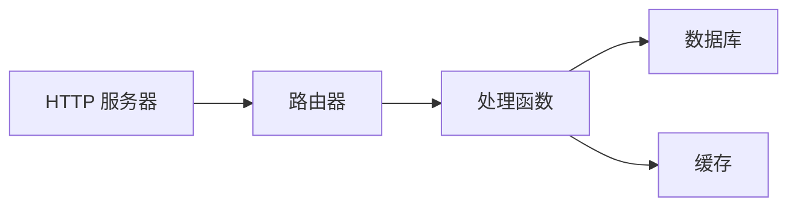
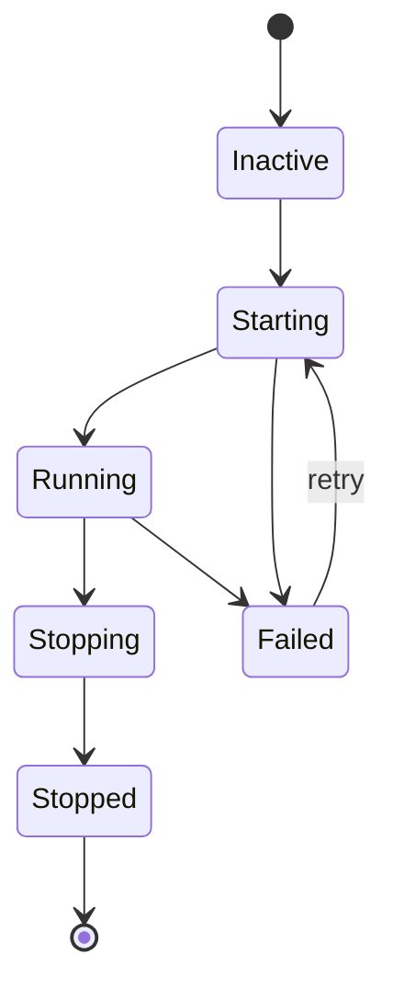

# 监督

监督器管理服务生命周期，处理启动顺序、自动重启和优雅关闭。设置了 `auto_start: true` 的服务在应用启动时自动运行。

## 生命周期配置

服务通过 `lifecycle` 块向监督器注册。对于进程，使用 `process.service` 包装进程定义：

```yaml
# 进程定义（代码）
- name: worker_process
  kind: process.lua
  source: file://worker.lua
  method: main

# 受监督的服务（包装进程并进行生命周期管理）
- name: worker
  kind: process.service
  process: app:worker_process
  host: app:processes
  lifecycle:
    auto_start: true
    start_timeout: 30s
    stop_timeout: 10s
    stable_threshold: 5s
    depends_on:
      - app:database
    restart:
      initial_delay: 2s
      max_delay: 60s
      max_attempts: 10
```

| 字段 | 默认值 | 说明 |
|------|--------|------|
| `auto_start` | `false` | 监督器启动时自动启动 |
| `start_timeout` | `10s` | 允许的最大启动时间 |
| `stop_timeout` | `10s` | 优雅关闭的最长时间 |
| `stable_threshold` | `5s` | 视为稳定的运行时长 |
| `depends_on` | `[]` | 必须先运行的服务 |

## 依赖解析

监督器从两个来源解析依赖：

1. **显式依赖**：在 `depends_on` 中声明
2. **注册表提取的依赖**：从入口引用中提取（例如配置中的 `database: app:db`）



依赖先于依赖它们的服务启动。如果服务 C 依赖 A 和 B，则 A 和 B 必须先达到 `Running` 状态，C 才能启动。

<tip>
无需在 <code>depends_on</code> 中声明数据库等基础设施入口。监督器会自动从入口配置中的注册表引用提取依赖关系。
</tip>

## 重启策略

服务失败时，监督器使用指数退避进行重试：

```yaml
lifecycle:
  restart:
    initial_delay: 1s      # 首次重试等待
    max_delay: 90s         # 最大延迟上限
    backoff_factor: 2.0    # 每次尝试的延迟倍数
    jitter: 0.1            # ±10% 随机化
    max_attempts: 0        # 0 = 无限重试
```

| 尝试次数 | 基础延迟 | 带抖动（±10%） |
|----------|----------|----------------|
| 1 | 1s | 0.9s - 1.1s |
| 2 | 2s | 1.8s - 2.2s |
| 3 | 4s | 3.6s - 4.4s |
| 4 | 8s | 7.2s - 8.8s |
| ... | ... | ... |
| N | 90s | 81s - 99s（上限） |

当服务运行时长超过 `stable_threshold` 时，重试计数器重置。这可防止瞬时故障导致延迟永久升级。

### 终止性错误

以下错误会停止重试：

- 上下文取消
- 显式终止请求
- 标记为不可重试的错误

## 安全上下文

服务可以使用特定的安全身份运行：

```yaml
# 进程定义
- name: admin_worker_process
  kind: process.lua
  source: file://admin_worker.lua
  method: main

# 带安全上下文的受监督服务
- name: admin_worker
  kind: process.service
  process: app:admin_worker_process
  host: app:processes
  lifecycle:
    auto_start: true
    security:
      actor:
        id: "service:admin-worker"
        meta:
          role: admin
      groups:
        - app:admin_policies
      policies:
        - app:data_access
```

安全上下文设置：

| 字段 | 说明 |
|------|------|
| `actor.id` | 服务的身份字符串 |
| `actor.meta` | 键值元数据（角色、权限等） |
| `groups` | 应用的策略组 |
| `policies` | 应用的单独策略 |

服务中运行的代码继承此安全上下文。`security` 模块可以检查权限：

```lua
local security = require("security")

if security.can("delete", "users") then
    -- 允许
end
```

<note>
未配置安全上下文时，服务在无角色身份下运行。在严格模式（默认）下，安全检查会失败。为需要授权的服务配置安全上下文。
</note>

## 服务状态



监督器将服务在这些状态间转换：

| 状态 | 说明 |
|------|------|
| `Inactive` | 已注册但未启动 |
| `Starting` | 启动进行中 |
| `Running` | 正常运行 |
| `Stopping` | 优雅关闭进行中 |
| `Stopped` | 已干净终止 |
| `Failed` | 发生错误，可能重试 |

## 启动和关闭顺序

**启动**：先启动依赖，再启动依赖它们的服务。同一依赖层级的服务可以并行启动。

**关闭**：先关闭依赖服务的一方，再关闭被依赖的服务。确保依赖服务在其依赖项停止前完成。

```
启动：database → cache → handler → http_server
关闭：http_server → handler → cache → database
```

## 参见

- [进程模型](concepts/process-model.md) - 进程生命周期
- [配置](guides/configuration.md) - YAML 配置格式
- [Security 模块](lua/security/security.md) - Lua 中的权限检查
