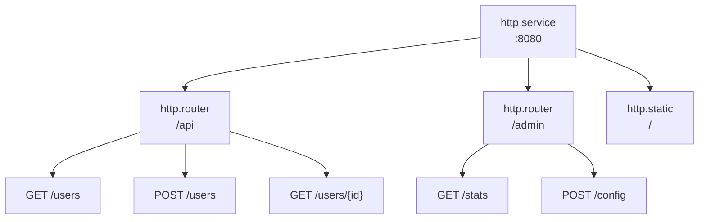

# 路由

路由器将端点组织在 URL 前缀下，并应用共享的中间件。端点定义 HTTP 处理器。

## 架构



条目通过 metadata 引用父级：
- 路由器：`meta.server: app:gateway`
- 端点：`meta.router: app:api`

## 路由器配置

```yaml
- name: api
  kind: http.router
  meta:
    server: gateway
  prefix: /api/v1
  middleware:
    - cors
    - compress
  options:
    cors.allow.origins: "*"
  post_middleware:
    - endpoint_firewall
```

| 字段 | 类型 | 说明 |
|------|------|------|
| `meta.server` | Registry ID | 父级 HTTP 服务器 |
| `prefix` | string | 所有路由的 URL 前缀 |
| `middleware` | []string | 匹配前中间件 |
| `options` | map | 中间件选项 |
| `post_middleware` | []string | 匹配后中间件 |
| `post_options` | map | 匹配后中间件选项 |

## 端点配置

```yaml
- name: get_user
  kind: http.endpoint
  meta:
    router: api
  method: GET
  path: /users/{id}
  func: app.users:get_user
```

| 字段 | 类型 | 说明 |
|------|------|------|
| `meta.router` | Registry ID | 父级路由器 |
| `method` | string | HTTP 方法 (GET, POST, PUT, DELETE, PATCH, HEAD) |
| `path` | string | URL 路径模式 (以 `/` 开头) |
| `func` | Registry ID | 处理函数 |

## 路径参数

使用 `{param}` 语法定义 URL 参数：

```yaml
- name: get_post
  kind: http.endpoint
  meta:
    router: api
  method: GET
  path: /users/{user_id}/posts/{post_id}
  func: get_user_post
```

在处理器中访问：

```lua
local http = require("http")

local function handler()
    local req = http.request()
    local user_id = req:param("user_id")
    local post_id = req:param("post_id")

    -- ...
end
```

### 通配符路径

使用 `{param...}` 捕获剩余路径段：

```yaml
- name: serve_files
  kind: http.endpoint
  meta:
    router: api
  method: GET
  path: /files/{filepath...}
  func: serve_file
```

```lua
-- 请求: GET /api/v1/files/docs/guides/readme.md
local file_path = req:param("filepath")  -- "docs/guides/readme.md"
```

通配符必须是路径中的最后一个段。

## 处理函数

端点处理器使用 `http` 模块访问请求和响应对象。完整 API 请参阅 [HTTP 模块](lua/http/http.md)。

```lua
local http = require("http")
local json = require("json")

local function handler()
    local req = http.request()
    local res = http.response()

    local user_id = req:param("id")
    local user = get_user(user_id)

    res:status(200)
    res:write(json.encode(user))
end

return { handler = handler }
```

## 中间件选项

中间件选项使用点号表示法，以中间件名称作为前缀：

```yaml
middleware:
  - cors
  - ratelimit
  - token_auth
options:
  cors.allow.origins: "https://app.example.com"
  cors.allow.methods: "GET,POST,PUT,DELETE"
  ratelimit.requests: "100"
  ratelimit.window: "1m"
  token_auth.store: "app:tokens"
  token_auth.header.name: "Authorization"
```

匹配后中间件使用 `post_options`：

```yaml
post_middleware:
  - endpoint_firewall
post_options:
  endpoint_firewall.default_policy: "deny"
```

## 匹配前与匹配后中间件

**匹配前** (`middleware`) 在路由匹配之前运行：
- CORS (处理 OPTIONS 预检请求)
- 压缩
- 限流
- 真实 IP 检测
- Token 认证 (上下文丰富)

**匹配后** (`post_middleware`) 在路由匹配之后运行：
- 端点防火墙 (需要路由信息进行授权)
- 资源防火墙
- WebSocket relay

```yaml
middleware:        # 匹配前: 此路由器的所有请求
  - cors
  - compress
  - token_auth     # 用 actor/scope 丰富上下文

post_middleware:   # 匹配后: 仅匹配的路由
  - endpoint_firewall  # 使用 token_auth 设置的 actor
```

<tip>
Token 认证可以作为匹配前中间件，因为它只丰富上下文而不阻止请求。授权在匹配后中间件如 <code>endpoint_firewall</code> 中进行，该中间件使用 <code>token_auth</code> 设置的 actor。
</tip>

## 完整示例

```yaml
version: "1.0"
namespace: app

entries:
  # 服务器
  - name: gateway
    kind: http.service
    addr: ":8080"
    lifecycle:
      auto_start: true

  # API 路由器
  - name: api
    kind: http.router
    meta:
      server: gateway
    prefix: /api/v1
    middleware:
      - cors
      - compress
      - ratelimit
    options:
      cors.allow.origins: "https://app.example.com"
      ratelimit.requests: "100"
      ratelimit.window: "1m"

  # 处理函数
  - name: get_users
    kind: function.lua
    source: file://handlers/users.lua
    method: list
    modules:
      - http
      - json
      - sql

  # 端点
  - name: list_users
    kind: http.endpoint
    meta:
      router: api
    method: GET
    path: /users
    func: get_users

  - name: get_user
    kind: http.endpoint
    meta:
      router: api
    method: GET
    path: /users/{id}
    func: app:get_user_by_id

  - name: create_user
    kind: http.endpoint
    meta:
      router: api
    method: POST
    path: /users
    func: app:create_user
```

## 受保护路由

带认证的常见模式：

```yaml
entries:
  # 公开路由 (无认证)
  - name: public
    kind: http.router
    meta:
      server: gateway
    prefix: /api/public
    middleware:
      - cors

  # 受保护路由
  - name: protected
    kind: http.router
    meta:
      server: gateway
    prefix: /api
    middleware:
      - cors
      - token_auth
    options:
      token_store: app:tokens
    post_middleware:
      - endpoint_firewall
```

## 参见

- [服务器](http/server.md) - HTTP 服务器配置
- [静态文件](http/static.md) - 静态文件服务
- [中间件](http/middleware.md) - 可用的中间件
- [HTTP 模块](lua/http/http.md) - Lua HTTP API
