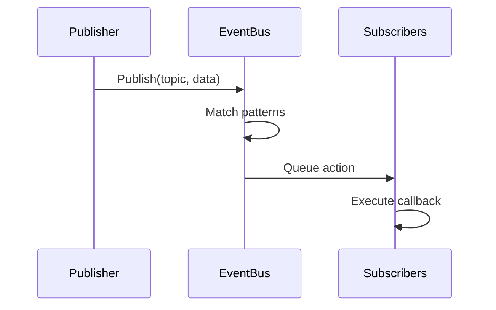
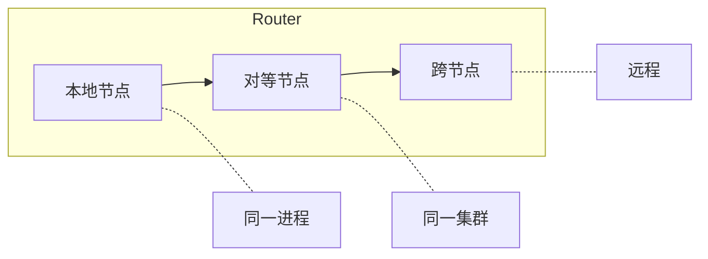

# 架构

<note>
此页面正在完善中。内容可能不完整或有所变化。
</note>

Wippy 是基于 Go 构建的分层系统。组件按依赖顺序初始化，通过事件总线通信，并通过工作窃取调度器执行 Lua 进程。

## 层次结构

| 层 | 组件 |
|-----|------|
| 应用层 | Lua 进程、函数、工作流 |
| 运行时层 | Lua 引擎 (gopher-lua)、50+ 模块 |
| 服务层 | HTTP、队列、存储、Temporal |
| 系统层 | 拓扑、工厂、函数、契约 |
| 核心层 | 调度器、注册表、分发器、事件总线、中继 |
| 基础设施层 | AppContext、日志器、转码器 |

每层仅依赖于其下层。核心层提供基本原语，而服务层在其上构建更高级别的抽象。

## 启动序列

应用启动经历四个阶段。

### 阶段 1：基础设施

在任何组件加载之前创建核心基础设施：

| 组件 | 用途 |
|------|------|
| AppContext | 用于组件引用的密封字典 |
| EventBus | 组件间通信的发布/订阅 |
| Transcoder | 负载序列化 (JSON、YAML、Lua) |
| Logger | 带事件流的结构化日志 |
| Relay | 消息路由 (Node、Router、Mailbox) |

### 阶段 2：组件加载

Loader 通过拓扑排序解析依赖关系，并逐级加载组件。同级组件并行加载。

| 级别 | 组件 | 依赖 |
|------|------|------|
| 0 | PIDGen | 无 |
| 1 | Dispatcher | PIDGen |
| 2 | Registry | Dispatcher |
| 3 | Finder, Supervisor | Registry |
| 4 | Topology | Supervisor |
| 5 | Lifecycle | Topology |
| 6 | Factory | Lifecycle |
| 7 | Functions | Factory |

每个组件在 Load 阶段将自身附加到 context，使服务可供依赖组件使用。

### 阶段 3：激活

所有组件加载完成后：

1. **冻结 Dispatcher** - 锁定命令处理器注册表以实现无锁查找
2. **密封 AppContext** - 不再允许写入，启用无锁读取
3. **启动组件** - 对每个具有 `Starter` 接口的组件调用 `Start()`

### 阶段 4：条目加载

从 YAML 文件加载并验证注册表条目：

1. 从项目文件解析条目
2. 管道阶段转换条目（覆盖、链接、字节码）
3. 标记为 `auto_start: true` 的服务开始运行
4. Supervisor 监控已注册的服务

## 组件

组件是参与应用生命周期的 Go 服务。

### 生命周期阶段

| 阶段 | 方法 | 用途 |
|------|------|------|
| 加载 | `Load(ctx) (ctx, error)` | 初始化并附加到 context |
| 启动 | `Start(ctx) error` | 开始活动操作 |
| 停止 | `Stop(ctx) error` | 优雅关闭 |

组件声明依赖关系。Loader 构建有向无环图并按拓扑顺序执行。关闭以相反顺序进行。

### 标准组件

| 组件 | 依赖 | 用途 |
|------|------|------|
| PIDGen | 无 | 进程 ID 生成 |
| Dispatcher | PIDGen | 命令处理器分发 |
| Registry | Dispatcher | 条目存储和版本控制 |
| Finder | Registry | 条目查找和搜索 |
| Supervisor | Registry | 服务重启策略 |
| Topology | Supervisor | 进程父/子树 |
| Lifecycle | Topology | 服务生命周期管理 |
| Factory | Lifecycle | 进程生成 |
| Functions | Factory | 无状态函数调用 |

## 事件总线

用于组件间通信的异步发布/订阅。

### 设计

- 单个 dispatcher goroutine 处理所有事件
- 基于队列的 action 投递防止阻塞发布者
- 模式匹配支持精确主题和通配符 (`*`)
- 基于 context 的生命周期将订阅与取消关联

### 事件流

### 常见主题

| 主题 | 发布者 | 用途 |
|------|--------|------|
| `registry.entry.*` | Registry | 条目变更 |
| `process.started` | Topology | 进程生命周期 |
| `process.stopped` | Topology | 进程生命周期 |
| `supervisor.state.*` | Supervisor | 服务状态变更 |

## 注册表

条目定义的版本化存储。

### 特性

- **版本化状态** - 每次变更创建新版本
- **历史记录** - SQLite 支持的历史记录用于审计追踪
- **观察** - 监视特定条目的变更
- **事件驱动** - 在变更时发布事件

### 条目生命周期

管道阶段转换条目：

| 阶段 | 用途 |
|------|------|
| Override | 应用配置覆盖 |
| Disable | 按模式移除条目 |
| Link | 解析需求和依赖 |
| Bytecode | 编译 Lua 为字节码 |
| EmbedFS | 收集文件系统条目 |

## 中继

跨节点的进程间消息路由。

### 三层路由

1. **本地** - 同一节点内的直接投递
2. **对等** - 转发到集群中的对等节点
3. **跨节点** - 通过网络路由到远程节点

### 邮箱

每个节点有一个带工作池的邮箱：

- FNV-1a 哈希将发送者分配到工作者
- 保持每个发送者的消息顺序
- 工作者并发处理消息
- 队列满时产生背压

## AppContext

用于组件引用的密封字典。

| 属性 | 行为 |
|------|------|
| 密封前 | RWMutex 保护的写入 |
| 密封后 | 无锁读取，写入时 panic |
| 重复键 | Panic |
| 类型安全 | 类型化 getter 函数 |

组件在 Load 阶段附加服务。启动完成后，AppContext 被密封以获得最佳读取性能。

## 关闭

优雅关闭按依赖顺序的逆序进行：

1. SIGINT/SIGTERM 触发关闭
2. Supervisor 停止托管服务
3. 具有 `Stopper` 接口的组件接收 `Stop()`
4. 基础设施清理

第二个信号强制立即退出。

## 另请参阅

- [调度器](internals/scheduler.md) - 进程执行
- [事件总线](internals/events.md) - 发布/订阅系统
- [注册表](internals/registry.md) - 状态管理
- [命令分发](internals/dispatch.md) - Yield 处理
