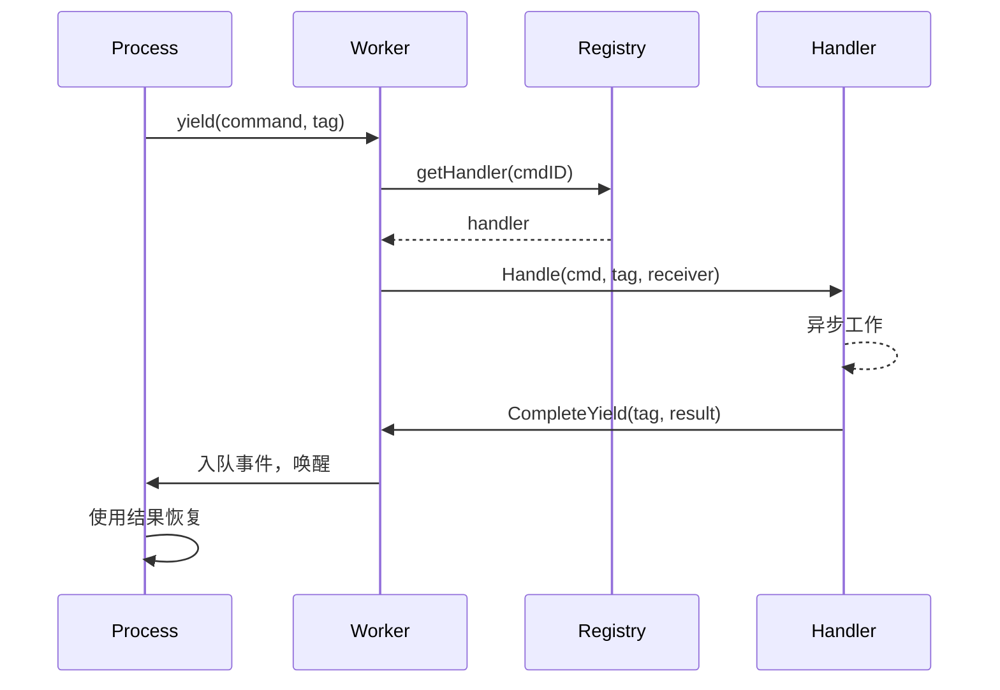

# Command Dispatch

Dispatch 系统将命令从进程路由到 handler。进程使用关联标签 yield 命令，handler 执行异步工作，结果通过事件队列返回。

## 流程



## Command Registry

Registry 使用混合结构存储 handler：

```go
type Registry struct {
    handlers [256]Handler         // 系统命令：O(1) 索引
    extended map[CommandID]Handler // 扩展命令：map 查找
    frozen   atomic.Bool          // 启动后无锁
}
```

系统命令（0-255）使用数组索引。扩展命令使用 map 查找。`Freeze()` 后所有查找都是无锁的。

### Command ID 范围

| 范围 | 模块 | 示例 |
|-------|--------|----------|
| 1-9 | process | Send, Spawn, Terminate, Monitor, Link |
| 10-29 | clock | Sleep, Ticker, Timer |
| 50-59 | stream | Read, Write, Close, Seek |
| 60-79 | http | Request, RequestBatch |
| 80-89 | websocket | Connect, Send, Receive |
| 90-99 | event | Subscribe, Send |
| 100-119 | sql | Query, Execute, Transaction ops |
| 120-129 | store | Get, Set, Delete, Has |
| 130-139 | security | ValidateToken, CreateToken |
| 140-149 | function | Call, AsyncStart, AsyncCancel |
| 150-159 | exec | ProcessWait |
| 160-169 | cloudstorage | Upload, Download, List, Presigned URLs |
| 170-179 | eval | Compile, Run, CreateProcess |
| 180-189 | workflow | SideEffect, Call, Version, UpsertAttrs |
| 190-199 | contract | Open, Call, AsyncCall, AsyncCancel |
| 256+ | custom | 用户定义的服务 |

注册在启动期间通过 `MustRegisterCommands()` 完成。冲突会在启动时 panic。

## 定义 Command

Command 是具有唯一 `CommandID` 的数据结构：

```go
const MyCommand dispatcher.CommandID = 200

type MyCmd struct {
    Input  string
    Option int
}

var myCmdPool = sync.Pool{New: func() any { return &MyCmd{} }}

func (c *MyCmd) CmdID() dispatcher.CommandID { return MyCommand }

func (c *MyCmd) Release() {
    c.Input = ""
    c.Option = 0
    myCmdPool.Put(c)
}
```

池复用消除了热路径中的分配。在包初始化时注册：

```go
func init() {
    dispatcher.MustRegisterCommands("myservice", MyCommand)
}
```

## Dispatcher

Dispatcher 将相关的 handler 分组。它实现 `RegisterAll` 来注册 handler，以及用于设置/清理的生命周期方法：

```go
type Handler interface {
    Handle(ctx context.Context, cmd Command, tag uint64, receiver ResultReceiver) error
}

type ResultReceiver interface {
    CompleteYield(tag uint64, data any, err error)
}
```

```go
type Dispatcher struct {
    // 服务状态
}

func (d *Dispatcher) RegisterAll(register func(id dispatcher.CommandID, h dispatcher.Handler)) {
    register(myapi.MyCommand, dispatcher.HandlerFunc(d.handleMyCommand))
}

func (d *Dispatcher) handleMyCommand(ctx context.Context, cmd Command, tag uint64, receiver ResultReceiver) error {
    c := cmd.(*myapi.MyCmd)
    go func() {
        result := doWork(c)
        if ctx.Err() == nil {
            receiver.CompleteYield(tag, result, nil)
        }
    }()
    return nil
}
```

作为启动组件注册：

```go
func MyDispatcher() boot.Component {
    return boot.New(boot.P{
        Name:      "dispatcher.myservice",
        DependsOn: []boot.Name{DispatcherName},
        Load: func(ctx context.Context) (context.Context, error) {
            reg := dispatcher.GetRegistrar(ctx)
            svc := myservice.NewDispatcher()
            svc.RegisterAll(reg.Register)
            return ctx, nil
        },
    })
}
```

## Yield 和关联

当进程需要异步工作时，它使用关联标签 yield 一个命令：

```go
type Yield struct {
    Cmd Command
    Tag uint64    // 用于关联的进程本地计数器
}
```

Worker 在每一步之后从 `StepOutput` 提取 yield 并分发给 handler。每个标签唯一标识请求，以便结果可以匹配回来。

## 另请参阅

- [Scheduler](internals/scheduler.md) - 进程执行
- [Modules](internals/modules.md) - Lua 模块集成
- [Process Model](concepts/process-model.md) - 高级概念
