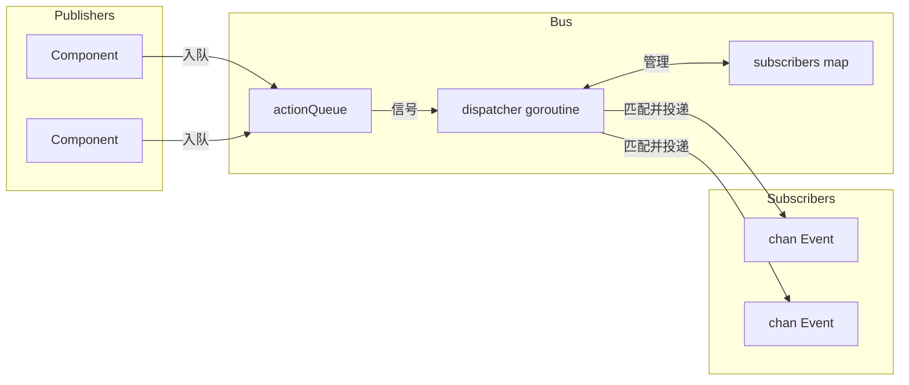

# Event Bus

Event bus 是使用单个 dispatcher goroutine 的发布/订阅系统。发布者将动作入队，dispatcher 按顺序处理它们，订阅者在 channel 上接收匹配的事件。

## Event 结构

```go
type Event struct {
    System string  // 组件/模块（如 "registry", "process"）
    Kind   string  // 事件类型（如 "create", "update", "exit"）
    Path   string  // 实体标识符
    Data   any     // 负载
}
```

## Bus 架构



Bus 使用简单结构存储状态：

```go
type Bus struct {
    subscribers       map[SubscriberID]sub
    subscriberCounter uint64

    actionQueue []action
    spareQueue  []action
    actionMu    sync.Mutex
    actionReady chan struct{}  // buffered=1

    closed atomic.Bool
}
```

所有变更都通过 dispatcher goroutine，无需复杂锁定即可消除竞态条件。

## Action

四种 action 类型流经队列：

| Action | 行为 |
|--------|----------|
| Subscribe | 将订阅者添加到 map，在 done channel 上响应 |
| Unsubscribe | 移除订阅者，在 done channel 上响应 |
| Send | 将事件投递给匹配的订阅者 |
| Stop | 清空订阅者，排空队列，退出循环 |

Subscribe 和 Unsubscribe 阻塞直到 dispatcher 确认。Send 是即发即弃。

## 队列交换

Dispatcher 使用切片交换以避免稳态下的分配：

```go
func (b *Bus) processActions() bool {
    b.actionMu.Lock()
    actions := b.actionQueue
    b.actionQueue = b.spareQueue[:0]
    b.spareQueue = nil
    b.actionMu.Unlock()

    for i := range actions {
        // 处理 action
    }

    clear(actions)
    b.actionMu.Lock()
    b.spareQueue = actions[:0]
    b.actionMu.Unlock()
    return true
}
```

两个切片交替：一个用于处理，一个用于新到达。`actionReady` channel 缓冲为 1，因此信号永不阻塞，多次入队合并为一次唤醒。

## 模式匹配

订阅在订阅时一次性编译模式：

```go
type sub struct {
    subID   SubscriberID
    ctx     context.Context
    system  *wildcard.Wildcard
    kind    *wildcard.Wildcard
    eventCh chan<- Event
}
```

Wildcard 包支持三种模式类型：

| 模式 | 匹配 |
|---------|---------|
| `registry` | 仅完全匹配 |
| `*` | 任意单段 |
| `**` | 零个或多个段 |
| `(a\|b)` | 段内的选择 |

模式按 `.` 分割，因此 `registry.*` 匹配 `registry.create` 但不匹配 `registry.entry.create`。模式 `registry.**` 匹配 `registry`、`registry.create` 和 `registry.entry.create` 三者。

## 事件投递

在 Send 处理期间，dispatcher 迭代订阅者：

```go
for id, s := range b.subscribers {
    if s.system != nil && !s.system.Match(a.event.System) {
        continue
    }
    if s.kind != nil && !s.kind.Match(a.event.Kind) {
        continue
    }

    select {
    case <-a.ctx.Done():
        goto cleanup
    case <-s.ctx.Done():
        expiredSubs = append(expiredSubs, id)
    case s.eventCh <- a.event:
    }
}
```

如果订阅者的 context 被取消，它会在该投递过程中被标记为待移除。事件 context 也可以在迭代中途取消投递。

## Lua Process 桥接

Events dispatcher 将 Go 事件桥接到 Lua 进程。它一次性订阅所有事件（`"**"`），并根据进程订阅在内部路由：

```go
type Dispatcher struct {
    bus    event.Bus
    node   relay.Node
    subID  SubscriberID
    eventC chan event.Event

    mu   sync.RWMutex
    subs map[string]*subscription  // topic -> subscription
}
```

当 Lua 进程通过 `events.subscribe()` 订阅时，dispatcher 存储模式和目标 PID。匹配的事件被打包并通过 relay 发送：

```go
func (d *Dispatcher) routeEvent(evt event.Event) {
    d.mu.RLock()
    defer d.mu.RUnlock()

    for _, sub := range d.subs {
        if !matchPattern(sub.system, evt.System) {
            continue
        }
        if sub.kind != "" && !matchPattern(sub.kind, evt.Kind) {
            continue
        }

        data := map[string]any{
            "system": evt.System,
            "kind":   evt.Kind,
            "path":   evt.Path,
        }
        if evt.Data != nil {
            data["data"] = evt.Data
        }

        pkg := relay.NewPackage(pid.PID{}, sub.pid, sub.topic, payload.New(data))
        d.node.Send(pkg)
    }
}
```

## Helper 类型

### Subscriber

使用回调封装 channel 订阅：

```go
handler, err := eventbus.NewSubscriber(ctx, bus, "registry", "*.created",
    func(evt Event) {
        // 处理
    })
defer handler.Close()
```

生成两个 goroutine：一个读取事件并调用 handler，另一个等待 context 取消以取消订阅。

### EventRouter

使用集中式生命周期管理多个 handler：

```go
router, err := eventbus.StartRouter(ctx, bus,
    WithHandlers(handler1, handler2),
    WithLogger(log))
defer router.Stop()
```

每个 handler 实现 `Pattern()` 和 `Handle()`。Router 为每个创建 Subscriber，并在 Stop 时关闭所有。

### Awaiter

同步等待特定事件：

```go
awaiter := eventbus.NewAwaiter(bus, "registry", "accept")
waiter, _ := awaiter.Prepare(ctx, "service-id")
defer waiter.Close()

bus.Send(ctx, triggeringEvent)

result := waiter.Wait()  // 阻塞直到匹配或超时
```

Prepare-then-Wait 模式避免竞态条件：在触发产生响应的事件之前订阅。

## 关闭

1. `Stop()` 原子地设置 closed 标志并入队 Stop action
2. Dispatcher 清空订阅者 map
3. 剩余的排队 action 被排空：
   - Subscribe 请求收到 "bus is closed" 错误
   - Unsubscribe 请求立即完成
   - Send 事件被丢弃
4. WaitGroup 完成

## 另请参阅

- [Registry](internals/registry.md) - 主要事件生产者
- [Command Dispatch](internals/dispatch.md) - 进程到 handler 的路由
