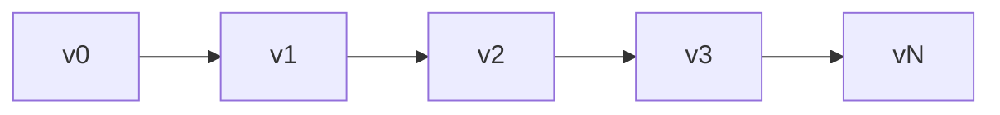
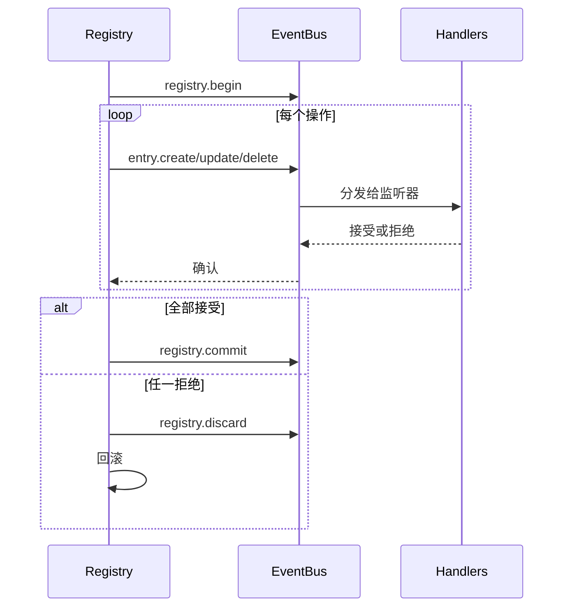

# Registry 内部机制

Registry 是一个版本化的事件驱动状态存储。它维护完整的版本历史，支持事务，并通过事件总线传播变更。

## Entry 存储

Entry 以有序切片存储，配合哈希映射索引实现 O(1) 查找：

```go
type Entry struct {
    ID   ID              // namespace:name
    Kind Kind            // Entry 类型
    Meta attrs.Bag       // 元数据
    Data payload.Payload // 内容
}
```

Entry ID 使用 Go 的 `unique` 包进行字符串驻留——相同的 ID 共享内存。

## 版本链

每个版本指向其父版本。路径计算使用图算法找到任意两个版本之间的最短路径：



## ChangeSets

ChangeSet 是将一个状态转换为另一个状态的有序操作列表：

| 操作 | OriginalEntry | 用途 |
|-----------|---------------|---------|
| Create | nil | 添加新 entry |
| Update | 旧值 | 修改现有 entry |
| Delete | 被删除的值 | 移除 entry |

`OriginalEntry` 支持反向操作——更新时存储先前的值，删除时存储被移除的内容。

### 构建 Delta

`BuildDelta(oldState, newState)` 生成最小操作集：

1. 比较状态，识别变更
2. 按反向依赖顺序排序删除操作（依赖者优先）
3. 按正向依赖顺序排序创建/更新操作（被依赖者优先）

### 合并

多个 changeset 通过跟踪每个 entry 的最终状态进行合并：

```
Create + Update = Create（使用更新后的值）
Create + Delete = 空（相互抵消）
Update + Delete = Delete
Delete + Create = Update
```

## 事务



Handler 有 30 秒时间来接受或拒绝每个操作。如果被拒绝，registry 通过计算并应用反向 delta 进行回滚。

### 非传播 Entry

某些 kind 完全跳过事件总线：
- `registry.entry` - 应用配置
- `ns.requirement` - 命名空间需求
- `ns.dependency` - 模块依赖

## 依赖解析

Entry 可以声明对其他 entry 的依赖。解析器通过注册的模式提取依赖：

```go
resolver.RegisterPattern(PathConfig{
    Path: "meta.server",
    AllowWildcard: true,
})
```

依赖从 entry 的 Meta 和 Data 字段中提取，然后在状态转换期间用于拓扑排序。

## 版本历史

历史后端：

| 实现 | 用例 |
|----------------|----------|
| SQLite | 生产环境持久化 |
| Memory | 测试 |
| Nil | 无历史 |

SQLite 使用 WAL 模式，包含版本表、changeset（MessagePack 编码）和元数据表。

### 导航

路径计算找到版本之间的最短路径：

```go
Path(v0, v3) = [v1, v2, v3]  // 正向应用 changeset
Path(v3, v1) = [v2, v1]      // 应用反向 changeset
```

`LoadState()` 从基线重放历史而不创建新版本——用于启动时。

## Finder

带有 LRU 缓存的查询引擎，用于搜索 entry：

| 操作符 | 前缀 | 示例 |
|----------|--------|---------|
| Glob | (无) | `.kind=function.*` |
| Regex | `~` | `~meta.path=/api/.*` |
| Contains | `*` | `*meta.tags=backend` |
| Prefix | `^` | `^meta.name=user` |
| Suffix | `$` | `$meta.path=Handler` |

缓存在版本变更时失效。

## 另请参阅

- [Registry](concepts/registry.md) - 高级概念
- [Events](internals/events.md) - 事件总线详情
