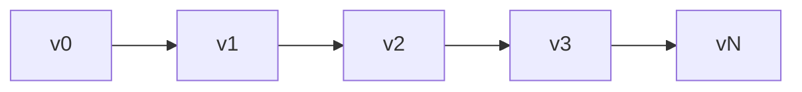
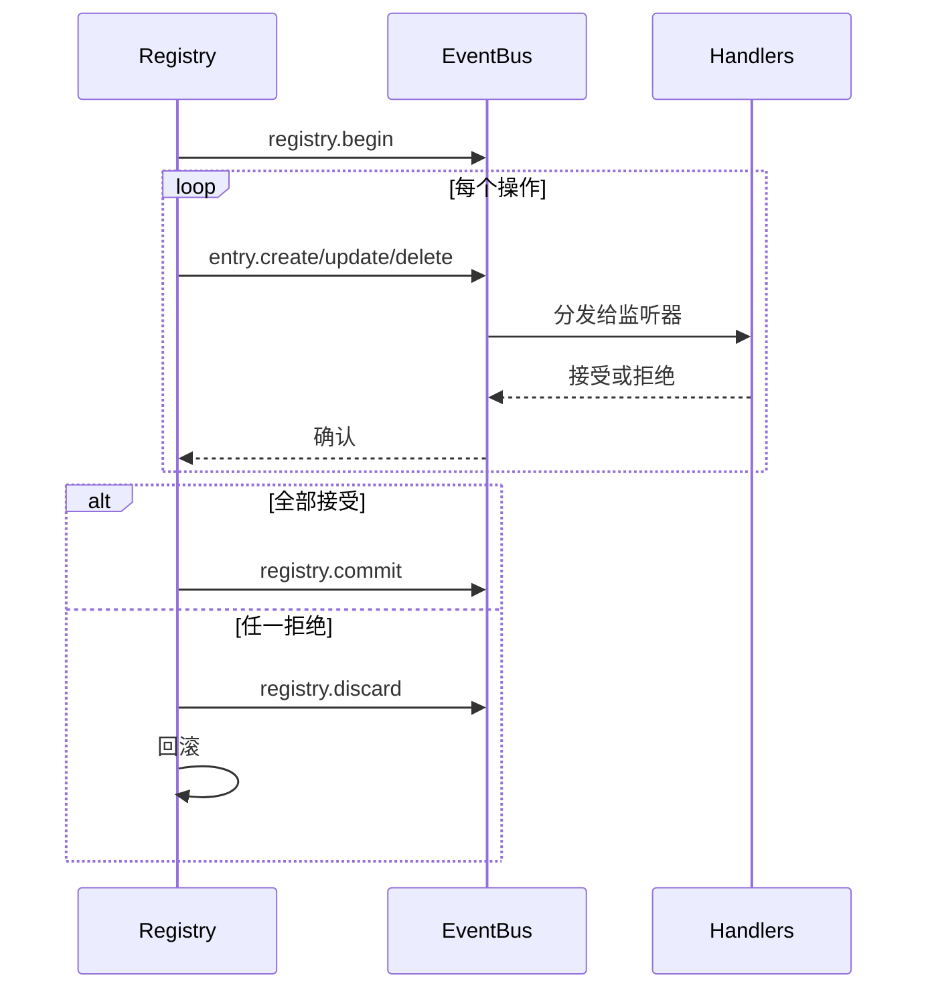

# Registry 内部机制

Registry 是一个版本化的事件驱动状态存储。它维护完整的版本历史，支持事务，并通过事件总线传播变更。

## Entry 存储

Entry 以有序切片存储，配合哈希映射索引实现 O(1) 查找：

```go
type Entry struct {
    ID       ID              // namespace:name
    Kind     Kind            // Entry 类型
    Meta     attrs.Bag       // 作者元数据
    Data     payload.Payload // 内容
    Registry EntryMetadata   // Registry 所有的来源信息
}

type EntryMetadata struct {
    Owner string // 提供该 entry 的部署来源
    Root  bool   // 由部署选中的依赖声明
}
```

Entry ID 使用 Go 的 `unique` 包进行字符串驻留——相同的 ID 共享内存。

`Registry` 归 registry 所有，而非 entry 作者。`Owner` 根据部署来源赋值；`Root` 由 `ns.dependency` entry 上的写入侧字段 `dependency_root` 设置。普通的 entry API 只返回 `ID`、`Kind`、`Meta` 和 `Data`；来源信息通过快照状态 API 读取。

## Snapshot

`Registry.Snapshot()` 返回一个原子视图：版本、该版本下的 entry，以及同一版本的 registry 所有的状态元数据。

```go
type Snapshot struct {
    Registry StateMetadata
    Version  Version
    Entries  State
}

type StateMetadata struct {
    Resolution *DependencyResolution
}
```

将版本、entry 和解析结果作为一个值读取，可以避免调用方把 entry 与另一个版本的解析结果配对。选定的模块图每个快照只存储一次，而不是在每个 entry 上重复。

## Overlay

`OverlayWriter` 是 registry 用于进程本地 entry 的可选能力：

```go
type OverlayWriter interface {
    ApplyOverlay(context.Context, string, uint64, ChangeSet) (uint64, error)
    GetOverlay(string) (State, uint64, error)
}
```

Overlay entry 按逻辑所有者字符串分组。它们加入生效状态，并与持久 entry 一样经过相同的拓扑排序和 handler 转换，因此服务会正常为它们启动和停止，但它们从不产生历史版本。冷启动后它们为空，必须由其所属的控制服务重新协调。

写入采用乐观并发：`GetOverlay` 返回所有者当前的世代，`ApplyOverlay` 仅在该世代仍然是最新时才提交，否则返回可重试的 `Conflict`。每次成功应用都会产生一个新的进程内唯一世代，并为发生过变更的所有者保留一个墓碑，使 ABA 序列不会被误认为未变更的 overlay。

每次应用都会校验的组合规则：

- 只有在没有持久 entry 也没有 overlay entry 占用某个 ID 时，才能创建该 entry。
- 只有所属身份可以更新或删除自己的 overlay entry。
- Overlay entry 不得携带 registry 所有的元数据，也不得使用被 registry 指令占用的类型。
- 删除操作不得移除仍有存续 entry 依赖的 entry。
- 依赖边不得跨越所有者边界，持久 entry 也不得依赖 overlay entry。

## 版本链

每个版本指向其父版本。路径计算使用图算法找到任意两个版本之间的最短路径：


```mermaid
flowchart LR
    v0[v0] --> v1[v1] --> v2[v2] --> v3[v3] --> vN[vN]
```

## ChangeSets

ChangeSet 是将一个状态转换为另一个状态的有序操作列表：

| 操作 | OriginalEntry | 用途 |
|-----------|---------------|---------|
| Create | nil | 添加新 entry |
| Update | 旧值 | 修改现有 entry |
| Delete | 被删除的值 | 移除 entry |

`OriginalEntry` 支持反向操作——更新时存储先前的值，删除时存储被移除的内容。

### 构建 Delta

`BuildDelta(oldState, newState)` 生成最小操作集：

1. 比较状态，识别变更
2. 按反向依赖顺序排序删除操作（依赖者优先）
3. 按正向依赖顺序排序创建/更新操作（被依赖者优先）

### 合并

多个 changeset 通过跟踪每个 entry 的最终状态进行合并：

```
Create + Update = Create（使用更新后的值）
Create + Delete = 空（相互抵消）
Update + Delete = Delete
Delete + Create = Update
```

## 事务


```mermaid
sequenceDiagram
    participant R as Registry
    participant B as EventBus
    participant H as Handlers

    R->>B: registry.begin
    loop 每个操作
        R->>B: entry.create/update/delete
        B->>H: 分发给监听器
        H-->>B: 接受或拒绝
        B-->>R: 确认
    end
    alt 全部接受
        R->>B: registry.commit
    else 任一拒绝
        R->>B: registry.discard
        R->>R: 回滚
    end
```

Handler 有 30 秒时间来接受或拒绝每个操作。如果被拒绝，registry 通过计算并应用反向 delta 进行回滚。

### 非传播 Entry

某些 kind 完全跳过事件总线：
- `registry.entry` - 应用配置
- `ns.requirement` - 命名空间需求
- `ns.dependency` - 模块依赖
- `ns.definition` - 模块元数据（readme、wiki、许可证、作者）

## 依赖解析

Entry 可以声明对其他 entry 的依赖。解析器通过注册的模式提取依赖：

```go
resolver.RegisterPattern(registry.DependencyPattern{
    Path: "meta.server",
    AllowWildcard: true,
})
```

依赖从 entry 的 Meta 和 Data 字段中提取，然后在状态转换期间用于拓扑排序。

### 依赖访问策略

外部依赖访问是请求作用域的上下文值，而不是全局标志：

| 策略 | 效果 |
|------|------|
| `DependencyAccessUnspecified` | 由调用方决定；采用调用方自身的默认值 |
| `DependencyAccessOnline` | 允许外部解析和构件下载 |
| `DependencyAccessVerifiedOffline` | 禁止外部访问；解析使用锁定的清单和本地已存在的构件 |

当上下文未指定时，`LoadState()` 默认为已验证离线，因此启动会重放已存储的依赖图而不访问网络。恢复部署基线会将上下文切换为在线，因为它必须获取该基线所指定的模块。在已验证离线模式下，仅提供锁定模块的清单 provider 会取代 hub provider，缺失的构件会作为缺失证据而失败，而不是触发下载。

## 版本历史

历史后端：

| 实现 | 用例 |
|----------------|----------|
| SQLite | 生产环境持久化 |
| PostgreSQL | 生产环境持久化，可跨节点共享 |
| Memory | `history_type` 未设置时的默认值；测试 |
| Nil | 无历史 |

SQLite 使用 WAL 模式，包含版本表、changeset（MessagePack 编码）和元数据表。PostgreSQL 通过 `registry.history_type: postgres` 加上 `history_dsn`/`history_schema` 选择（参见[配置](guides/configuration.md#registry)）。

历史还会持久化每个版本的精确依赖解析结果：当应用一个 `ns.dependency` 变更时，解析出的模块图会以内容寻址方式与 changeset 一同存储。启动和回滚时重放已存储的图而不是重新求解，因此每个版本始终与其解析时所用的版本保持一致。历史 schema 在升级后的首次启动时自动迁移；已存在的旧版本会在首次访问时解析一次并建立检查点。

### 导航

路径计算找到版本之间的最短路径：

```go
Path(v0, v3) = [v1, v2, v3]  // 正向应用 changeset
Path(v3, v1) = [v2, v1]      // 应用反向 changeset
```

`LoadState()` 从基线重放历史而不创建新版本——用于启动时。

## Finder

带有 LRU 缓存的查询引擎，用于搜索 entry：

| 操作符 | 前缀 | 示例 |
|----------|--------|---------|
| Glob | (无) | `.kind=function.*` |
| Regex | `~` | `~meta.path=/api/.*` |
| Contains | `*` | `*meta.tags=backend` |
| Prefix | `^` | `^meta.name=user` |
| Suffix | `$` | `$meta.path=Handler` |

缓存在版本变更时失效。

## 另请参阅

- [Registry](concepts/registry.md) - 高级概念
- [Events](internals/events.md) - 事件总线详情
