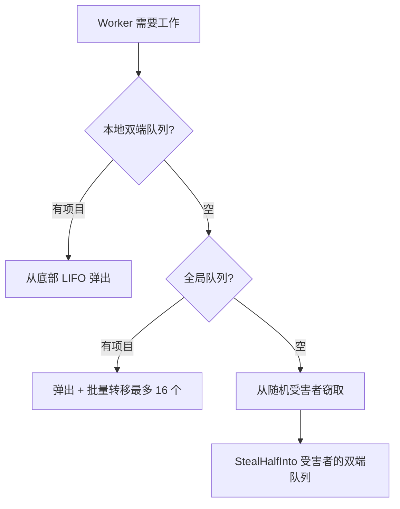
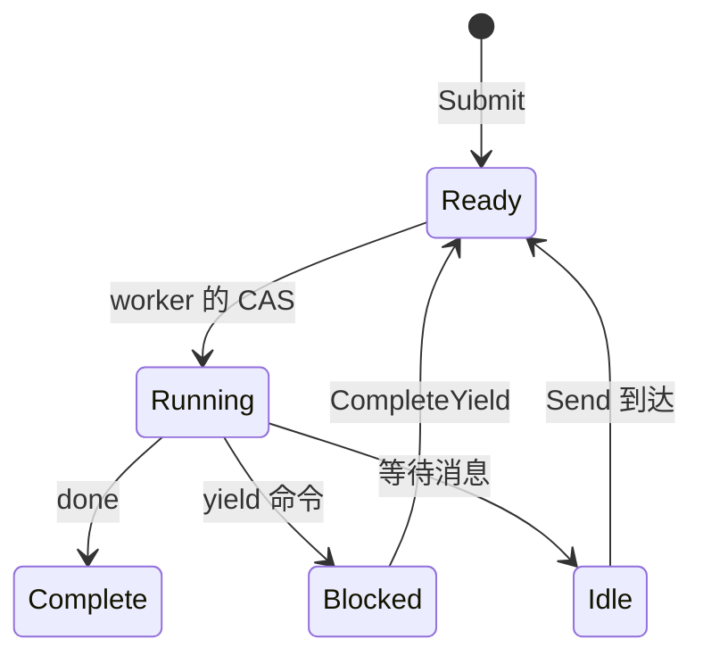

# Scheduler

Scheduler 使用工作窃取设计执行进程。Worker 维护本地双端队列，空闲时相互窃取任务。

## Process 接口

Scheduler 可以与任何实现 `Process` 接口的类型协作：

```go
type Process interface {
    Init(ctx context.Context, method string, input payload.Payloads) error
    Step(events []Event, out *StepOutput) error
    Close()
}
```

| 方法 | 用途 |
|--------|---------|
| `Init` | 使用入口方法名和输入参数准备进程 |
| `Step` | 使用传入事件推进状态机，将 yield 写入输出 |
| `Close` | 释放资源 |

`Init` 中的 `method` 参数指定要调用的入口点。一个进程实例可以暴露多个入口点，调用者选择执行哪一个。这也用于验证 scheduler 正确启动了进程。

Scheduler 反复调用 `Step()`，传递事件（yield 完成、消息）并收集 yield（要分发的命令）。进程将其状态和任何 yield 写入 `StepOutput` 缓冲区。

```go
type Event struct {
    Type  EventType  // EventYieldComplete 或 EventMessage
    Tag   uint64     // yield 完成的关联标签
    Data  any        // 结果数据或消息负载
    Error error      // yield 失败时的错误
}
```

## 结构

Scheduler 默认生成 `GOMAXPROCS` 个 worker。每个 worker 有一个本地双端队列用于缓存友好的 LIFO 访问。全局 FIFO 队列处理新提交和跨 worker 转移。进程通过 PID 跟踪以进行消息路由。

## 工作查找



Worker 按优先级顺序检查来源：

| 优先级 | 来源 | 模式 |
|----------|--------|---------|
| 1 | 本地双端队列 | LIFO 弹出，无锁，缓存友好 |
| 2 | 全局队列 | FIFO 弹出并批量转移 |
| 3 | 其他 worker | 从受害者双端队列窃取一半 |

从全局队列弹出时，worker 取一个项目并批量转移最多 16 个到本地双端队列。

## Chase-Lev 双端队列

每个 worker 拥有一个 Chase-Lev 工作窃取双端队列：

```go
type Deque struct {
    buffer atomic.Pointer[dequeBuffer]
    top    atomic.Int64  // 窃取者从这里偷（CAS）
    bottom atomic.Int64  // 所有者在这里推/弹
}
```

所有者从底部推入和弹出（LIFO），无需同步。窃取者使用 CAS 从顶部偷取（FIFO）。这使所有者能够缓存友好地访问最近推入的项目，同时将较旧的工作分配给窃取者。

`StealHalfInto` 在一次 CAS 操作中取走一半项目，减少竞争。

## 自适应自旋

在阻塞于条件变量之前，worker 自适应地自旋：

| 自旋次数 | 动作 |
|------------|--------|
| < 4 | 紧密循环 |
| 4-15 | 让出线程（`runtime.Gosched`） |
| >= 16 | 阻塞于条件变量 |

## 进程状态



| 状态 | 描述 |
|-------|-------------|
| Ready | 排队等待执行 |
| Running | Worker 正在执行 Step() |
| Blocked | 等待 yield 完成 |
| Idle | 等待消息 |
| Complete | 执行完成 |

唤醒标志处理竞态：如果 handler 在 worker 仍拥有进程（Running）时调用 `CompleteYield`，它会设置标志。Worker 在分发后检查标志，如果设置则重新入队。

## 事件队列

每个进程有一个 MPSC（多生产者，单消费者）事件队列：

- **生产者**：命令 handler（`CompleteYield`），消息发送者（`Send`）
- **消费者**：Worker 在 `Step()` 中消费事件

## 消息路由

Scheduler 实现 `relay.Receiver` 将消息路由到进程。调用 `Send()` 时，它在 `byPID` 映射中查找目标 PID，将消息作为事件推入进程队列，如果进程空闲则通过推入全局队列唤醒它。

## 关闭

关闭时，scheduler 向所有运行中的进程发送取消事件，并等待它们完成或超时。一旦没有剩余工作，worker 退出。

## 另请参阅

- [Command Dispatch](internals/dispatch.md) - yield 如何到达 handler
- [Process Model](concepts/process-model.md) - 高级概念
