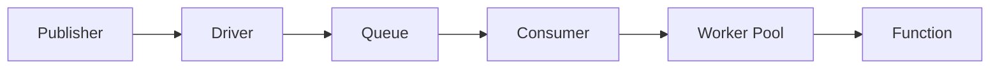

# Queue

Wippy 提供队列系统，用于异步消息处理，支持可配置的驱动和消费者。

## 架构



- **Driver** - 后端实现（memory、AMQP、Redis）
- **Queue** - 绑定到驱动的逻辑队列
- **Consumer** - 连接队列到处理器，带并发设置
- **Worker Pool** - 并发消息处理器

多个队列可以共享一个驱动。多个消费者可以从同一队列处理消息。

## Entry 类型

| Kind | 描述 |
|------|------|
| `queue.driver.memory` | 内存队列驱动 |
| `queue.queue` | 带驱动引用的队列声明 |
| `queue.consumer` | 处理消息的消费者 |

## 驱动配置

### 内存驱动

用于开发和测试的内存驱动。

```yaml
- name: memory_driver
  kind: queue.driver.memory
  lifecycle:
    auto_start: true
```

<note>
计划支持更多驱动（AMQP、Redis、SQS）。驱动接口允许在不更改队列或消费者配置的情况下切换后端。
</note>

## 队列配置

```yaml
- name: tasks
  kind: queue.queue
  driver: app.queue:memory_driver
```

| 字段 | 类型 | 必需 | 描述 |
|------|------|------|------|
| `driver` | Registry ID | 是 | 队列驱动引用 |
| `options` | Map | 否 | 驱动特定选项 |

<note>
内存驱动没有配置选项。外部驱动（AMQP、Redis、SQS）定义自己的选项，如持久性、最大长度和 TTL。
</note>

## 消费者配置

```yaml
- name: task_consumer
  kind: queue.consumer
  queue: app.queue:tasks
  func: app.queue:task_handler
  concurrency: 4
  prefetch: 20
  lifecycle:
    auto_start: true
    depends_on:
      - app.queue:tasks
```

| 字段 | 默认值 | 最大值 | 描述 |
|------|--------|--------|------|
| `queue` | 必需 | - | 队列 registry ID |
| `func` | 必需 | - | 处理函数 registry ID |
| `concurrency` | 1 | 1000 | 并行 worker 数量 |
| `prefetch` | 10 | 10000 | 消息缓冲区大小 |

<tip>
消费者遵循调用上下文，可以受安全策略约束。在 lifecycle 级别配置 actor 和策略。参见 <a href="system-security.md">Security</a>。
</tip>

### Worker Pool

Worker 作为并发 goroutine 运行：

```
concurrency: 3, prefetch: 10

1. Driver delivers up to 10 messages to buffer
2. 3 workers pull from buffer concurrently
3. As workers finish, buffer refills
4. Backpressure when all workers busy and buffer full
```

## 处理函数

消费者函数接收消息数据并返回成功或错误：

```lua
local json = require("json")
local logger = require("logger")

local function handler(body)
    local data = json.decode(body)

    logger.info("Processing", {task_id = data.id})

    local result, err = process_task(data)
    if err then
        return nil, err  -- Nack: requeue message
    end

    return result  -- Ack: remove from queue
end

return handler
```

```yaml
- name: task_handler
  kind: function.lua
  source: file://task_handler.lua
  modules:
    - json
    - logger
```

### 确认机制

| 处理结果 | 动作 | 效果 |
|----------|------|------|
| 返回值 | Ack | 从队列中移除消息 |
| 返回错误 | Nack | 消息重新入队（取决于驱动） |

## 发布消息

从 Lua 代码发布：

```lua
local queue = require("queue")

queue.publish("app.queue:tasks", {
    id = "task-123",
    action = "process",
    data = payload
})
```

参见 [Queue 模块](lua/storage/queue.md) 了解完整 API。

## 优雅关闭

消费者停止时：

1. 停止接收新消息
2. 取消 worker 上下文
3. 等待正在处理的消息（有超时）
4. 如果 worker 未及时完成则返回错误

## 参见

- [Queue 模块](lua/storage/queue.md) - Lua API 参考
- [Queue 消费者指南](guides/queue-consumers.md) - 消费者模式和 worker 池
- [Supervision](guides/supervision.md) - 消费者生命周期管理
