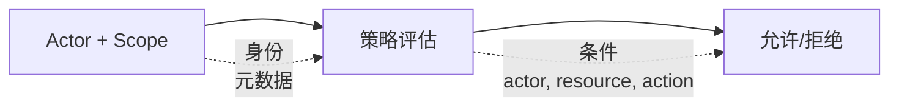

# Security 模型

Wippy 实现基于属性的访问控制。每个请求携带一个 actor（谁）和一个 scope（应用哪些策略）。策略根据 action、resource 以及来自 actor 和 resource 的元数据评估访问权限。



## Entry 类型

| Kind | 描述 |
|------|------|
| `security.policy` | 带条件的声明式策略 |
| `security.policy.expr` | 基于表达式的策略 |
| `security.token_store` | Token 存储和验证 |

## Actors

Actor 表示执行操作的主体。

```lua
local security = require("security")

-- Create actor with metadata
local actor = security.new_actor("user:123", {
    role = "admin",
    team = "backend",
    department = "engineering",
    clearance = 3
})

-- Access actor properties
local id = actor:id()        -- "user:123"
local meta = actor:meta()    -- {role="admin", ...}
```

### 上下文中的 Actor

```lua
-- Get current actor from context
local actor = security.actor()
if not actor then
    return nil, errors.new({ kind = errors.PERMISSION_DENIED, message = "No actor in context" })
end
```

## Policies

策略定义访问规则，包含 actions、resources、conditions 和 effects。

### 声明式策略

```yaml
# src/security/_index.yaml
version: "1.0"
namespace: app.security

entries:
  # Admin full access
  - name: admin_policy
    kind: security.policy
    policy:
      actions: "*"
      resources: "*"
      effect: allow
      conditions:
        - field: actor.meta.role
          operator: eq
          value: admin
    groups:
      - admin

  # Read-only access
  - name: readonly_policy
    kind: security.policy
    policy:
      actions:
        - "*.read"
        - "*.get"
        - "*.list"
      resources: "*"
      effect: allow
    groups:
      - default

  # Resource owner access
  - name: owner_policy
    kind: security.policy
    policy:
      actions:
        - read
        - write
        - delete
      resources: "document:*"
      effect: allow
      conditions:
        - field: meta.owner
          operator: eq
          value_from: actor.id
    groups:
      - default

  # Deny confidential without clearance
  - name: deny_confidential
    kind: security.policy
    policy:
      actions: "*"
      resources: "document:*"
      effect: deny
      conditions:
        - field: meta.classification
          operator: eq
          value: confidential
        - field: actor.meta.clearance
          operator: lt
          value: 3
    groups:
      - security
```

### 策略结构

```yaml
policy:
  actions: "*" | "action" | ["action1", "action2"]
  resources: "*" | "resource" | ["res1", "res2"]
  effect: allow | deny
  conditions:  # Optional
    - field: "field.path"
      operator: "eq"
      value: "static_value"
      # OR
      value_from: "other.field.path"
```

### 基于表达式的策略

对于复杂逻辑，使用表达式策略：

```yaml
- name: flexible_access
  kind: security.policy.expr
  policy:
    actions:
      - read
      - write
    resources: "file:*"
    effect: allow
    expression: |
      (actor.meta.role == "editor" && action == "write") ||
      (action == "read" && meta.public == true) ||
      actor.id == meta.owner
  groups:
    - editors
```

## Conditions

条件允许基于 actor、action、resource 和元数据进行动态策略评估。

### 字段路径

| 路径 | 描述 |
|------|------|
| `actor.id` | Actor 的唯一标识符 |
| `actor.meta.*` | Actor 元数据（支持嵌套） |
| `action` | 正在执行的操作 |
| `resource` | 资源标识符 |
| `meta.*` | 资源元数据 |

### 运算符

| 运算符 | 描述 | 示例 |
|--------|------|------|
| `eq` | 等于 | `actor.meta.role eq "admin"` |
| `ne` | 不等于 | `meta.status ne "deleted"` |
| `lt` | 小于 | `meta.priority lt 5` |
| `gt` | 大于 | `actor.meta.clearance gt 2` |
| `lte` | 小于等于 | `meta.size lte 1000` |
| `gte` | 大于等于 | `actor.meta.level gte 3` |
| `in` | 值在数组中 | `action in ["read", "write"]` |
| `nin` | 值不在数组中 | `meta.status nin ["deleted", "archived"]` |
| `exists` | 字段存在 | `meta.owner exists true` |
| `nexists` | 字段不存在 | `meta.deleted nexists true` |
| `contains` | 字符串包含 | `resource contains "sensitive"` |
| `ncontains` | 字符串不包含 | `resource ncontains "public"` |
| `matches` | 正则匹配 | `resource matches "^doc:.*"` |
| `nmatches` | 正则不匹配 | `actor.id nmatches "^system:.*"` |

### 条件示例

```yaml
# Match actor role
conditions:
  - field: actor.meta.role
    operator: eq
    value: admin

# Compare fields
conditions:
  - field: meta.owner
    operator: eq
    value_from: actor.id

# Numeric comparison
conditions:
  - field: actor.meta.clearance
    operator: gte
    value: 3

# Array membership
conditions:
  - field: actor.meta.role
    operator: in
    value:
      - admin
      - moderator

# Pattern matching
conditions:
  - field: resource
    operator: matches
    value: "^api:/v[0-9]+/admin/.*"

# Multiple conditions (AND)
conditions:
  - field: actor.meta.department
    operator: eq
    value: engineering
  - field: meta.environment
    operator: eq
    value: production
```

## Scopes

Scope 将多个策略组合成一个安全上下文。

```lua
local security = require("security")

-- Get policies
local admin_policy = security.policy("app.security:admin_policy")
local readonly_policy = security.policy("app.security:readonly_policy")

-- Create scope with policies
local scope = security.new_scope()
scope = scope:with(admin_policy)
scope = scope:with(readonly_policy)

-- Scopes are immutable - :with() returns new scope
```

### 命名 Scope（策略组）

从组加载所有策略：

```lua
-- Load scope with all policies in group
local scope, err = security.named_scope("app.security:admin")
```

策略通过 `groups` 字段分配到组：

```yaml
- name: admin_policy
  kind: security.policy
  policy:
    # ...
  groups:
    - admin      # This policy is in "admin" group
    - default    # Can be in multiple groups
```

### Scope 操作

```lua
-- Add policy
local new_scope = scope:with(policy)

-- Remove policy
local new_scope = scope:without("app.security:temp_policy")

-- Check if policy is in scope
local has = scope:contains("app.security:admin_policy")

-- Get all policies
local policies = scope:policies()
```

## 策略评估

### 评估流程

```
1. No actor or no scope in context → strict mode decides (deny by default)
2. Check each policy in scope
3. If ANY policy returns Deny → Result is Deny
4. If at least one Allow and no Deny → Result is Allow
5. No applicable policies → Result is Undefined
```

访问检查只有在 `Allow` 时才通过。`Undefined` 与 `Deny` 一样拒绝访问 — 一旦同时存在 actor 和 scope，strict 模式就不再起任何作用。

### 评估结果

| 结果 | 含义 |
|------|------|
| `allow` | 访问已授权 |
| `deny` | 访问被明确拒绝 |
| `undefined` | 没有策略匹配 |

```lua
-- Evaluate directly
local result = scope:evaluate(actor, "read", "document:123", {
    owner = "user:456",
    classification = "internal"
})

if result == "deny" then
    return nil, errors.new({ kind = errors.PERMISSION_DENIED, message = "Access denied" })
elseif result == "undefined" then
    -- No policy matched - access checks treat this as denied
end
```

### 快速权限检查

```lua
-- Check against current context's actor and scope
local allowed = security.can("read", "document:123", {
    owner = "user:456"
})

if not allowed then
    return nil, errors.new({ kind = errors.PERMISSION_DENIED, message = "Access denied" })
end
```

## Token Stores

Token store 提供安全的 token 创建、验证和撤销。

### 配置

```yaml
# src/auth/_index.yaml
version: "1.0"
namespace: app.auth

entries:
  # Register environment variable
  - name: os_env
    kind: env.storage.os

  - name: AUTH_SECRET_KEY
    kind: env.variable
    variable: AUTH_SECRET_KEY
    storage: app.auth:os_env

  # Backing store for tokens
  - name: token_data
    kind: store.memory
    lifecycle:
      auto_start: true

  # Token store
  - name: tokens
    kind: security.token_store
    store: app.auth:token_data
    token_length: 32
    default_expiration: "24h"
    token_key: ${env:AUTH_SECRET_KEY}
```

### Token Store 选项

| 选项 | 默认值 | 描述 |
|------|--------|------|
| `store` | required | 后端键值存储引用 |
| `token_length` | 32 | Token 大小（字节，256 位） |
| `default_expiration` | 24h | 默认 token TTL |
| `token_key` | none | HMAC-SHA256 签名密钥（直接值，或用 `${env:NAME}` 从 [env 注册表](system/env.md)中取值） |

在生产环境中使用 `token_key: ${env:NAME}` 以避免在 entry 中嵌入密钥。遗留的 `token_key_env` 指令解析方式相同，但已弃用；请优先使用 `${env:NAME}`。

### 创建 Token

```lua
local security = require("security")

-- Get token store
local store, err = security.token_store("app.auth:tokens")
if err then
    return nil, err
end

-- Create actor and scope
local actor = security.new_actor("user:123", {
    role = "user",
    email = "user@example.com"
})

local scope, _ = security.named_scope("app.security:default")

-- Create token
local token, err = store:create(actor, scope, {
    expiration = "7d",  -- Override default expiration
    meta = {
        device = "mobile",
        ip = "192.168.1.1"
    }
})

if err then
    return nil, err
end

-- Token format: base64_token.hmac_signature (if token_key set)
-- Example: "dGVzdHRva2VuMTIz.a1b2c3d4e5f6"
```

### 验证 Token

```lua
-- Validate token
local actor, scope, err = store:validate(token)
if err then
    return nil, errors.new({ kind = errors.PERMISSION_DENIED, message = "Invalid token" })
end

-- Actor and scope are reconstructed from stored data
print(actor:id())  -- "user:123"
```

### 撤销 Token

```lua
-- Revoke single token
local ok, err = store:revoke(token)

-- Close store when done
store:close()
```

## 上下文传播

安全上下文通过函数调用传播。

### 设置上下文

```lua
local funcs = require("funcs")

-- Call function with security context
local result, err = funcs.new()
    :with_actor(actor)
    :with_scope(scope)
    :call("app.api:protected_endpoint", data)
```

### 上下文继承

| 组件 | 继承 |
|------|------|
| Actor | 是 - 传递给子调用 |
| Scope | 是 - 传递给子调用 |
| Strict mode | 否 - 应用全局 |

函数和新生成的进程都继承调用者的安全上下文。新生成的进程从一个由 spawn 方的帧分叉而来的帧开始，该帧携带 spawn 方的 actor 和 scope，而它自己条目上的 `security:` 块会修改这个继承来的上下文。当该条目没有声明这个块时，进程原样保留 spawn 方的 actor 和 scope；两者都没有的 spawn 方会产生一个两者都没有的子进程，strict 模式会拒绝它。声明了该块并指定 `actor` 会替换继承的 actor，其 `policies` 和 `groups` 会合并进继承的 scope；省略 `actor` 的块保留 spawn 方的 actor，同时省略 `policies` 和 `groups` 的块则保留 spawn 方的 scope。

## 在条目上声明安全设置

安全块在出现的每个位置都是相同的形态：

| 字段 | 类型 | 描述 |
|------|------|------|
| `actor.id` | string | Actor 身份；替换继承的 actor |
| `actor.meta` | map | 策略求值的 actor 属性 |
| `policies` | list | 合并进 scope 的策略注册表 ID |
| `groups` | list | 其策略被合并进 scope 的策略组注册表 ID |

`policies` 和 `groups` 是 **`namespace:name` 形式的注册表 ID**。裸名称无法解析 — 与策略条目上默认使用该策略自身命名空间的 `groups:` 字段不同，这些引用不带默认命名空间。

解析是原子且失败即关闭的。所有列出的策略和组都会在安装任何内容之前解析完成；只要其中任何一个缺失、为空或不包含任何策略，整个配置就会失败，不会应用任何 actor，也不会应用部分 scope。因此调用方绝不会带着半个上下文跨越边界。

### 进程条目

`process.lua`、`process.lua.bc`、`function.lua` 和 `function.lua.bc` 条目接受一个顶层 `security:` 块，作用于该条目的每一次执行：

```yaml
- name: worker_process
  kind: process.lua
  source: file://worker.lua
  method: main
  security:
    actor:
      id: "service:worker"
      meta:
        role: worker
        service: true
    policies:
      - app.security:worker_policy
    groups:
      - app.security:workers
```

该块在进程启动时应用，`process.host` 和 `terminal.host` 上都是如此。解析失败会中止 spawn，而不是以更弱的上下文启动进程。

### 服务生命周期

受监督的服务在 `lifecycle` 下接受同样的块，在服务控制器创建时解析一次，并在服务的整个生命周期内固定：

```yaml
- name: worker
  kind: process.service
  process: app:worker_process
  host: app:processes
  lifecycle:
    auto_start: true
    security:
      actor:
        id: "service:worker"
      groups:
        - app.security:workers
```

### CLI 命令

命令条目声明 `meta.command.security`，仅在该条目作为 CLI 命令启动时应用 — 运行 `wippy run <name>` 的操作员就是该上下文的信任锚点。它绝不影响同一条目的普通 spawn。该块会被严格校验：未知字段会被拒绝，空块会被拒绝，没有命令 `name` 的 `security` 也会被拒绝。参见[命令安全](guides/cli.md#command-security)。

## Strict 模式

Strict 模式决定当请求既没有 actor 也没有 scope 时会发生什么。它**默认开启**，因此不完整的上下文会被拒绝。关闭它是一个显式选择，在运行时配置文件（`.wippy.yaml`）中做出，而不是在模块清单 `wippy.yaml` 中：

```yaml
# .wippy.yaml
security:
  strict_mode: false
```

| 模式 | 缺少上下文 | 行为 |
|------|------------|------|
| Strict（默认） | 无 actor/scope | 拒绝 |
| Permissive（`strict_mode: false`） | 无 actor/scope | 允许 |

一旦 actor 和 scope 都存在，strict 模式就不会改变任何事情：无论哪种模式，求值都是默认拒绝的。它只管辖不完整的情形，这也是为什么在默认设置下，没有声明安全上下文的进程会在每次检查中失败。为这样的进程提供一个 `security:` 块，或者通过能提供上下文的路径启动它。

## 认证流程

HTTP 处理器中的 Token 验证：

```lua
local http = require("http")
local security = require("security")

local function protected_handler()
    local req = http.request()
    local res = http.response()

    -- Extract and validate token
    local auth = req:header("Authorization")
    if not auth then
        return res:set_status(401):write_json({error = "Missing authorization"})
    end

    local token = auth:gsub("^Bearer%s+", "")
    local store, _ = security.token_store("app.auth:tokens")
    local actor, scope, err = store:validate(token)
    if err then
        return res:set_status(401):write_json({error = "Invalid token"})
    end

    -- Check permission
    if not security.can("api.users.read", "users") then
        return res:set_status(403):write_json({error = "Forbidden"})
    end

    res:write_json({user = actor:id()})
end

return { handler = protected_handler }
```

登录时创建 Token：

```lua
local actor = security.new_actor("user:" .. user.id, {role = user.role})
local scope, _ = security.named_scope("app.security:" .. user.role)

local store, _ = security.token_store("app.auth:tokens")
local token, err = store:create(actor, scope, {expiration = "24h"})
```

## 运行时信任边界

策略求值管辖代码可以做什么。另有三个独立机制管辖哪些代码被准入，以及上下文可以传播到哪里。

### 模块完整性

`wippy.lock` 中的每个模块都携带一个构件摘要。启动时，下载内容会针对锁文件中固定的摘要以及 hub 提供的摘要进行校验，已供应商化的包会在加载之前针对锁文件重新校验；不匹配属于不可重试的完整性失败，不会被绕过 — 该模块不会被加载。`wippy install` 仅针对 hub 提供的摘要和大小校验新下载的包，不匹配时删除该文件并失败，然后把所提供的摘要写回锁文件，因此固定的摘要是由 install 重新建立而不是由它强制执行的；只有已在供应商目录中的包才会针对锁文件的摘要进行检查。解压出的模块目录携带各自记录的摘要和树摘要，并以同样方式检查，因此被修改的供应商目录树会被检测出来而不是被信任。参见[依赖管理](guides/dependency-management.md#integrity-verification)。

### 集群节点间身份

集群中的节点相互认证。每个节点持有一个 ed25519 身份密钥以及它所信任的对端公钥映射；网格握手是双向的，将基于共享 gossip 密钥的 HMAC 绑定到覆盖两个节点 ID 和两个 nonce 的记录的 ed25519 签名上。不在受信任映射中的对端，或其 gossip 公告的密钥与受信任条目不一致的对端，会被拒绝。不存在未认证模式：没有身份的节点无法加入网格。参见[节点间身份](guides/cluster.md#internode-identity)。

### Temporal 传播

跨入 Temporal 的安全上下文以签名 header 的形式携带，而不是作为普通的 workflow 输入。Actor、其元数据和策略 ID 会被序列化进 `wippy-security` 信封，并用客户端的 HMAC 密钥签名，受众为特定的 workflow 或 activity ID。接收方 worker 会在 workflow 或 activity 运行之前校验签名和受众，并在本地解析每个指定的策略；任何失败都会使该次执行失败。在安全上下文下运行的 workflow 还会拒绝未签名的信号，因此外部 Temporal 客户端无法驱动它。参见 [Workflow](temporal/workflows.md#security-context) 和 [Temporal 概览](temporal/overview.md#security-context-propagation)。

## 最佳实践

1. **最小权限** - 授予最小必需权限
2. **默认拒绝** - 使用显式允许策略，启用 strict 模式
3. **使用策略组** - 按角色/功能组织策略
4. **签名 Token** - 生产环境始终通过 `${env:NAME}` 引用设置 `token_key`
5. **短期过期** - 对敏感操作使用较短的 token 生命周期
6. **基于上下文的条件** - 使用动态条件而非静态策略
7. **审计敏感操作** - 记录安全相关操作

## Security 模块参考

| 函数 | 描述 |
|------|------|
| `security.actor()` | 从上下文获取当前 actor |
| `security.scope()` | 从上下文获取当前 scope |
| `security.can(action, resource, meta?)` | 检查权限 |
| `security.new_actor(id, meta?)` | 创建新 actor |
| `security.new_scope(policies?)` | 创建空或预设的 scope |
| `security.policy(id)` | 通过 ID 获取策略 |
| `security.named_scope(group_id)` | 获取包含所有组策略的 scope |
| `security.token_store(id)` | 获取 token store |
